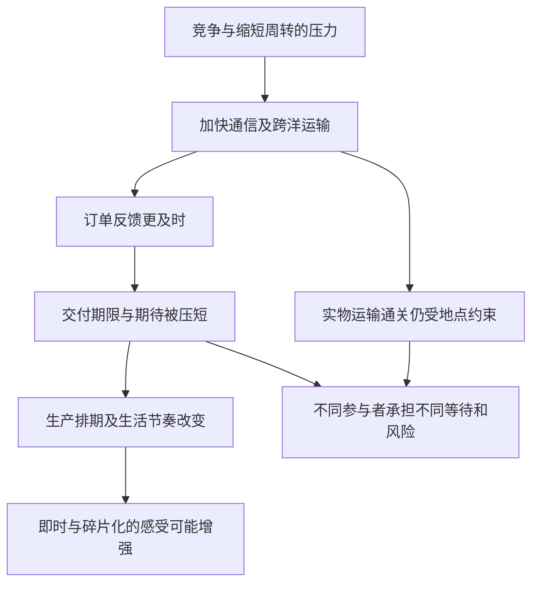

# 06｜世界变快以后，距离真的消失了吗？

> 交通通信加速为何会改变人的时间感与文化经验？

---

## 一、先说结论

距离没有消失，改变的是跨越距离所需的时间、成本，以及人们对“及时”的期待。哈维用**时空压缩**描述资本主义中运输、通信和组织速度的变化：远方越来越容易进入今天的交易与感受，许多决定也被推到更短的时限里。但同样是“更快”，不同地点、职业与人承担的成本并不相同。时空压缩既是物质过程，也是生活节奏和文化经验的变化，绝不等于地理差异被抹平。

## 二、我们先理解一个问题

设想一家接跨洋设计订单的工作室：客户的修改意见几乎马上抵达，成品样本却必须通过跨洋快递才送到对方手中。电子文件可以在夜间传来，包裹仍需分拣、运输、通关和签收。客户因此觉得“你已经看到意见，明早就能改好”；负责设计和协调交付的人，却必须在两个时间表之间压缩工作。这里的订单与快递都是**假设案例**，不对应书中某个真实企业。

既然信息送达快了，为什么人反而可能更忙？如果说海洋已不重要，为什么一次交付延误还会改变双方的安排？这里的问题不是技术有没有进步，而是速度的提升怎样重新分配等待：客户少等一会儿，设计者、物流环节或接收者就一定也少等吗？

## 三、作者到底提出了什么观点？

哈维讨论资本主义竞争时，关注缩短周转时间的压力：投入、组织生产、销售、回收再投入，环节越能衔接，资金占用与等待越可能减少。运输与通信技术为这种加速提供条件，但技术不是唯一原因；采购制度、订单期限和竞争预期也会促使人把可节约的时间继续压短。他把这种对时间和空间关系的重组称作时空压缩。

另一半问题是感受方式。来自远方的要求更频繁地进入眼前，今天接收的消息可能要在今天处理，商品的样式和交付周期变得更短。哈维把这种变化与后现代的文化经验联系起来：碎片化、即时性和对新鲜感的追逐，可以与更快的经济周转互相呼应。这是他的解释框架，不是说所有文化变化都只有经济一个原因，更不是说每个人都必然感到相同的焦虑。

## 四、把这个观点翻译成人话

过去需要很久才能来回确认的设计意见，现在可以几分钟内对齐；但“收到”不等于“做完”，“做完文件”也不等于“实物已到”。如果双方只盯着最快的那一环，便容易把最快速度当成整个流程的标准。时间感就在此改变：昨天还可以等的事，今天被视为耽误；真正节省的时间，却可能被下一次修改要求立刻占满。

所谓空间被“压缩”，不是把地图揉小，而是同样的物理间隔对交易安排和日常想象的约束发生了变化。屏幕上的订单似乎就在手边，跨洋快递仍要经过实在的路径。两者同时成立，才看得见谁能参与远程协作、谁为时差和交付不确定性留下弹性。若只说“世界变小了”，就容易忘记每一步加速都需要具体的人与设施。

## 五、为什么会这样？

推理从周转开始：竞争使企业希望更快回应需求；交通通信缩短某些等待；更快的回应又提高了各方对下次交付的预期。预期反过来调整排期与评价标准，速度从技术能力变成行为要求。与此同时，不能电子化的货物与跨地域制度仍留下不同的摩擦。

这不是速度越高、生活就必然越差的单向公式。如果改进能减少无谓等待，而且协商的期限允许人合理排班，设计者与客户都可能受益。关键要看缩短的到底是哪段时间，又是谁有权决定交付期限。图里的“可能”也很重要：从加速推到某种文化体验，需要观察具体工作制度和使用习惯，不能只凭一项技术的出现直接宣告时代性格。

## 六、举一个现实生活中的例子

继续看这个**假设的跨洋快递与设计订单**。客户在自己的白天发来小改动，工作室所在地点正是深夜。为了赶上约定的快递揽收，设计者要在睡前完成确认；若样本材料还没备好，线上沟通再即时也不能把实物提前送达。客户眼中的“明天发货”，对应设计者的夜间劳动和物流网络的具体班次。

再换一个条件：若双方预先约定反馈窗口，并把通关、制作与运输各自列成时间节点，消息传得快就能帮助发现问题，而不必意味着随时在线。两种安排使用近似的通信和快递能力，却产生不同的时间体验。案例不证明真实跨国订单都压榨劳动者，只说明“距离成本下降”与“每个人获得自由时间”之间隔着合同、时区、交付责任等制度环节。

## 七、回到书中重新理解

[《世界的逻辑》中译本公开目录](https://www.dedao.cn/ebook/detail?id=Jjrvne28LQ2OjoRqkgdnmJX6NADGlWxMkg3x1KvbBz97eaMP4VZrpEYy5VB6adNX)第五章题为“时空压缩与后现代状况”。已对照哈维《The Condition of Postmodernity》第十七章原文：该章从福特主义向灵活积累的过渡、周转时间缩短、通信与消费加速，进而讨论后现代感受，以及空间差异如何在新条件下重新显现。本文的跨洋订单是假设案例，不是书中个案。

从前几篇关于资本寻找空间和城市建造的讨论到这里，可以看到“空间”不只有地点与建筑，也有从一地抵达另一地所需的时间。资本可以通过加快流通改变两地的联系，却不能仅凭传输速度使法律、语言、交通能力和生活作息一致。用这一层意思读“压缩”，比说“全球已经没有远近”更贴近哈维的问题。

## 八、这个观点背后还有什么？

“快”至少有三种不同的尺度：消息抵达的速度、产品实际交付的速度、生产者恢复精力所需的时间。前两者被纳入商业排期，第三者常被当成个人自己的事。一旦把它们混为一谈，快速回信就会被误认为立即履约的能力，人的休息空间也可能在计划表上消失。这不是说所有加速都不合理，而是说评价效率不能只算信息传输的秒数。

还有地理差异：起点与目的地的基础设施、规则、工作时段不同，快递可以跑得更快，货物仍须从特定地点出发并在特定地点被接收。某些参与者能够要求即时响应，另一些参与者只能承受波动。时空压缩没有均匀覆盖每个人；当速度变成优势，距离造成的差异也可能以新的方式重新显现。这些是根据概念推导出的分析问题，不能替代逐地的调查。

## 九、这个观点有问题吗？

哈维的解释有力之处，是把“世界变快”的经济驱动与人的切身时间经验连在一起：为什么流程越快，截止时间也常被提前？但从加速到“后现代”文化的关系存在争议。文化变化可能还受到审美实验、政治观念、教育与媒介使用方式影响；若把各种碎片化感受统统归因于资本周转，就是过度简化。

另一种解释强调，速度带来更便宜的跨地协作和更多选择，未必必然损害生活质量。不同参与者究竟是得到灵活性还是增加负担，要看合同的谈判能力、可预期的交付时间和组织保障。比较同样速度下不同工作安排，比单纯断言技术使人焦虑更能检验哈维框架。也应承认有些地区交通不便，压缩对它们可能首先是尚未实现的机会，而非现成的压力。

## 十、今天再看这个观点

**以下部分是把哈维的时空压缩概念用于当下的现代延伸，不是作者原话。**面对跨洋设计订单，可以把“收到修改”“确认版本”“样本制作”“跨洋快递签收”分别标上时间，再询问每个阶段谁能决定期限、延误由谁承担。这样会发现，数字传输提速是一回事，把所有环节都按数字传输的速度要求是另一回事。

一个简单的检验是：当沟通更快时，合同是否允许对方在合理时段答复？客户是否知道快递所需的物理时间？有没有预留跨地域协作无法同步的余地？如果能回答这些问题，便不必在“越快越好”与“拒绝全球联系”之间二选一。距离不是宿命，速度也不是中性的恩赐；我们可以讨论怎样安排速度带来的便利和负担。

## 十一、这一篇真正应该记住什么？

1. 时空压缩是跨越距离的时间与组织方式改变，并非地理空间消失；信息可即时到达，实物与人仍受地点、制度和作息约束。
2. 哈维将速度竞争与周转压力及文化感受联系起来；这种联系有解释力，但不能把每种后现代经验都归结为单一经济原因。
3. 衡量加速的效果，要分别看谁设定期限、谁节省等待、谁承担夜间劳动和交付波动，而不只看通信是否变快。

## 十二、留一个问题

当不同城市都想在更短的时间里争取订单、资金与人，速度会怎样改变公共权力的选择？如果城市也开始像参与竞争的经营者那样行动，城市为什么越来越像在招商的企业？
