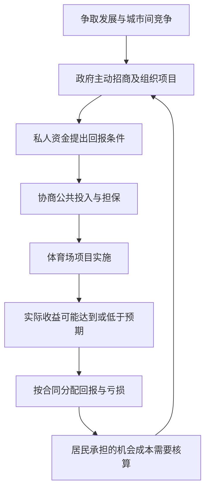

# 07｜城市为什么越来越像在招商的企业？

> 城市政府为何从提供公共服务转向竞争投资和项目？

---

## 一、先说结论

城市不会真的变成公司，但政府有时会从主要管理已有服务，转向主动组织项目、吸引投资、宣传发展前景。哈维把这一变化概括为从**管理主义到企业主义**的城市治理转向：公共权力与私人资本结成项目合作，希望在城市间竞争中争取增长。关键不只是项目能否开工，还在于不确定的收益与成本怎么分配：谁先出钱、谁提供担保、成功后谁得利、失败后谁负责。招商是手段，不能代替公共利益的检验。

## 二、我们先理解一个问题

设想一场**假设的体育场招商会**。城市政府向运营商和出资方展示新场馆的前景：赛事、周边消费和新的城市形象。投资方愿意谈，但提出条件：若收入不足以覆盖部分成本，希望城市以公共担保分担风险。台上双方都说这是合作共赢；台下却有人问，若收入真的不足，原本可以用于哪些公共服务的资金会不会被占用？这不是任何一座城市的真实招商记录。

体育场确实可能带来活动与便利，承诺也可能最终无须兑现。问题因此不是一听到私人合作就否定，而是：政府为什么愿意像投资推广者一样说服市场参与？当收益预期来自未来、担保义务却由公共部门承担时，谁有资格确定这是值得冒的风险？

## 三、作者到底提出了什么观点？

哈维讨论的企业主义，不是说政府登记成了公司，也不等于简单减少政府职能。恰恰相反，地方公共权力可能更积极地组织开发、参与宣传、协调资金与风险，用公共资源撬动私人投入。相对于以基础服务和行政管理为重心的管理主义，这是一种更主动、也更依赖市场前景的治理取向。

他的分析提醒我们看城市间的竞争：当某地担心投资转到别处，就可能争相提供有吸引力的场地与交易条件。预想中的就业、消费和声望能成为项目理由，但收益未必如预计出现，也未必平均分给居民。这里说的是治理逻辑和风险分配的分析，不是断言每个地方政府都只图利润，或任何招商项目都损害公共利益。

## 四、把这个观点翻译成人话

如果一座城市主要问“现有公共设施怎么维护，居民怎样方便使用”，它更接近管理现有事务；如果它不断问“拿什么项目吸引外部资金和关注，怎样让投资方相信我们能保证条件”，就显出企业主义的倾向。两种问题未必互斥，同一个政府也可能同时做。但只要谈到担保、保底或优先投入，城市就不能像普通企业那样只向股东交代：公共风险由居民共同承担。

体育场招商会的宣传册展示的是项目可能带来的好处，担保文本写的则是预测没有实现时怎么办。把两份材料放在一起，才能看到完整交易。公共部门不是天然被动的一方，它可以设计条件；私人运营也不是天然高效的一方，它同样面对需求的不确定性。真正要追问的是交易如何约束双方，而不只是给合作贴上“市场化”或“民生”的标签。

## 五、为什么会这样？

推理可以拆开：城市希望增加活动与收入，地方间竞争使“错过项目”的担忧更强；单靠公共预算难以或不愿承担全部前期投入，于是寻找私人合作；为了让对方入场，政府可能提供资源、便利或担保。项目的预期收益与实际风险从此走上不同的路径。

这张图不是说担保必然导致亏损。担保可能降低融资障碍，使原本难以建成的项目落地；也可能把商业预测错误的一部分转成财政负担。重要的是在决策前说明触发条件、最高责任、期限和谁有权审查，而不是在项目成功时只报收益，在项目失败时才发现公共承诺。**风险由谁承担**必须与**收益由谁取得**放在同一张账上。

## 六、举一个现实生活中的例子

继续看这场**假设的体育场招商会**。运营商预计每年举办足够多活动以覆盖运营费用，因此要求较低的前期资金成本；政府认为场馆能提升城市吸引力，愿意就特定债务提供有限公共担保。若活动达到预期，运营商获得合同约定的收入，城市可能获得公共使用机会；若活动偏少，担保可能被触发，财政就要按约支付。两种结局在签约时都尚未发生。

讨论不能只问“有没有投资”，还要问：居民使用场馆的时段与价格是否被写入协议？公共担保上限是多少，私人方是否也承担相应的损失？与其他公共支出相比，项目还有什么机会成本？若收益预测过于乐观，能否调整规模或取消？这些问题不保证给出唯一答案，但能防止招商现场最响亮的愿景吞没那些未上台的人所承担的风险。

## 七、回到书中重新理解

[中译本《世界的逻辑》公开目录](https://www.dedao.cn/ebook/detail?id=Jjrvne28LQ2OjoRqkgdnmJX6NADGlWxMkg3x1KvbBz97eaMP4VZrpEYy5VB6adNX)第六章题为“从管理主义到企业主义：城市治理的转型”。已对照1989年英文论文全文：哈维把这一变化同公共—私人伙伴关系、投机性项目、城市间竞争与地方公共部门吸收风险联系起来。本文以体育场的假设合同把这些机制翻译为能检验的收益与责任问题，不是说该合同来自书中。

连上前一篇关于速度与地域竞争的讨论，更容易理解政府为什么担忧项目流向别处。不过，不应把先后读成唯一因果：即使不考虑加速，本地预算约束、政治目标和居民对公共设施的需求，也会影响政府的选择。企业主义这个词描述一种值得分析的组合，而不是对每一个政府动机的现场鉴定。

## 八、这个观点背后还有什么？

项目谈判里的“城市”不是一个有单一钱包和偏好的主体。决定签约的官员、承担合同风险的财政、可能使用场馆的居民、获得收入的运营商，在时间与利益上并不完全一致。宣传时计算的短期活动热度，未必与多年后的维护支出同一节奏；公共担保的负担可能到未来才显现。这就是为什么治理问题不能只数开工数量。

进一步看，担保还可能改变谈判动力。如果私人方确信最差结果由公共部门托底，就可能接受本来会更谨慎评估的收益预测；但合理设计的担保也可换取明确的公共使用权与私人承担的真实风险。判断关键在于合同如何写、预测如何检验、谁能提前看到并质疑条款。这是从哈维视角出发的机制推论，不是对任何现实体育场合同的事实陈述。

## 九、这个观点有问题吗？

哈维框架有说服力：它能揭示“有项目、有人投资”不自动等于公共利益增长，也让公共部门隐藏在漂亮愿景后的担保责任进入视野。但把城市治理一律描述成由管理转向企业竞争，可能抹去不同时期、地区与公共制度的差别。有的合作项目可能以透明规则改善服务，有的公共机构也可能在不招商时作出低效决定。

争议还在评价指标。支持者可能强调活动、便利和财政回报；批评者则问回报是否被高估、风险是否社会化。另一种解释会更多强调居民的服务需求、政府间财政分工或治理能力，而不是仅仅归因于资本竞争。哪种解释更适合某个地方，必须比较合同、客流预测、实际使用率及其他支出选项；一场招商会里的口号，不能代替项目后来的结果。

## 十、今天再看这个观点

**以下部分是把哈维的企业主义分析用于当下的现代延伸，不是作者原话。**今天若面对类似体育场招商方案，可以要求同时公布三套数字：正常情况下的收益与公共使用安排，低于预期时的担保触发条件，以及不做这个项目时公共预算的可选用途。公布方案也要给出修改可能，不然公开只是把既定选择贴在墙上。

这种做法不预设市政府必须拒绝私人合作。它只是把“吸引了多少投资”从唯一成绩单，改成一组可追踪的问题：公共风险是否有上限，私人方是否自担一部分亏损，居民有没有实际享用场馆的机会？只有追踪到项目运行多年之后，才知道招商时的承诺是否兑现。城市治理既要敢于安排合作，也要让参与合作的人承担与收益相称的责任。

## 十一、这一篇真正应该记住什么？

1. 城市企业主义指公共部门更主动参与招商、项目组织和跨城竞争，不是说政府变成企业，也不意味着管理公共服务的责任就此消失。
2. 判断合作项目不能只看投资额和愿景，还须把担保条件、公共使用权、私人回报、失败责任与其他预算选择放在一起比较。
3. 哈维提供的是检验收益与风险分配的框架；具体项目是利是弊，仍依赖公开合同、实际需求及长期运行数据，而不能靠标签预判。

## 十二、留一个问题

体育场招商会讨论了城市要吸引谁、公共担保由谁承担；但若项目的土地、能源与环境代价也要计算，账本就不能只停在财政一栏。下一步该问：自然为什么不是城市之外的背景板？
