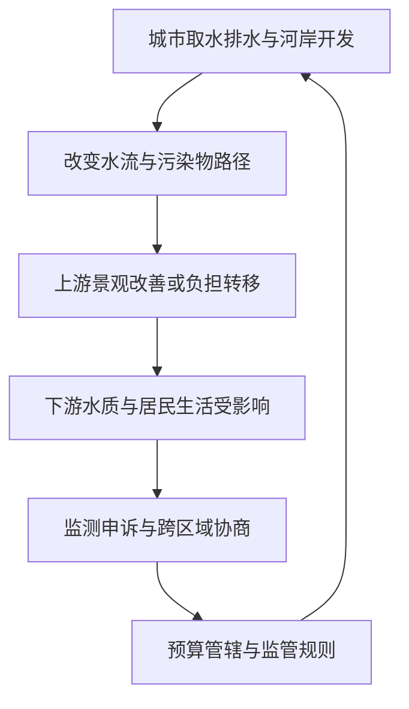

# 08｜自然为什么不是城市之外的背景板？

> 城市发展与生态变化，为什么不能被当成彼此无关的两件事？

---

## 一、先说结论

城市并不是把自然赶到边界之外后才建成的。城市取水、排水、用地和处理废弃物，时时都在改变河流、土壤与生物的生活条件；反过来，水流、降雨和生态承载能力又限制城市可以怎样运作。哈维的环境辩证法提醒我们：**承认自然过程真实存在，同时追问社会关系怎样安排资源使用和生态代价。**生态问题不是一幅受损风景的照片，也是一张记录谁受益、谁付费、谁承担后果的关系图。

## 二、我们先理解一个问题

假设一座城市要整治穿城河道。上游河岸新设步道，水面看上去干净了，居民也多了休憩的地方。可是整治若只是把排水口改接到更远的地方，污染随河水抵达下游，那么城市展示的改善与整个流域的改善便不是同一件事。这是为理解问题设计的**假设案例**，并非书中记录的项目。

此时不能只问岸边是否变漂亮，还要问：污染物去了哪里？谁测量了下游的水质？受影响的人有没有参与方案制定？同一条河，在城市景观规划中可能被画成一段线，在居民的用水和生计中却是连续的水流。所谓城市与自然分开，往往是管理图纸画出了边界，而河流没有遵守这条线。

## 三、作者到底提出了什么观点？

哈维讨论环境时，不把自然简单看成静止的、供人类使用的外部物件，也不认为人可以随心所欲地改写自然规律。可以把他的辩证视角理解为：社会通过劳动、技术和制度改变环境，而改变后的环境又作用于社会；两边不是互不相干的两套故事。这是对其理论方向的概括，不是逐句引述。

这里的**资源**不只是地下或地上的东西，还包括谁能调动资金取水、谁能批准排放、谁有条件修复受损河段。物质流动与社会关系交织，构成理解环境问题的两条线。若只说“人类破坏了自然”，具体的权力和责任容易消失；若只说“一切都是社会建构”，污染对生命与水体的物理影响又会被轻视。环境辩证法恰恰拒绝这两种偷懒。

## 四、把这个观点翻译成人话

想象河道穿过不同街区。河水不会因为经过行政边界就暂停流动，沿岸却可能由不同单位负责清淤、监测和收费。一个区域修好了亲水台阶，不能自动推出全流域水质合格；下游出现异味，也不能不调查就认定全部责任属于上游某一工程。自然有自己的流向和反应，制度有自己的管辖区与预算表，两者碰在一起才形成具体后果。

因此，“自然不是背景板”并不意味着每一棵树、每一条河都只由资本逻辑决定。洪水季节、地形和污染物性质不能靠政治口号抹掉；与此同时，沿岸谁能获得优质水源、谁只能承担治理失败的成本，也不是地形自行决定。先分清物质过程，再看决定它如何被利用、如何被监测的社会安排，解释才不会落在空话上。

## 五、为什么会这样？

关键不是把自然和社会硬拼在一句话里，而是追踪从工程决策到生态反馈的实际链条：

图中的箭头表示值得检查的关系，不意味着只要修河就一定污染下游。上游工程可能同时减少污染，条件是污水真正得到处理、监测覆盖全流域、后续维护有经费。反之，若城市仅考核可见河段的颜色与景观，污染源不变，工程还可能把成本藏在指标之外。生态代价之所以常被看漏，既因水会跨空间流动，也因收益与责任被不同机构分开计算。

## 六、举一个现实生活中的例子

把这个**假设案例**再展开一步：城区治理河道时，在核心河段铺设步道，并把几个雨污混接的口子临时改到下游支流。上游商户迎来更多散步的人；下游居民却发现汛期过后水面常有漂浮物，担心附近的菜地浇灌水源。这里的症状和工程安排均为设想，不能拿来证明现实中某地确有违法排污，也不能只凭漂浮物判断污染成分。

假如只计算步道面积和游客人次，项目很容易被评为成功；若同时核对排放位置、雨季与旱季水样、污水处理能力和受影响居民的反馈，评价可能不同。改善不应被否定，真正要问的是有没有把改善的范围说清楚。对下游来说，能否取得数据、能否参与河道维护的决定，和上游能否享受新景观一样，是环境治理的一部分。

## 七、回到书中重新理解

[中译本公开目录](https://www.dedao.cn/ebook/detail?id=Jjrvne28LQ2OjoRqkgdnmJX6NADGlWxMkg3x1KvbBz97eaMP4VZrpEYy5VB6adNX)把第七章列为“环境的本质”。已对照英文原文《The Nature of Environment: The Dialectics of Social and Environmental Change》：哈维讨论货币估值、生态话语、城乡区分，以及城市化作为再造生态的过程。上述河道故事仍是帮助辨认问题的假设案例，不能说它出现在该章。

前面谈城市治理时，容易把关注点停在投资、审批和景观的可见一面；读到环境论题，则应把视线沿着物质流向移出项目边界。城市不是叠在自然之上的一层装饰，而是不断依赖、塑造并受到环境反馈的生活组织。理解这一点，才知道“生态代价由谁承担”并非治理完成后才附带讨论的补充题。

## 八、这个观点背后还有什么？

这套解释隐含一个尺度难题：河流按流域运行，治理机构却可能按城区、预算年度和单项工程运转。同一笔支出在某部门账上是成本，在下游居民生活中可能意味着避免损失；同一片“干净的岸”在视觉上是成果，在污染物总量上未必是成果。这里是在哈维问题意识上所作的分析推论，而不是称他对这条虚构河流给出了政策方案。

也因此，所谓生态公正不等于把任何改变都叫作破坏。城市需要排水、防涝和公共空间，工程可以改善水生态；重要的是把获益与受损的空间、时间拉到同一张评估表上。短期看似省钱的方案，若把治理责任挪给无权参与的下游，长期反而可能增加共同成本。追问社会关系，正是为了让自然过程和具体人的处境同时进入判断。

## 九、这个观点有问题吗？

它有说服力的地方，是防止我们把城市环境当成孤立的绿化指标：同一流域内，改善与转移负担可能并存。争议则在于，怎样衡量特定工程的净效果并不容易。污染浓度会受降雨、季节、上游其他排口影响；居民感受到的改善与实验室测量结果也未必完全一致。仅凭“受害者在下游”就断定某项目造成污染，同样缺少证据。

若把每次水质变化都简化为制度不公，会忽略老旧管网的技术约束、极端天气和既有污染沉积等其他解释；若只谈技术，不谈谁有权设定监测点，也同样片面。需要公开前后对比数据、追踪污染源、核算治理支出，并让不同位置的居民表达需求。哈维提供一套提出好问题的视角，具体因果归属仍须靠调查确认。

## 十、今天再看这个观点

**以下部分是将哈维的环境辩证视角用于当下城市治理的现代延伸，不是作者原话。**许多城市有实时水质看板与数字化排口管理，数据使得长期观察更方便，却也可能让未设监测点的河段从公共讨论中消失。漂亮的界面本身不是治理结果，关键在于采样点如何选择、原始数据能否复核、超标后的处置是否跨行政边界继续跟进。

读者看到“生态修复完成”时，可以试着连续问三件事：改善了什么物质指标，覆盖哪段河流与哪个季节，可能的代价落在哪里。问题问得越具体，越能既肯定真正的环境改善，又识别只把污染移出视野的表面成功。这样的追问不是先判定工程有罪，而是避免把景观照片当作全部证据。

## 十一、这一篇真正应该记住什么？

1. 环境辩证法强调社会改变自然、自然反馈社会；自然规律与制度安排都不能被另一个代替。
2. 评价城市生态项目要沿着资源与污染的流向追踪，不能只看项目边界内的可见改善。
3. 谁获益、谁承受生态代价是重要问题；但判断具体责任，仍须监测数据与因果调查，而非仅凭立场。

## 十二、留一个问题

沿着河流追问，我们发现一个地点的决定可能改变远处人们的生活。然而，受影响的人不一定拥有同一个诉求或同一种组织能力。如果大家都从自己的处境出发，**一次地方行动怎样触及全球问题？**
