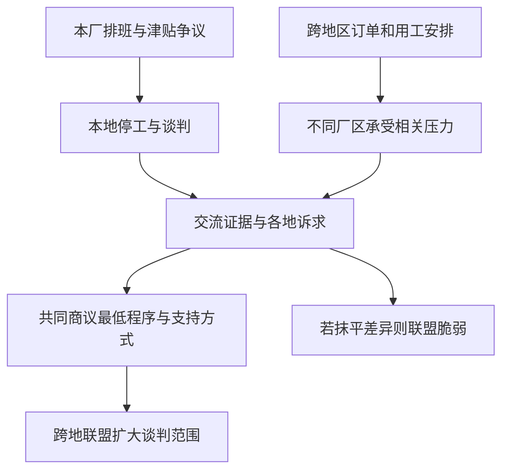

# 09｜一次地方行动怎样触及全球问题？

> 本地工人的具体诉求怎样与跨地域的资本力量对话？

---

## 一、先说结论

一场罢工往往从很具体的地方开始：某班次的工资、某工序的安全、某厂的劳动安排。资本的经营决定却可能横跨多个地点。哈维借“战斗性的特殊主义”提醒我们，**地方抗争可以成为追问更普遍规则的起点，却不能自动变成全球团结。**要跨过地点，既要找到可共同谈判的问题，也要保留各地工人所面对的差异；否则响亮的共同口号可能只代表其中一部分人的处境。

## 二、我们先理解一个问题

设想一家汽车配件工厂因调整班次、削减津贴引发本地停工。工人要求厂方说明新安排并谈判补偿。管理方回答说：订单可能调往别处生产，单靠这一厂反对也改变不了成本压力。这是用于分析的**假设案例**，不对应书中某次罢工，也不能拿来概括某一真实企业的行为。

工人的问题于是多了一层：继续守住本地谈判当然重要，可如果类似劳动安排在其他地区同时推行，这场争议还能只在厂门口解决吗？反过来说，若立刻把本地诉求说成全世界工人的共同诉求，其他地区工人可能有不同工资、工时、法律处境，甚至担心合作会危及现有岗位。如何让地方诉求与跨地联系真正接上，是这一篇要解释的难点。

## 三、作者到底提出了什么观点？

哈维沿用雷蒙德·威廉斯所说的“战斗性的特殊主义”讨论政治行动的起点：人们通常不是先认同一条没有地点的普遍原则，再去参与抗争；他们在某个工作场所、社区或城市遇到实际冲突，因共同处境而组织起来。“特殊”说的是这个起点有具体边界和利益，“战斗性”说的是参与者不满足于被动接受现状。这是对概念的通俗阐释，不是书中原话。

然而资本可以在不同地域配置生产和投资，地方组织若只要求自己获得例外待遇，可能无法改变反复制造争议的规则。哈维的关键问题并非“地方行动有没有用”，而是**具体抗争能否提炼出可供不同地方商议的普遍目标**。普遍性不是先验的同一身份，而要在联系中生成；它还必须接受其他地方当事人对自身处境的修正。

## 四、把这个观点翻译成人话

想象工厂门口的两块告示牌：一块写着本厂津贴如何计算，另一块写着公司所有工厂的订单与排班规则。只拿第二块牌子谈“全球力量”，会让今晚少拿津贴的工人觉得自己的问题被抽象掉；只拿第一块牌子谈本厂补偿，则可能看不见规则改变后会在不同厂区轮番出现的谈判压力。两个尺度都是真实的，但需要不同的证据和不同的协商方式。

跨地联盟也不是各厂工人把诉求一字不差地复制到同一张纸上。一个地方在意夜班补贴，另一个地方可能更急需安全设备；相互支持可以从要求透明的调岗程序、相互通报谈判结果做起。若把差异说成“不够团结”，联盟反而不稳。地方抗争触及全球问题，是因为它追问了跨地域决策怎样影响具体劳动者，而不是因为喊出“全球”二字就完成了组织。

## 五、为什么会这样？

这一步的难处可以画成两条同时推进的线：

本地停工能够让难以被听见的诉求进入谈判，但停工不必然意味着跨地协作。要把两条线接起来，需要确认：订单调整是不是确实发生，谁有决定权，不同工厂的合同和法律条件是否允许相同的行动，以及各地愿意承担什么风险。联盟若不能回答这些问题，可能既无力约束跨地调配，也会让承担最大停工损失的人为抽象目标买单。

## 六、举一个现实生活中的例子

把上述**假设案例**再推进：汽车配件厂本地工人停工后，邻近地区另一个厂的工人并没有立即跟进停工，而是先协助整理相似的班次变动公告，并比较两地的补贴计算方式。双方发现，有些要求可以共同提出，例如排班提前告知、申诉渠道公开；有些必须分别谈，例如不同地区的夜班交通条件和现有集体协议。接着，两地代表才商量如何在各自规则允许的范围内表达支持。

这里的“跨地联盟”不是一个按钮：信息共享可以发生，集体行动还需要信任、组织资源和法律判断。如果另一厂并无类似变动，或订单根本不能替代生产，本厂就不应为了叙事完整而硬说对方处境相同。这个例子说明的是一条可能的组织路径，不宣称任何真实汽车配件厂曾经照此罢工或结盟，更不能用设想推出某种策略必定有效。

## 七、回到书中重新理解

[中译本公开目录](https://www.dedao.cn/ebook/detail?id=Jjrvne28LQ2OjoRqkgdnmJX6NADGlWxMkg3x1KvbBz97eaMP4VZrpEYy5VB6adNX)将第八章列为“工人运动与城市 本地化与全球化的思辨”。英文原文从哈维1988年在牛津参与 Rover/Cowley 汽车厂命运研究写起；这项研究服务于一场反对关闭工厂的运动。哈维讨论的是工会传统、厂区忠诚、城市利益与更大尺度社会主义目标之间的张力，不是一个简单的“某次罢工成功或失败”的故事。

因此，我们读这一论题时，可以把注意力放在地方行动与更大尺度的关系，而不是急于寻找一个“地方胜利等于全球胜利”的故事。哈维关心的张力是：工人依赖具体地点形成组织力量，同时又面对能够跨地点安排投资的对手。承认地点的重要性，不等于把其他地点的劳动者当成敌人；追求普遍目标，也不等于放弃本地的谈判权。

## 八、这个观点背后还有什么？

“团结”至少涉及两种不同工作。第一种是翻译：把各地不同的工资制度、用语和合同条款转成彼此听得懂的问题。第二种是分担：谁停工、谁提供信息、谁提供法律支持，产生的成本不应悄悄压在力量最弱的地方。若没有这两步，普遍原则即便说得动听，也可能只是某个厂区的优先事项被放大。这是依哈维提出的尺度问题所作的分析推论，不是对原书中某次行动的事实陈述。

还有一层悖论：组织越想跨地，就越需要在各地点积累可持续的信任；而各地的实际差异，恰恰使简单复制一种策略变得困难。因此更稳妥的普遍目标，可能不是保证所有人获得完全相同的待遇，而是让各地都有谈判权、知情权与可申诉的程序。目标如何设定，须由参与者协商，不能由理论替他们决定。

## 九、这个观点有问题吗？

这个视角有说服力，因为它能解释两种常见挫败：只在一厂谈判，可能遭遇跨地转单的压力；只呼吁抽象团结，则可能得不到具体工人的信任。争议在于，“共同规则”能有多大范围？各地劳动法、市场需求和产业结构并不相同，甚至对同一项保护措施的得失判断也可能相反。跨地联盟越大，协调成本和代表性问题也可能越突出。

若把所有本地谈判失败都归于全球资本压制，会过度简化：企业订单是否真能转移、地方组织是否有效、产品市场是否萎缩，都可能提供其他解释。反过来，也不能因为本地诉求不同就说跨地合作毫无意义。判断联盟有无帮助，需要比较谈判前后的合同、支持网络与实际风险，而不是把一次行动的声势当作全部结果。哈维的概念说明应当追问什么，不能替代这些检验。

## 十、今天再看这个观点

**以下部分是将哈维的地方与全球尺度问题用于当下劳动协作的现代延伸，不是作者原话。**跨地区的视频会议和即时通信能让不同工厂更快交换排班通知、核对消息来源，也使工人更容易发现各地制度差异。但消息传得快，不等于信息可靠，更不等于每个人都安全地参与谈判；公开个人身份、误传转单信息都可能伤害原本要支持的人。

在任何关于“跨地联合”的新闻里，不妨分别问：是谁提出共同诉求，谁有机会修改它，谁承担行动成本？还要问联盟是否允许某个地点选择不同步行动，却仍保留互相通报和支持。这样理解团结，比把各地排成整齐队列更慢，却更接近从具体生活生长出的普遍政治。

## 十一、这一篇真正应该记住什么？

1. 战斗性的特殊主义把地方具体冲突当作行动起点；跨地目标需经组织与协商形成，不会从地方诉求自动长出。
2. 面对跨地域的资本安排，工人可以共享证据、讨论共同程序，但团结不能抹去工资、法律与风险的地方差异。
3. 判断联盟的成效要看决策权、成本分担和谈判结果；理论能帮助提出问题，不能代替现场证据与参与者判断。

## 十二、留一个问题

工人可以尝试把不同地点的诉求连起来，资本则不只在各地安排生产，还可能改变人们原本共同使用的资源究竟归谁、由谁收费。当收益来自重新划定占有边界时，**为什么资本扩张不只靠生产，还靠“拿走”？**
