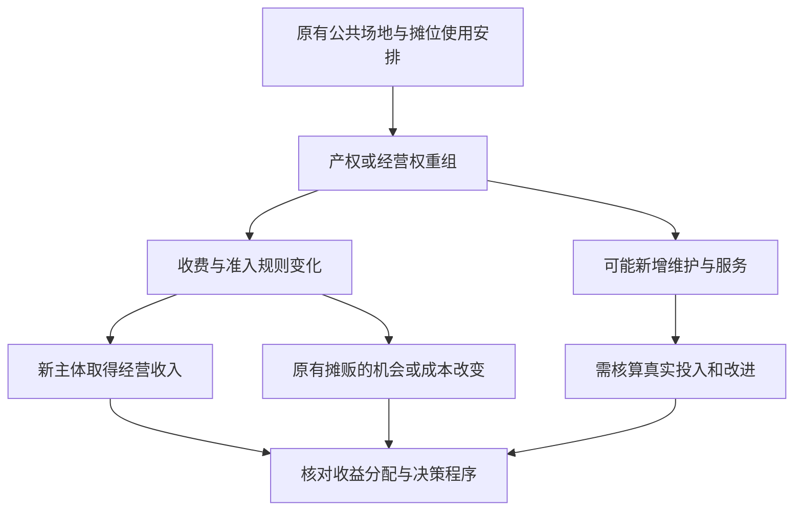

# 10｜为什么资本扩张不只靠生产，还靠“拿走”？

> 私有化、圈占和剥夺为什么也是理解资本扩张的线索？

---

## 一、先说结论

资本可以通过组织劳动、出售新产品获取收益，也可以通过改变原有资源的产权和使用规则，把过去共同享有或较低成本可得的东西变成新的收费来源。哈维用“掠夺式积累”提醒我们关注后一种路径：**扩张不仅发生在生产线上，也可能发生在重新划定谁有权使用、转让和收取收益的边界时。**但产权调整不等于天然违法，更不能仅凭私有化一词就认定存在掠夺；关键要查谁失去什么、谁得到什么，以及改变是否正当。

## 二、我们先理解一个问题

设想一处公共菜市场，原本由公共机构提供场地，摊贩按较低费用租用固定摊位。后来市场进行产权改造，经营权交给新主体，场地维护也由其负责；租金标准和摊位准入规则随之改变。改造有可能改善卫生和消防，也有可能让原有摊贩难以继续营业。这是为分析机制设置的**假设案例**，不是书中发生过的市场故事。

一个常见问法是：新经营者有没有提高效率？这个问题重要，但还不够。还应问旧经营规则下有哪些实际使用权，改造后谁有决定权，是否有补偿、过渡期和申诉程序。若只盯新增营业额，原本不用高价购买的使用机会就会从账上消失；若只说改造等于“拿走”，却不查原有产权与改造后的服务，也可能误判。

## 三、作者到底提出了什么观点？

哈维提出“掠夺式积累”，是为了说明资本积累不能仅用“企业投资、雇人生产、卖出商品”的循环来解释。他强调既有资产、公共资源和各种财产权的重组，也可能为私人收益打开通道。这里“掠夺”是一个有争议的批判性概念，意在逼我们看清转移过程，并非法律上对所有产权交易的定罪；把它直接当成某个具体项目的判决，是超出理论所能证明的。

需要分清三个层面：资源本来由谁控制，规则改变时经过什么程序，改变后收益与损失怎样分配。圈占意味着原来可共同进入或使用的资源被划出新的排他边界；私有化是可能采用的制度方式之一；剥夺则强调某些人丧失原有的使用或收益机会。三者有交集，但不应混为同义词。哈维的核心提醒，是把这些环节纳入积累分析，而不是只统计新增商品的产量。

## 四、把这个观点翻译成人话

如果有人新做出一张桌子，把它卖掉赚取收入，我们容易看到劳动、材料和价格的关系。若有人接手一处原本低门槛开放的场地，重新规定进场要付多少钱，收入的来源就不只是“做出了更多东西”，还包括获得决定别人能否使用场地的权力。管理与维护也可能创造价值，所以不能把后一种收入全部视为凭空所得；关键在于两部分如何区分。

公共菜市场尤其能说明这点：摊位不是抽象平方米，还承载了固定客流、邻里信任与摊贩对地点的熟悉。这些未必写在产权证或年度报表上，改造却可能改变它们。反过来，公共运营并不保证条件良好；过去的低租金也可能伴随维护不足。真正需要比较的，是改造前后实际权利、服务质量、成本和进入机会，而不是只凭“公”或“私”的标签站队。

## 五、为什么会这样？

从旧规则到新收益，至少要经过若干可追踪的环节：

图示的是需要核查的机制，不是预设结论：即便经营权改变，也可能保留低价摊位、增加公开补偿，并让卫生条件明显改善；同样，形式上仍叫公共市场，也可能通过合同把控制权和收益交给少数主体。只有把合同期限、收费依据、原使用者是否能续租、投入维护的实际成本摆在一起，才可能分辨新收益有多少来自服务改善，有多少来自控制原本可及的资源。

## 六、举一个现实生活中的例子

继续这个**假设案例**：市场产权改造后，新经营者修好了漏水的屋顶，统一消防通道，却将最靠入口的摊位改成高租金区域。几位经营多年的摊贩被安排到边角位置，原先来买菜的居民仍可入场，但常买的低价品种减少了。这里每一个变化都是设想，不是对任何真实市场的调查，也不能据此断定改造者违法。

看收益账本，新经营者投入了维修资金，也获得较高租金；看摊贩账本，位置变化可能导致营业额下降；看居民账本，环境更安全，却可能付出更多寻找商品的时间。若合同允许旧摊贩在过渡期内优先选择摊位，并公开租金调整和维护成本，结果又可能不同。哈维的概念在这里帮助提出一个精确的问题：新利润来自新增服务，还是也来自对已有使用机会的重新占有？答案必须由具体资料而非例子本身给出。

## 七、回到书中重新理解

[中译本公开目录](https://www.dedao.cn/ebook/detail?id=Jjrvne28LQ2OjoRqkgdnmJX6NADGlWxMkg3x1KvbBz97eaMP4VZrpEYy5VB6adNX)将第九章列为“‘新型’帝国主义 资本的掠夺式积累”。已对照英文原文：哈维用“accumulation by dispossession”替换持续存在的“原始积累”，并列举土地私有化、公共财产权转为排他性产权、压制公地权利、殖民与金融掠夺等机制。这里的市场故事只是帮助辨认概念的假设案例，而非原书史料。

把“拿走”放回哈维的问题意识，重点不是指责某次交易动作粗暴，而是看到积累还依赖规则、财产权和公共权力的安排。即便交易有合同，也要继续问合同之前谁拥有使用机会、谁能参与规则制定；即便人们觉得改造不公平，也要继续核实法律程序与实际损益。这样理解才不会把宏大批判变成对个体行为的未经核实的指控。

## 八、这个观点背后还有什么？

“原本共同使用”本身也需要考证。有的摊贩只拿到短期许可，有的享有长期租约，还有的依赖惯例而没有正式权利；居民希望保留平价菜源，市场管理者又必须支付消防、清洁与修缮费用。谁算旧使用者、谁有资格获得补偿，本身就是一场关于权利的协商。这是在哈维概念基础上的分析推论，不是说他对上述虚构市场作出了具体判断。

因此，一项产权重组能否称得上剥夺，不只取决于所有权从公共名下转到私人名下，也取决于排他门槛怎样形成、旧权利是否被尊重、被改变的价值流向哪里。制度可以同时鼓励必要投入与保护较弱使用者：例如把维修改造的成本单列，把租金与准入的变化交由公开程序审议。这类制度设计是读者可继续讨论的方向，并非原书在该案例中的政策清单。

## 九、这个观点有问题吗？

这一视角有说服力：只看新市场的投资和营业额，会漏掉原有摊位使用权被重新定价的过程。争议则在于，何种转移才该叫“掠夺”？合法交易可能包含不平等谈判，合同形式完善也不一定代表所有受影响者同意；反过来，把所有产权重组都叫剥夺，会忽略公共运营失败和合理补偿的可能。概念既要能揭示权力，也要防止先定性、后找证据。

过度简化的解释会把经营收入全算作“拿走”，不计算消防修缮、人员管理与服务改进。其他解释可能强调市场原有亏损、财政约束、消费习惯变化或周边竞争。要区分这些路径，需要产权和合同文件、改造前后的财务数据、租户去留与居民可及性调查。没有这些资料，不能从理论直接推出某一市场改造的合法性、效果或唯一动机。

## 十、今天再看这个观点

**以下部分是将哈维的掠夺式积累概念用于当下公共空间治理的现代延伸，不是作者原话。**一些市场开始用线上排队、电子摊位登记与统一支付管理场地。这些工具可能减少混乱，也可能使准入规则更难被普通摊贩看懂。技术本身既不等于剥夺，也不自动带来公正；关键仍是规则谁制定、费用如何公示、被拒绝入场者能否申诉。

面对“盘活闲置资产”的说法，读者可以先问资产真的闲置吗，谁过去在使用，它带来的非收费价值由谁记录；再问改造后新增投入与排他收费各占多大比重。如果资料显示服务改善、机会得到保障，便不应为了套理论否认它；若资料显示部分人承担损失而无从参与，便不能只用投资增长遮盖转移。这是把批判概念变成可检验问题的一种用法。

## 十一、这一篇真正应该记住什么？

1. 掠夺式积累提醒我们：除了生产和销售，既有公共资源与财产权的重组也可能为资本开辟收益来源。
2. 私有化、圈占与剥夺不是同一词；是否存在不正当损失，要查旧权利、程序、补偿与实际收益分配。
3. 不应把所有改造都定性为掠夺，也不能只凭合同或新增投资宣告公正；具体评价必须基于可核实资料。

## 十二、留一个问题

如果某种收益能够来自重新规定谁可使用既有资源，那么城市发展中的资产价格与融资承诺也值得继续追问：钱从哪里来，风险又会沿着什么路径扩散？这就把我们带到下一道题：**金融危机为什么有城市根源？**
