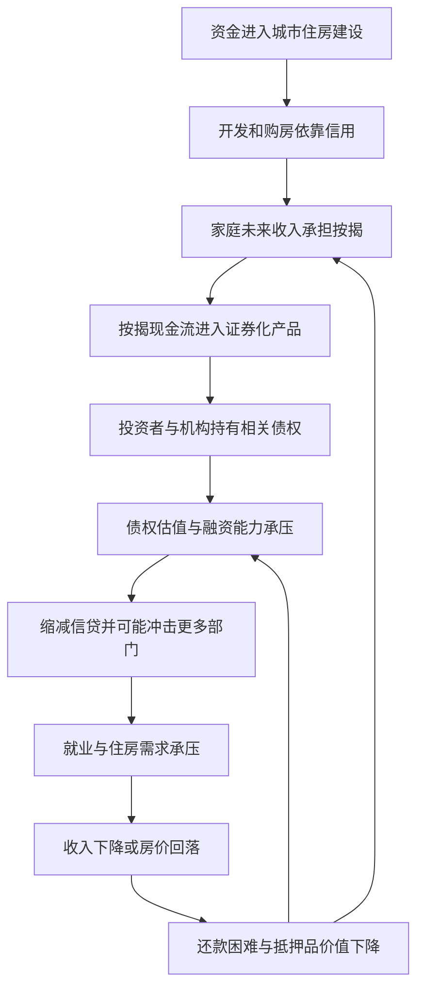

# 11｜金融危机为什么有城市根源？

> 为什么一笔住房贷款的风险，会沿着城市建设与金融网络传到远处？

---

## 一、先说结论

哈维提醒我们：金融危机不只起于交易屏幕上的数字，城市的建造与住房的买卖也可能成为危机生成和传递的场所。土地开发、建房、购房都需要先付钱、后收回收益；信用让这些长期投入成为可能，也让许多人的偿债能力与未来房价绑在一起。**城市化能吸纳资金，却不能保证债务一定还得上。**当房地产价格下跌、收入不足以偿债，风险又被层层转手时，局部困难便可能牵动金融体系；这是一种有条件的机制，不是每次房价调整都会引发金融危机。

## 二、我们先理解一个问题

一户家庭按月还款，银行发放贷款，一幢楼由借款建起。三件事表面分开，背后却同时押注未来：家庭今后有稳定收入，房屋有可处置的价格，开发项目能如期卖出。现金今天先进入房屋和土地，偿还却要靠未来几十年的收入与销售。假如还款变得困难，谁承担差额？答案并不一定止于借款人和放贷人。

这里要问的不是房子是否应当贷款购买，而是**为什么房屋这一种固定在城市中的资产，会成为可以在金融机构之间流动的债权的底座**。看清从住户到账本、再到融资市场的连接，才能理解新闻中看似抽象的金融震荡，为什么也可能起于普通街区的价格与偿债压力。

## 三、作者到底提出了什么观点？

哈维关注资本怎样在生产、流通与建成环境之间寻找去处。按他的分析视角，城市建设需要大量前期投入，能够吸收资金和劳动，但住宅与基础设施不能像货物那样随时搬走或迅速变现。信用把尚未取得的未来收入提前变成今日可用的资金；这既扩大建设的可能，也把兑现未来的压力带进城市空间。

本篇只抓其中一个命题：**城市化与信用扩张相互支持，也可能让房地产波动沿债务关系放大。**这不等于哈维声称金融机构毫无独立作用，更不等于仅凭一座城市的房价曲线就能确定一次危机的全部成因。危机涉及监管、杠杆、收入与国际资金流向，城市根源说的是不可忽略的连接点，而不是唯一根源。

## 四、把这个观点翻译成人话

贷款好比让人先用未来的工资把今天的房子买下来。银行在今天付出资金，换来此后按月收款的权利；开发者也可能先借钱建房，再等成交回款。如果这些未来收入都兑现，信用就帮助居住与建设跨过一次性支付的门槛。但房屋造好了很难退货，家庭失业也不能把过去的合同倒回去。债务的到期日不会因为房价下跌而自动后移。

更重要的是，银行未必把这笔收款权始终留在自己手里。它可以把一批住房按揭的现金流打包，形成由住房贷款支持的证券，再由投资者持有。证券化本身只是转移与分配风险的一种工具：若审核松散、信息不透明或持有人误以为分散就是安全，风险也可能换了位置却没有消失。我们需要同时看住户能否还钱、房子能否卖出，以及最终谁持有那张收款凭证。

## 五、为什么会这样？

第一步是投资期限长：城市的房屋与配套今天要投入，收益却要多年逐渐收回。第二步是用债务跨越这段时间；购房贷款和开发融资让建设及交易扩大。第三步是相互依赖：还款依赖家庭收入，抵押物价值依赖市场交易，金融机构的资产价值又依赖债务回收。若各环节都把房价持续上涨当作缓冲垫，意外到来时，缓冲便可能同时失效。

图中最后的回路表示可能发生的反馈，而非必然发生的顺序。损失能否扩散，要看贷款质量、各方自有资本、风险是否集中、能否有序处置债务，也要看公共机构如何应对。**城市不是金融危机之外的舞台，而是部分承诺被写下、抵押与兑现的地点。**

## 六、举一个现实生活中的例子

来看一个**完全假设的家庭账本**，数字只用于说明机制，不代表任何真实市场。某家庭每月到手收入两万元，其中八千元用于房贷，一万元用于日常生活和其他固定支出，结余两千元。银行依据家庭收入与住房抵押发放贷款；另一机构购买由多户房贷现金流组成的证券。此时的八千元对家庭是必须按时付出的现金，对证券持有人则是预期收入的一部分。房屋在同一张账本里既是住所，也是借款的担保。

如果家庭收入暂时降到一万五千元，维持原有支出便会出现缺口。家庭可以削减消费、动用积蓄、协商展期或卖房；哪条路可行，取决于缓冲有多厚、就业是否恢复、房屋能以什么价格成交。若许多家庭同时遭遇类似冲击，卖房未必能按原价迅速完成；若多笔贷款又集中在同类证券中，投资者便难以判断自己到底承受多大损失。一次家庭预算困难并不等于系统性危机，但**大量相似账本与互相依赖的融资合同叠加**，就值得警惕。

## 七、回到书中重新理解

中译本公开目录把《世界的逻辑》第十章列为“金融危机的城市根源”。已对照英文原文《The Urban Roots of Financial Crises》：哈维反驳住房泡沫罕见的说法，追踪房地产繁荣、抵押融资、证券化和城市建设怎样把资本吸收与宏观危机连起来。这里不是把本系列的篇次当成原书章次，更不能把刚才的家庭数字误称为书中例证。

这个视角要求我们往两边看。一边看建造的街道和待售住房，谁投入、需要多久才能回款；另一边看贷款如何记账、转让和融资，谁预支了未来的钱。只有两边一起看，才不会把城市繁荣直接当成偿债能力，也不会把债权凭证误认为与真实家庭收入毫无关系。具体危机的历史判断仍需查原书正文与相应的经济资料，不能从公开目录反推作者使用了哪组数据或哪句原话。

## 八、这个观点背后还有什么？

这里隐藏着一个时间上的不对称：信用使长期工程在今天可启动，合同却把未来多年收入提前指定给债权人。项目可能按今日较乐观的销售预期定价，家庭却要承受将来的失业与利率变化。还有一个尺度上的不对称：一个家庭知道自己的工资变了，却无法看到持有按揭证券的每一家机构；投资者看到汇总的违约概率，也可能看不清某一地区的就业与住房压力。这些信息落差会影响谁在风险显现前受益、谁在风险出现后付账。

还须区分**风险的分散**与**风险的消除**。把许多家庭的贷款汇在一起，可以减弱单笔贷款造成的损失；但如果这些家庭共同受到同一轮收入下降或房价回落影响，贷款之间并不独立，汇总可能掩盖共同风险。由此推论，讨论系统风险时除了问一笔贷款是否安全，还要问不同借贷者、银行和投资者是否都在依靠同一种上涨预期。这是从哈维的城市与信用视角推展开的机制解释，而不是对某一证券产品的历史定论。

## 九、这个观点有问题吗？

它的说服力在于，提醒人们不要把金融市场看成脱离街区生活的封闭机器：收入、房价与建设周期确实会通过债务影响资产负债表。争议则在于“城市根源”究竟在多大程度上解释某次危机，必须经过具体检验；并非所有城市扩张都过度借贷，证券化也并非必然制造损失。

如果把每次金融危机都说成房地产泡沫破裂，就是过度简化。监管放任、利率变化、金融机构过高杠杆、信息披露缺陷和非地产部门的资产价格波动，都可能构成其他解释，且可能与城市机制同时起作用。对同一事件，应比较贷款违约发生在哪里、债权被谁持有、机构资本能承受多少损失，以及政策是否阻断了传染。理论给出要找的链条，证据才能判断哪一环最关键。

## 十、今天再看这个观点

**以下部分是把哈维的城市与信用视角用于当下的现代延伸，不是作者原话。**读到一座城市增加住房建设或推出新的住房金融工具，不妨同时询问：家庭月供相对收入是否可承受？开发投入依赖怎样的销售回款？银行和投资者有无足够缓冲？这些问题比单独盯着成交量或房价涨跌更能看出脆弱环节。

现代政策讨论还可把压力测试做得更具体：假定失业增多、成交放缓，哪些家庭先遇到现金缺口，哪些机构需要追加资金？若贷款条件审慎、家庭有积蓄、处置机制顺畅，同样的市场调整未必变成系统危机。这里提出的是可核查的观察问题，并不是据此断言任何现实城市正处于危机之中。

## 十一、这一篇真正应该记住什么？

1. 城市建设要先投入、后回款；住房信贷把未来收入带进今天的交易，也把偿债压力留在未来。
2. 按揭、抵押与证券化可以连接家庭和远方投资者；风险转手不等于消失，相关借款人的共同冲击尤其需要辨认。
3. 哈维的城市视角帮助寻找债务放大的路径；是否构成系统风险，还要查收入、贷款质量、杠杆、监管与风险处置的证据。

## 十二、留一个问题

如果信用能建设城市，也可能把共同的脆弱性放大，那么只改一条贷款规则是否足够？当技术、制度、观念和生活方式一起影响我们的选择时，**如果资本会演化，我们怎样改变世界？**
