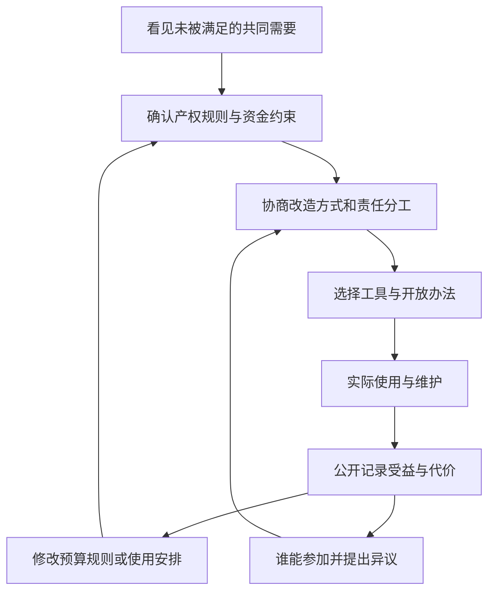

# 12｜如果资本会演化，我们怎样改变世界？

> 技术、制度、观念和生活方式互相牵动时，怎样提出真正能落地的改变？

---

## 一、先说结论

在哈维的视角里，资本主义不是一台只需更换单个零件的机器，而是由生产技术、社会关系、制度安排、日常生活与观念等活动领域相互塑造的历史过程。所谓资本演化，不是它会自动走向更好，而是各领域在矛盾和调整中改变彼此。因此，**改变世界不能把一项政策当作万能钥匙；也不必等所有条件完全成熟才开始行动。**比较可行的起点是找准具体矛盾，提出能让不同人参与、能检验后果并在必要时修正的组合方案。

## 二、我们先理解一个问题

某处闲置空间可以成为开放的公共场所，也可以出租换取稳定收入。有人希望开放，但管理者担心维修费；有人提议数字预约，却忽略不会用手机的人；有人主张直接免租，却没有说明谁负责日常维护。每个建议都触到了问题的一部分，单独实行却可能让另一处出现缺口。

这正是本篇的问题：假如一个社会安排牵连资金、所有权、工具、劳动与习惯，为什么改变不能只靠一句愿望或一条规定？讨论资本演化时，我们并非要列出所有坏现象，而是要解释**多个活动领域怎样相互制约，又怎样留下共同改变的入口**。这里的改变不是保证一次会议解决所有问题，而是让可被追问和修订的决策取代只有少数人能决定用途的惯性。

## 三、作者到底提出了什么观点？

中译本公开目录以“资本的演化”为最后一章。哈维的总体问题意识是把资本积累放在空间、国家、劳动、观念与生活实践中理解，而不是把技术或政策孤立为唯一驱动力。用通俗的话说，新的生产办法需要有人使用，也要有产权和规则支持；规则改变了，人们对合理生活的期待又可能随之改变。资本主义的延续与变形，正是在这些环节相互作用中发生的。

这里提炼的核心观点是：**既然社会不是单一开关，改变就应寻找不同活动领域之间能够互相支撑的路径。**这不等于哈维给出了一张普遍有效的政策清单，也不能从书名推断作者赞成文中后面的具体方案。本文讨论的是依据同题公开章节作出的概念性解读；凡涉及可操作的设计，须另外说明其推论性质。

## 四、把这个观点翻译成人话

想象一间房要改成大家都能用的活动室。装一扇门解决了进出问题，没解决钥匙由谁保管；公布开放时间解决了信息问题，没解决夜间由谁值守；获得一笔改造费解决了开工问题，没解决第二年的维护费。门、规则、钱、值守者和使用者的习惯不是同一件东西，却必须相互配合。这不是说处处都要先达成完美共识，而是说一个环节的改变会改变其他环节的成本和可能性。

“演化”也不表示只能等待。人们可以试行新的分工，观察使用情况，再调整时间、预算与参与方式。反过来，若只换一种技术却维持原有的排除规则，受益者可能没变；若只发布新规却不给执行者资源，规则可能只停在纸上。因此判断改革，不能只看它宣布了什么，还要看它是否有足够的配套，以及谁有机会在发现问题后提出修正。

## 五、为什么会这样？

可以把行动路径理解为一条带反馈的链：先确认当前安排让哪些需要得不到满足，再辨认产权和资源的限制，接着选择工具、分配责任，最后通过实际使用检验结果。每走一步，参与者对问题的理解也可能改变。制度决定谁有权提案，技术决定怎样记录需求，生活习惯决定空间是否真正被使用；这些不是排成一列的单向因果，而是互相牵引的条件。

图里的反馈箭头尤其重要：如果效果不如预期，问题未必是“公众不懂改革”，也可能是使用时间不合适、维护任务未获支付，或参与者原本就没被邀请。每次修订都需要有明确的权限、公开的成本和可核查的结果，才不会把“协同”当作无需负责的好听口号。这里是基于多领域相互作用所作的行动推论，并非书中规定的操作流程。

## 六、举一个现实生活中的例子

来看一个**假设案例**，不对应原书或任何真实校园：一所学校有栋停用的旧楼，邻近居民希望周末把部分房间改造成社区学习与活动空间。学校担心安全责任，教师担心教学区域被干扰，居民希望有低门槛的活动地点，管理方则必须核算加固、保洁与水电费用。若只宣布“开放”，风险可能被推给没有决策权的值守人员；若只按最高租金决定用途，某些无力支付的需求又会被排除。

参与者先把问题拆开：由专业人员评估建筑安全，区分可开放与不可开放区域；校方确认产权和安全责任；居民提出时段与用途，保洁和值守人员说明工作量；资金方案分别列出一次性改造与每年维护。可以先试行部分房间的限定时段开放，提供线下报名，同时记录实际使用率、冲突、费用和投诉。试行失败可以暂停或调整，不能把热情当作建筑安全证明，也不能把一次会议当作永久授权。

这个场景的重点不是证明某种管理模式必然优于另一种，而是让各领域的约束出现在同一张决策桌上。技术上的加固没有解决谁可进入，协商好的规则也不能替代维护经费；使用者、管理者与劳动者对“成功”的理解还可能不同。若有人提议商业租赁补贴免费活动，就要进一步公开租金怎么分配，检查付费活动是否挤走原本希望进入的人。

## 七、回到书中重新理解

《世界的逻辑》是不同年代论文组成的文集，不是从开篇逐章推出一套现成社会改造蓝图。中译本第十一章名为“资本的演化”；可核对到哈维《The Enigma of Capital》中同题章节“Capital Evolves”的公开版本，出版方目录也把它列为本书最后一章。该章把资本演化放在技术与组织、社会关系、制度安排、劳动过程、自然关系、日常生活和世界观等多个活动领域的共同演化中理解。

需要特别守住资料边界：公开文本可以支持上述多领域框架，但旧楼协商程序不是作者案例，也不能把某一种改革路径加上“哈维主张”的标签。本文把这一框架转成可检验的问题，具体操作仍是分析推论。

## 八、这个观点背后还有什么？

多领域相互作用不意味着各方权力对等。产权人可以拒绝进入，出资者可以撤资，维护者可能没有发言时间，使用者也不一定能持续参与。说“共同协商”之前要问：谁有否决权，谁承担无偿劳动，谁能看到预算？若规则只让有空开会的人发言，貌似平等的程序仍可能排除工作时段不固定的人。能否改变，取决于参与的入口是否真实、义务与权利是否相称。

还要区分短期试点与长期制度变迁。旧楼开放三个月可能改善部分人的活动条件，但不代表所有财政压力、空间分配矛盾都消失。试点值得做，是因为它产生可观察的信息：哪些时段需求最大，维修成本由谁承担，安全边界能否守住；而决定是否扩大试点，则应把反对意见与被遗漏的人也纳入。由“资本会演化”推到“可以通过协商改造制度”，中间需要集体行动和持续资源，不能把变化说成自发的善意循环。

## 九、这个观点有问题吗？

这套视角有说服力之处，是能解释为什么漂亮的单项改革常在执行时碰壁，也能提醒我们关注技术、规则和生活需求怎样彼此作用。争议在于，若把所有东西都称作相互关联，分析可能变得过宽，以至于不知道从哪里行动；不同利益主体也不一定愿意协商，更不一定能平等协商。

过度简化的说法是“只要改好每一个领域，社会就会整体变好”。资源有限时必须排序，有些矛盾涉及不可妥协的安全底线，试错也可能让弱势者先付代价。其他解释会强调财政能力、法律权限、专业安全评估，或者利益冲突下的谈判力量，而不仅是活动领域之间的配套程度。评判一个方案，应比较成本、使用效果和负担分配，也应允许事实表明最初设想并不适用。

## 十、今天再看这个观点

**以下部分是把哈维关于资本演化的视角用于当下公共决策的现代延伸，不是作者原话。**在平台化管理普及的今天，用线上预约记录空间使用情况很方便，但它不能自动回答谁能进入、数据由谁保管、不能上网的人如何报名。若要让工具服务集体行动，可以同时保留线下渠道、公开使用规则与年度维护账目，并设定可申诉的程序。工具的价值应由它改善了什么来判断，而不是由它看起来有多先进来判断。

这样的思路也适用于评估任何被称作“创新”的安排：先问解决的是谁的困难，再问经济成本、管理权与劳动时间怎样重新分配，最后约定什么证据会促使我们改变主意。集体行动不是先拥有所有答案，而是让受影响的人能够持续发现问题、修改方案，同时保护那些承担风险却不易发声的人。没有这几项条件，“改变”可能仅仅是把旧负担转移到另一群人身上。

## 十一、这一篇真正应该记住什么？

1. 哈维把资本的变化放在多种活动领域的互动中理解；技术、制度、观念与生活实践不能互相替代。
2. 改变可以从具体矛盾出发，同时安排权限、经费、劳动与参与机制，并通过反馈修订，而非等待万能政策。
3. 多领域视角不是成功保证；还须核查安全、成本、权力差异与实际受益者，保留对方案说不和修改的可能。

## 十二、留一个问题

当一种空间安排既能带来收入，又要满足人的真实需要时，我们愿意把谁的需要放进账本？面对收益、成本与权利之间的冲突，你会用什么证据判断一种改变值得尝试，又在什么情形下愿意修正自己的判断？

## 系列收束

回到最初那套房：它让人安顿生活的**使用价值**，与它能够出售、抵押的**交换价值**，始终不能简单互相替代。沿着这条张力，我们一路追问资金怎样流动、城市怎样被建造、风险由谁承担、共同生活如何被决定；走到最后，并没有得到一把包办所有问题的钥匙。更值得带走的是一种判断习惯：看见某项安排创造了什么，也追问它遗漏了谁；辨认作者有力的解释，也寻找适用边界与其他证据。愿你从自己熟悉的地方出发，把这些问题交给现实检验，并形成自己的答案。
