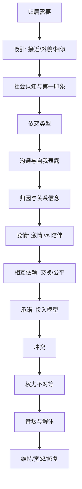

# 《亲密关系》深度解读系列

## 系列简介

《亲密关系》是关系科学领域的经典教材级著作（罗兰·米勒）。它把"爱情、友情、婚姻"这些通常被当作感性话题的东西，放进了严谨的研究框架里：**我们为什么需要亲密关系？我们被谁吸引？为什么会误解最爱的人？关系又是如何在冲突与背叛中解体或修复的？**

它最重要的贡献，是提供了一套"看关系的科学镜头"。它告诉你：吸引并非玄学，而是接近性、外貌、相似性的可测量组合；误解并非人品问题，而是归因与沟通的系统性偏差；承诺也并非誓言，而是满意度、替代选择与投入量的函数。

这本书最大的价值，不是给你鸡汤式的安慰，而是让你**知道关系里哪些是可以改变的结构，哪些只是正常的起伏。** 本系列围绕 **16 个核心问题**，从归属需要、依恋类型，一路讲到冲突、权力、背叛与修复。

---

## 全书核心问题

| 层次 | 问题 |
|---|---|
| 基础问题 | 人为什么离不开亲密关系？我们被谁吸引？ |
| 认知问题 | 为什么我们最容易误解最亲近的人？ |
| 爱情问题 | 爱情有哪几种？承诺由什么决定？ |
| 冲突问题 | 冲突、权力与背叛为何发生？ |
| 修复问题 | 如何维持与修复一段关系？ |

---

## 全书知识地图



---

## 全系列目录

### 第一部分：关系的基础

#### 01｜人为什么离不开亲密关系？

核心问题：为什么孤独会让人痛苦，而关系会影响健康与寿命？

核心观点："归属需要"是人类进化出的基本需求，和饥饿、口渴一样真实。缺乏亲密联结不仅让人情绪低落，还会影响免疫、心血管与寿命。关系不是生活的点缀，而是生理与心理的刚需。

理解难度：★★☆☆☆

关键词：归属需要、孤独、健康、演化

---

#### 02｜我们会被什么样的人吸引？

核心问题：喜欢一个人，究竟是被什么决定的？

核心观点：吸引有可研究的规律：接近性（越常接触越容易喜欢）、曝光效应、外貌吸引力、相似性（价值观、态度、背景），以及被对方喜欢本身。激情不是凭空而来，而是这些因素共同作用的产物。

理解难度：★★★☆☆

关键词：吸引、接近性、曝光效应、外貌、相似性

---

#### 03｜第一印象为什么那么准，又那么错？

核心问题：为什么我们认定一个人"是什么样"，就会不断"证实"它？

核心观点：社会认知的研究表明：第一印象一旦形成，就会通过"自我实现预言"和选择性注意被不断强化——你越觉得对方冷淡，就越用冷淡的方式对待他，最终真的把他推远了。我们对伴侣的判断，往往是循环论证。

理解难度：★★★★☆

关键词：第一印象、自我实现预言、社会认知、确认偏误

---

#### 04｜什么是“依恋类型”？

核心问题：为什么有人在关系里安心，有人总在焦虑，有人拼命想逃？

核心观点：依恋理论把人分为安全型、焦虑型、回避型（以及混合的恐惧型）。它源于早期照料经验，并延续到成人亲密关系中：安全型信任亲密，焦虑型害怕被抛弃，回避型害怕被吞噬。理解依恋类型，能解释大量"我怎么又这样了"的重复模式。

理解难度：★★★★☆

关键词：依恋、安全型、焦虑型、回避型

---

### 第二部分：沟通与理解

#### 05｜为什么最亲密的人反而最容易误解彼此？

核心问题：为什么我们和陌生人客气，却和爱人争吵？

核心观点：沟通是编码—解码的过程，而亲密关系里情绪更强、期待更高、试探更多，失真也更大。我们常用"读心"代替确认，用自己的意图去揣测对方，于是误会层层累积。亲密的错觉，恰恰是误解的温床。

理解难度：★★★☆☆

关键词：沟通、编码解码、读心、误解

---

#### 06｜“自我表露”为什么是亲密的钥匙？

核心问题：为什么"交心"能让人变亲近？

核心观点：自我表露是关系深化的核心机制：逐步、对等地向对方开放内心，会建立信任与亲密。它需要"互惠"——一方的开放会邀请另一方的开放；也需要"节奏"——太快会让人有压力，太慢则关系停滞。

理解难度：★★★☆☆

关键词：自我表露、互惠、信任、亲密

---

#### 07｜为什么我们总把对方的错归因于“人品”？

核心问题：为什么同样一件事，对自己和对伴侣的解释完全不同？

核心观点：归因偏差：我们倾向于把伴侣的失误解释为"他的品性"（他就是不在乎我），把自己的失误解释为"处境"（我太忙了）。这种"行动者—观察者偏差"在亲密关系中会持续侵蚀满意度，是误解与怨气的常见来源。

理解难度：★★★★☆

关键词：归因偏差、行动者观察者、关系信念、怨气

---

### 第三部分：爱情与相互依赖

#### 08｜爱情到底有几种？

核心问题：为什么热恋会冷却，而有的感情却越来越深？

核心观点：研究者区分"激情之爱"（强烈、痴迷、生理唤起、随时间衰减）与"陪伴之爱"（温和、依恋、关怀、随时间加深）。爱情也可拆成亲密、激情、承诺三成分。理解这一点，能解释"热恋期结束"并不等于"不爱了"。

理解难度：★★★☆☆

关键词：激情之爱、陪伴之爱、爱情三角、新鲜感

---

#### 09｜为什么“付出与回报”在关系里很重要？

核心问题：谈钱伤感情？可为什么关系里其实一直在"算账"？

核心观点：相互依赖理论指出：关系是一种交换——我们关注回报、成本与"这段关系值不值"。健康的关系不是零计较，而是公平：双方都觉得付出与所得大致对等。长期不公平，无论谁吃亏，都会动摇关系。

理解难度：★★★★☆

关键词：社会交换、公平理论、投入、依赖

---

#### 10｜为什么有人承诺，有人离开？

核心问题：一个人留在一段关系里，究竟由什么决定？

核心观点：投入模型：承诺感 = 满意度 + 替代选择质量 + 投入量。也就是说，一个人不离开，不一定是因为很幸福，也可能是因为没有更好的选择、或已经投入太多。理解这个公式，能更清醒地看待"他为什么不走"和"我为什么走不了"。

理解难度：★★★★☆

关键词：承诺、投入模型、满意度、替代选择

---

#### 11｜友情和爱情有什么不同？

核心问题：友情和爱情的边界在哪里？为什么友情常常被低估？

核心观点：友情与爱情共享亲密、信任与支持，但爱情通常包含激情与排他性期待，友情则更灵活、更少义务。研究显示，友情对幸福感与寿命的贡献常被严重低估。理解二者的异同，有助于更健康地经营两类关系。

理解难度：★★★☆☆

关键词：友情、爱情、边界、支持

---

### 第四部分：冲突、权力与伤害

#### 12｜关系里的冲突为什么无法避免？

核心问题：为什么再恩爱的两个人也会吵架？

核心观点：冲突是关系的常态：两个独立的人，需求、习惯、目标必然有分歧。冲突本身不致命——真正影响关系的是**如何处理**冲突。研究反复发现：用"回避"还是"面对"、用"批评人格"还是"就事论事"，比冲突的频率重要得多。

理解难度：★★★☆☆

关键词：冲突、分歧、关系常态、应对方式

---

#### 13｜吵架有“正确方式”吗？

核心问题：为什么有的争吵越吵越近，有的越吵越远？

核心观点：破坏性的应对包括：批评、蔑视、防卫、冷战（研究者称为关系的"末日四骑士"）。建设性的方式则是：就事论事、表达自身感受、倾听对方、寻求妥协。区别不在"吵不吵"，而在"怎么吵"。

理解难度：★★★★☆

关键词：末日四骑士、批评、蔑视、冷战、建设性冲突

---

#### 14｜权力不对等会怎样伤害关系？

核心问题：当一方掌握更多资源时，关系会发生什么变化？

核心观点：权力来自"更少依赖"——谁更不怕失去，谁就更有话语权。权力不对等会带来决策失衡、情绪劳动不均、以及冷暴力与人身暴力的风险。研究显示，平等与尊重，是关系稳定和满意度的关键预测因素。

理解难度：★★★★☆

关键词：权力、依赖、平等、暴力、控制

---

#### 15｜关系为什么会走向背叛与解体？

核心问题：分手和出轨，是突然发生的，还是逐步发生的？

核心观点：关系解体通常不是突然的，而是经历"不满—疏离—另寻—公开"的渐进过程。背叛常与"替代选择变好、投入感下降、满意度降低"有关。理解解体的机制，不是为了悲观，而是为了在早期信号出现时有机会干预。

理解难度：★★★★☆

关键词：背叛、出轨、关系解体、渐进过程

---

### 第五部分：维持与修复

#### 16｜如何让一段关系活得更久？

核心问题：那些长久而幸福的关系，究竟做对了什么？

核心观点：维持与修复的关键包括：主动表达欣赏、保持日常的正向互动、在冲突中修复（道歉与宽恕）、共同建设"我们"的叙事、以及持续投入。研究者强调：稳定的关系靠的不是"找对人"，而是"持续做对事"。

理解难度：★★★★☆

关键词：维持、宽恕、修复、欣赏、共同意义

---

## 推荐阅读顺序

**主线顺序（推荐）：01 → 16。**

```text
第一段｜基础（01–04）      归属需要 → 吸引 → 第一印象 → 依恋类型
第二段｜理解（05–07）      沟通 → 自我表露 → 归因偏差
第三段｜爱情（08–11）      爱情类型 → 公平交换 → 承诺模型 → 友情
第四段｜冲突（12–15）      冲突 → 争吵方式 → 权力 → 背叛
第五段｜修复（16）         维持与修复
```

**阅读建议：**

- **想快速自查关系**：读 04、07、09、10、16。
- **正在争吵/冷战**：直接读 12、13、14。
- **想理解"为什么留不住/走不掉"**：读 10、15。
- **想练习批判性阅读**：重点看 03、09、13 三篇。

---

## 全系列状态

> 本系列共 16 篇，正文生成中。
