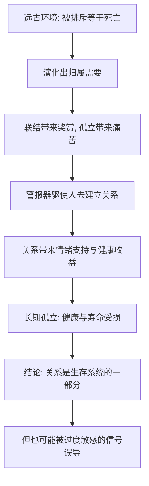

# 01｜人为什么离不开亲密关系？

> 为什么孤独会让人痛苦，而关系真的会影响健康与寿命？

---

## 一、先说结论

米勒给出的答案，来自一个被反复验证的心理学概念：**归属需要。**

人对亲密联结的渴望，和饥饿、口渴一样，是进化写进身体里的基本需求——不是"矫情"，而是刚需。长期缺乏亲密关系，不只是让人情绪低落，还会实实在在地影响免疫、心血管、睡眠乃至寿命。

也就是说：**关系不是生活的装饰，而是生存系统的一部分。**

---

## 二、我们先理解一个问题

先想一个反常识的现象。

一个人可以做到经济独立、身体健康、工作顺利，什么都不缺——可如果长期没有可以说心里话的人，他依然会感到一种难以排解的痛。这种痛，不是"想太多"，而是真实存在的。

反过来，一个物质条件普通、但身边有稳定亲密关系的人，往往比前一种人更健康、更长寿、更不容易抑郁。

于是问题来了：

> 为什么"有人可依"这件事，会和"活下去"这件事，被大脑放在了同一个层级上？

---

## 三、作者到底提出了什么观点？

米勒在书中把"归属需要"作为理解一切亲密关系的起点。他提出的核心观点是：

1. **归属需要是普遍的、与生俱来的。** 几乎所有人类文化中，人都要建立并维持稳定的亲密关系；这不是文化偏好，而是生物倾向。
2. **它和基本生存需求同源。** 在人类进化史上，被群体接纳意味着生存，被排斥意味着死亡。因此大脑把"被接纳"和"被拒绝"处理成了强烈的奖赏与痛苦信号。
3. **缺乏亲密关系是有代价的。** 大量研究表明，长期孤独与更高的抑郁、心血管疾病和早逝风险相关；关系的质量，是预测健康和幸福的重要变量之一。

一句话：**我们需要关系，不是因为软弱，而是因为我们本就是"社会性动物"。**

---

## 四、把这个观点翻译成人话

可以用"身体里的警报器"来理解。

饥饿的时候，身体给你一个难受的信号，催你去找吃的；口渴同理。归属需要也一样：当联结不足时，身体会给你一个难受的信号——孤独、空虚、烦躁、莫名低落，催你去找人。

这个警报器在远古是保命的：脱离部落的人几乎活不下来。所以它被设计得非常敏感，也非常难以忽略。

问题是，它并不总是"对"的：它会让人害怕被拒绝，会让人为了融入而委屈自己，也会让人把一段有害的关系抓得比孤独更紧。**警报器提醒你有需求，但它不负责判断该往哪儿走。**

---

## 五、为什么会这样？

把它拆成一条链：

关键在 **A → B** 这一跳。

正因为"被群体接纳"在远古等同于"活命"，大脑才把社会排斥处理得如此剧烈——研究显示，被拒绝时激活的脑区，与身体疼痛的脑区有重叠。这既是归属需要如此强烈的原因，也是它有时会"误报"的原因：**一个为远古设计的报警系统，在今天的社交环境里，并不总是精准。**

---

## 六、举一个现实生活中的例子

回想疫情居家的那段时间。

很多人并不缺食物、不缺娱乐、不缺工作，却普遍出现了一种奇怪的状态：烦躁、失眠、提不起劲、无缘无故地想哭。有意思的是，这种难受，往往在看到别人聚会、家庭聚餐的照片时最强烈。

这说明：**驱使我们痛苦的，不是"没吃没喝"，而是"联结被切断"。**

再想一位独居的老人。他可能衣食无忧，但如果没有稳定的社会联系，健康会加速下滑——这一点在大量流行病学研究中被反复观察到：社会孤立与死亡率上升相关。

反过来，一个人哪怕工作不顺、经济一般，只要有几个能倾诉的人，他的抗压能力就会显著不同。**关系在这里扮演的，不是"锦上添花"，而是"防护层"。**

---

## 七、回到书中重新理解

现在再回看米勒为什么用"归属需要"开篇，就顺了。

他并不是在说"人要合群"。他是在为一个更冷的命题打地基：**亲密关系是人的基本需求，而不是可选项。** 只有先接受这一点，后面关于吸引、依恋、爱情、冲突的所有讨论，才有一个统一的出发点——我们不是"想不想"要有关系，而是"必须"有关系，问题只在于**建立什么样的关系、如何维护它。**

理解了归属需要，你也就理解了为什么"孤独"值得被严肃对待，而不是被一句"多出去走走"打发。

---

## 八、这个观点背后还有什么？

**第一，重要的不只是"有没有关系"，更是"关系好不好"。** 一段充满冲突、贬低与控制的劣质关系，对健康的伤害不亚于孤独。

**第二，"需要关系"不等于"必须依赖某个人"。** 归属需要的对象可以是伴侣、朋友、家人、社群，甚至宠物；把全部需求压在一个人身上，反而是风险。

**第三，它解释了孤独为什么"生理性"地痛。** 如果把孤独理解成情绪问题，就会责怪自己脆弱；把它理解成需求信号，就能采取行动。

**第四，它和第 04 篇"依恋类型"直接相连。** 归属需要是普遍的需求，依恋类型则解释了这个需求在不同人身上表现为怎样的"索求方式"。

---

## 九、这个观点有问题吗？

有，需要一些限定。

**第一，"关系影响健康"多为相关性证据。** 孤独与疾病、早逝相关，但相关不等于因果——也可能是健康状况差导致人更孤立。研究者通常用纵向追踪来缓解这个问题，但仍不能完全排除混杂因素。

**第二，"归属需要是进化本能"的叙事难以直接检验。** 它更像一个有力的解释框架，而非可被实验证伪的定律。

**第三，文化差异被低估的可能。** 不同文化对"独立"与"联结"的重视程度不同，把"需要亲密关系"说成普世刚需，可能忽略了文化对需求强度与表达方式的塑造。

**第四，但对绝大多数人而言，这个判断是安全的。** 大量跨文化、跨年龄的研究支持：稳定的社会联结与更好的健康、幸福感相伴。

**所以更准确的说法是**：人确实有强烈而普遍的社会联结需求，且它与健康幸福密切相关；但"关系决定健康"的因果链仍需谨慎表述，个体差异与文化差异也应被承认。

---

## 十、今天再看这个观点

以下部分是基于米勒思想的现代延伸，不是他在书里的原话。

在今天，"归属需要"遇到了一个尖锐的矛盾：我们比历史上任何时代都"连接"，却可能比任何时候都"孤独"。

社交软件提供的是**低成本的连接感**——点赞、转发、群聊——但它们常常满足的是"被看见"的表层需求，而非"被理解"的深层需求。研究反复发现：**社交媒体的使用时长与孤独感，有时是正相关的。**

这恰好印证了米勒的区分：归属需要要的是"真实的、双向的、稳定的联结"，而不是"数量的连接"。所以，问题也许不是"我们有没有朋友"，而是"我们有没有那种可以说真话的关系"。

---

## 十一、这一篇真正应该记住什么？

1. **归属需要是基本需求。** 对亲密联结的渴望与饥饿、口渴同源，不是软弱或矫情。
2. **孤独是真的会伤人。** 长期孤立与抑郁、心血管疾病、早逝风险相关，关系是健康的防护层。
3. **进化视角解释了它的强度。** 被排斥在远古等于死亡，因此大脑把拒绝处理成了类似疼痛的信号。
4. **但要区分"有连接"和"有联结"。** 廉价、表层的连接，满足不了深层需求；质量比数量重要。
5. **这是理解全书的地基。** 先接受"人必须有关系"，后面关于吸引、依恋、冲突的讨论才成立。

---

## 十二、留一个问题

> 如果对关系的需要像饥饿一样真实，
> 那么你上一次感到的孤独，
> 是被"没有人在身边"触发的，还是被"身边有人，却没人真的懂我"触发的？

---

**下一篇**：既然人离不开关系，那下一个问题就来了——我们究竟会被什么样的人吸引？是缘分，是眼缘，还是其实有一整套可被研究的规律？

下一篇我们就来拆开这个问题——**我们会被什么样的人吸引？**
