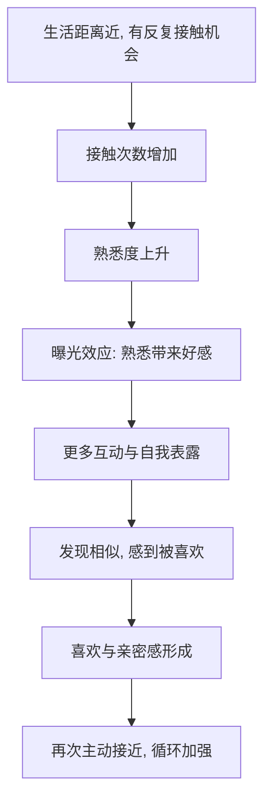

# 02｜我们会被什么样的人吸引？

> 喜欢一个人，究竟是被缘分、眼缘决定的，还是背后有一整套可以被研究的规律？

---

## 一、先说结论

米勒给出的答案，冷静但清晰：**吸引不是玄学，而是一组可被研究的因素的产物。**

在他的框架里，我们喜欢上谁，很大程度上取决于三件事：我们有多常与对方接触、对方在多大程度上与我们有相似之处、以及对方是否让我们感觉良好。缘分和眼缘当然存在，但它们更像是这些规律运行之后，我们才回头贴上的标签。

一句话：**吸引是“可研究”的，它由条件塑造，而不是由命运指派。**

---

## 二、我们先理解一个问题

先看一个反直觉的事实。

问一问身边的人：“你最好的朋友是怎么认识的？”答案往往平淡得令人失望——“我们是大学同宿舍的”“我们以前在同一个办公室”“我们住同一个小区”。很少有人会说“我在街上一眼看到他，就认定要成为朋友”。

也就是说，一段深厚感情的起点，常常不是什么灵魂共振，而是一个更朴素的东西：**我们碰巧经常遇上。**

于是就出现了一个值得追问的问题：

> 如果“喜欢”是一种情感，为什么它会被“距离”和“见面次数”这种极其机械的变量左右？

---

## 三、作者到底提出了什么观点？

米勒在讨论“吸引”时，提出了几条被大量研究支持的规律。他关注的第一个，也是常常被低估的一个，是**接近性**。

1. **接近性。** 米勒认为，我们最容易喜欢上的，是那些与实际生活距离近、有反复接触机会的人。物理或功能上的接近，是关系开始的第一道门槛。
2. **曝光效应。** 仅仅是“反复看到”某个人，就足以提升我们对他的好感，哪怕最初没有任何互动。熟悉本身会带来喜欢，前提是接触不是负面的。
3. **相似性。** 一些研究者反复发现，价值观、态度、背景上的相似，是长期吸引最稳定的预测因素之一。我们倾向于喜欢与自己相似的人。
4. **被喜欢的感觉。** 得知对方喜欢我们，本身就会提升我们对对方的好感，这是一种互相加强的循环。

在这些之外，外貌吸引力、我们自身的需要与状态，也在其中起作用。换句话说：**吸引是一套多因素系统，不是单一的“感觉”。**

---

## 四、把这个观点翻译成人话

可以用“熟悉感是感情的入场券”来理解。

想象一个剧场。你和某个人要成为朋友或恋人，首先得有人把你们放进同一个房间，并且让灯光反复照到彼此身上。接近性负责“把你们放进同一个房间”，曝光效应负责“让灯光反复照到”。只有当这两步发生之后，相似性、好感、喜欢才有机会登场。

这就解释了一个很多人不愿承认的事实：**很多“错过”，不是不合适，而是没有机会反复相遇。** 那些在同一个城市、同一个圈子里反复出现的人，天然获得了更多可能性。

换句话说：**喜欢不是从天而降的，它是被“机会”喂养出来的。**

---

## 五、为什么会这样？

把这条链拆开：

关键在 **C → D** 这一跳。

人脑对“熟悉”有一种本能的偏好：一个反复出现、且没有威胁的刺激，会被大脑处理得越来越“安全”，而安全往往会被体验为“好感”。这不是理性计算，而是演化留下的倾向——在远古环境里，熟悉的面孔通常意味着“自己人”，而自己人意味着生存。

但要注意：曝光效应的前提是“接触是中性的或正面的”。如果每次见面都伴随冲突和不适，那么反复接触只会放大反感。**接近性是放大器，它放大的是原本的方向。**

---

## 六、举一个现实生活中的例子

回想一下，你有没有注意过宿舍楼或办公楼里的这种现象。

很多人的挚友，最初都来自“同一层楼”“同一个部门”“每天同一趟电梯”。你可能并不觉得对方特别契合，只是因为你们每天都在走廊里碰面、打招呼、顺手帮个小忙，一年下来，居然成了可以交心的人。

反过来也有一种人：明明各方面和你很合拍，但你们不在同一个空间，一年也见不上几次，于是关系始终停在“点赞之交”。

这背后就是接近性与曝光效应在起作用：**每天见面的人，曝光频率高，熟悉感累积快，互动的机会多，误会被澄清的机会也多。** 而距离远的人，即使契合，也缺少让感情生长的土壤。

这也解释了一个常见的感慨：毕业之后，曾经形影不离的朋友渐渐就淡了。未必是感情变了，而是“反复碰面”这个条件消失了。

---

## 七、回到书中重新理解

现在再回看米勒为什么把“接近性”放在吸引的第一个位置，就顺了。

他并不是要否认浪漫，而是要给浪漫打一个冷静的底。**感情的第一个开关，不是心灵的契合，而是物理的相遇。** 只有先接受“接近性决定可能性”，后面关于相似性、互惠、依恋、承诺的讨论才有现实基础——毕竟，一个人只有先反复出现在你生活里，你才有机会了解他是否与你相似、是否值得托付。

理解了这一点，你也就理解了为什么“异地”如此艰难，为什么“换个环境”往往意味着换一批朋友。**关系的地图，首先是一张空间的地图。**

---

## 八、这个观点背后还有什么？

**第一，它把“选择权”还给了我们。** 如果你相信吸引取决于“机会”，那你可以主动制造机会——去固定的场所、参与固定的圈子，就等于给自己增加了遇见对的人的概率。

**第二，它解释了“日久生情”的机制。** 日久生情不是迷信，而是曝光效应与互动累积的自然结果。

**第三，它提示了“相似性”的边界。** 相似让人亲近，但过度相同也可能缺少新鲜与互补；研究并没有说“越像越好”，而是说“相似性在关键维度上很重要”。

**第四，它和后面几篇直接相连。** 接近性解决“有没有机会认识”，而第一印象、依恋类型、沟通方式，则决定“认识之后能不能走到一起”。

---

## 九、这个观点有问题吗？

需要一些限定。

**第一，“曝光效应”有严格的前提。** 关于这一问题，学界存在不同解释：一些研究者强调重复接触带来的熟悉与好感，另一些则指出，如果最初的接触是负面的，重复只会加深厌恶。所以“多见面就会喜欢”并不成立，方向很重要。

**第二，接近性好用，但不等于唯一。** 影响吸引的因素众多，接近性只是“让人有机会相遇”。真正的吸引，还要看相似性、互惠、外貌、价值观等。

**第三，“相似性吸引”也并非铁律。** 一些研究者认为，互补性在某些维度同样重要；还有人指出，人们有时会被“与自己理想自我相似”的人吸引，而非与实际自我相似的人。

**第四，但核心判断是稳妥的。** 大量研究反复支持：接近性与曝光效应是真实存在的影响因素，尤其在关系的最初阶段。

**所以更准确的说法是**：接近性与熟悉度显著提高了“喜欢”的概率，但它们是放大器而非决定因素；吸引最终是接近、相似、互惠、外貌与个人状态共同作用的结果。

---

## 十、今天再看这个观点

以下部分是基于米勒思想的现代延伸，不是他在书里的原话。

在互联网时代，“接近性”被改写了。过去，接近意味着物理距离近；今天，一个算法推荐、一个共同话题的群组，也能制造出高频的“虚拟碰面”。

这带来了一个矛盾：**线上可以制造曝光，却很难制造真实的共处。** 你在同一个社群里天天看到某人发言，熟悉感确实会上升；但这种熟悉缺少身体在场、缺少生活细节的共享，往往难以直接转化为深厚的关系。

这恰好印证了米勒的框架：**曝光效应需要真实的、反复的、非负面的接触。** 频繁的线上互动可以成为开始，但真正让关系生长的，仍然是有质量的重复相处。所以问题也许不是“我们能不能在网上遇见彼此”，而是“遇见之后，我们有没有把线上的一瞥，变成线下的反复共处”。

---

## 十一、这一篇真正应该记住什么？

1. **吸引有规律，不是玄学。** 接近性、曝光效应、相似性、被喜欢，都是可研究的因素。
2. **接近性是关系的第一道门槛。** 很多感情的开始，只是“我们经常碰到”。
3. **熟悉会带来好感，但有前提。** 反复接触只有在非负面时才提升好感，否则会放大厌恶。
4. **相似性在关键维度上很重要。** 价值观、态度、背景的相似，是长期吸引的稳定预测因素。
5. **你可以主动制造机会。** 既然吸引受条件影响，改变你的“接触环境”，就是改变你的关系地图。

---

## 十二、留一个问题

> 你人生中最重要的几段关系，
> 有多少是从“我们经常碰面”开始的？
> 如果答案比你想象的多，那么你现在的“碰面环境”，正在替你筛选什么样的人？

---

**下一篇**：既然吸引很大程度上取决于“反复接触”，那么在这些接触里，我们对一个人形成的判断——也就是第一印象——又有多可靠？它为什么看起来那么准，却又常常把关系引向错误的方向？

下一篇我们就来拆开这个问题——**第一印象为什么那么准又那么错**。
