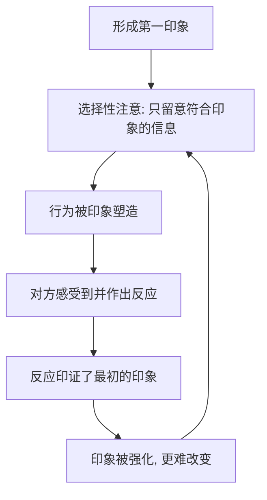

# 03｜第一印象为什么那么准，又那么错？

> 为什么我们一旦认定对方“是什么样的人”，就会不断找到证据来证明它？

---

## 一、先说结论

米勒给出的答案，藏在一个反直觉的结论里：**第一印象之所以“准”，很大程度上是因为它自己把自己变成了现实。**

我们对一个人的初始判断，会通过选择性注意、确认偏误和自我实现预言被反复强化：你越觉得对方冷淡，就越用冷淡的方式对待他，最终真的把他推远了。也就是说，**我们对伴侣的判断，常常是一场循环论证——不是印象反映了真相，而是印象制造了真相。**

一句话：**第一印象的“准”，有一部分是它自己努力的结果。**

---

## 二、我们先理解一个问题

先看一个奇怪的现象。

同一场聚会，两个人在结束后回忆同一个陌生人：一个人说“他挺温和的，只是话少”，另一个人说“他明显很傲慢，懒得理人”。两人看到的画面几乎一样，得出的结论却完全相反。

更关键的是，接下来的发展往往会各自印证他们的判断：觉得他温和的人，会主动搭话，于是发现他其实很友好；觉得他傲慢的人，会冷着脸保持距离，于是他确实也没给什么好脸色。

于是问题来了：

> 如果两个人都看到了“事实”，为什么他们眼中的事实如此不同？而且为什么到最后，两种判断都“应验”了？

---

## 三、作者到底提出了什么观点？

米勒在谈社会认知时，提出了几个相互咬合的观点：

1. **人是主动的信息加工者，不是被动的记录仪。** 我们不会等看完全部证据再判断一个人，而是很早就形成一个整体印象，然后用它去解释后续的一切。
2. **第一印象形成得极快，且异常顽固。** 关于这一问题，学界存在不同解释，但一个被广泛观察到的现象是：最初的判断往往主导了之后的解读方向。
3. **确认偏误与选择性注意。** 一旦形成印象，我们会不自觉地搜寻、记住那些符合印象的信息，忽略或重新解释那些不符合的信息。
4. **自我实现预言。** 米勒特别强调：我们对别人的期望，会通过我们的行为改变对方，从而让期望真的实现。你预期对方友善，就会友善地对待他；你预期对方敌意，就会戒备，从而诱发敌意。

一句话：**印象不是照片，而是一副眼镜——戴上它之后，你看到的“事实”，已经被它染过色。**

---

## 四、把这个观点翻译成人话

可以用“滤镜”来理解。

第一印象就像给手机装了一个滤镜。装之前，相机拍到的都是原图；装之后，同样的画面会呈现出完全不同的色调。滤镜本身不会撒谎，它只是改变了你看到的东西。

更要命的是，这个滤镜还会反过来影响被拍的人。你带着“这人很冷淡”的滤镜去和他说话，语气自然就冷了三分；他接收到你的冷，也就回敬你一份冷——于是你更加确信：看吧，他果然冷淡。

这就是一个闭环：**印象到行为，行为到对方的反应，反应再印证印象。** 你既是观察者，也是这个循环的参与者，却常常以为自己在“客观判断”。

---

## 五、为什么会这样？

把它拆成一条环：

关键在 **C → D** 这一跳。

如果印象只是让我们“看错”，问题还不大；真正麻烦的是它会通过行为改变现实。**这一步让印象从“主观判断”升级成了“客观事实”的制造者。** 这也解释了为什么第一印象“既准又错”：它错在起点（最初的判断可能基于极少的信息），却对在终点（它成功地让对方按你的预期行事）。

换句话说：**不是第一印象看穿了真相，而是第一印象先把真相捏成了它想要的样子。**

---

## 六、举一个现实生活中的例子

想想第一次约会。

假设你第一次约会时，对方迟到了十分钟，进门时表情有点紧绷，寒暄也略显敷衍。你在那一刻就形成了一个印象：**他不太重视这次见面。**

约会结束后，这个印象开始工作。他后面主动问你“周末有什么安排”，在你眼里变成了“他只是礼貌性客套”；他讲了个笑话，你礼貌地笑了一下，心里想的是“他在敷衍气氛”。同一场约会，如果一开始的印象是“他很在意我”，迟到会被解读成“路上太堵，他一定很着急”，紧张会被解读成“他有点害羞”。

更微妙的是后续：因为你觉得他不上心，回消息就慢了一点、短了一点；他感到你的疏离，也收回了热情。几次来回之后，你们真的渐行渐远——于是你更确信：我一开始就看出来了，他根本不在乎我。

这正是米勒所说的循环：**第一次约会的印象，成了之后每一次解读的模板；而模板又通过行为，把关系推向它预言的方向。**

---

## 七、回到书中重新理解

现在再回看米勒为什么把社会认知放在关系的前段，就顺了。

他并不是在说“第一印象不可信”，而是在指出一个更深的机制：**在亲密关系里，我们不是在客观地认识对方，而是在持续地“建构”对方。** 了解这一点，才能理解为什么很多关系里的问题，根源不在事实本身，而在于双方各自戴着的滤镜。

也正因如此，米勒后来谈沟通、谈归因偏差，才有了逻辑上的接续：**既然印象会自我实现，那么主动核对、主动沟通，就成了打破循环的唯一出口。** 你无法完全摘掉滤镜，但你可以提醒自己：眼前这个人，也许并不是我以为的样子。

---

## 八、这个观点背后还有什么？

**第一，它给了关系一次“重来”的机会。** 既然印象可以被行为塑造，那么改变行为，就有可能改变印象——主动表达善意，往往能扭转对方的预期。

**第二，它解释了“关系初期最重要”。** 早期的印象一旦固化，后续需要成倍的努力才能覆盖，所以开始阶段的相处格外关键。

**第三，它提醒我们警惕“读心”。** 我们常常以为“我很了解他”，实际上只是把印象当成了证据。

**第四，它和后续关于沟通、归因的讨论直接相连。** 印象制造的误会，正是靠沟通与归因的调整来化解的。

---

## 九、这个观点有问题吗？

需要保持平衡。

**第一，自我实现预言并非万能。** 关于这一问题，学界存在不同解释：一些研究者强调期望的力量，另一些则指出，当对方的真实特质很强、情境约束很大时，期望的影响会被削弱。印象不是总能“为所欲为”。

**第二，第一印象也确实有一定准确性。** 一些研究表明，人们从极短的行为片段中得出的判断，与后续评价存在一定的相关。所以“第一印象全是错的”也是过度简化。

**第三，印象改变的难易存在个体与情境差异。** 在长期、高互动的亲密关系中，印象既会被强化，也有机会被修正。

**第四，但这个机制本身是被反复支持的。** 选择性注意、确认偏误与期望效应，是认知心理学中相当稳固的发现。

**所以更准确的说法是**：第一印象会通过注意、解释与行为不断自我强化，因而既可能“看准”，也可能“造错”；它既有顽固的一面，也有被新信息修正的空间。

---

## 十、今天再看这个观点

以下部分是基于米勒思想的现代延伸，不是他在书里的原话。

在社交媒体时代，第一印象的“材料”变了，但机制没变，甚至被放大了。我们常常在见到一个人之前，就已经通过头像、主页、几条发言形成了印象；而算法又不断把符合该印象的内容推给我们，等于给滤镜又加了一层。

这带来一个新问题：**我们越来越容易“确认”自己的判断，却越来越难真正更新它。** 因为线上环境天然鼓励选择性的信息暴露，而缺少那种能推翻印象的、真实而持续的相处。

这恰好印证了米勒的核心：**打破印象的循环，靠的不是更多的信息，而是更真实、更长期的互动。** 所以问题也许不是“我的第一印象准不准”，而是“我有没有给它留一个被推翻的机会”。

---

## 十一、这一篇真正应该记住什么？

1. **第一印象会自我实现。** 它不只是判断，还会通过你的行为改变对方，从而让自己成真。
2. **“准”有时是循环论证的结果。** 印象制造了证据，证据又强化了印象。
3. **确认偏误与选择性注意在推波助澜。** 我们记住符合印象的信息，忽略或改写不符合的。
4. **印象并非全错，也并非不可改。** 它有一定准确性，也能在长期真实互动中被修正。
5. **主动核对是破局的关键。** 与其“读心”，不如直接问；与其下结论，不如给对方一次被重新认识的机会。

---

## 十二、留一个问题

> 你对身边某个人“早就看清了”的那个判断，
> 有多少是通过持续的相处验证出来的，
> 又有多少，其实是你的行为一步步把它变成现实的？

---

**下一篇**：如果说第一印象是关系的地基，那么在地基之下，还埋着一层更深的东西——为什么有人天生在关系里安心，有人却总在焦虑或想逃？这就要说到“依恋类型”。

下一篇我们就来拆开这个问题——**什么是“依恋类型”**。
