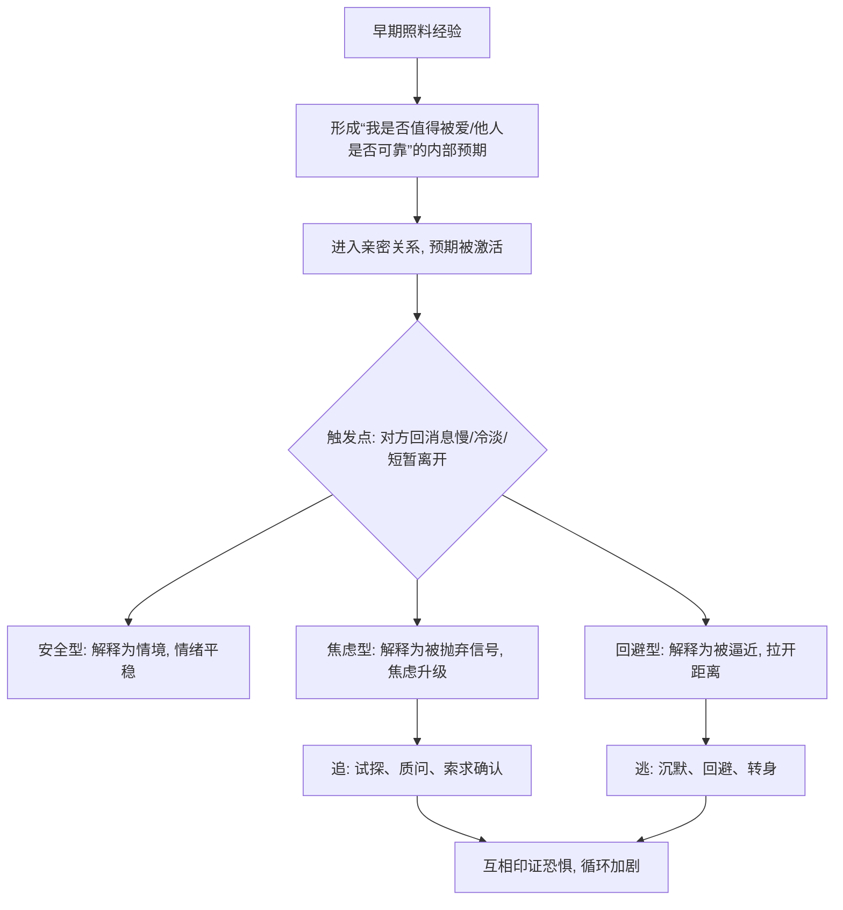

# 04｜什么是“依恋类型”？

> 为什么有人在关系里安心，有人总在焦虑，有人拼命想逃？

---

## 一、先说结论

米勒引入“依恋理论”来回答这个问题。**人在亲密关系中的安全感，很大程度上延续了早期与照料者相处的经验，并会形成相对稳定的模式。**

依恋研究把人区分为几种类型：**安全型**信任亲密、能安心依赖也能独立；**焦虑型**渴望亲近却害怕被抛弃，对关系的风吹草动极度敏感；**回避型**害怕被吞噬，倾向于用保持距离来保护自己；还有恐惧型，焦虑与回避并存。

一句话：**同一个“亲密”，在不同依恋类型的人身上，会触发完全不同的反应——有人觉得安全，有人觉得危险。**

---

## 二、我们先理解一个问题

先看一个让人困惑的场景。

两个人在一段关系里，对方只是回消息慢了一点。第一个人想：他在忙吧，晚点会回。第二个人却瞬间心慌：他是不是不想理我了？是不是我做错了什么？是不是要分手了？同样的行为，引发的情绪强度天差地别。

于是就出现了一个值得追问的问题：

> 为什么“亲密”这件事，对有些人来说像港湾，对另一些人来说却像警报？

---

## 三、作者到底提出了什么观点？

米勒借助依恋理论，提出了几个关键判断：

1. **依恋是有“风格”的。** 一些研究者发现，人对自己是否值得被爱、对他人是否可信，会形成一套相对稳定的内部预期，这套预期在亲密关系中被激活。
2. **它源于早期照料经验。** 关于依恋来源，学界有不同侧重，但一个被广泛接受的思路是：如果照料者稳定回应，孩子会形成“我是可爱的、别人是可靠的”的信念；如果回应时有时无，就容易形成焦虑；如果长期被忽视或拒绝，则容易走向回避。
3. **它延续到成人关系。** 米勒强调，成人爱情在某种意义上也是一种“依恋”，伴侣成了新的“安全基地”。因此早年的模式，会在恋爱中重演。
4. **焦虑与回避的核心恐惧不同。** 焦虑型最怕“被抛弃”，回避型最怕“被控制、被吞噬”。这两种恐惧，往往在关系中形成痛苦的互相追逐与退避。

一句话：**依恋类型，是我们对待“亲密”这件事的默认设置。**

---

## 四、把这个观点翻译成人话

可以用“体温调节”来理解。

安全型像一个体温稳定的人，冷了会靠近取暖，热了会适度退开，他相信对方不会因为自己靠近或退开就消失。焦虑型像一个特别怕冷的人，会紧紧抓住热源，一旦对方稍微离开一点，就恐慌地追问“你是不是不要我了”。回避型则像一个特别怕热的人，一旦被抱得太紧，第一反应是挣脱、透气，结果常常被误读成“他不爱我”。

真正困难的不是冷或热本身，而是两个类型的人相遇时，一个越追、一个越逃，彼此都觉得自己被伤害。

---

## 五、为什么会这样？

把机制拆开：

关键在 **C → D** 这一段。

**同一个触发点，会被不同类型的内部预期解读成完全不同的含义。** 对焦虑型而言，“回消息慢”不是信息，而是信号——它被直接翻译成“我不被重视、我随时可能被抛下”。对回避型而言，“对方追问”也不是关心，而是压力——它被翻译成“我的空间要被占据了”。

于是双方都在保护自己，却都在加重对方的恐惧：焦虑型越想确认，回避型越退；回避型越退，焦虑型越慌。**这不是谁人品不好，而是两套保护机制的错位。**

---

## 六、举一个现实生活中的例子

就拿“恋人回消息慢了就心慌”来说。

假设你的伴侣下午发了一条消息，你回过去之后，几个小时没有回音。对安全型的人来说，这可能只是“他大概在开会”；但对焦虑型的人，这几个小时会变成一场漫长的心理解剖：

他是不是生气了？我刚才那句话是不是说得不对？他是不是在跟别人聊天？他是不是开始烦我了？

于是可能的行动是：再发一条“在吗”，过一会儿又发一条“你是不是不想理我了”，最后干脆打电话过去。对方如果正忙，语气不耐烦，这条“证据”就被焦虑型牢牢记住——果然，他确实没那么在乎我。

对焦虑型的人来说，**“被回避”的恐惧几乎是身体级的**：心慌、坐立难安、无法专注。这也解释了为什么焦虑型的人常常显得“要求多”“情绪化”——他们不是要控制对方，而是内在的警报一直在响，需要反复的确认才能暂时安静。

理解了这一点，“回消息慢”这件小事为什么能引爆一场关系危机，就不难懂了。

---

## 七、回到书中重新理解

现在再回看米勒为什么花大力气讲依恋类型，就顺了。

他并不是给人贴标签，而是给出一个可理解的框架：**许多“我怎么又这样了”的重复模式，并不是意志力问题，而是依恋风格在自动运行。** 只有先承认这套模式的存在，人才有可能在警报响起时，多出一点观察自己的余地——“这是我的依恋在说话，不一定是事实。”

也正因如此，依恋类型与后面的沟通、归因、冲突等主题紧密相连：**它解释了我们为什么会在亲密中做出那些连自己都后悔的反应。**

---

## 八、这个观点背后还有什么？

**第一，它让人少一点自责。** 明白焦虑或回避是一种习得的模式，有助于把“我是不是很差劲”换成“我在保护自己”。

**第二，它不等于宿命。** 依恋风格会随经历、关系质量与自我觉察而变化，并非终身不变。

**第三，安全型并非“完美”，而是“弹性”。** 安全型的优势不在于没有恐惧，而在于情绪被激活后能较快回到稳定，并能直接表达需要。

**第四，它提示了“匹配”的重要。** 焦虑型与回避型的组合往往最痛苦；理解彼此的模式，才有机会把追逐与退避的循环停下来。

---

## 九、这个观点有问题吗？

需要谨慎。

**第一，类型划分可能过于整齐。** 关于这一问题，学界存在不同解释：一些研究者沿用安全、焦虑、回避的三分类，另一些认为依恋更适合用“维度”（如焦虑程度、回避程度）来描述，而非把人塞进几个盒子。

**第二，早期经验的因果被简化了。** 一些研究者指出，成人的依恋风格并非只由婴儿期决定，后来的关系经历、伴侣的回应方式都会重塑它。把一切归因于童年，可能忽略了成年后的可塑性。

**第三，测量与稳定性存在争议。** 不同研究对依恋的测量方式和稳定性估计并不一致，单一问卷的结果未必可靠。

**第四，但核心框架仍有价值。** 大量研究支持：依恋的个体差异真实存在，且能预测关系中的情绪反应与互动模式。

**所以更准确的说法是**：依恋风格是一套有研究支持、有解释力的框架，能帮助我们理解亲密中的重复模式；但它更适合当作“程度与倾向”，而不是给人贴上固定不变的标签。

---

## 十、今天再看这个观点

以下部分是基于米勒思想的现代延伸，不是他在书里的原话。

在即时通讯时代，焦虑型的触发器被大幅放大了。过去，对方一整天不在，你可能只是“联系不上”；今天，聊天框里的“已读不回”“对方正在输入”“朋友圈点赞了别人却没回我”，都成了高频率、低门槛的焦虑触发点。

这恰好印证了米勒框架里的一条：**触发点本身不重要，重要的是它被哪套预期解读。** 即时通讯并没有制造新的依恋类型，它只是把原有的警报按得更频繁了。对焦虑型而言，技术放大了不安；对安全型而言，技术只是一种方便。

所以问题也许不是“他为什么回得这么慢”，而是“当消息变慢时，我脑子里的那套解释，是我的模式在说话，还是对方真的做了什么”。

---

## 十一、这一篇真正应该记住什么？

1. **依恋有风格。** 安全、焦虑、回避（以及恐惧型），描述了我们在亲密中的默认反应。
2. **它源于早期经验，但并非宿命。** 模式相对稳定，却可以被新的关系与自我觉察改变。
3. **焦虑怕被抛弃，回避怕被吞噬。** 两种恐惧不同，却常常触发“追与逃”的循环。
4. **同一个行为会引发不同解读。** “回消息慢”对焦虑型是危险信号，对安全型只是情境。
5. **觉察是改变的开始。** 能在警报响起时认出“这是我的模式”，就已经比被它牵着走前进了一步。

---

## 十二、留一个问题

> 当你在关系里感到不安时，
> 那个让你心慌的，是对方真的做了什么，
> 还是你心里那套“我随时会被抛下”的预期，又一次提前报警了？

---

**下一篇**：理解了依恋类型，我们就能明白为什么有些反应是“自动”的。但还有一个更日常的谜题：为什么我们对外人客客气气，却总对最爱的人说出最伤人的话？为什么最亲密的人，反而最容易误解彼此？

下一篇我们就来拆开这个问题——**为什么最亲密的人反而最容易误解彼此**。
