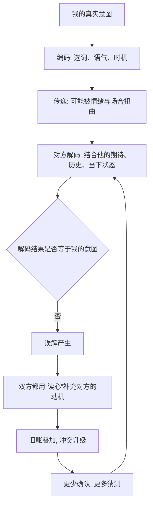

# 05｜为什么最亲密的人反而最容易误解彼此？

> 我们和陌生人客气，为什么却总和爱人争吵、互相误解？

---

## 一、先说结论

米勒给出的答案，藏在“沟通”的本质里：**沟通是一个编码与解码的过程，而亲密关系恰恰是最容易让这个过程失真的场景。**

亲密关系里情绪更强、期待更高、试探更多、对默契的假定也更多。我们常常用“读心”代替确认，用自己的意图去揣测对方，于是误会层层累积。**亲密的错觉——“他应该懂我”——恰恰是误解的温床。**

一句话：**不是我们不够爱，而是我们太相信对方应该“自动懂我”。**

---

## 二、我们先理解一个问题

先看一个奇怪的反差。

同一个人，在公司里能和同事客气地讨论分歧，能耐心解释自己的意思，能把情绪收得很好；可一回到家，面对伴侣，一句话就能吵起来，甚至一句话就冷战一整晚。

于是问题来了：

> 为什么我们在关系越近的人面前，沟通能力反而越差、误解反而越多？

---

## 三、作者到底提出了什么观点？

米勒在讲沟通时，提出了几个关键判断：

1. **沟通是编码与解码的过程。** 我想表达的是一个“意图”，但我只能说出一串“话语”，这是编码；对方听到的是“话语”，却要还原出“意图”，这是解码。任何一个环节出错，都会产生误解。
2. **亲密关系里的信息更容易失真。** 因为情绪更强烈、期待更高、彼此的历史更长，同一句话会被叠加大量旧账与假设。
3. **我们常用“读心”代替确认。** 一些研究者发现，伴侣之间常常高估自己对对方心思的了解程度；实际上，我们以为的“我懂你”，准确性往往有限。
4. **亲密的错觉会放大误解。** 越是亲密，越容易假定“他不需要我说就该懂”；一旦对方没懂，就会从“没听懂”升级为“不在乎我”。

一句话：**误解不是因为沟通太少，而是因为我们太相信“不用沟通”。**

---

## 四、把这个观点翻译成人话

可以用“传话游戏”来理解。

一群人排成一列，第一个人看到一句话，耳语给第二个，一路传到最后，结果往往面目全非。亲密关系就是一场情绪更浓的传话游戏：中间还夹杂着语气、旧账、疲惫和期待。

更要命的是，在这场游戏里，我们还常常跳过“传话”这一步，直接替对方“猜”了下一个人会说什么——然后就对着自己的猜测生气。

**关系里的很多争吵，吵的根本不是对方说的话，而是自己解码出来的那个意思。**

---

## 五、为什么会这样？

把失真拆成一条链：

关键在 **D → E** 这一跳。

**解码不是一个客观还原的过程，而是带着解码者自身经验的重建过程。** 同样一句“你今天怎么回来这么晚”，在心情平稳时是关心，在积怨已久时就是指责。对方听到的不是你说的话，而是“他预期你会说的话”。

而当误解产生，双方又习惯用“读心”去填补空白：他没有直接问“你刚才是这个意思吗”，而是断定“你就是不在乎我”。**猜测一旦披上“我很了解你”的外衣，就几乎无法被纠正。**

---

## 六、举一个现实生活中的例子

就拿情侣吵架时最经典的那句——“你根本不在乎我”来说。

这句话通常发生在这样的场景里：你忙了一天，很累，语气可能有点敷衍；伴侣问你某件小事，你随口“嗯”了一声。伴侣的情绪一下子被点着，脱口而出：“你根本不在乎我。”

从编码与解码的角度看，事情是这样的：

你真正想表达的可能是“我今天太累了，让我缓一下”；但你发出的编码是一个简短的“嗯”。伴侣的解码，则自动挂上了你们的历史——上周你也敷衍过、上个月纪念日你忘了、最近你总是加班。于是那个“嗯”被解码成了“我不重要”。

接下来，双方都开始用“读心”指控对方：你说“我明明很在乎，你怎么能这么说”；对方说“你要真在乎，怎么会是这种态度”。争论的焦点，从“这件事怎么解决”变成了“你到底爱不爱我”。

这就是米勒所说的失真：**一句话在传递中，被情绪、旧账和猜测层层加码，最后到达对方耳朵里时，早已不是你本来说的那句话。** 而那句“你根本不在乎我”，其实是一句被解码扭曲后的求救。

---

## 七、回到书中重新理解

现在再回看米勒为什么把“沟通”放在理解亲密关系的关键位置，就顺了。

他并不是在教人“会说话”，而是在揭示一个结构性的问题：**亲密关系里的误解，是系统性的，不是偶然的。** 情绪放大、期待拉高、默契被高估、确认被省略——这些因素叠加在一起，使得最亲近的关系反而最容易失真。

理解了这一点，你也就理解了为什么“他应该懂我”是关系里最危险的假设之一。**亲密不是省掉沟通的理由，恰恰是更需要沟通的理由。**

---

## 八、这个观点背后还有什么？

**第一，它把矛头从“人品”转向了“机制”。** 很多时候不是对方不在乎，而是信息在传递中失真了。

**第二，“确认”是解药。** 与其猜测，不如直接问一句“你刚才的意思是……吗”，成本极低，却能打断整条失真链。

**第三，它和归因、依恋互相咬合。** 同一个行为，焦虑型的人更容易做“被抛弃”的解码，回避型的人更倾向于沉默，这些都放大了沟通的难度。

**第四，它提示“时机”的重要。** 在情绪高峰时沟通，编码和解码都会更糟；先安顿情绪，再处理问题，往往更有效。

---

## 九、这个观点有问题吗？

需要保持平衡。

**第一，“读心”并非全无根据。** 关于这一问题，学界存在不同解释：一些研究者强调伴侣之间确实存在一定程度的准确理解，长期相处会提高默契；另一些则强调这种准确度被系统性高估。两者并不完全矛盾——默契存在，但远没有我们以为的那么可靠。

**第二，坦诚沟通也有边界。** 沟通不是越直白越好。完全不加修饰的表达，尤其是情绪化的指责，同样会造成伤害。如何说，与说什么同样重要。

**第三，文化与性别会塑造沟通方式。** 不同文化与成长背景对“直接表达”的接受度不同，把某种沟通方式当作唯一正确答案，可能忽略差异。

**第四，但核心机制是被反复支持的。** 编码解码的失真、亲密错觉、以猜测代替确认，都是研究中较稳定的现象。

**所以更准确的说法是**：亲密关系中的误解，主要来自信息编码解码的失真与“应该懂我”的假定，而非单纯的不爱或人品问题；确认可以大幅降低误解，但沟通的方式、时机和边界同样需要讲究。

---

## 十、今天再看这个观点

以下部分是基于米勒思想的现代延伸，不是他在书里的原话。

在文字消息主导的时代，“解码”变得更难了。面对面时，我们至少还有表情、语气、停顿可以帮助还原意图；而在文字里，这些线索全部消失，同一句话可以被读成平静、敷衍，或讽刺。

这恰好印证了米勒的框架：**线索越少，解码越依赖对方自己的期待与情绪，失真也就越大。** 于是“你根本不在乎我”这类误读，在文字沟通中被大幅放大——一个句号、一次已读不回，都可能被解码成冷淡。

所以问题也许不是“他为什么不把话说清楚”，而是“我们有没有意识到，隔着屏幕的每一句话，都需要更多的确认，而不是更多的猜测”。

---

## 十一、这一篇真正应该记住什么？

1. **沟通是编码与解码，失真几乎是必然的。** 你想说的和对方听到的，常常不是同一句话。
2. **亲密关系让失真更严重。** 情绪更强、期待更高、旧账更多，误解因此被层层放大。
3. **“你应该懂我”是最危险的假设。** 越亲密，越容易高估默契、省略确认。
4. **读心有作用，但远不如我们以为的可靠。** 与其猜，不如问。
5. **确认是打断误解循环的出口。** 一句“你的意思是……吗”，往往比一场争论更有效。

---

## 十二、留一个问题

> 回想你最近一次对爱人说出的重话，
> 那到底是对方真的做错了什么，
> 还是一句本无恶意的话，在传递与解码之间，被你们各自的历史改写成了另一层意思？

---

**下一篇**：如果说误解常常源于“我们不敢或不愿把话说清楚”，那么反过来，真正让两个人靠近的，又是什么？答案很可能是一件更主动的事——把自己一点点敞开给对方。

下一篇我们就来拆开这个问题——**“自我表露”为什么是亲密的钥匙**。
