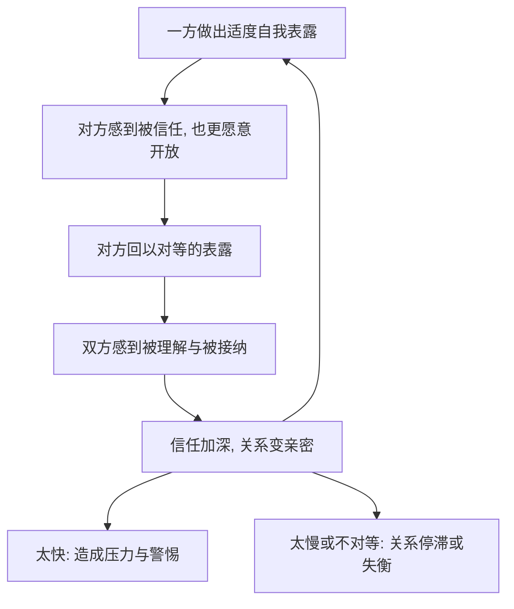

# 06｜“自我表露”为什么是亲密的钥匙？

> 为什么把心事说出去，两个人才会真的变亲近？

---

## 一、先说结论

米勒认为，亲密关系不是靠时间自动长出来的，而是靠一种特定行为长出来的：**自我表露**。

它指的是一个人主动把关于自己的、真实的、别人不容易知道的信息告诉对方——包括想法、感受、经历和弱点。当两个人都愿意这样向对方打开，并且你来我往地对等开放时，信任与亲密才会建立。

一句话：**亲密不是"认识了很久"，而是"彼此知道得够深"。**

---

## 二、我们先理解一个问题

先看一个奇怪的现象。

同事共处五年，每天见面八小时，谈话却始终停在天气、项目和午饭吃什么；而两个人在一个深夜聊了几个小时，把各自的成长、恐惧和秘密都说了一遍，第二天就觉得彼此"不一样了"。

时间一样吗？不一样。距离近吗？同事更近。那为什么后者更亲密？

> 决定亲密的，不是共处了多少时间，而是互相知道了多少"真东西"。

---

## 三、作者到底提出了什么观点？

米勒把自我表露放在亲密关系的中心位置。他的核心观点可以概括为几条：

1. **自我表露是亲密的必要条件。** 亲密的核心是"被了解"，而不是"被陪伴"。如果对方不知道真实的你，再多的相处也只是熟悉，而非亲密。
2. **表露是互惠的。** 一方的开放通常会邀请另一方的开放。你说了心里话，对方也更愿意说，这种"你来我往"构成了信任的交换。
3. **表露是渐进的。** 关系像洋葱，从外层（公开信息）一层层剥到内层（私密感受）。速度太快会吓退人，速度太慢则关系停在表面。
4. **表露与喜欢相互促进。** 我们喜欢那些向我们敞开心扉的人，也愿意向喜欢的人敞开心扉，这是一个良性循环。

一句话：**亲密是一场"逐步而平等"的相互敞开。**

---

## 四、把这个观点翻译成人话

可以用"一层一层开门"来理解。

每个人心里都有好几道门：第一道门后是日常信息，第二道门后是真实看法，第三道门后才是脆弱、羞耻和恐惧。自我表露，就是邀请别人一道道往里走。

关键不在"开得多大"，而在"节奏"和"对等"：

- 如果刚认识就一把推开所有的门，对方会感到压力甚至警惕；
- 如果永远只开第一道门，关系就永远停在寒暄；
- 如果只有你一直开、对方不回应，你会觉得不被珍惜。

所以真正健康的表露，是**你开一道，对方也开一道**，慢慢往深处走。

---

## 五、为什么会这样？

把它拆成一条循环：

关键在 **A → B → C** 这一环。

表露之所以能建立亲密，是因为它同时传达了两个信号："我信任你"和"我愿意让你了解真实的我"。当对方接住并回以同样的开放，两个人就完成了一次小型的信任交换。这个循环转得越久，洋葱剥得越深，亲密就越牢固。

而它出事的地方，恰恰是节奏或对等被破坏：**太快的表露让人有压力，太慢或单方面的表露让关系停在原处。**

---

## 六、举一个现实生活中的例子

想一想那种"深夜聊天"。

白天大家都戴着面具，聊的是正事。到了深夜，灯光暗下来，戒备也松了，话题开始往深处走：一个人说起自己小时候被忽视的经历，另一个人也说起自己的不安；一个人承认最近很怕失败，另一个人也说出了类似的脆弱。

你会发现，这样的夜晚过后，两个人的关系往往"跳了一级"。原因不在于聊了多久，而在于**双方都逐步地、平等地打开了内心**——不是一个人单方面倒苦水，也不是一个人审问另一个人，而是你来我往，一人深一点，另一人也深一点。

反过来，如果只是一个人不停倾诉，另一个人只是听着，第二天反而可能有点尴尬：因为天平没有被摆平。这正说明，自我表露里真正起作用的是**互惠与对等**，而不只是"说了心里话"这件事本身。

---

## 七、回到书中重新理解

现在再回看米勒为什么把自我表露叫做"亲密的钥匙"，就顺了。

他说的不是"要多聊天"，而是一个更精确的命题：**亲密是"被了解"的结果，而"被了解"需要主动的、对等的、有节奏的敞开。** 这就解释了很多困惑——为什么有人嘴上喊着想要亲密，却从不谈真实感受；为什么有人急着把全部心事倒给对方，反而把人吓跑。

理解自我表露，你也就理解了：亲密不是纯粹的运气，而是可以被"设计"和"练习"的——你愿意先说，也懂得等对方跟上。

---

## 八、这个观点背后还有什么？

**第一，表露的代价是脆弱。** 打开内心意味着可能被拒绝、被嘲笑、被利用。所以愿意表露本身就是一种冒险，而亲密正是对这种冒险的回报。

**第二，不是所有表露都通向亲密。** 有些表露是宣泄（只顾自己说），有些是操控（用秘密换取控制）。只有带着信任与接纳的表露，才会加深关系。

**第三，它与依恋类型相连。** 焦虑型可能表露得过多过快，回避型可能几乎不表露，安全型则更接近"逐步而平等"的理想节奏。

**第四，表露往往存在性别差异。** 一些研究者认为，女性之间的自我表露通常比男性之间更深入，这也部分解释了为什么男性的孤独感常被低估。

---

## 九、这个观点有问题吗？

有，需要一些限定。

**第一，相关不等于因果。** 表露与亲密相关，但可能是"关系本来就亲密，所以更愿意表露"，也可能是第三因素（比如安全感）同时导致两者。研究多用纵向设计来缓解，但难以完全排除。

**第二，互惠并非铁律。** 关于自我表露的对等性，学界存在不同解释：有研究强调"你深我也深"的匹配，也有研究发现某些时刻的"不同步"反而更自然。把互惠说成绝对规则，可能过于简化。

**第三，文化差异明显。** 不同文化对"说什么、对谁说、说多少"有不同规范，把"深度表露等于亲密"直接推广，可能忽略了文化对边界与含蓄的重视。

**第四，但对多数人而言，方向是稳的。** 大量研究支持：适度的、对等的自我表露与更高的人际亲密、满意度相伴。

**所以更准确的说法是**：自我表露是亲密的重要路径，逐步与对等是它的健康节奏；但它的效果依赖于关系背景、个体与文化差异，不能简单等同于"说得越多越亲密"。

---

## 十、今天再看这个观点

以下部分是基于米勒思想的现代延伸，不是他在书里的原话。

在社交媒体时代，自我表露被"表演化"了。我们发朋友圈、发动态，看起来是在"表露"，但多数内容经过了精心挑选和美化，是一种**面向观众的自我呈现**，而不是面向某个具体的人的真实敞开。

于是出现一个悖论：我们发得越多，反而越可能觉得没人真的懂自己。因为真正的亲密来自"被一个具体的人准确地了解"，而社交媒体的表露常常是广播式的、无回应的、也是修饰过的。

这恰恰提醒我们：**表露的关键不是"公开"，而是"对谁说、说得真不真、对方有没有回应"。** 深夜对一个朋友说的十句真话，可能比一百条动态都更接近亲密。

---

## 十一、这一篇真正应该记住什么？

1. **亲密的核心是"被了解"。** 时间与陪伴只是前提，彼此知道得深，才是亲密。
2. **自我表露是建立亲密的钥匙。** 主动、真实地开放内心，会邀请对方的开放，形成信任的循环。
3. **需要节奏。** 太快让人有压力，太慢则关系停滞；洋葱要一层层剥。
4. **需要对等。** 单方面的倾诉或单方面的沉默，都会让关系失衡。
5. **它是一条路径，不是唯一路径。** 效果受个体、文化、关系背景影响，不等于"说得越多越好"。

---

## 十二、留一个问题

> 如果亲密来自彼此真实地了解，
> 那么你最近一次真正的心事，
> 是告诉了谁，还是只是发了出去？

---

**下一篇**：既然交心能拉近距离，那为什么我们总在最亲近的人身上，"读错"那些平常的举动？接下来这一篇，谈的是我们为什么总把对方的失误，读成他的"人品"。

下一篇我们就来拆开这个问题——**07｜为什么我们总把对方的错归因于"人品"**。
