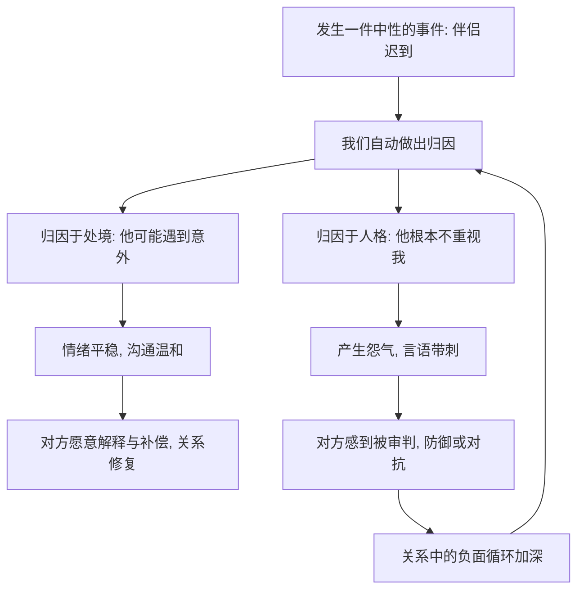

# 07｜为什么我们总把对方的错归因于“人品”？

> 为什么同一件事，发生在自己身上是"情有可原"，发生在伴侣身上却成了"人品问题"？

---

## 一、先说结论

米勒认为，在亲密关系里，我们常常使用"两套标准"来解释同一件事。

对方出错时，我们倾向于归因于他的**品性**——"他就是不重视我""他本性如此"；而自己出错时，我们倾向于归因于**处境**——"我实在太忙了""路上堵车我也没办法"。这种系统性偏差，研究者称为**行动者—观察者偏差**。

它一次两次不打紧，但日积月累，会堆成怨气，悄悄侵蚀关系的满意度。

一句话：**伤感情的不是那件事本身，而是我们给那件事配的那句解释。**

---

## 二、我们先理解一个问题

先看一个再普通不过的场景。

约好了七点吃饭，对方七点半才到，也没提前说一声。你等在那里的二十分钟里，脑子里几乎自动地浮现一句话："他根本不在乎我。"

可如果是你自己迟到呢？你多半会想："今天临时开会，实在脱不开身，谁都有意外。"

同样一个"迟到"，为什么解释完全不同？更有意思的是：**你几乎不会停下来去核对，"不在乎"这个结论到底是怎么得出来的。**

> 为什么我们解释别人的行为时，总是不自觉地滑向"人品"，解释自己时却滑向"处境"？

---

## 三、作者到底提出了什么观点？

米勒把"归因"作为理解误解与怨气的关键。他的核心观点可以概括为几条：

1. **归因是对行为原因的解释。** 同一件事，可以被解释成"人的问题"，也可以被解释成"情境的问题"。这个选择决定了我们接下来会生气还是会体谅。
2. **存在行动者—观察者偏差。** 解释别人的行为，我们更容易看"他是怎样的人"；解释自己的行为，我们更容易看"我遇到了什么情况"。
3. **还有自我服务偏差。** 成功时我们倾向于归功于自己，失败时倾向于归咎于环境。这套机制保护自尊，却也可能让人失去反思。
4. **亲密关系会放大归因的后果。** 因为我们对伴侣的期待更高、依赖更深，一个"他不重视我"的解释，带来的情绪远比对陌生人强烈。
5. **幸福与不幸的伴侣，归因风格不同。** 一些研究者发现，关系稳定的伴侣更倾向于对伴侣的过失做"处境性、可挽回"的解释，而关系紧张的伴侣更倾向于做"人格性、稳定的"解释。

一句话：**我们对行为的解释方式，本身就是关系质量的一部分。**

---

## 四、把这个观点翻译成人话

可以用"同时坐在两个位置上的人"来理解。

想象你在法庭上，一会儿当判官，一会儿当辩护律师。

当对方（伴侣）是被告时，你坐的是**判官席**：你盯着他的"品性"，认定"这反映了他是什么样的人"，从重判决。当自己是被告时，你坐的是**辩护席**：你强调"当时的特殊情况"，请求从轻发落。

问题在于，同一个行为，判官席和辩护席会得出截然不同的结论——而当事人往往浑然不觉，以为自己只是在"客观陈述事实"。

所以，归因偏差的可怕之处不在于我们会犯错，而在于**我们坚信自己没错。**

---

## 五、为什么会这样？

把它拆成一条自我强化的链：

关键在 **B → C1 / C2** 这一跳。

外界给的往往只是一个中性事件：迟到了。真正决定走向的，是我们给它配了哪句解释。配了"处境"，情绪就平，沟通就顺；配了"人品"，怨气就起，对话就变成了审判。

而"审判"又会引发对方的防御，对方的防御又反过来"证实"了我们的判断——于是偏差被当成了真相，循环就此闭合。

---

## 六、举一个现实生活中的例子

还是那顿迟到的晚餐，只是把两个版本都走一遍。

**版本一（人格归因）**：对方一坐下，你就冷着脸说："你每次都这样，你就是不把我当回事。"对方本来带着歉意，被这一句"你就是不重视我"激到，立刻回敬："我加班是为了谁？你倒说说我哪里不在乎你？"于是这顿饭，从"迟到"吵成了"你这个人怎么样"。你越想越觉得自己没看错人，他越想越觉得你不可理喻。

**版本二（处境归因）**：对方迟到进门，你说："路上是不是出状况了？我有点担心，也有点饿。"对方立刻解释临时被叫去处理急事，并主动提出下次提前发消息。一顿原本可能吵起来的饭，变成了一次"怎么改进"的对话。

请注意：**两个版本里，事实完全相同，只有归因不同。** 这就是米勒想让我们看见的——我们常常不是在和"事实"相处，而是在和"自己对事实的解释"相处。

---

## 七、回到书中重新理解

现在再回看米勒为什么把归因偏差放在"沟通与理解"这一部分，就顺了。

他说的不是"别生气"，而是一个更精确的命题：**亲密关系里大量的冲突，其实不是发生在行为层面，而是发生在解释层面。** 沟通之所以失真，很大一部分原因，就是我们把"我的解读"当成了"客观事实"，然后拿它去指责对方。

这就解释了一个常见的困惑——为什么两个人常常"吵的明明不是一件事"。因为一个人吵的是"你迟到"，另一个人吵的是"你说我不在乎你"。若能看到归因这一层，很多争吵就有了松动的可能：**先分清"发生了什么"和"我认为它意味着什么"。**

理解归因偏差，你也就理解了为什么"就事论事"这么难，却又这么重要。

---

## 八、这个观点背后还有什么？

**第一，归因和"关系信念"相互喂养。** 如果你相信"好伴侣就该心有灵犀"，那么对方任何一次没猜到你的心思，都会被解读成"不够爱"。

**第二，记忆也会跟着偏差走。** 一旦认定了对方"不在乎我"，你会更容易记住他所有让你失望的瞬间，而淡忘他体贴的时刻——这会让"判官席"的证据越来越充分。

**第三，它和自我表露连在一起。** 若双方能坦率说出感受与需要，就更容易看到对方行为背后的处境，而不是直接跳到人品结论。

**第四，归因是可以调整的。** 它说到底是一种思维习惯，而不是不可改变的性格。研究者发现，有意识地练习"多问一句情境、少扣一顶帽子"，能实际改善关系沟通。

---

## 九、这个观点有问题吗？

有，需要一些限定。

**第一，并非所有"归因于人格"都是偏差。** 如果对方长期、反复、在不同情境下都表现出同样的不尊重，那么把它解释为模式，可能是准确的判断，而不是偏见。把所有不满都说成"你想多了"，同样是一种伤害。

**第二，因果方向并不确定。** 关系满意度低会让人更倾向于做负面归因，而负面归因又会降低满意度——两者互相强化。究竟哪个在先，学界仍存在不同解释。

**第三，文化差异被低估的可能。** 不同文化对"归因于个人"还是"归因于关系与情境"的默认倾向不同，把某一种归因风格笼统地视为"更健康"，可能带有文化预设。

**第四，也要警惕"归因矫正"被滥用。** 有人会借"你是不是想多了"来否认对方正当的感受，这已经从纠偏变成了情感操控。

**所以更准确的说法是**：归因偏差是亲密关系中真实而普遍的倾向，留意它有助于减少不必要的怨气；但它不是"永远该体谅对方"的借口，当负面模式长期稳定存在时，人格性归因也可能是对的。

---

## 十、今天再看这个观点

以下部分是基于米勒思想的现代延伸，不是他在书里的原话。

在即时通讯时代，归因偏差被技术放大了。消息发出后对方没回，我们的脑子几乎是瞬间就开始编故事——"他是不是生气了""他是不是不在乎我了"。而事实上，对方可能只是在开会、在开车、在洗澡。

更微妙的是"已读不回"：一个小小的状态提示，被当成了"态度证据"，成了审判席上的新证物。可我们忘了，**"没回"是一个中性事件，"不在乎"是我们的解释。**

这恰恰提醒我们：越是信息碎片化的时代，越需要把"事实"和"解释"分开。多等一会儿，多问一句，往往就能避免一场本不必发生的战争。

---

## 十一、这一篇真正应该记住什么？

1. **同一件事，可以有两种解释。** 归因是选择，而选择会决定情绪的走向。
2. **行动者—观察者偏差是普遍倾向。** 对别人看"人品"，对自己看"处境"。
3. **偏差会在关系中累积成怨气。** 单次归因不致命，长期模式才致命。
4. **先分清事实与解释。** "他迟到了"是事实，"他不重视我"是解释，两者不是一回事。
5. **纠偏要有度。** 当负面行为长期、稳定、跨情境出现时，人格归因可能是准确的，而非偏见。

---

## 十二、留一个问题

> 如果真正伤感情的是解释而不是事件，
> 那么你最近一次对伴侣下的"人品结论"，
> 手里握着的，究竟是证据，还是只是那一刻的情绪？

---

**下一篇**：把对方的举动读成"人品"，只是我们误读关系的一种方式。再往深处看，还有一个更根本的问题——我们口中那个被反复使用的"爱"字，究竟指的是同一种东西吗？热恋的滚烫和久伴的温厚，是一回事吗？

下一篇我们就来拆开这个问题——**08｜爱情到底有几种**。
