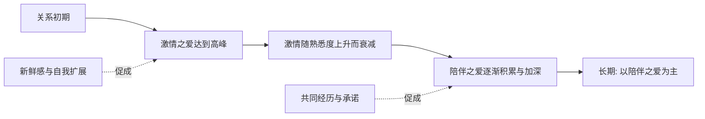

# 08｜爱情到底有几种？

> 为什么热恋总会冷却，而有的感情却越走越深？

---

## 一、先说结论

米勒在书中转述并整合了关系科学的一个重要结论：爱情不止一种。

研究者通常把它区分为**激情之爱**和**陪伴之爱**。激情之爱强烈、痴迷、伴随着生理唤起，却会随着时间衰减；陪伴之爱温和、依恋、充满关怀，反而常常随着时间加深。此外，爱情还可以被拆成亲密、激情、承诺三种成分——不同的组合，构成了不同形态的爱。

一句话：**热恋的冷却，未必是"不爱了"，而常常是爱从一种形态，换成了另一种形态。**

---

## 二、我们先理解一个问题

先看一对恋人。

刚开始时，他们恨不得每秒都黏在一起：见面前心跳加速，分开后反复看手机，对方的一句回复能让一整天亮起来。可三年之后，那种心跳和痴迷消失了，日子变得平淡、熟悉、甚至有点"没感觉"。

很多人到这一步就慌了：是不是不爱了？是不是该换一个人？

> 可如果"没有心动"就等于"没有爱"，为什么那些携手几十年的老夫老妻，看上去一点也不激情，却依然稳固而深情？

---

## 三、作者到底提出了什么观点？

米勒引用的研究，把爱情拆开来看。核心观点可以概括为几条：

1. **激情之爱是强烈而有生理基础的。** 它伴随心跳加速、注意力窄化、日思夜想，甚至类似"上瘾"的状态。它来得猛烈，却难以长期维持。
2. **陪伴之爱是温和而依恋的。** 它更像深厚的友谊加上亲密的依恋与关怀，强度不如激情，却更稳定，也更可能随时间增长。
3. **爱情可以被拆成三种成分：亲密、激情、承诺。** 亲密是亲近与联结，激情是浪漫与吸引，承诺是决定长期相守。三者比例不同，爱情的样子就不同。
4. **不同组合对应不同类型。** 比如只有激情的是迷恋，亲密加承诺、缺少激情的是相伴之爱，三者兼备的是相对完整的爱。

一句话：**"爱情"是一个统称，它底下至少住着好几种不同的东西。**

---

## 四、把这个观点翻译成人话

可以用"篝火与炉火"来理解。

激情之爱像**篝火**：点燃时轰然作响、光芒四射、让人挪不开眼，但它烧得快，若不持续添柴就会熄灭。陪伴之爱像**炉火**：不耀眼，不喧哗，却能长年温着整个屋子。

很多人误以为"火就该一直是篝火那样的"，一旦火焰变小，就判定"火灭了"。其实火还在，只是换了烧法。

这也解释了那句常见的叹息——"我们之间没有激情了"。问题可能不在于爱消失了，而在于**我们只用一把尺子（激情）去量所有阶段的感情**，于是把"炉火"误判成了"余烬"。

---

## 五、为什么会这样？

把它画成两条随时间变化的曲线：

关键在 **B → C** 和 **C → D** 这两段。

激情之爱的燃料是**新鲜感与未知**。当一个人越来越熟悉，神秘感消退，生理唤起自然回落——这不是谁变心了，而是这套系统本身就为"短期"设计。而陪伴之爱靠的是**共同经历、承诺和日常的关怀**，它恰恰在新鲜感褪去之后，才慢慢长起来。

换句话说，激情的衰减和陪伴的增长，几乎是同时发生的。**很多人只看见了前者，忽略了后者。**

---

## 六、举一个现实生活中的例子

想想热恋期和老夫老妻的对比。

**热恋期**：他会为你冒雨送伞，你会为见他精心打扮；一天几十条消息，见面就忍不住笑；对方的一个小缺点，在眼里也是可爱的。这种状态里，注意力几乎全被对方占满，世界像被调到最亮。

**老夫老妻**：不再有那样的心跳，但早上会记得给对方留一杯温水；一个眼神就知道对方今天心情不好；生病时有人守在床边，出门前有人提醒带伞。激情稀薄了，可那种"知道有人一直在"的踏实，却比当年更厚。

这两段并不矛盾。若只用热恋的标准去衡量老夫老妻，会觉得"平淡得可怕"；可若用陪伴的标准去看，那碗温水里藏着的，未必比当年的玫瑰更少。**热的形态变了，温度不一定降了。**

---

## 七、回到书中重新理解

现在再回看米勒为什么要区分这两种爱，就顺了。

他真正想破除的，是一个被浪漫文化反复灌输的误解：**爱情就应该永远是热恋的样子。** 一旦这个假设成立，那么激情的自然回落，就会被误读成"感情失败"或"找错了人"，从而引发不必要的恐慌，甚至草率的背叛与分手。

理解激情的衰减是**规律而非事故**，你就能把"热恋期结束"重新理解为"关系进入下一个阶段"，而不是"爱情已经死亡"。这也正是这套区分最实用的价值：**它让人有能力分辨"爱变了样"和"爱没了"。**

---

## 八、这个观点背后还有什么？

**第一，激情并非注定归零。** 新鲜感和共同的新体验，可以在一定程度上重新点燃激情。研究者发现，一起做有挑战、有趣味的新事，能提升关系满意度。

**第二，三种成分会动态变化。** 亲密、激情、承诺不是一次配齐就固定不动，它们会随关系阶段此起彼伏，理解这一点有助于更从容地应对起伏。

**第三，"爱情是婚姻的基础"本身是近代观念。** 在更长的历史里，婚姻更多关乎家族、生计与责任；把"相爱"视为结合的唯一正当理由，是相当晚近的文化产物。

**第四，它和生物机制相连。** 一些研究者认为，激情之爱涉及的神经与生理过程，和奖赏、动机系统关系密切，这也部分解释了它为何强烈却难持久。

---

## 九、这个观点有问题吗？

有，需要一些限定。

**第一，两种爱的划分可能过于整齐。** 现实中的感情常常是混合的，激情与陪伴彼此渗透，很难被干净地切分成两类。关于如何界定，学界也存在不同解释。

**第二，激情衰减并非人人必然。** 有研究发现，一部分长期伴侣仍报告着相当程度的激情，个体差异和文化背景都会影响衰减的速度与程度。

**第三，测量高度依赖自我报告。** 一个人说自己"还有激情"或"只剩亲情"，本身就带有主观建构的成分，未必等同于内在状态。

**第四，也是最需要警惕的：** "激情会衰减"若是被误用，就可能变成出轨或轻言分手的托词。规律解释的是普遍趋势，不构成任何背叛的免责理由。

**所以更准确的说法是**：爱情确实包含激情与陪伴等多种成分，激情在多数关系中随熟悉而回落、陪伴随投入而增长，是一个有价值的框架；但它并非普适定律，更不该被当作放弃或越界的借口。

---

## 十、今天再看这个观点

以下部分是基于米勒思想的现代延伸，不是他在书里的原话。

在影视剧和社交媒体的塑造下，我们对爱情的想象被"激情化"了：满屏都是一见钟情、轰轰烈烈、为爱不顾一切。这些叙事把激情当成爱情的常态，却几乎从不展示激情退去之后，那漫长而琐碎的部分。

于是很多人手里拿的是一把"激情标尺"，用它去量自己的日常感情，越量越失望——"为什么我的关系这么平淡""为什么我没有那种心动的感觉"。问题往往不在关系，而在**标尺选错了**。

这恰恰印证了那套区分的价值：当我们承认爱情本就有多种形态，就更有机会在平淡里辨认出深情，也更有余地思考——**如果激情会自然衰减，那么维系一段关系的，究竟是什么在起作用？**

---

## 十一、这一篇真正应该记住什么？

1. **爱情不止一种。** 至少要区分强烈的激情之爱与温和的陪伴之爱。
2. **激情会随熟悉而衰减。** 这是规律，不必然是"不爱了"或"看错人了"。
3. **陪伴之爱常随时间加深。** 它更像深厚的友谊加上亲密的依恋与关怀。
4. **爱情可拆成亲密、激情、承诺。** 三者比例不同，爱的形态就不同。
5. **别只用一把尺子量感情。** 用热恋的标准衡量长久关系，只会误判；同时，"激情会衰减"绝不是背叛的借口。

---

## 十二、留一个问题

> 如果你的关系正从篝火转向炉火，
> 那么让你焦虑的，
> 究竟是"爱变淡了"，还是你从没被教过，炉火也算数？

---

**下一篇**：说到"维系一段关系靠什么"，就绕不开一个听起来很扫兴、却极其真实的问题——感情里到底要不要"算账"？为什么有人付出了很多，却越来越委屈？付出与回报，在亲密关系里究竟扮演着怎样的角色？

下一篇我们就来拆开这个问题——**09｜为什么"付出与回报"在关系里很重要**。
