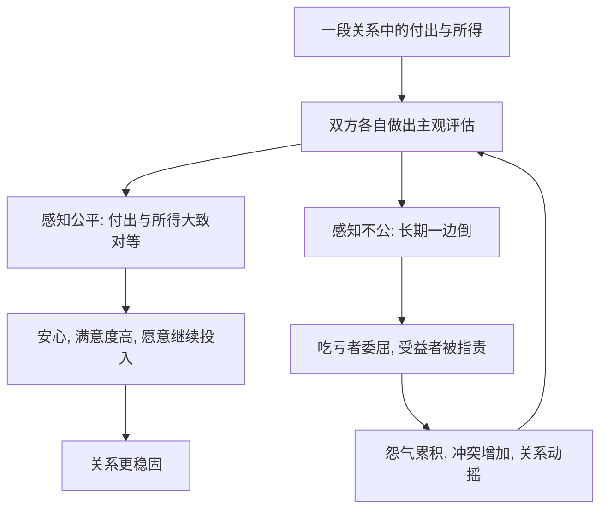

# 09｜为什么“付出与回报”在关系里很重要？

> 都说"谈钱伤感情"，可为什么关系里其实一直在算账？

---

## 一、先说结论

米勒引用的相互依赖理论认为：关系本质上是一种**交换**。

我们虽然不常把这句话说出口，但内心里一直在评估：我在这段关系里得到了什么、付出了什么、值不值得。健康的关系并不是"零计较"，而是**公平**——双方都觉得自己的付出与所得大致对等。

长期不公平，无论吃亏的是谁，都会动摇关系。一句话：**感情当然需要爱，但也需要一本双方都认的账。**

---

## 二、我们先理解一个问题

先看一个很常见的委屈。

一个人常年操持家务、照顾老人孩子，另一半却觉得"这有什么，不就是做点家里的活"。起初付出的一方还能自我安慰"都是一家人，不计较"，可年复一年，她心里的怨气越来越重，终于在某件小事上爆发。

有意思的是，那个"少付出"的一方往往一脸茫然：不是因为做了什么大错事，而是他**从没意识到账一直在算着**。

> 如果爱一个人就该无怨无悔、不计回报，那为什么"我做得多、你做得少"，会让人这么难受？

---

## 三、作者到底提出了什么观点？

米勒把"相互依赖"作为理解关系的一个核心框架。他的观点可以概括为几条：

1. **关系是一种交换。** 我们会不自觉地权衡回报与成本，评估这段关系带来的结果究竟是正还是负。
2. **我们还有一个"比较水平"。** 也就是自己心里认为"我这样的人，应该得到什么样的关系"。结果高于它，就满意；低于它，就不满。
3. **公平感比绝对数量更重要。** 关键不是谁做得多，而是双方是否觉得大致对等。贡献与所得比例相当的伴侣，满意度更高。
4. **不公平对双方都有害。** 吃亏的一方会委屈、易怒；而占便宜的一方，也可能感到愧疚或压力。
5. **公平与依赖相互关联。** 谁更依赖这段关系、谁更离不开，谁在"议价"时就处于弱势，这又直接影响公平能否维持。

一句话：**关系里真正起作用的，不是"谁付出更多"，而是"双方是否都觉得值"。**

---

## 四、把这个观点翻译成人话

可以用"情感账户"来理解。

每一段关系，心里都有一本看不见的账。对方为你做的事是"存入"，你为对方做的是"支出"；反过来，你的付出也是你期待被"存入"的。

账户大体平衡时，两个人都安心；长期一边倒，问题就来了：一直"存钱"却看不到回报的人会累，一直"取钱"的人可能觉得理所当然。**决定关系体感的，不是数字本身，而是那杆秤在两个人心里是不是一般高。**

需要强调的是，这里的"账"多半不是精算出来的，而是一种**主观的公平感**。你觉得值，就值；你觉得亏，再多的付出也留不住心。

---

## 五、为什么会这样？

把它拆成一条链：

关键在 **B → C1 / C2** 这一跳。

人对"公平"是有直觉的。一旦感到长期失衡，吃亏的一方会产生委屈与愤怒，受益的一方则可能被怨气包围，甚至自己也隐隐不安。于是关系从"我们"退化成"我在为你牺牲"，亲密感随之流失。

而失衡又会被反复重新评估、不断强化，一旦进入负面循环，就很难靠一句"你别计较"解开。

---

## 六、举一个现实生活中的例子

想想两件小事：谁做家务，以及 AA 制。

**先说家务。** 一个家里，如果做饭、打扫、带孩子几乎全落在一个人身上，而另一个人只负责上班，那么即便收入上后者贡献更多，前者依然会觉得不公平——因为"累"和"被看见"是两回事。久而久之，那些没洗的碗、没倒的垃圾，都会变成情绪的导火索。这时真正的问题不是家务本身，而是**没有人承认那本账一直在算**。

**再说 AA 制。** 它本身没有对错，关键在于双方是否都觉得公平。如果一方习惯精确到每一顿饭各付一半，另一方却觉得"太见外、不像亲密关系"，那么问题不在 AA 好不好，而在于两个人对"公平"的定义不同。有人要的是数字上的平等，有人要的是"你需要时我愿意多担一点"的心理安全。

这两件事都说明：**公平不是绝对的平均，而是双方心中那杆秤大致平了。**

---

## 七、回到书中重新理解

现在再回看米勒为什么把"相互依赖"放在爱情之后、承诺之前，就顺了。

他真正要破除的，是那句流行的"真爱不该计较"。他说的不是"感情要精打细算"，而是：**公平感是关系能否长期维持的结构性条件。** 一段持续让人觉得"我亏了"的关系，靠激情或道德感是撑不了太久的。

这也解释了一个常见困惑——为什么有些看起来"什么都没发生"的关系，会悄悄走向冷淡。很可能不是被某件大事击垮的，而是那杆秤长期歪着，谁都不肯先说。

理解了公平，你就理解了承诺的一个前提：**一个人愿不愿意长久留下，往往先取决于他在这段关系里，是不是觉得自己值得。**

---

## 八、这个观点背后还有什么？

**第一，亲密关系和普通交易并不完全一样。** 一些研究者区分"交换型关系"（你帮我、我就帮你）和"共有型关系"（彼此主动关心对方的需要、不要求即时回报）。健康的亲密关系更接近后者，但共有并不等于可以永远单方面付出。

**第二，看不见的付出最容易被忽略。** 情绪的安抚、关系的维系、记得各种日子，这些"情绪劳动"往往不被计入账本，却实实在在地消耗着人。

**第三，它和权力直接相关。** 谁更依赖、谁更怕失去，谁就更容易接受不公平——这也解释了为什么经济或情感上弱势的一方，常常默默承担更多。

**第四，公平是可以协商的。** 既然它是一种主观感知，那么把委屈说出来、把账摊开谈，本身就可能重建平衡。

---

## 九、这个观点有问题吗？

有，需要一些限定。

**第一，公平理论的"交换"框架带有文化预设。** 它更贴近强调个体与对等的文化，而在更看重集体与角色的文化里，"不计较地付出"本身可能被赋予正面价值。用同一把尺子衡量所有关系，可能失真。

**第二，因果方向不易确定。** 究竟是"不公平导致不满"，还是"已经不满的人，才更容易把关系算成不公平"？两者很可能互为因果，学界仍存在不同解释。

**第三，公平感高度主观，难以精确测量。** 同样一件事，有人觉得天经地义，有人觉得无法忍受，测量依赖自我报告。

**第四，把账算得太清也可能伤害关系。** 事事计较、分毫必较，会把亲密感挤走。这套理论解释的是"长期失衡会出问题"，而不是"越精确越好"。

**所以更准确的说法是**：公平感是关系长期稳定的重要条件，长期失衡无论谁吃亏都会带来风险；但"公平"不等于精确平分，也不是所有关系都该用交换的尺子来量，具体含义深受文化与个体差异影响。

---

## 十、今天再看这个观点

以下部分是基于米勒思想的现代延伸，不是他在书里的原话。

今天，关于"付出与回报"的讨论被大量搬到台面上：AA 制该不该、家务如何分工、彩礼与嫁妆怎么算、"情绪价值"要不要计较。这些争论常常吵得不可开交，本质却是同一个问题——**两个人对"公平"的定义不一样。**

与此同时，一种更隐蔽的不公平正被越来越多人看见：**情绪劳动和隐性家务**。记得家人的生日、安抚伴侣的情绪、操心孩子的社交，这些大多由一方承担却很难被计入"付出"。当它长期不被承认，账就歪了，而当事人甚至说不出自己委屈在哪里。

这恰恰延续了米勒的那套提醒：**不是要你处处算计，而是别假装那本账不存在。** 承认它、谈开它，反而比"我从来不计较"更能保护一段关系。

---

## 十一、这一篇真正应该记住什么？

1. **关系在某种意义上是一种交换。** 我们会评估回报、成本与值不值，这是人之常情。
2. **重要的是公平感，不是绝对平均。** 关键是双方都觉得那杆秤大致平了。
3. **长期失衡会动摇关系。** 吃亏的一方委屈，受益的一方也不安，无论谁"占便宜"都不健康。
4. **别忽略看不见的付出。** 情绪劳动与隐性家务也是账的一部分。
5. **公平可以谈出来。** 承认账存在、把感受讲清楚，比假装不计较更能维系长久。

---

## 十二、留一个问题

> 如果关系里那本账一直都在，
> 那么你最近一次感到的委屈，
> 是真的"付出太多"，还是"付出从没被对方看见"？

---

**下一篇**：既然付出与回报一直在被默默计算，那另一个问题就浮出水面了——为什么有人明明不幸福却不肯离开，而有人看着好好的却突然抽身？一个人留在一段关系里，究竟由什么决定？

下一篇我们就来拆开这个问题——**10｜为什么有人承诺，有人离开**。
