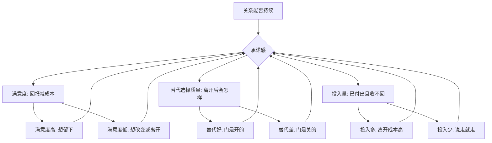

# 10｜为什么有人承诺，有人离开？

> 一个人留在一段关系里，究竟由什么决定？

---

## 一、先说结论

米勒给出的答案是**投入模型**：承诺感 = 满意度 + 替代选择质量 + 投入量。

也就是说，一个人留不留在关系里，不只看他有多幸福。他可能并不幸福，但因为没有更好的选择、或者已经投入了太多，仍然留下；他也可能很满意，却因为别处出现了诱人的选择，或者本来就没投入多少，说走就走。

一句话：**承诺不是感情的浓度，而是三种力量的合力。**

---

## 二、我们先理解一个问题

先看两个都很常见的场景。

第一对情侣，三天一小吵，五天一大吵，连朋友都替他们累，结果几年过去，他们还在一起，甚至结了婚。

第二对情侣，从不吵架，在外人看来平静体面，某天却突然宣布分开。而且一方早已收拾好行李，语气平静得像在说今天晚饭吃什么。

为什么吵吵闹闹的没散，平平静静的反倒散了？

表面看是感情深浅的问题。但仔细想，第一对吵完还在一起，说明他们心里都判定这段关系值得留；第二对平静地分开，说明早在宣布之前，离开的决定就已经完成了。

于是问题来了：**一个人决定留下，或决定离开，到底是被什么推动的？**

---

## 三、作者到底提出了什么观点？

米勒在讨论承诺时，介绍了一个影响深远的研究框架——**投入模型**。它的核心观点是：承诺感由三个独立的部分共同决定。

1. **满意度。** 这段关系带来的回报，减去成本，再和你的期待相比，是否让人满意。满意的人倾向于留下。
2. **替代选择的质量。** 如果离开这段关系，你能过得怎样？有没有更好的伴侣人选、更自在的单身生活、更值得投入的事业。替代越好，越容易走。
3. **投入量。** 你在这段关系里已经放进去、并且很难收回的东西：时间、共同的朋友、共同的财产、孩子、付出的牺牲。投入越多，越难走。

米勒强调的是：这三者加起来，才构成承诺。**满意度只是其中一项，而且不总是最强的一项。**

---

## 四、把这个观点翻译成人话

可以把它想象成一个三条腿的凳子。

第一条腿是，我在这段关系里开不开心；第二条腿是，我离开后有没有更好的地方可去；第三条腿是，我走了要损失多少。

很多人对承诺的误解，是以为只要第一条腿够粗，凳子就稳。其实不是。一条腿再粗，另外两条缺失，凳子照样倒。

反过来也成立：一条腿很细，也就是不太满意，但另外两条特别粗，也就是无处可去、投入巨大，凳子照样立着。

**这就是为什么不爱了还不走，和很爱却走了，都能发生，而且都不矛盾。**

---

## 五、为什么会这样？

把它拆成一条链：

关键在 **A → B** 这一跳：关系能不能继续，不取决于单一的情绪，而取决于三股力量的合力方向。

一个值得注意的推论是，当关系里出现问题时，满意度下降会同时牵动另外两条腿。感到不满的人，会开始更容易注意到外界的机会，让替代显得变好；也会重新评估自己的投入还值不值。**所以不满一旦发生，往往不是一股力量，而是三股力量一起推着人往外走。**

---

## 六、举一个现实生活中的例子

回到那两对情侣。

第一对，吵吵闹闹仍然在一起。原因可能有很多：他们虽然吵，但每次冲突都能修复，满意度其实不低；也可能他们没有更好的替代，社交圈窄、年纪有压力，或者彼此已经是最熟悉的人；更常见的，是投入太大——房子是共同的，双方父母早已熟悉，一起扛过很多难事。**吵是吵，但凳子的三条腿都在。**

第二对，平静中默默离开。也许矛盾并不激烈，只是日复一日地话不投机；而某一天，其中一方发现，朋友、事业，甚至独处，都比这段关系更让自己舒展，替代选择变好了。同时他们可能一直财务独立、各过各的，投入本就有限。**门一开，人自然就走了。**

这两种结局都不神秘。**离开很少是因为某一次争吵，留下也很少是因为某一句话的感动。**

---

## 七、回到书中重新理解

现在再回看米勒为什么强调承诺不等于爱，就顺了。

他要纠正我们一个直觉：**把"他留下来了"直接等同于"他爱我"，是危险的简化。**

一个人留下，可能因为爱，也可能因为没地方去、因为怕麻烦、因为孩子、因为舍不得已经付出的成本。前者是承诺，后者更像**被困**。同样，一个人离开，可能是不爱了，也可能只是替代变好、投入变少。

所以米勒真正在给的，是一副**清醒的眼镜**：不要只问他和不和我在一起，还要问他有没有更好的选择，他在这段关系里投入了什么。**承诺是一个可以被理解，甚至可以被计算的结构，而不是一团只能靠猜的迷雾。**

---

## 八、这个观点背后还有什么？

**第一，它解释了沉没成本为何如此难摆脱。** 投入越多越舍不得，即使关系已经让人痛苦。这不是深情，而是投入量在替你做决定。

**第二，它把承诺从玄学变回可干预的。** 想让人更愿意留下，与其反复确认爱意，不如提升满意度、增加有意义的投入，让对方感到这里值得。

**第三，替代选择的质量是主观的。** 不是真有更好的人才算替代，而是**当事人相信**外面更好，就足以动摇承诺。

**第四，它和第 09 篇的公平交换是同一条线。** 公平影响满意度，满意度影响承诺，三者层层相扣。

---

## 九、这个观点有问题吗？

有，需要平衡地看。

**第一，感受与认知的边界被模糊了。** 满意度、替代、投入都靠当事人自评，而人并不擅长准确报告自己的感受，也很容易事后合理化。

**第二，模型偏冷，可能低估道德与责任本身的力量。** 有些人不是算完账才留下，而是我答应过这件事本身就有分量；把一切还原为交换，可能漏掉责任、信仰与文化规范的独立作用。

**第三，因果方向不总是单向。** 也可能是先决定留下，然后才调高对满意度的评价。模型很难区分因为满意所以承诺，与因为承诺所以显得满意。

**不过**，这个框架之所以被广泛使用，正因为它对关系的稳定与解体有相当稳定的预测力。作为一面镜子，它足够有用，只是别把它当成唯一的真相。

---

## 十、今天再看这个观点

以下部分是投入模型的现代延伸，不是米勒的原话。

在今天的城市生活里，三条腿的权重正在变化。

**替代选择的门槛被大幅降低了。** 交友软件让下一个人永远触手可及，替代选项从社交圈里有没有，变成口袋里有没有。这会系统性地削弱承诺——不是人变心了，而是门变多了。

**投入的结构也在变。** 财务独立、不婚、不要孩子，减少了收不回的投入，让离开的成本变低。这既是自由，也让关系更需要靠满意度本身来支撑。

值得追问的是：当替代永远唾手可得，**我们是不是反而更难体验承诺这种状态的深度？**

---

## 十一、这一篇真正应该记住什么？

1. **承诺是三个变量的和，不是爱的同义词。** 满意度、替代选择、投入量，共同决定去留。
2. **不走可能是不爱了却没处去；走了也可能是很爱但代价太小。** 别把行为直接等同于感情。
3. **不满会同时牵动三股力量。** 满意度一下降，替代会显得更诱人，投入会显得更不值。
4. **沉没成本会替你做决定。** 投入越多越难走，这与幸福无关。
5. **承诺是可理解、可经营的。** 提升满意度、增加有意义的投入，比空口保证更有效。

---

## 十二、留一个问题

> 如果留下和离开都是一道三变量的算术题，
> 那么你现在的关系里，
> 让你留下的，到底是满意，是没有更好的选择，还是舍不得已经付出的那些？

---

**下一篇**：既然承诺由满意度、替代与投入决定，那么关系本身是不是只有爱情这一种？我们身边那些没有激情、没有排他、却极其重要的联结——友情，又在这套系统里占据什么位置？

下一篇我们就来拆开这个问题——**友情和爱情有什么不同？**
