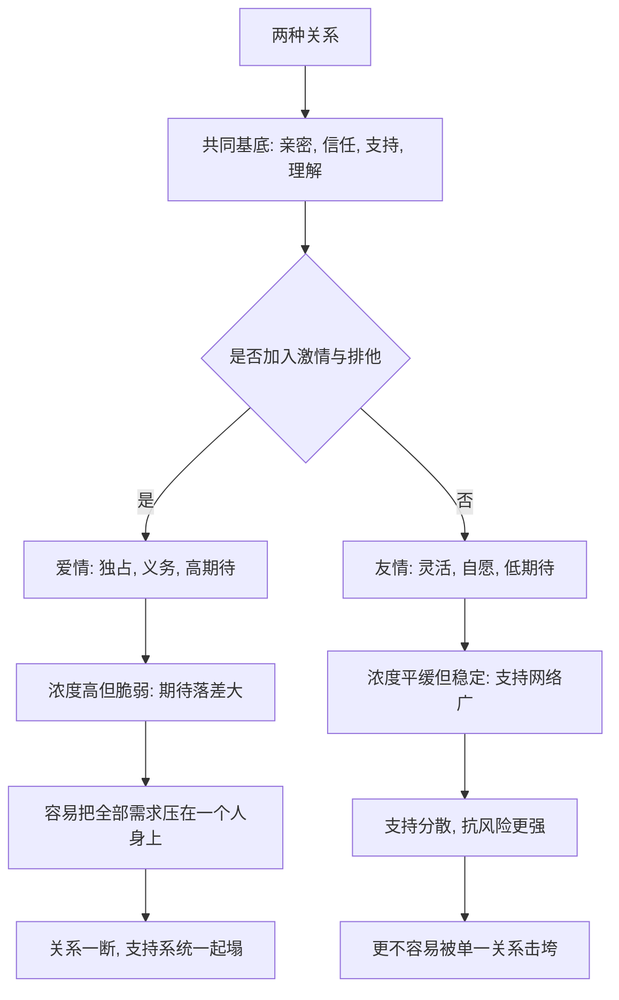

# 11｜友情和爱情有什么不同？

> 友情和爱情的边界在哪里？为什么友情常常被低估？

---

## 一、先说结论

米勒的观点是：友情与爱情共享很多东西——亲密、信任、支持、理解——但通常有两个关键区别：**激情**和**排他性期待**。

友情更灵活、更少义务、也更少占有；爱情往往多了性的吸引、独占的渴望，以及你是我的唯一这种期待。

更重要的是：**研究显示，友情对幸福感和寿命的贡献，长期被严重低估。** 我们花大量精力经营爱情，却常常任由友情自生自灭。

---

## 二、我们先理解一个问题

先看两个场景。

第一个：一个人失恋了，深夜给闺蜜打电话，哭了一个小时。闺蜜没有解决任何实际问题，但挂掉电话之后，她觉得自己还活得下去。这段关系里没有激情、没有承诺、没有排他，却接住了她。

第二个：一个人有个很好的异性朋友，彼此无话不谈，伴侣却越来越不安，反复追问：你们到底是什么关系？

为什么第一段关系如此重要，却很少有人认真经营？为什么第二段关系明明清清白白，却总被当成潜在威胁？

于是问题来了：**友情和爱情的边界，到底划在哪里？** 这条线如果划不清，我们既会低估友情，也会误解它和爱情之间的关系。

---

## 三、作者到底提出了什么观点？

米勒在讨论友情时，提出了几个核心观点。

1. **友情与爱情共享核心成分。** 亲密、信任、尊重、支持、理解、分享，这些在两种关系里都存在，甚至可以说，好的爱情里必须包含友情。
2. **区别主要在激情与排他性。** 爱情通常包含性的吸引与独占的期待；友情通常不包含，或者至少不以它为核心。
3. **友情更灵活、义务更少。** 朋友之间没有法律和契约的约束，可以亲近也可以疏远，少了必须，多了愿意。
4. **友情的价值被系统性低估。** 研究反复发现，朋友的数量与质量，与幸福感、健康乃至寿命显著相关，但人们在寻求支持时，往往过度依赖伴侣。

一句话：**爱情不是友情的高级版本，它们是两种不同结构的关系。**

---

## 四、把这个观点翻译成人话

可以这样区分：**友情是我愿意，爱情是我属于。**

友情里，两个人是并肩的。你今天想聊就聊，不想聊就不聊，关系不会因此崩塌。它靠的是自愿的、随时可以撤回的靠近。

爱情里，多了一层归属。你会期待对方把你放在特殊的位置，会介意他和别人走得太近，会希望我是那个不一样的人。

但这不意味着爱情更高级。恰恰相反：**很多爱情之所以撑得住，是因为里面有一份扎实的友情；很多爱情之所以崩，是因为除了激情和占有，底下什么都没有。**

---

## 五、为什么会这样？

把它拆成一条链：

关键在 **C** 这一跳：同样的亲密基底，加上激情与排他，就变成爱情；不加，就是友情。

这也解释了两种关系各自的风险结构。爱情浓度高，但把所有支持集中在一处，一旦崩塌，损失惨重；友情浓度平缓，却分散在多个点上，反而更抗震。**这正是一些研究者认为友情被低估的原因——它提供的是一种更分散、更持续的支持。**

---

## 六、举一个现实生活中的例子

回到闺蜜和异性朋友。

那位失恋后深夜打电话的人，靠的是一段**没有排他性期待的关系**。闺蜜不需要对她负责到底，也不必承诺永远，但正因为没有这些重负，这段关系反而可以长期存在、随叫随到。它不轰轰烈烈，却是她心理支持网络里最结实的一根绳。

再看那位有异性好友的人。他和朋友的亲密是真的，但他和伴侣之间多了一层**排他性期待**：伴侣希望最深的分享、最难堪的脆弱、最要紧的时刻，是留给自己的。于是冲突的核心往往不是你有没有做错事，而是你把本该属于我的位置给了别人。

**边界不划在亲密程度上，而划在排他期待上。** 这也解释了为什么有些伴侣能接受对方有异性好友，有些完全不能——差的是对排他范围的定义。

---

## 七、回到书中重新理解

现在再回看米勒为什么要把友情单独拎出来讲，就顺了。

他其实在纠正一种普遍的偏见：**把爱情视为人生的主线，把友情视为配角。** 但研究给出的图像是，友情在幸福感、健康、寿命上的作用长期被我们忽略；婚姻满意度高的人，往往也拥有好的朋友，而不是只有彼此。

米勒想说的是：**爱情和友情不是同一个序列上的高低，而是两种功能不同的关系。** 一个人可以有极深的友情而无爱情，也可以有爱情却极度孤独——因为爱情提供不了友情能提供的全部东西，友情也替代不了爱情里的那份归属。

---

## 八、这个观点背后还有什么？

**第一，性别与文化的差异在起作用。** 一些研究者认为，女性之间的友情更擅长情感分享，男性之间的友情更常围绕共同活动；把亲密只定义成倾诉，会低估男性友情的深度。

**第二，爱情里必须包含友情这个判断很有分量。** 那些既是伴侣又是朋友的关系，通常比只有激情的更稳定。

**第三，友情不排他，但也不廉价。** 它看似随时可以散，实际维持得好的友情，靠的是长期、主动、对等的投入。

**第四，它和第 06 篇的自我表露直接相关。** 无论友情还是爱情，深化的机制是同一套：逐步、对等地开放自己。

---

## 九、这个观点有问题吗？

有，需要谨慎。

**第一，激情和排他的划分有灰色地带。** 现实中大量关系难以归类：有性吸引却无承诺、有排他却无激情、友达以上恋人未满。把它们硬塞进两个抽屉，会丢失真实。

**第二，不同文化对边界的规定差异极大。** 在一些文化里，异性单独吃饭就是越界；在另一些文化里，这稀松平常。所谓友情与爱情的边界，一部分是心理事实，一部分是文化约定。

**第三，低估友情的结论多为相关性证据。** 有朋友的人更幸福，也可能是更幸福的人更容易交到朋友，方向未必单向。

**关于这一问题，学界存在不同解释**：有人强调友情与爱情是连续的谱系，有人认为二者是性质不同的关系类别。

**所以更准确的说法是**：友情与爱情共享亲密基底，区别主要体现在激情与排他期待上；友情的重要性被低估是有研究支持的，但低估到什么程度、边界划在哪里，仍然高度依赖个体与文化。

---

## 十、今天再看这个观点

以下部分是基于米勒思想的现代延伸，不是米勒的原话。

在今天，友情正在经历一场**结构性的变化**。

一方面，都市化与高流动性让人不断搬迁、换城市、换工作，**发小、同窗式的长期友情越来越难。** 友情变得更容易建立，也更难维持。点赞之交满地都是，可以深夜打电话的人却越来越少。

另一方面，亲密关系的形态也在松动：不婚、晚婚、独居的人越来越多。当爱情不再必然承担全部支持功能，**友情的重要性正在被动上升**，它可能不再只是爱情的补充，而成为许多人情感生活的主干。

值得追问的是：**当友情承担了更多，我们有没有准备好，用经营爱情那样的认真去经营它？**

---

## 十一、这一篇真正应该记住什么？

1. **友情与爱情共享亲密，区别在激情与排他。** 不是高级与低级，而是两种结构。
2. **友情更灵活、义务更少。** 靠的是自愿的靠近，而不是契约的捆绑。
3. **友情被系统性低估。** 朋友的质量与数量，和幸福、健康、寿命显著相关。
4. **爱情集中支持，友情分散支持。** 前者浓度高而脆弱，后者平缓而抗震。
5. **好的爱情里往往包含友情。** 只有激情和占有的关系，很难长期撑住。

---

## 十二、留一个问题

> 如果友情提供的支持，比我们以为的更关键，
> 那么你上一次认真经营友情，
> 是在什么时候？还是说，你早已默认它会永远在原地等你？

---

**下一篇**：无论是友情还是爱情，只要是人跟人长期相处，就一定会有分歧。那么，为什么再恩爱的两个人也会吵架？冲突到底是关系出问题的信号，还是关系本来的样子？

下一篇我们就来拆开这个问题——**关系里的冲突为什么无法避免？**
