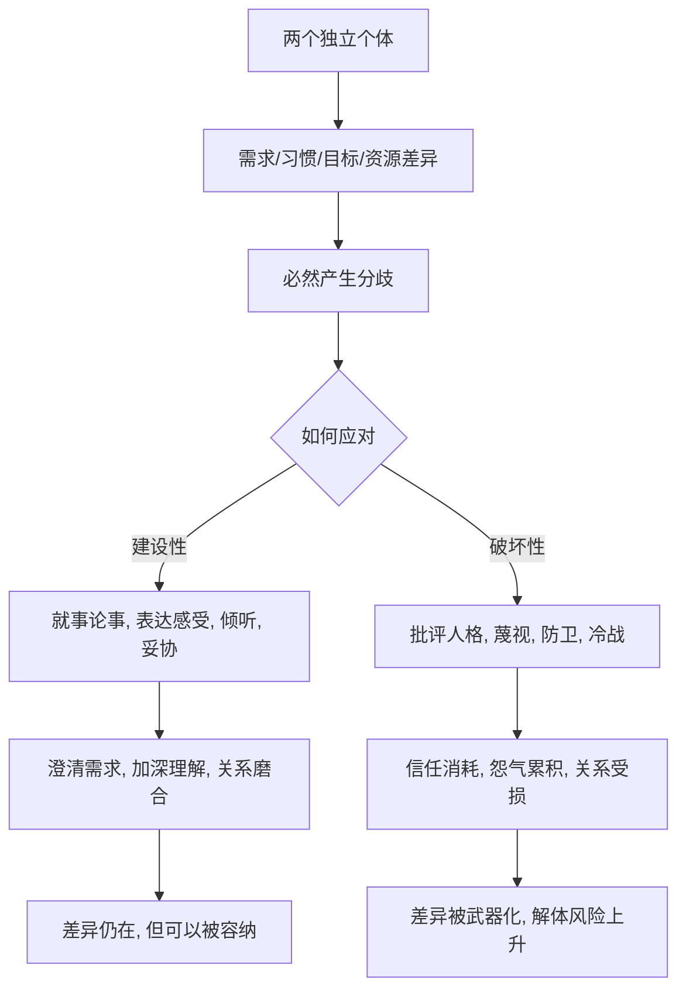

# 12｜关系里的冲突为什么无法避免？

> 为什么再恩爱的两个人也会吵架？

---

## 一、先说结论

米勒的观点是：冲突不是关系出了故障，而是**关系的常态**。

两个独立的人，需求、习惯、目标、节奏必然不同。分歧是结构性的，不是谁不够好。真正决定关系命运的，不是吵不吵，而是怎么处理：是回避还是面对，是攻击人格还是就事论事。

一句话：**冲突无法避免；但冲突会变成伤害还是磨合，可以选择。**

---

## 二、我们先理解一个问题

先看一个几乎所有情侣都会遇到的问题：过年回谁家。

男方觉得，当然回我家，我是儿子；女方觉得，凭什么总是回你家，我爸妈也一年到头见不到我。两个人都没有错，两个人的需求都真实，两个人的父母都在等。

这不是谁自私、谁不讲理的问题。就算两个人都很爱对方、都很通情达理，这个问题依然会摆到桌面上，而且很难有一个让所有人都满意的答案。

于是问题来了：**如果两个人都没错，冲突为什么还是会发生？**

---

## 三、作者到底提出了什么观点？

米勒在讨论冲突时，提出了几个核心判断。

1. **冲突源于差异，而差异是关系固有的。** 任何两个独立个体，在偏好、信念、目标、资源分配上都存在不一致。差异本身不是问题，问题是我们误以为相爱就不该有分歧。
2. **冲突的频率不是关键，处理方式才是。** 研究反复发现，比起吵多少次，关系更受怎么吵的影响。
3. **冲突有两种走向。** 建设性的冲突能澄清需求、促成调整、加深理解；破坏性的冲突则不断消耗信任，把差异变成敌意。
4. **把冲突当关系失败，本身就有害。** 越是相信好的关系不该吵架，越容易在冲突出现时感到幻灭和羞耻，从而选择回避或攻击。

一句话：**冲突是关系的一部分，而不是关系的反面。**

---

## 四、把这个观点翻译成人话

可以这样理解：**冲突是两台不同系统的对接。**

每个人都是一套运行了很久的操作系统，有自己的习惯、偏好、默认设置。两个人相处，就是让两套系统长期联网。联网就一定会出现**接口不兼容**的地方：你想省电，我想跑满性能；你觉得周末该休息，我觉得周末该出门。

接口不兼容不是谁的系统坏了，而是两个系统本来就不一样。

所以真正的问题从来不是我们为什么会有分歧，而是**我们遇到不兼容时，是打补丁，还是砸对方的机器。**

---

## 五、为什么会这样？

把它拆成一条链：

关键在 **C → D** 这一跳：差异和分歧是**输入**，我们怎么处理才是**变量**。

这里有一个容易被忽略的机制：**我们对冲突的信念，会反过来影响冲突的结果。** 如果你相信吵架说明不合适，那么一吵架，你的第一反应可能是否认问题、躲避沟通，或者干脆判定这段关系没救了。这两种反应都会让分歧更快升级。反过来，如果你把冲突看成需要共同解决的问题，你会更愿意坐下来谈。

**也就是说，冲突本身是中性的；是它被放进怎样的框架里，决定了它成为磨合还是损伤。**

---

## 六、举一个现实生活中的例子

回到过年回谁家。

破坏性的版本：两个人一谈就上升到人格攻击——你就是自私，你根本没把我爸妈当回事，当初真不该嫁给你。谈的已经不是回谁家，而是你是什么样的人、这段婚姻值不值。问题没解决，两个人都带着伤退场，还在心里记了一笔账。

建设性的版本：两个人把问题摊开——我想回我家，因为一年只见我爸妈一面；我也想回我家，因为我是独生女，我爸妈很孤单。**双方的需求都被听见了，而不是被评判。** 然后一起想办法：轮流、各回各家、接父母过来，甚至某一年谁都不回。方案不一定完美，但彼此确认了我们是一起面对这个问题，而不是互相对抗。

**同样一件事，前者把差异变成刀，后者把差异变成需要一起处理的课题。**

---

## 七、回到书中重新理解

现在再回看米勒为什么说冲突无法避免，就顺了。

他要打破的，是一个浪漫主义的幻觉：**对的人，就是不会和我冲突的人。** 事实上，只要两个人足够诚实、足够亲近，冲突反而会更频繁地浮出水面。因为亲密关系里，你们的利益、期待、边界交织得最深，可分歧的空间也最大。回避冲突的表面和平，往往是以压抑真实需求为代价的。

米勒真正的观点是：**看一段关系健不健康，不要看它吵不吵架，要看它能不能在吵架之后，把问题往前推进一步。**

---

## 八、这个观点背后还有什么？

**第一，它把冲突和敌意区分开了。** 冲突是目标不一致；敌意是把对方当敌人。很多关系毁掉的不是冲突，而是把冲突升级成了敌意。

**第二，有些分歧是永远无法彻底解决的。** 一些研究者认为，伴侣之间的部分分歧属于永久性问题，能做的不是消灭它，而是学会与它共存。这一点非常重要，因为它把必须解决的压力卸掉了一部分。

**第三，回避也是一种策略，但它有代价。** 短期看，回避能避免当下的不快；长期看，被压抑的需求会以冷漠、疏离或突然爆发的形式回来。

**第四，它和第 07 篇的归因偏差互为因果。** 冲突中我们更容易把对方的失误归因为人品，把冲突本身越推越深。

---

## 九、这个观点有问题吗？

有，需要平衡。

**第一，冲突是常态可能被滥用。** 如果把它理解成吵架很正常、忍忍就好，就忽略了冲突中确实存在伤害性行为。贬低、控制、暴力，这些不是正常的差异，而是需要严肃对待的伤害。

**第二，不是所有冲突都值得硬扛。** 有些分歧背后是价值观的根本冲突，或者对方根本不愿意沟通。在这种情况下，学会处理冲突可能变成单方面的消耗，而离开才是更健康的选择。

**第三，如何衡量处理得好，标准并不统一。** 有研究支持建设性表达更有利，但也有研究者提醒，不同依恋类型、不同文化下，好的处理方式差异很大。回避型的人未必需要当面说清楚，安全型的人可能正相反。

**所以更准确的说法是**：冲突源于差异，是亲密关系的固有部分，处理方式比频率更能预测关系质量；但冲突是常态不等于一切冲突都该忍，识别伤害性行为、判断分歧是否可解，同样重要。

---

## 十、今天再看这个观点

以下部分是基于米勒思想的现代延伸，不是米勒的原话。

在今天，冲突的**战场**变了。

过去吵架要面对面，情绪有温度，也有终场——累了就睡了，第二天还得一起吃饭。现在，冲突可以发生在微信里、在已读不回里、在朋友圈的阴阳里。

**低成本的冲突带来两个后果。** 一是回避变得极容易：不想谈就不回，不想吵就冷处理，表面没有冲突，实则积累了更深的疏远。二是冲突可能被无限延长：文字可以反复编辑、截图、转发，一句气话可以被保存很久，冲突从一件事变成一段历史的清算。

这恰好印证了米勒的框架：**技术没有制造差异，但它改变了我们处理差异的方式。** 值得追问的是：当我们随时可以不回应，我们是不是也在慢慢失去把问题谈完的能力？

---

## 十一、这一篇真正应该记住什么？

1. **冲突是关系的常态，不是故障。** 两个独立的人，差异是结构性的，分歧必然发生。
2. **相爱就不该吵架是危险的幻觉。** 它会让冲突出现时，我们不是处理它，而是怀疑关系本身。
3. **频率不重要，处理方式才重要。** 就事论事、表达感受、倾听、妥协，比吵多少次更能预测关系质量。
4. **冲突会走向两极：磨合或损伤。** 区别在于我们把差异当课题，还是当武器。
5. **有些分歧无法彻底解决。** 学会与永久性问题共存，比强行消灭它更现实。

---

## 十二、留一个问题

> 如果冲突无法避免，而处理方式可以选，
> 那么你和最重要的人上一次发生分歧时，
> 你是在解决那个问题，还是在证明那个人有问题？

---

**下一篇**：既然冲突无法避免，那么接下来的问题就是——吵架到底有没有正确方式？为什么有的争吵越吵越近，有的却越吵越远，直到把关系吵没了？

下一篇我们就来拆开这个问题——**吵架有正确方式吗？**
