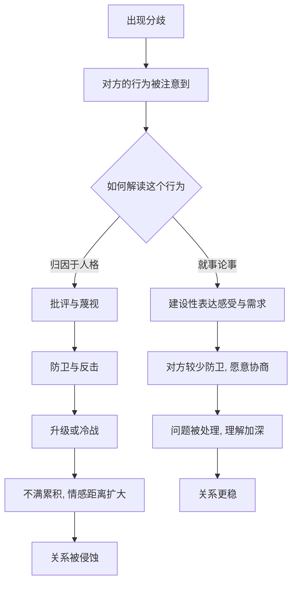

# 13｜吵架有“正确方式”吗？

> 为什么有的争吵越吵越近，有的越吵越远？

---

## 一、先说结论

米勒给出的答案，反直觉但清楚：**问题从来不是“吵不吵”，而是“怎么吵”。**

冲突是关系的常态，两个独立的人必然会有分歧。真正决定关系走向的，是分歧出现之后的那几分钟：你是在攻击对方这个人，还是在解决眼前这件事；你是在关上门，还是在把门留着。

同样是吵架，有的伴侣越吵越了解彼此，有的伴侣越吵越像敌人。差别不在于谁脾气更好，而在于有没有掉进那几种被研究反复标记的“破坏性模式”。

---

## 二、我们先理解一个问题

先看一个奇怪的现象。

有两对伴侣，吵架的频率差不多，吵的也都是同类的琐事：谁忘了交水电费、谁回家太晚、谁说话不算数。

几年之后，一对还在一起，甚至比从前更默契；另一对已经分开，或者同住一个屋檐下却形同陌路。

频率相当，事情相似，结局却完全相反。于是：

> 决定一段关系生死的，究竟是“冲突的多少”，还是“冲突的样子”？

这个问题，正是米勒在谈冲突时最想厘清的。

---

## 三、作者到底提出了什么观点？

米勒的核心判断有三层：

1. **冲突本身无害，甚至有益。** 分歧被摊开、被处理，会让双方更了解彼此的真实需求；长期压着不说，反而会让不满发酵。
2. **破坏性的应对会持续侵蚀关系。** 米勒在书中介绍了一组被研究者反复观察到的行为模式，通常被称为关系里的“末日四骑士”：**批评**（攻击对方的人格而非具体行为）、**蔑视**（嘲讽、翻白眼、贬低，被视为最危险的一种）、**防卫**（把责任全部推回去，拒绝承担任何部分）、**冷战**（退出对话、沉默、筑墙）。
3. **建设性的方式是可以学的。** 就事论事地描述问题、表达自己的感受而不是指责对方、认真倾听并确认对方的立场、在可能处寻求妥协——这些不是天生的能力，而是可以练习的技能。

一句话：**吵架没有“要不要”的选择，只有“会不会”的差别。**

---

## 四、把这个观点翻译成人话

可以用“对事”和“对人”来区分。

同样是对方忘记倒垃圾：

- 对事：“垃圾没倒，我有点烦，今晚你能处理一下吗？”——说的是行为，给出了出路。
- 对人：“你就是这么懒，永远指望不上。”——说的是人格，没有出路。

前者是抱怨，后者是批评。抱怨可能让人不舒服，但还留有改进的余地；批评直接否定了对方这个人，对方的自然反应就是防卫或者反击。

再往上一步就是蔑视。当一句话里带着“你怎么这么可笑”的意味时，对方接收到的已经不是“这件事没做好”，而是“你不配”。蔑视之所以最危险，是因为它传递的是不尊重——而尊重一旦消失，关系就失去了地基。

至于冷战，它是把战场从语言转移到沉默。表面上是“我不想吵了”，实际效果却是让对方在悬置和不确定里煎熬。**关门不是结束冲突，而是把冲突冻起来。**

---

## 五、为什么会这样？

把它拆成一条链：

关键在 **C** 这一跳。

同一句“你怎么又晚回来”，可以被解读为“他担心我”，也可以被解读为“他在控制我”。解读方式决定了你是回应需求，还是回应攻击。**很多争吵的真正内容，不是那件事，而是双方对那件事的解释。**

---

## 六、举一个现实生活中的例子

设想一对伴侣，因为一方连续几晚很晚回家而产生摩擦。

**版本一：冷战。**

晚归的一方进门，另一方不说话，只把碗筷往桌上一放，转身进屋刷手机。被冷落的一方感到莫名其妙，也赌气不回话。接下来几天，两个人在同一个屋檐下小心地绕开彼此，谁都不提那件事。

表面看，没有争吵，风平浪静。但沉默里，晚归的人感到的是“被判决了却不给理由”，等待的人感到的是“我的不满根本不被看见”。**问题没有被解决，只是被埋起来了。** 下一次摩擦，会把两次的怨气一起引爆。

**版本二：就事论事。**

同样是晚归，但这一次，等待的一方在对方进门后说：“你这几天都十一点后才回来，我一个人吃饭，有点失落，也有点担心。你最近是遇到什么事了吗？”

这句话里有行为（十一点后回来）、有感受（失落、担心）、有询问（是不是遇到事），唯独没有人格判定。晚归的一方没有被逼到墙角，反而更容易说出真实原因——也许是项目赶工，也许是压力太大不想回家面对催促。

注意，这个版本并没有让问题立刻消失。晚归可能还会继续，失落也依然存在。但两个人现在讨论的是**同一件事**，而不是各自心里的两个不同版本。

**这就是“有效争吵”和“无效争吵”的差别：前者让双方站在问题的同一边，后者让双方站在彼此的对立面。**

---

## 七、回到书中重新理解

现在回头看米勒为什么要把“应对方式”而不是“冲突频率”放在中心，就清楚了。

他并不是在教人“如何不吵架”，而是在指出一个更基础的判断：**关系不是被冲突毁掉的，是被处理冲突的方式毁掉的。** 那些最终散掉的伴侣，往往不是分歧特别多，而是在分歧中反复使用了那几种会刺伤对方的方式，直到尊重被消耗殆尽。

理解了这一点，你也就理解了一句常被误解的话——“我们从不吵架”。它可能意味着成熟，也可能意味着两个人都已经放弃了表达。

---

## 八、这个观点背后还有什么？

**第一，情绪淹没与生理唤起。** 一些研究者认为，争吵升级时人会进入高度紧张的状态，心跳加快、思维变窄，此时很难理性沟通。这解释了为什么“先冷静二十分钟”常常比“当场争个明白”更有效——不是因为回避，而是因为生理上确实需要时间。

**第二，修复尝试很重要。** 研究者观察到，稳定伴侣在争吵中会做“小动作”来降温：一个玩笑、一句“我们别这样”、一次伸手。这些修复尝试不一定成功，但只要有，关系就有回旋余地。

**第三，破坏性模式的根源常在归因。** 把对方的行为解释成“他就不在乎我”，几乎必然导向批评和蔑视。反过来，如果能把行为解释成“他今天可能状态不好”，冲突的温度就会不同。

**第四，它是可以训练的。** 把“你总是……”换成“当……的时候，我感到……”，把“你根本不懂”换成“我想让你知道我的感受”——这些句式不是话术，而是把攻击转成请求的具体做法。

---

## 九、这个观点有问题吗？

有，需要保持平衡。

**第一，“末日四骑士”的观察多来自对伴侣互动的长期追踪，属于相关性与预测性证据。** 蔑视与分手相关，但不能简单反推“没有蔑视就一定能长久”。

**第二，“正确吵架方式”的标准化，可能压抑真实表达。** 如果每次冲突都要修辞得体、情绪克制，有些人反而会感到“我连生气都不被允许”。健康的争吵并不排斥激烈的情绪，排斥的是对人的否定。

**第三，文化差异需要考虑。** 不同文化对“直接表达”与“间接含蓄”的接受度不同，把某一套沟通模板当作普适标准，可能并不公平。

**第四，个体差异真实存在。** 有人需要当场说清，有人需要先独处缓冲；把其中一种当成“正确”，本身就会制造新的冲突。

**所以更准确的说法是**：冲突中“对人”与“对事”的分野，以及蔑视、冷战这类模式的破坏性，在多数研究中是相对稳健的；但“只有一种正确吵法”的说法，则过于简化。

---

## 十、今天再看这个观点

以下部分是基于米勒思想的现代延伸，不是他在书里的原话。

在今天，很多争吵已经从客厅搬到了手机屏幕上。

**冷战有了新形态：已读不回。** 过去关门是物理动作，现在关上门只需要不回复一条消息。它带来的不确定感更强——你不知道对方是忙、是气、还是已经不在意。

**文字放大了误解。** 面对面时，语气和表情会稀释攻击性；而在文字里，“你怎么又这样”只剩下最冷的那个版本。缺少语调的缓冲，批评和蔑视更容易被读出来。

**同时，屏幕也提供了缓冲。** 有的人打了一段话又删掉，重新组织成“我感到……”再发出去——这其实是把“修复尝试”提前到了发送之前。

所以问题也许不再是“吵不吵架”，而是：**你是在用工具解决分歧，还是在用工具伤害对方。**

---

## 十一、这一篇真正应该记住什么？

1. **吵架不是问题，怎么吵才是问题。** 冲突是关系的常态，避开它既不可能也无必要。
2. **四种破坏性模式要警惕：批评、蔑视、防卫、冷战。** 其中蔑视最伤根基，因为它否定的是尊重本身。
3. **建设性方式是可学的。** 描述行为、表达感受、倾听确认、寻求妥协——把攻击换成请求。
4. **修复尝试比不吵架更现实。** 稳定关系不是没有冲突，而是冲突中不断尝试降温。
5. **目标是站到问题的同一边，而不是站到彼此的对立面。**

---

## 十二、留一个问题

> 你们最近一次争吵，
> 最后停下来是因为“问题有了着落”，
> 还是因为“其中一个人先认输、或者索性不说话了”？

---

**下一篇**：吵得再凶，有时也还能修；可如果两个人手里的筹码根本不对等——一个随时能走，一个离不起——那这场关系里的“怎么吵”，还轮得到双方商量吗？

下一篇我们就来拆开这个问题——**权力不对等会怎样伤害关系。**
