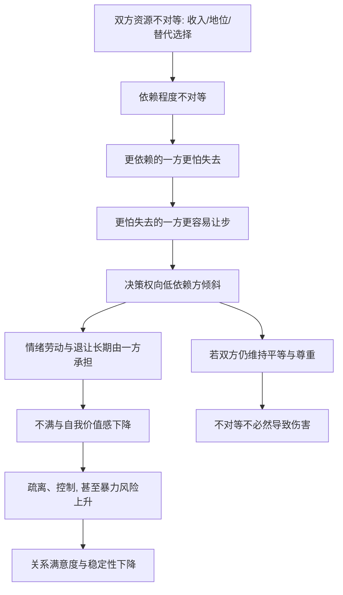

# 14｜权力不对等会怎样伤害关系？

> 当一方掌握更多资源时，关系会发生什么变化？

---

## 一、先说结论

米勒给出的答案可以浓缩成一句话：**权力来自“更少依赖”——谁更不怕失去，谁就更有话语权。**

在关系里，权力不总是命令和咆哮，它更多时候是一句“那就算了吧”，是“你不愿意就算了，我自己安排”，是“随便你”。谁更离不开这段关系，谁就更容易先让步。

而当这种不对等持续扩大时，随之而来的往往是决策权的倾斜、情绪劳动的不均，以及在极端情况下出现的控制、冷暴力乃至人身暴力。米勒指出，**平等与尊重，是关系稳定与满意度最关键的预测因素之一。**

---

## 二、我们先理解一个问题

先看一个安静的变化。

一对伴侣刚在一起时，两个人的收入差不多，决定去哪里吃饭、周末做什么、要不要换城市，基本是有商有量的。

几年后，其中一方的事业起飞，收入成了另一方的几倍。慢慢地，家里大大小小的决定——买哪套房、孩子上哪所学校、假期怎么安排——越来越由收入高的那一方拍板。另一方开始习惯性地问：“你觉得呢？”“听你的。”

没有人宣布过新的规则，也没有人强加，可权力就这样悄悄转移了。

于是：

> 为什么“谁赚得多”这样一件外部的事，会慢慢变成“谁说了算”这样一件关系内部的事？

---

## 三、作者到底提出了什么观点？

米勒在这一部分提出了几个关键判断：

1. **权力是亲密关系中一个普遍存在的维度。** 它未必意味着控制或压迫，但只要有两个人，就一定存在“谁更需要谁”的差异。
2. **权力的核心是依赖程度。** 米勒援引的“更少依赖原则”指出：在关系中，对关系依赖更少、更不怕失去的一方，拥有更大的影响力；而更依赖、更害怕失去的一方，往往在冲突中先行退让。
3. **资源是权力的主要来源之一，但不是全部。** 收入、社会地位、外貌、替代选择的质量、甚至情绪上的自足程度，都会转化为关系中的分量。
4. **不对等会带来一系列后果。** 决策权失衡、情绪劳动分配不均、被忽视一方的满意度下降，以及更高概率的出现控制行为与暴力风险。
5. **平等与尊重是关键。** 大量的关系研究发现，双方感知到的平等程度，比谁挣得多、谁更能干，更能预测关系的稳定和幸福。

一句话：**在关系里，真正决定话语权的，往往不是“谁更能干”，而是“谁更不怕走”。**

---

## 四、把这个观点翻译成人话

可以用“谈判桌上的底气”来理解。

权力不是喊出来的，是谈出来的。在每一次分歧中，双方其实都在无声地估算：如果我坚持，对方会不会真的离开？如果我离开，我还能不能过得下去？

估算的结果，决定谁让步。**手里有更多退路的人，语气更容易从容；没有退路的人，更容易妥协。**

这也解释了为什么权力有时和金钱无关。一个全职照顾家庭的人，可能掌握了所有家务和育儿的实际经验，却在“要不要搬家”“要不要接受这份工作”上几乎没有发言权——不是他不懂得这些决定，而是他在这段关系里的替代选择更少、投入却更多。

反过来，一个经济条件普通、但社交圈广、自我价值感强的人，未必“怕失去”。**权力来自依赖的落差，而不是绝对的资源总量。**

---

## 五、为什么会这样？

把它拆成一条链：

关键在 **B → C** 这一跳。

资源差异本身不等于权力，同样挣得多的人，未必都强势。真正起作用的是：**这些资源是否让对方“更不怕离开”**。一个收入高但情感上高度依赖伴侣的人，未必有权力；一个收入低但独立、朋友多、内心不慌的人，未必没有权力。

**权力是依赖的镜像：你越需要这段关系，这段关系对你的要价就越高。**

---

## 六、举一个现实生活中的例子

设想一对伴侣，从“差不多”走到“差很多”。

开始时，两个人都是普通上班族，谁加班谁做饭是轮着来的，吵起来也旗鼓相当，因为谁都能自己过日子。

后来一方升职加薪，另一方因为照顾孩子，退到了半职。表面上看，这是家庭内的合理分工，两个人也都同意。

但变化是缓慢发生的。先是“要不这个周末就不出去了，我下周有个会”，然后是“这个房子定了就定了，你眼光不行”，再然后是“你要是不喜欢，你可以自己安排”。

让步的一方起初还会抗议，慢慢地，抗议变成了沉默，沉默变成了习惯。**他并没有被强迫，只是每一次坚持，成本都比对方高。**

更微妙的是情绪劳动。谁负责记住家人的生日、谁负责在孩子生病时请假、谁负责在对方心情不好时先安抚——这些看不见的工作，往往自动落到了依赖更深、话语权更弱的一方身上，而且很少被算作“付出”。

**权力不对等最伤人的地方，不是某次争吵谁赢谁输，而是它会日复一日地重塑两个人对彼此的定位：一个越来越习惯决定，一个越来越习惯服从。**

---

## 七、回到书中重新理解

现在再回看米勒为什么要把“权力”单独拿出来讲，就顺了。

他并不是要把亲密关系描述成一场冷酷的博弈。他说的是：**权力的存在是结构性的，它不因两个人感情好就消失。** 你可以爱一个人，同时在关系里更有底气；你也可以被一个人爱着，同时在关系里更没得选。

承认这一点，才有可能谈公正。把“我们之间不存在权力”当成浪漫，往往只是让权力以更隐蔽的方式运行——比如那个总说“都听你的”的人，其实是没得选的那个。

理解了权力，你也就理解了那句话：**一段关系里真正稀缺的，不是爱，是平等。**

---

## 八、这个观点背后还有什么？

**第一，权力有两种面孔。** 一些研究者区分了“命运控制”（能决定对方得到什么）与“行为控制”（能影响对方怎么做）。前者靠资源和奖惩，后者靠日常的互动与影响力。很多关系里的权力，是后一种更隐蔽的形态——谁的情绪影响整个家的气氛，谁就有一种特殊权力。

**第二，权力也藏在“谁来道歉”里。** 谁先低头、谁先开口、谁负责收拾残局，长期看是会形成惯例的。道歉次数的分布，本身就是权力的一张体检表。

**第三，它与依恋类型相关。** 焦虑型的人更容易因为害怕被抛弃而让渡权力，回避型的人则可能靠保持距离来获得主动权。依恋与权力常常互相放大。

**第四，制度与文化会叠加。** 在一些社会环境中，性别、阶层、年龄会预先分配权力，使不对等看起来“理所当然”。真正的平等需要对抗的不只是个人习惯，还有这些默认设定。

---

## 九、这个观点有问题吗？

有，需要一些限定。

**第一，“更少依赖原则”的验证多为相关研究。** 依赖与影响力确实相关，但权力关系也可能反向塑造依赖——被压低话语权的一方，可能因此变得更难独立，形成循环。

**第二，不对等未必等于不公。** 有些分工是双方自愿且满意的：一个人主外一个人主内，如果两人都认可这种安排，并且都能表达不满、都有随时重新协商的通道，那它未必是伤害。

**第三，把一切不对等都读成压迫，会忽略真实的差异。** 一方收入更高、更擅长某类决策，并不自动意味着另一方被剥夺了什么，关键仍在于**是否平等、是否尊重、是否可以说不**。

**第四，关于暴力的部分，研究结论更为稳健。** 资源不对等、控制欲与伴侣暴力之间的关联，在大量研究中被反复观察到，但因果关系复杂，个体差异也很明显，应避免简单归因。

**所以更准确的说法是**：权力来自依赖落差，不对等会系统性地增加关系的风险；但不对等本身并不注定伤害，决定性因素在于它是否伴随平等、尊重与可协商的空间。

---

## 十、今天再看这个观点

以下部分是基于米勒思想的现代延伸，不是他在书里的原话。

在今天，权力不对等的形态正在发生变化。

**一是财务透明度的权力。** 双职工家庭越来越多，但“谁管钱”依然是一种隐蔽的权力。如果一方掌握全部账户与预算，另一方即使有收入，也可能在重大决定上没有真正的话语权。

**二是“数字权力”。** 谁能看对方手机、谁知道对方的密码、谁的社交账号更活跃，正在成为新的影响力来源。定位共享、聊天记录的查看权，有时会比工资条更能说明家里谁更有底气。

**三是经济波动带来的再分配。** 行业兴衰、裁员、创业失败，会让原本的“高收入方”突然失去筹码。这时不对等会反转，而两个人是否经得起这种反转，考验的正是关系里有没有超越收入的尊重。

所以问题也许不再只是“谁挣得多”，而是：**在这段关系里，两个人都能说不吗？**

---

## 十一、这一篇真正应该记住什么？

1. **权力来自“更少依赖”。** 谁更不怕失去，谁就更有话语权；权力是依赖的镜像。
2. **资源不等于权力。** 收入、替代选择、情绪自足程度共同决定分量，关键是依赖的落差。
3. **不对等伤害的不是某一次争吵，而是长期的定位。** 决策倾斜与情绪劳动不均会日复一日地累积。
4. **平等与尊重是关键预测因素。** 不对等未必致命，但没有平等与尊重的不对等，风险显著上升。
5. **“我们之间没有权力”通常只是一厢情愿。** 承认权力存在，才谈得上公正。

---

## 十二、留一个问题

> 在你们的关系里，
> 最近一次真正由你拍板、并且对方认真对待的决定，
> 是什么时候？

---

**下一篇**：权力的裂缝如果一直没被看见，关系通常会往哪个方向走？那些最后走向出轨或分手的伴侣，到底是某一刻崩塌的，还是很久以前就开始慢慢走远了？

下一篇我们就来拆开这个问题——**关系为什么会走向背叛与解体。**
