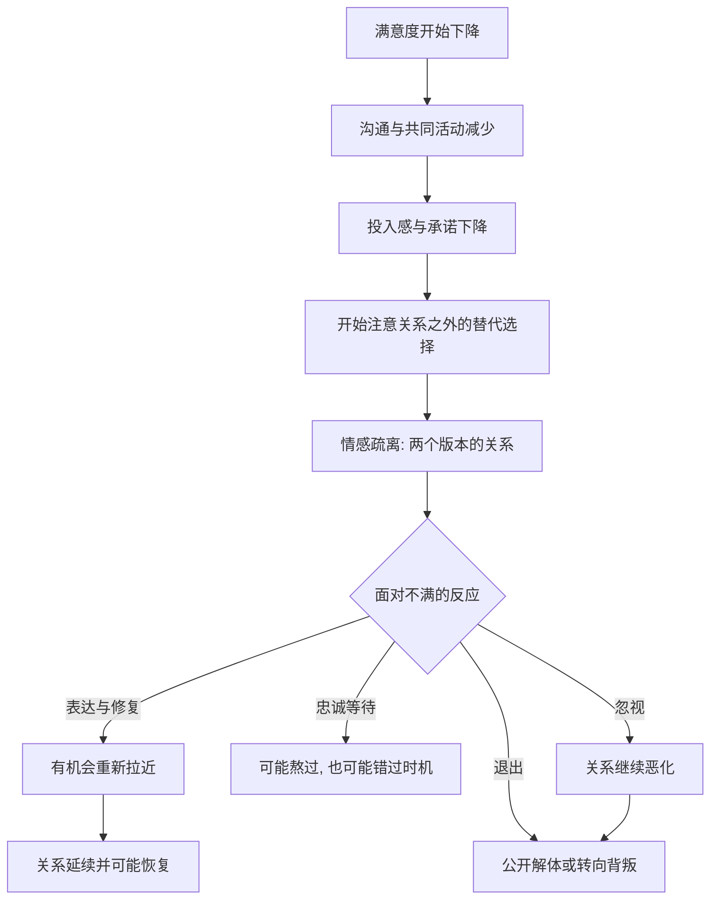

# 15｜关系为什么会走向背叛与解体？

> 分手和出轨，是突然发生的，还是逐步发生的？

---

## 一、先说结论

米勒给出的答案很冷静：**关系的解体，通常不是某一刻的崩塌，而是一个渐进的过程。**

它往往经历一条可辨认的路径：满意度下降、沟通与投入减少、开始向关系之外寻找、情感逐步疏离，最后才是那个看起来“突然”的事件——一次摊牌，或一次出轨。

背叛也遵循类似的逻辑。它很少凭空发生，而常与三个因素相关：**替代选择变好了、投入感下降了、满意度降低了。** 理解这套机制，不是为了让人悲观，而是为了说明：**在早期信号出现时，关系其实还有干预的机会。**

---

## 二、我们先理解一个问题

先看一个反常的现象。

一对伴侣分手了，周围人都很惊讶：“他们不是挺好的吗？上周还一起吃饭。”当事人自己有时也觉得恍惚：“怎么就走到这一步了？”

可如果把时间倒回去看，事情并不突然。半年前，他们不再每天分享小事；三个月前，争吵变成了沉默；两个月前，其中一个人开始频繁加班、参加聚会、回复某个人的消息时格外小心。那次分手，只是把早已发生的事说出口。

于是：

> 如果关系的结束几乎都不是瞬间完成的，
> 那我们平时看到的“突然”，到底遮蔽了什么？

---

## 三、作者到底提出了什么观点？

米勒在这一部分提出了几个核心判断：

1. **背叛的定义比“出轨”更宽。** 米勒把它理解为：来自我们信任之人的、伤害性的行为——它可能是一段隐瞒的感情，也可能是背后说坏话、违背重大承诺、在关键时刻站在对立面。共同点是：**它破坏的是信任，而信任是关系的地基。**
2. **解体是一个过程，不是一个事件。** 关系往往先经历一段“不满累积”的时期，再进入“疏离与重新评估”，然后可能出现“另寻出路”，最后才是“公开解体”。
3. **解体与投入模型相连。** 当满意度下降、替代选择的吸引力上升、投入感不再增长时，离开的阈值就会降低；反过来，高投入会让人即使不满意也继续留下。
4. **面对不满，人有不同的反应方式。** 一些研究者把它们概括为四种：**表达**（说出问题、尝试修复）、**忠诚**（默默等待、期待变好）、**退出**（离开或威胁离开）、**忽视**（冷淡、敷衍、任关系恶化）。
5. **早期信号是可观察的。** 沟通减少、共同活动减少、开始对比他人、回避提及未来，都是值得注意的变化。

一句话：**关系很少死于一场争吵，它更多死于长期无人处理的疏离。**

---

## 四、把这个观点翻译成人话

可以用“水位下降”来理解。

关系破裂不像地震，一次就完成；它更像水位慢慢下降。一开始你察觉不到，因为水面还在，船还浮着。等到某天船搁浅了，你才惊呼“怎么会”——其实水早就退了很多，只是没人去看。

值得注意的是，**在解体之前，双方往往已经进入“两个版本的关系”**：一个人还在努力修补，另一个人已经在心里办理离场手续。这种信息不对称，往往是被背叛者最痛苦的来源——他以为自己在一段关系里，对方却早已不在。

还有一个容易忽略的点：**忽视比争吵更危险。** 争吵至少意味着还在乎，还想让对方听见；而冷淡、敷衍、无所谓，传递的是“你已经不值得我花力气了”。这往往是解体前最沉默也最确凿的信号。

---

## 五、为什么会这样？

把它拆成一条链：

关键在 **A → B** 这一段。

满意度下降本身不可怕，几乎每段长期关系都会经历低谷。真正致命的，是下降之后**沟通与投入同步减少**——因为这意味着双方失去了发现和修复问题的通道。**当两个人不再交换信息，误解就会代替事实填满空白。**

再加上替代选择的出现，离开的成本在心理上就被拉低了。这不意味着新出现的人一定更好，只是意味着“离开”从一个不能想的事，变成了一个可以想的事。

---

## 六、举一个现实生活中的例子

设想一段持续多年的关系，最后以一方出轨、随后分手告终。

事后回头看，那条路其实走得很慢。

**第一阶段，是不满的积累。** 两个人为了孩子、工作和家务疲于奔命，约会没有了，深入的聊天也没有了。抱怨还在，但没人真的去处理，因为“太忙了，以后再说”。

**第二阶段，是疏离。** 他们开始各自安排周末，各自刷手机到深夜，性生活变得稀少且程序化。他们仍然同住一个屋檐下，但共同的话题只剩下事务性的交代。

**第三阶段，是另寻。** 其中一个人在工作中遇到一个愿意听他说话的人。真正让他动摇的，未必是对方的吸引力，而是那种久违的“被认真对待的感觉”。这段关系起初只是朋友式的倾诉，边界是一点一点模糊的。

**第四阶段，才是公开。** 隐瞒被发现，摊牌，分手。在旁人看来，这是一场因出轨而破裂的感情；但当事人心里清楚，**出轨更像是一个结果，而不是全部原因。**

需要说清楚的是：**理解这个过程不等于为出轨开脱。** 关系疏离可以解释一个人为什么动摇，但不能免除他对承诺与诚实的责任。渐进地走远是一回事，选择欺骗则是另一回事。

---

## 七、回到书中重新理解

现在再回看米勒为什么要用“过程”而不是“事件”来描述解体，就清楚了。

他并不是要替背叛找理由，而是要指出一个更实用的事实：**既然解体是渐进的，那么在每一个“渐进的台阶”上，都存在回头的可能。** 如果把分手理解成一次偶然的爆发，人就只能事后懊悔；如果把它理解成一条有迹可循的坡，人就可以在半路停下来看看。

这也修正了一种常见的错觉：以为“没吵架就没事”。实际上，一段关系最危险的时刻，往往不是吵得最凶的时候，而是**连吵都懒得吵的时候。**

---

## 八、这个观点背后还有什么？

**第一，背叛不止一种。** 除了性方面的不忠，还有情感上的背离（把最深的倾诉给了别人）、忠诚上的背离（在关键时刻不站在对方一边）、以及公开的贬低。**伤害的衡量标准，是被背叛者的感受，而不是背叛者的自我辩解。**

**第二，被背叛者的创伤是真实的。** 研究者发现，遭遇背叛后的人常经历反复回想、信任崩塌、自我怀疑，甚至类似创伤后的反应。这不是“想不开”，而是信任被抽走后的自然结果——原来的世界地图失效了。

**第三，替代选择的影响是心理性的。** 一个人觉得“没有更好的选择”，往往比事实上的确没有选择，更能把人困在一段关系里。反过来，仅仅是“觉得自己能离开”，就足以改变一个人的行为。

**第四，信号是可以被回应的。** 疏离期的沟通重建、共同活动恢复、坦诚的重新评估，都属于“表达”而非“忽视”。很多关系不是败给了问题本身，而是败给了问题被搁置得太久。

---

## 九、这个观点有问题吗？

有，需要审慎。

**第一，“渐进解体”的叙述存在事后回溯偏差。** 人在分手后回看往事，会自然地讲出一个有头有尾的故事，把零散的细节串成必然的因果。真实过程可能远比叙事混乱。

**第二，“渐进”不等于“必然”。** 很多关系经历过同样的疏离低谷，却并没有解体。把过程当成命运，会低估修复的力量。

**第三，不是所有结束都需要“背叛”来解释。** 有些关系是双方平静地意识到不合适而分开的，这未必是失败，也未必有谁做错了什么。

**第四，机制解释有被误用的风险。** 用“满意度下降、替代选择出现”来解释出轨，容易被曲解成“这是没办法的事”。解释不是辩护，理解原因与承担责任是两件事。

**所以更准确的说法是**：关系解体通常呈现渐进特征，背叛也常与满意度、投入和替代选择的变化相关；但这条路径不是宿命，个体的选择与道德责任始终不能被机制抹去。

---

## 十、今天再看这个观点

以下部分是基于米勒思想的现代延伸，不是他在书里的原话。

在今天，背叛与解体的场景被数字技术重新塑形。

**一是暧昧的门槛降低了。** 过去“另寻”需要见面、需要机会；现在一条深夜的消息、一个只对某人可见的动态，就足以开始一段隐秘的联结。边界的模糊往往发生在毫无仪式的时刻。

**二是“微背叛”难以被命名。** 频繁点赞某个人、删掉聊天记录、对伴侣隐瞒某个联系人——这些行为单独看都“没什么”，累积起来却构成了信任的裂缝。争议在于：多大程度算越界，往往双方认知不一致。

**三是算法参与了关系。** 推荐系统会让人不断看到“更理想的生活”和“更合适的人”，无形中抬高了想象中的替代选择，让人更容易对现状不满。**过去人们比较的是身边的人，现在比较的是被挑选过的完美样本。**

所以问题也许不再是“他会不会背叛我”，而是：**我们有没有在日常里，持续地看见并回应彼此的需求。**

---

## 十一、这一篇真正应该记住什么？

1. **解体是过程，不是事件。** 满意度下降、沟通减少、疏离、另寻、公开，是可以辨认的路径。
2. **背叛的本质是信任的破裂。** 它不限于出轨，也包括情感背离与忠诚背离。
3. **警报信号里，沉默往往比争吵更危险。** 冷淡与忽视，通常意味着已经在办理离场手续。
4. **理解机制不等于免除责任。** 解释动机与承担后果是两回事，二者不可混淆。
5. **渐进意味着可干预。** 在坡上还有机会停下，问题在于有没有人愿意先开口。

---

## 十二、留一个问题

> 如果关系的走远真的是一步一步发生的，
> 那么你们上一次“不太对劲”，
> 是在哪个台阶上被忽略的？
> 又是谁，先开始不再说话的？

---

**下一篇**：既然关系的解体是一步步发生的，那么反过来说，关系的存活是不是也藏在那些不起眼的日常里？道歉、宽恕、还有重建信任——这些到底是怎么起作用的？一段关系要活得久，究竟需要做对什么？

下一篇我们就来拆开这个问题——**如何让一段关系活得更久。**
