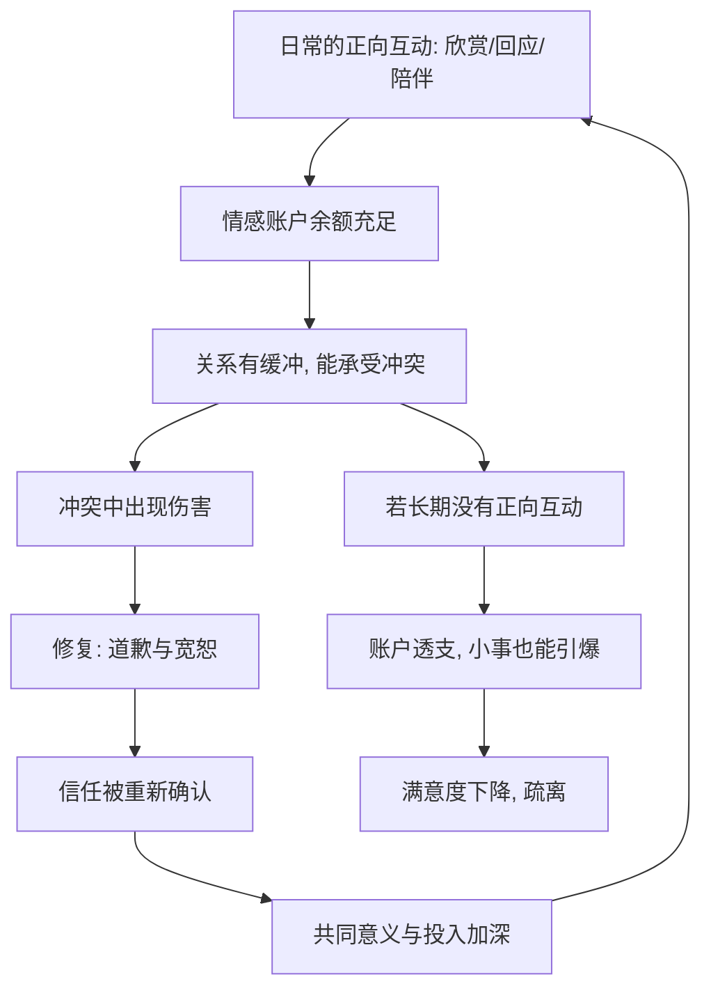

# 16｜如何让一段关系活得更久？

> 那些长久而幸福的关系，究竟做对了什么？

---

## 一、先说结论

米勒给出的答案，和他谈冲突、权力、背叛时一样冷静：**长久的幸福关系，靠的不是“找对人”，而是“持续做对事”。**

他归纳出的维持与修复机制包括：主动表达欣赏、保持日常的正向互动、在冲突中及时修复（道歉与宽恕）、共同建设“我们”的叙事，以及持续不断地投入。

换句话说，**关系不是一次选择的结果，而是一连串小动作的累积。** 它更像一个需要每天浇水的花园，而不是一件签下合同就自动生效的商品。

---

## 二、我们先理解一个问题

先看一个令人费解的对比。

有的伴侣在一起二三十年，看彼此的眼神仍然温柔；有的伴侣条件更好、更相配，却两三年就耗尽了。

如果吸引力、相似性、甚至“对的人”都解释不了这个差别，那么剩下的答案可能有点乏味：

> 那些走得远的关系，是不是并没有什么惊天动地的秘密，
> 只是一直在重复一些很普通、但很难坚持的小事？

这个问题，正是米勒谈维持与修复时想交代的。

---

## 三、作者到底提出了什么观点？

米勒的核心判断可以归为几条：

1. **维持靠的是一组具体的机制。** 一些研究者把它们概括为：**积极**（相处时保持友善与愉快）、**开放**（愿意自我表露与沟通）、**保证**（表达对关系的承诺与重视）、**共同社交圈**（有共享的朋友与活动）、**共担事务**（一起分担任务）。
2. **欣赏需要被说出来。** 关系里最容易被忽略的，是把“你做的这些我都看见了”说出口。感激一旦停止表达，对方就更容易把付出当成理所当然。
3. **冲突中的修复比不吵架更重要。** 道歉与宽恕是修复的核心。有效的道歉不是辩解，而是承认、共情、补救和改变。
4. **共同意义很重要。** 稳定的关系往往发展出“我们是谁”的共同叙事——共享的仪式、称呼、回忆与目标。它把两个人从一个“我”和一个“你”，黏合成一个“我们”。
5. **投入可以自我强化。** 已经投入的越多，离开的成本越高，承诺感也会因此增强；这既是约束，也是关系的黏合剂。

一句话：**关系的长寿，来自持续、微小、可重复的用心。**

---

## 四、把这个观点翻译成人话

可以用“情感账户”来理解。

每一次正面的互动——一句谢谢、一次主动的拥抱、一次认真听完的倾诉——都像往账户里存了一笔钱；每一次伤害和忽视，则像取款。

关系稳固的伴侣未必没有争吵，但他们平时存的足够多，所以在冲突的“大额取款”之后，账户不至于透支。而那些长期只有取款的关系，看起来也许平静，实际上早已资不抵债，任何一件小事都可能成为最后一根稻草。

还有一个关键区分：**道歉和宽恕是一对，但它们的顺序不能乱。**

道歉不是“对不起我错了”这么简单。有效的道歉包含：承认自己做了什么、不为自己辩解、理解对方为什么受伤、提出补救、并且用行动改变。少了后面几项，“对不起”就只是想让对方闭嘴。

而宽恕也不是遗忘，更不是“当没发生过”。它更像是**决定不再把这件事作为对付对方的武器**——伤害仍然存在，但被重新安放在了可以被跨越的位置。

**道歉修复的是行为，宽恕修复的是关系。**

---

## 五、为什么会这样？

把它拆成一条链：

关键在 **A → B** 这一环。

很多人误以为，关系好不好用“有没有大问题”来衡量。但研究反复提示：**决定关系走向的，往往是日常高频的小互动，而不是偶尔发生的大事。** 因为小互动数量多、频率高，它们才是账户余额的主要来源。

这解释了为什么“我为你做了那么多大事”常常换来“可你从来没好好听我说过话”。**大事件提供证据，小互动提供体感；而人是靠体感活着的。**

---

## 六、举一个现实生活中的例子

设想一对伴侣，因为一件事发生了伤害：一方在对方最需要支持的时候，选择了回避。

**笨拙的道歉：**

“好了好了，对不起行了吧？我当时也很累啊，你能不能别揪着不放？”——这里面有道歉的字面，却没有承认、没有共情，还夹着指责。对方听到的不是“我错了”，而是“你别烦了”。

**有效的道歉：**

“那天你说你需要我，我却走开了。我现在明白那让你觉得自己被丢下了。这是我的问题，不是你的。以后你再需要我的时候，我会留下来，哪怕只是陪着你。”——承认行为、点出对方的感受、不找借口、并给出具体的改变承诺。

**然后是宽恕。** 被伤害的一方可能不会立刻释怀，这是正常的。宽恕不是一夜之间完成的，它更像一场缓慢的搬迁：从“每次想起都像重新被扎一下”，到“我记得这件事，但它不再决定我怎么看你”。

而重建信任，则主要靠行动而不是语言。**信任是在一次次“说到做到”中重新长出来的。** 如果道歉后再犯，宽恕就会被证明是错的，关系会退得比从前更远。

所以那些活得更久的关系，并不是没有伤。它们只是**在每次受伤之后，都认真做完了“道歉—宽恕—用行动重建”这三步。**

---

## 七、回到书中重新理解

现在再回看米勒为什么把维持和修复放在全书的收尾，就顺了。

前面讲的吸引、依恋、沟通、冲突、权力、背叛，几乎都在回答“关系为什么会这样”。而这一部分回答的是唯一一个可以被行动改变的问题：**既然它可能坏，那它能怎样被修好、被养长？**

米勒的意思并不是“只要努力就一定长久”。他说的是：**关系的存续有它自己的规律，这些规律大部分是可以被练习的。** 把一段关系想成需要照料的东西，而不是需要找到的答案，人才会从“我有没有遇到对的人”，转向“我在不在做对的事”。

理解了这一点，你也就理解了本书最实用的一句总结：**爱情是动词。**

---

## 八、这个观点背后还有什么？

**第一，关系信念会影响结果。** 一些研究者区分了“宿命信念”（对的人自会一切顺利）与“成长信念”（关系靠经营）。持成长信念的人，在遇到困难时更倾向于处理而不是放弃。

**第二，自我扩张让关系保鲜。** 人有一种扩展自我、体验新鲜的倾向。一起尝试新事物、学习新技能，能让关系持续获得活力，而不是陷入停滞。

**第三，仪式感不分大小。** 每周一次的散步、睡前的十分钟聊天、固定的纪念日——这些看似平常的重复，正是共同意义的砖块。**稳定感来自可预期的温柔。**

**第四，依恋安全感会被关系塑造。** 依恋类型并非完全固定。长期处在一段稳定、可回应的关系中，不安全的人也可能逐渐变得更安全。关系会反过来改变人。

---

## 九、这个观点有问题吗？

有，而且这一点尤其重要。

**第一，宽恕有边界，不等于无条件忍受。** 在一段持续伤害、控制乃至暴力的关系里，“多宽恕、多努力”可能是有害的建议。修复的前提是双方都愿意承担，而不是让受伤的一方独自消化。

**第二，“努力就能长久”可能滑向关系完美主义。** 如果把维持变成一种绩效指标，人会因为“没能让关系幸福”而自责，反而忽略了有些关系的问题并不在自己。

**第三，有些关系本就应该结束。** 维持不是最高价值。一段消耗人的关系，体面地离开，有时比苦撑更健康。

**第四，研究的样本存在偏差。** 大量关于维持机制的研究来自特定群体（如已婚伴侣），其结论未必能直接套用到所有形态的关系上，文化的适用性也需要谨慎。

**所以更准确的说法是**：维持与修复的具体做法，在多数稳定关系中确实被反复观察到有效；但它们都建立在“关系本身值得、且双方都愿意投入”的前提之上，绝非放之四海而皆准的万能答案。

---

## 十、今天再看这个观点

以下部分是基于米勒思想的现代延伸，不是他在书里的原话。

在今天，“维持”面临一些新的挑战，也获得了一些新的工具。

**挑战之一是远程与异地。** 当两个人长期不在同一个空间，日常的小互动会大幅减少——而恰恰是这些小互动在维持情感账户。异地关系因此需要刻意地把“随手可得的陪伴”变成“被安排的陪伴”。

**挑战之二是注意力竞争。** 手机让“人在心不在”成为常态：同一个沙发上，两个人各自刷着各自的屏幕。表面上共处，实际上并未互动。**维持关系需要的是在场，而不只是同处一个房间。**

**应对方式也在出现。** 有人开始做定期的“关系检修”——像给车做保养一样，每隔一段时间坐下来问：最近我们哪里好、哪里不对、下个月想一起做什么。也有人刻意保留“无手机时间”，把注意力还给对方。

所以问题也许不再只是“我们还爱不爱”，而是：**在注意力被无限瓜分的时代，我们愿不愿意持续把一部分注意力，留给彼此。**

---

## 十一、这一篇真正应该记住什么？

1. **长久靠“持续做对事”，而不是“找对人”。** 关系是动词，是一次次小动作的累积。
2. **日常正向互动是情感账户的主要来源。** 欣赏要说出口，陪伴要真正在场。
3. **修复比不吵架更重要。** 有效道歉包含承认、共情、补救与改变；宽恕不是遗忘，而是不再把它当武器。
4. **信任靠行动重建，而不是靠语言保证。** 道歉后不再犯，宽恕才站得住。
5. **共同意义把“我”和“你”黏成“我们”。** 仪式、回忆与共同目标，是关系的黏合剂。
6. **但维持有前提。** 它适用于值得、且双方都愿意投入的关系；有些关系，体面地结束才是正确答案。

---

## 十二、留一个问题

> 如果关系是一条需要每天走的路，
> 那么你今天为它走的这一步，
> 是往前，还是仅仅在维持原地？

---

**全系列收束**

十六篇走到这里，我们其实一直在回答开篇留下的那个问题：**人为什么离不开亲密关系？**

米勒给出的地基是“归属需要”——对亲密联结的渴望，和饥饿、口渴一样真实。它让人在孤独时感到痛，也让人在联结中恢复力气。正因为它如此根本，我们才会被特定的人吸引，才会在第一印象里越陷越深，才会带着各自的依恋模式索求爱，才会在误解、归因与冲突里反复受伤，也才会在公平、承诺与权力之间寻找平衡。

而最后这几篇想说的，是这本书最不鸡汤、也最有用的一层意思：**关系里有可以改变的结构，也有只能接受的起伏。** 冲突无法避免，但可以换一种吵法；权力无法消失，但可以守住平等与尊重；背叛有迹可循，所以疏离期还有回头的机会；而长久，不靠运气，靠那些微小而重复的用心。

所以，这不是一条“读完了就懂了”的道理，而是一项需要你亲自去做的练习。米勒给你的是镜头，不是答案。真正属于你的那份理解——关于你被谁吸引、为什么害怕失去、又愿意为谁留下来——只能由你自己，在一次次具体的相处里慢慢写出来。

**愿你带着这套镜头，回到你的关系里，去做那件最普通也最重要的事：今天，好好对待一个人。**
