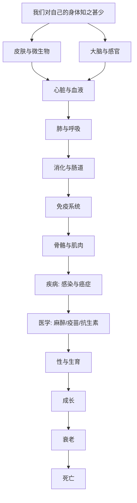

# 《人体简史》深度解读系列

## 系列简介

《人体简史》是《万物简史》作者比尔·布莱森的又一本科普杰作。它带着一个朴素的疑问出发：**我们住在自己的身体里一辈子，却对它了解得如此之少。**

你知道脾脏是干什么的吗？你知道身体里有多少微生物吗？你知道大脑为什么只占体重 2%，却消耗 20% 的能量？你知道人类是怎么一步步学会麻醉、疫苗和抗生素的吗？

布莱森走访了几十位顶尖医生与科学家，用他标志性的幽默与好奇心，把人体从皮肤、大脑、心脏，一路讲到免疫、消化、性、衰老与死亡。这本书看起来在讲器官，其实在讲两件事：**生命有多精妙，以及它有多脆弱。** 它也顺带回答了那个最现实的问题：现代医学到底为我们做了什么，又做不到什么。

本系列围绕 **16 个核心问题**，从"我们为什么对自己无知"开始，一路走到"人为什么会死"。

---

## 全书核心问题

| 层次 | 问题 |
|---|---|
| 概览问题 | 我们为什么对自己的身体如此无知？ |
| 结构问题 | 皮肤、大脑、心脏、肺、肠道分别如何工作？ |
| 防御问题 | 免疫、骨骼、疾病与医学是如何运作的？ |
| 生命问题 | 性、生育、成长与衰老是怎么回事？ |
| 终极问题 | 人为什么会死？医学能做什么、不能做什么？ |

---

## 全书知识地图



---

## 全系列目录

### 第一部分：我们的身体

#### 01｜为什么我们对自己的身体如此无知？

核心问题：我们每天使用身体，为什么对它几乎一无所知？

核心观点：多数人能说出心脏、肝脏，却说不清脾脏、胰腺、淋巴结在做什么；我们对自己的器官、细胞和微生物了解得惊人地少。布莱森指出：身体是"最熟悉的陌生人"——而这本"简史"，正是为了补上这堂课。

理解难度：★★☆☆☆

关键词：人体、无知、科普、器官

---

#### 02｜皮肤：身体最大的器官在做什么？

核心问题：皮肤只是"一层皮"吗？它到底有多重要？

核心观点：皮肤是人体最大的器官，负责屏障、调温、感知与免疫，还不断自我更新。它同时住着大量微生物，是我们与外界的第一道边界。别小看它——失去大面积皮肤，人会迅速面临致命风险。

理解难度：★★★☆☆

关键词：皮肤、屏障、调温、更新

---

#### 03｜身体里还有“另一半”：微生物

核心问题：我们身上和体内，到底住着多少别的生命？

核心观点：人体内外的微生物数量与人体细胞相当（甚至更多）。它们参与消化、免疫训练、甚至影响体重与情绪。人并非一个独立个体，而更像一个"行走的生态系统"。

理解难度：★★★☆☆

关键词：微生物组、肠道、共生、生态系统

---

#### 04｜大脑：为什么它是最神秘又最耗能的器官？

核心问题：大脑只占体重 2%，为什么却消耗 20% 的能量？

核心观点：大脑是人体最耗能、最复杂、也最不为人知的器官。我们用"意识""记忆""情绪"这些词描述它，却说不清它们如何在神经元之间产生。它是整本书最大的谜，也是最精彩的一章。

理解难度：★★★★☆

关键词：大脑、神经元、耗能、意识

---

### 第二部分：感官与器官

#### 05｜我们如何看见、听见、闻到、尝到？

核心问题：感官是怎么把外界变成"体验"的？

核心观点：视觉、听觉、嗅觉、味觉、触觉各有精巧的机制，也各有限制与错觉。布莱森提醒我们：感官不是世界的"摄像机"，而是大脑对信号的重建——所以它既强大，也容易被骗。

理解难度：★★★☆☆

关键词：视觉、听觉、嗅觉、错觉

---

#### 06｜心脏与血液：身体里的运输系统

核心问题：一颗拳头大的心脏，如何支撑起全身几十万亿个细胞？

核心观点：心脏每天不停跳动，通过血管把氧与营养送到全身，再把废物带走。血液里还有完整的免疫与修复力量。这套系统一旦出错，后果往往迅速而严重。

理解难度：★★★☆☆

关键词：心脏、血液、血管、循环

---

#### 07｜肺与呼吸：我们是怎么“换气”的？

核心问题：呼吸看起来最简单，为什么其实极其精妙？

核心观点：肺由数亿个肺泡组成，用巨大的表面积完成氧气与二氧化碳的交换。呼吸看似自动，实则由精密的神经与化学信号调控——它也是我们少数能"主动干预"的自动功能之一。

理解难度：★★★☆☆

关键词：肺、肺泡、气体交换、呼吸

---

#### 08｜消化与肠道：吃进去之后发生了什么？

核心问题：一顿饭之后，身体里究竟发生了什么？

核心观点：从口腔到肠道，身体用机械与化学的方式把食物拆解、吸收，并与肠道微生物共同工作。肠道被称为"第二大脑"，与免疫、情绪甚至决策都有联系。吃得如何，远比我们想象的更影响全身。

理解难度：★★★☆☆

关键词：消化、肠道、微生物、第二大脑

---

### 第三部分：防御与修复

#### 09｜免疫系统：身体里的军队

核心问题：面对无穷无尽的细菌和病毒，我们是怎么活下来的？

核心观点：免疫系统是一支分工严密的军队：识别、攻击、记忆、撤退。发烧、炎症都是它的战斗痕迹。它既保护我们，有时也会误伤自己（过敏、自身免疫病）。理解它，就理解了为什么疫苗有效、为什么"增强免疫"是个伪命题。

理解难度：★★★★☆

关键词：免疫、抗体、炎症、疫苗

---

#### 10｜骨骼与肌肉：我们怎么动起来？

核心问题：支撑与行动，身体是怎么做到的？

核心观点：骨骼提供支撑与保护，肌肉负责收缩与移动，二者共同构成"运动系统"。骨骼还是活跃的组织，参与造血与代谢。它会随使用与年龄变化——用进废退，在骨骼上尤其明显。

理解难度：★★★☆☆

关键词：骨骼、肌肉、运动、用进废退

---

#### 11｜为什么我们会生病？

核心问题：疾病到底是怎么来的？

核心观点：疾病来源多样：病原体（病毒、细菌）、基因、环境、生活方式，以及"细胞叛变"的癌症。布莱森指出：很多现代病不是"外敌入侵"，而是身体在错误条件下的失调。理解病因，才能理解医学的边界。

理解难度：★★★★☆

关键词：疾病、病原体、癌症、生活方式

---

#### 12｜医学到底救了多少人？

核心问题：现代医学真正改变人类命运的，是哪几件事？

核心观点：麻醉、疫苗、抗生素、卫生与外科，是现代医学最伟大的成就，把人类的寿命与痛苦推向了前所未有的境地。但医学也有大量无能为力的地方。这一篇既讲进步，也讲局限——避免把医学神化。

理解难度：★★★★☆

关键词：麻醉、疫苗、抗生素、医学史、局限

---

### 第四部分：爱与生育

#### 13｜性是怎么工作的？

核心问题：人类繁衍的机制，比我们想象的更奇妙吗？

核心观点：性与生殖涉及复杂的生理机制与激素调控，也带来繁殖成本、性别差异与演化博弈。布莱森用一种坦率又不失幽默的方式，讲清"我们从何而来"这个最朴素也最关键的问题。

理解难度：★★★☆☆

关键词：生殖、激素、繁衍、演化

---

#### 14｜我们如何从受精卵长到成年？

核心问题：从一个细胞到几十万亿个细胞，这个旅程是怎么完成的？

核心观点：受精、胚胎发育、器官形成、出生、成长、青春期——每一步都由精密的基因程序与激素调控。这个过程既惊人地稳健，又惊人地脆弱。理解它，也就理解了"生命为何如此不可思议"。

理解难度：★★★★☆

关键词：受精、胚胎、发育、青春期

---

### 第五部分：衰老与死亡

#### 15｜我们为什么会变老？

核心问题：衰老是必然的吗？它到底发生在哪里？

核心观点：衰老涉及细胞层面的磨损：端粒缩短、细胞衰老、DNA 损伤累积等。它不是单一原因，而是多个机制共同作用的结果。理解衰老，不是为了"永生"，而是为了活得更健康、更久一点。

理解难度：★★★★☆

关键词：衰老、端粒、细胞、损伤累积

---

#### 16｜人为什么会死？医学能做什么？

核心问题：面对死亡，医学的边界在哪里？

核心观点：死亡是生物学的必然终点。医学能极大地延后它、缓解它，却无法取消它。布莱森的态度既清醒又温和：理解身体的脆弱，反而能让我们更珍惜它——这也是全书最后想传达的，对生命的敬畏与幽默。

理解难度：★★★★☆

关键词：死亡、寿命、医学边界、敬畏

---

## 推荐阅读顺序

**主线顺序（推荐）：01 → 16。**

```text
第一段｜概览（01–04）   无知 → 皮肤 → 微生物 → 大脑
第二段｜器官（05–08）   感官 → 心脏 → 肺 → 消化
第三段｜防御（09–12）   免疫 → 骨骼 → 疾病 → 医学
第四段｜生命（13–14）   性 → 成长
第五段｜终局（15–16）   衰老 → 死亡
```

**阅读建议：**

- **想先抓住骨架**：读 01、04、09、12、16 五篇。
- **对健康感兴趣**：读 03、08、09、11、15。
- **对医学史感兴趣**：读 12、13、16。
- **想轻松入门**：从 01、02、05 开始，读起来最有趣。

---

## 全系列状态

> 本系列共 16 篇，正文生成中。
