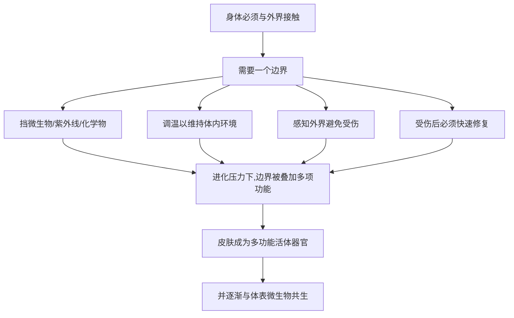

# 02｜皮肤：身体最大的器官在做什么？

> 皮肤真的只是“一层皮”吗？它为什么被称为人体最大的器官？

---

## 一、先说结论

布莱森认为：皮肤是人体最大的器官，也是最被低估的器官。

它不只是包裹身体的“包装纸”，而是一套同时负责屏障、调温、感知、免疫与修复的多功能系统。它每时每刻都在自我更新，还住着数以亿计的微生物。失去大面积皮肤，人会在很短的时间内面临致命风险。

研究表明，成年人的皮肤总面积大约在一点五到两平方米之间，连同皮下组织可以有好几公斤重。它铺开来看，是一张比双人床单还大的“器官”。我们平时却几乎感觉不到它存在——直到它受伤、被晒红、或者开始发痒。

这一篇只回答一个问题：**皮肤到底在做什么，为什么它比我们以为的重要得多？**

---

## 二、我们先理解一个问题

先想一件事。

你昨天洗了一次澡，今天再洗，还能从身上搓下一点“泥”。这些皮屑是从哪里来的？

答案是：你的皮肤一直在“更换自己”。它不是一块静止的皮革，而是一层不断死掉又不断新生的活组织。你看到的、摸到的“表面”，大多是已经死去、准备脱落的细胞。

这就引出一个直觉上的矛盾：我们总觉得皮肤是身体的“外壳”，是死的、被动的。可实际上，它是全身最活跃、更新最快的组织之一。它一边挡住外界的细菌、紫外线与化学物质，一边默默地把旧细胞替换掉。

如果它只是一层“皮”，身体大可不必为它配备这么复杂的生产线。它之所以这么重要，答案藏在它同时在做的很多件事里。

---

## 三、作者到底提出了什么观点？

综合布莱森在书中的论述，他的观点可以归纳为几条：

1. **皮肤是人体最大的器官。** 我们通常只把它当成“外壳”，但它有面积、有重量、有结构，完全够格算一个器官。
2. **它身兼数职。** 屏障、调温、感知、免疫、修复、合成维生素 D，都离不开皮肤。
3. **它是一道“活的边界”。** 皮肤不是把身体和外界完全隔开的一堵墙，而是一个会交流、会反应、会调度的界面——它甚至和住在它上面的微生物共同生活。
4. **它远比我们想象的脆弱，也比我们想象的坚韧。** 每天有无数细胞在它身上死去和诞生；但一旦大面积受损，后果极其严重。

布莱森特别强调的，是那种“习以为常”背后的精密。我们每天照镜子看到的那层皮肤，其实是一场从未停歇的更新工程。

---

## 四、把这个观点翻译成人话

把皮肤想象成一座城市的“外墙”，但这外墙是活的。

它有几层结构：最外面是不断脱落的死细胞，像一层随时更换的防护涂料；中间是制造新细胞的“生产车间”；最底下是提供营养、感受温度与疼痛的“线路层”。这座城市的外墙，每隔几周就会把自己从里到外刷一遍。

它还要当空调——天热时血管扩张、出汗散热；天冷时血管收缩、减少热量流失。它还要当警卫——紫外线照多了，它会制造黑色素来挡；被划破了，它会立刻启动凝血与修复。它还要当传感器——你能感到风吹、针刺、有人拍你肩膀，靠的都是皮肤里的神经末梢。

所以，“皮肤只是包装”这个说法，相当于说“城市只是那圈围墙”。它其实同时是围墙、空调、警报系统和维修队。

---

## 五、为什么会这样？

为什么一个器官要承担这么多职责？这背后是生存压力。

关键在 **A → G** 这一跳。

身体活在一个充满细菌、阳光、温差和物理伤害的世界里。任何“边界”都必须同时应付这些威胁，于是自然选择把多种功能叠加到了同一层组织上。它既是防守，也是感知，还是修复——因为这些事都发生在“身体与外界的接触面”上。

还有一层原因是：皮肤是身体的第一道防线。免疫系统要等到病原体进入体内才能反击，而皮肤可以在此之前就把大部分威胁挡在门外。**把防御前置到边界，是最省力也最有效的策略。**

---

## 六、举一个现实生活中的例子

看一个几乎人人都经历过的场景：**晒伤。**

夏天去海边玩了一天，晚上回到住处，肩膀和后背又红又烫，碰一下都疼。过几天，那层皮肤开始发痒、起皮、一片片往下掉。

这个过程恰好把皮肤的几项本事演了一遍。

晒红与疼痛，说明皮肤在承受紫外线损伤后发出警报——它通过扩张血管、释放信号让你“别再来一次”。脱皮，则是它在**主动淘汰受损细胞、加速自我更新**：既然那批细胞已经被紫外线伤到，干脆退货重做。新长出来的皮肤，往往还会带着更多黑色素，作为对下一次暴晒的提前防备。

这也提醒我们：晒伤不只是“变红几天”的小事。研究表明，反复的严重晒伤会显著提高皮肤癌风险。皮肤能修复，但每次修复都伴随代价，累积起来就成了账。**它是一道能自我修补的防线，却不是一道永不磨损的防线。**

---

## 七、回到书中重新理解

现在再回看布莱森为什么把皮肤放在身体器官的前面来讲，就清楚了。

他要打破的是一种“里重外轻”的直觉——我们总以为重要的器官都在身体深处，皮肤只是无关紧要的表面。可事实恰恰相反：皮肤是身体与整个外部世界之间唯一的界面，几乎所有外来威胁都要先在这里被处理。

它也自然地引出了下一层话题。皮肤不只是人的组织，上面还住着大量微生物——数以亿计的细菌、真菌在那里生活。它们既不是敌人，也不完全是无害的过客。**要理解皮肤，就得理解它其实是一个“共享空间”。**

所以这一篇真正想立住的，不是“皮肤很重要”这句空话，而是：**那些被我们当作背景的东西，往往承担着最关键的功能。**

---

## 八、这个观点背后还有什么？

**第一，皮肤是免疫的前哨。** 它不只是物理屏障，还驻扎着免疫细胞，能主动识别和清除入侵者。

**第二，皮肤是情绪的显示器。** 紧张时起鸡皮疙瘩、害羞时脸红、害怕时脸色发白——身体内部的情绪状态，常通过皮肤泄漏出来。

**第三，皮肤的“更新”是终身工程。** 它每天都在替换自己，这种持续修复的能力，是很多器官所不具备的。

**第四，它同时是“个体”与“生态”的交界。** 皮肤属于你，可它上面的微生物群落却像一个独立的社区。人与微生物的关系，从这里开始变得复杂。

**第五，它把“身体”和“环境”连在了一起。** 阳光、温度、湿度、接触物，都通过皮肤影响整个身体的状态，包括维生素 D 的合成、睡眠节律乃至情绪。皮肤不是隔绝世界的墙，而是与世界交换信息的膜。

---

## 九、这个观点有问题吗？

有，需要把“皮肤很重要”这个正确的大方向，和围绕它的一些流行说法区分开。

**第一，“皮肤是最大器官”是通俗表述，各有定义。** 若按重量或面积，不同的统计口径会得出不同答案；把它称为“最大的器官”更多是一种便于理解的概括，而非严格的医学排名。

**第二，皮肤微生物组的研究仍在早期。** 说皮肤上住着大量微生物是本事实，但这些微生物具体如何影响健康，很多结论还不确定。关于这一问题，学界存在不同解释，把它讲成“护肤就是养菌”之类的口号，容易被过度简化。

**第三，防晒与健康之间存在权衡。** 过度暴晒有害，这一点证据充分；但完全不接触阳光也可能影响维生素 D 的合成。一些研究者认为，关键在于“适度与防护”，而不是把阳光一刀切地妖魔化。

**第四，“修复屏障”也成了营销热词。** 正因为它确实重要，护肤品与保健品会借“屏障受损”“需要修复”来推销产品，把复杂生理简化成一句广告语。

**所以更准确的说法是**：皮肤确实是被严重低估的大器官，值得我们认真对待；但具体到护肤与健康决策，还是要看证据，而不是听信“皮肤在求救”式的营销叙事。

---

## 十、今天再看这个观点

以下部分是基于布莱森思想的现代延伸，不是布莱森的原话。

在今天，“皮肤很重要”这件事被赋予了新的现实含义。一方面，空气污染、紫外线、化学品暴露让皮肤长期处在压力之下；另一方面，人们又开始重新认识皮肤上的微生物，讨论“过度清洁”是否会破坏它原本的平衡。

同时，护肤产业空前庞大。它一边利用我们对皮肤的无知，一边又确实推动了部分科学研究。这两件事混在一起，让普通人很难分辨：哪些是真正的生理常识，哪些只是包装精美的焦虑。

如果把布莱森的观点放到今天，它更像一句提醒：**皮肤不是需要被“管理”的表面，而是需要被理解的器官。** 理解它的更新、它的防线、它和微生物的关系，比追逐任何一款“神奇产品”都更接近问题的根本。

---

## 十一、这一篇真正应该记住什么？

1. **皮肤是人体最大的器官。** 它有面积、有重量、有结构，绝不只是“一层皮”。
2. **它身兼屏障、调温、感知、免疫与修复等多重职责。** 它是身体与外界之间唯一的活体界面。
3. **它一直在自我更新。** 晒伤后的脱皮，正是它主动淘汰受损细胞、加速重建的表现。
4. **它能修复，却有代价。** 反复损伤会累积风险，防线不是永动机。
5. **它同时是“个体”与“生态”的交界。** 皮肤上住着大量微生物，人与它们的关系比想象中复杂。

---

## 十二、留一个问题

> 你每天都在使用皮肤，却可能从没想过它在为你做什么。
> 那么你上一次认真为它做点什么，
> 是因为了解了它的功能，还是因为一次晒伤、一句广告、或者一张镜子里的照片？

---

**下一篇**：皮肤并不是独自生活的。它上面、以及我们身体内部，还住着数量惊人的其他生命。它们和我们一同构成了一个几乎无法分割的整体。如果把这些微生物全部加起来，它们几乎与我们自己的细胞一样多——那我们到底还算不算一个“独立的人”？

下一篇我们就来拆开这个问题——**身体里还有“另一半”：微生物。**
