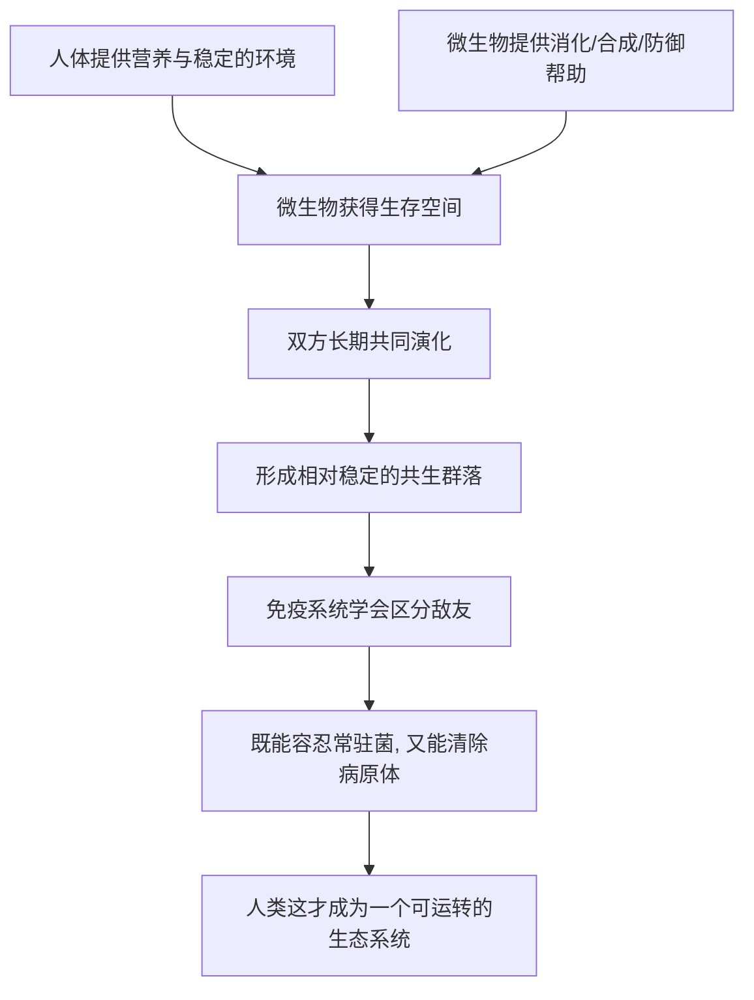

# 03｜身体里还有“另一半”：微生物

> 我们身上和体内，到底住着多少别的生命？它们算我们的敌人，还是我们自己的一部分？

---

## 一、先说结论

布莱森认为：人并不是一个“独立个体”，而更像一个行走的生态系统。

我们的皮肤上、口腔里、肠道中，住着数量惊人的细菌、真菌、病毒与其他微生物。研究表明，这些微生物的细胞数量与人体自身细胞数量大致相当，甚至可能更多；它们携带的基因数目，则远超人类自身的基因。它们参与消化、合成营养、训练免疫系统，还可能影响体重与情绪。

换句话说，我们一直以为“我”就是一个人的边界，其实边界要比这模糊得多。**我们的一生，是和一大群别的生命共享同一具身体。**

这一篇只回答一个问题：**这些“另一半”到底是什么，它们和我们是什么关系？**

---

## 二、我们先理解一个问题

先做一个小测试。

你身上最“脏”的地方是哪里？很多人会说是手、脚、腋下。但从微生物的数量和种类来看，真正的“热带雨林”是肠道——那里住着密度极高的微生物群落，总数以万亿计。

我们习惯把“细菌”当成需要被消灭的东西，于是有了消毒液、抗生素、抗菌洗手液。可事实是：一个成年人的身体里，微生物的总量相当可观，而且大部分并不致病，反而长期与我们共存。

这里就出现了一个反直觉的问题：**如果这些微生物对我们有害，身体为什么要容忍它们？如果它们无害，为什么我们又要用免疫系统去“管理”它们？** 答案指向一个关键词：共生。

---

## 三、作者到底提出了什么观点？

综合布莱森在书中的论述，他的观点大致可以归纳为几条：

1. **微生物的数量与人体细胞相当。** 我们不是“一个人”，而是一个由人体细胞与微生物共同组成的复合体。
2. **它们不是寄生者，多数是共生者。** 微生物帮我们分解食物、合成某些维生素、占据生态位以阻挡致病菌。
3. **它们参与免疫训练。** 免疫系统需要在与微生物的长期互动中学会“分清敌我”，而不是一味攻击。
4. **它们可能影响体重与情绪。** 这部分的证据正在积累，但机制还远未讲清。
5. **我们与微生物的关系，比“干净就好”复杂得多。** 过度清洁、滥用抗生素，可能会打乱这套长期建立起来的平衡。

布莱森的态度不是“微生物越多越好”，而是提醒我们：**身体从来不是一个人的领地，它是一个多方共存的系统。**

---

## 四、把这个观点翻译成人话

把身体想象成一座大城市。

城市里住着的“原住民”，是你的细胞；而那些不请自来的微生物，则像长期租客、街边商户和大量流动人口。城市不能没有他们——有人负责处理垃圾（分解食物残渣），有人负责供货（合成营养），有人守着城门（阻挡致病菌）。如果他们忽然集体消失，城市反而会运转失灵。

但城市也不能完全放任他们。所以警察（免疫系统）要持续巡逻，既不能见人就抓，也不能完全不管。好的城市管理，是“能和大多数人和平共处，同时随时准备处理少数捣乱分子”。

我们过去对身体的想象，是“一座只属于自己的堡垒”；布莱森想让你换一个画面：**它更像一座繁忙的口岸城市，人流、物流、信息流从不间断。**

---

## 五、为什么会这样？

为什么进化会把我们和微生物绑在一起？因为彼此都需要对方。

关键在 **C → H** 这一跳。

从进化的角度看，微生物进入人体、定居下来，是一笔对双方都有利的“交易”：它们得到稳定温暖、营养充足的环境；我们得到消化、防御与代谢上的帮助。长期反复的互动，让两边的命运逐渐纠缠在一起。

这也解释了一个现象：**免疫系统并非天生就“认识”什么是敌人。** 它需要在与微生物的相处中逐渐学会区分——哪些该容忍，哪些该攻击。如果一个孩子成长的环境过于“无菌”，这套学习过程就可能出问题。一些研究者认为，这可能与过敏与自身免疫疾病的上升有关。关于这一问题，学界存在不同解释，但“适度接触微生物对免疫有益”这一方向，已获得越来越多关注。

---

## 六、举一个现实生活中的例子

看一个被讨论得很多的例子：**肠道菌群与体重、情绪的关系。**

先看体重。研究表明，不同人的肠道菌群构成差异很大，而某些菌群特征在肥胖人群中出现的比例更高。把这些菌群移植到实验动物身上后，动物的体重与代谢也出现了变化。这说明：菌群与体重之间确实存在某种联系。

再看情绪。肠道与大脑之间有一条被称为“肠脑轴”的交流通道，涉及神经、激素与免疫信号。有些研究发现，菌群的变化可能影响压力反应与情绪状态；甚至有初步研究尝试用调节菌群来辅助改善某些情绪问题。

但要特别小心：**“有关系”不等于“是原因”。** 究竟是菌群紊乱导致了肥胖与情绪问题，还是肥胖与情绪问题改变了菌群？目前的证据还不足以给出定论。一些研究者认为，肠道菌群更像是一个“参与者”，而不是唯一的“主谋”。

所以这个例子真正说明的，是一件事：**身体里的这群“另一半”，确实在参与我们生活的方方面面——包括那些我们以为完全属于“自己”的事，比如胖瘦与心情。**

---

## 七、回到书中重新理解

现在再回看布莱森为什么要在讲完皮肤之后，紧接着讲微生物，就顺了。

皮肤篇说的是“身体与外界之间有一道活的边界”；微生物篇说的则是“这条边界从来不是封闭的”。我们以为是“外面”的微生物，其实大量住在“里面”；我们以为是“自己”的身体，其实运行中处处有它们的参与。

这也让“个体”这个概念变得松动。**我们常说“我的身体我做主”，可身体里绝大多数细胞的活动，我们既不知道，也管不了。** 布莱森正是想用这种“身份上的意外”，让我们重新理解自己是谁。

所以这一篇真正重要的，不是“微生物很多”这个数字，而是它背后的观念转变：**人不是一座孤岛，而是一个生态系统。**

---

## 八、这个观点背后还有什么？

**第一，肠道常被称为“第二大脑”。** 它有大量神经细胞，与大脑持续通信。这为“情绪与肠道有关”提供了结构上的基础。

**第二，微生物组会影响药物效果。** 同样一种药，不同人的反应可能不同，部分原因就在于肠道菌群的差异。

**第三，它改写了“我们是谁”这个问题。** 如果一个人的功能运行里，有很大一部分由非人类的细胞完成，“人”的定义就不再只是那几十万亿个自己的细胞。

**第四，它让“干净”这个词变得复杂。** 卫生当然重要，但“无菌”不等于健康。人类与微生物的关系，更像长期磨合的邻里关系，而不是你死我活的战争。

**第五，它为“个体化医疗”提供了方向。** 既然每个人的菌群都不一样，未来的营养与治疗，可能也要“因人而异”。

---

## 九、这个观点有问题吗？

有，而且这个领域恰恰是最容易被过度解读的地方。

**第一，因果性尚未确立。** 菌群与肥胖、情绪、疾病之间的关联被反复报道，但相关不等于因果。关于这一问题，学界存在不同解释，很多结论还停留在“可能”“相关”的层面。

**第二，益生菌产品的证据并不整齐。** 市面上大量宣称“调节菌群”的产品，其实际效果研究结论不一。一些研究者认为，不同菌株、不同剂量、不同人群的效果差异很大，不能一概而论。

**第三，“肠道决定情绪”被夸大了。** 肠脑轴确实存在，但情绪主要由大脑与整体身心状态决定，把一切归因于“肠道菌群”，是把复杂问题简化成了营销卖点。

**第四，个体差异巨大。** 每个人的菌群构成高度个性化，这也意味着“适用于所有人”的结论极难得出。

**所以更准确的说法是**：微生物组研究是目前最热、也最有前景的方向之一，它确实在改变我们对身体的理解；但正因为年轻，它更需要耐心与证据，而不是急着把它变成“万能解释”。

---

## 十、今天再看这个观点

以下部分是基于布莱森思想的现代延伸，不是布莱森的原话。

在布莱森写作之后，微生物组研究进入爆发期。测序技术变便宜了，科学家能大规模地“普查”人体各部位的菌群；粪菌移植、益生菌、益生元、后生元等概念，也从实验室走进了大众视野和货架。

与此同时，一个隐忧也在累积：抗生素的广泛使用、过度消毒的生活方式，是否正在削弱我们与微生物之间延续了数百万年的默契？一些研究者认为，这可能是现代过敏、代谢与免疫问题增多的因素之一——但同样，这仍是有争议的推测，而非定论。

如果把布莱森的观点放到今天，它更像一句提醒：**与其把身体当成需要不断“杀菌”的战场，不如把它当成需要精心维护的生态。** 对待那“另一半”的最佳态度，或许不是消灭，而是理解与共存。

---

## 十一、这一篇真正应该记住什么？

1. **我们不是独立个体，而是一个生态系统。** 人体内外的微生物数量，与人体细胞大致相当。
2. **多数微生物是共生者，不是敌人。** 它们参与消化、合成营养、训练免疫。
3. **它们可能影响体重与情绪，但因果未定。** 相关不等于因果，需要保持谨慎。
4. **过度清洁与滥用抗生素可能打乱平衡。** 与微生物的关系，是长期磨合的结果。
5. **微生物组研究前景巨大，但结论尚在形成中。** 它需要证据，而不是口号。

---

## 十二、留一个问题

> 你一直以为“我”就是这一具身体，
> 可它里面住着的其他生命，数量几乎和你的细胞一样多。
> 那么当你感到饿、感到困、甚至感到心情低落的时候，
> 有多少是“你”的意思，又有多少是它们的意思？

---

**下一篇**：说完了边界与共生，我们该走进身体里那个最贵的房间了。它只占体重的百分之二，却要吃掉全身五分之一的能量；我们用它思考、记忆、爱与做梦，却至今说不清它究竟如何产生“意识”。它是整本书最大的谜，也是最精彩的一章。

下一篇我们就来拆开这个问题——**大脑为什么是最神秘又最耗能的器官。**
