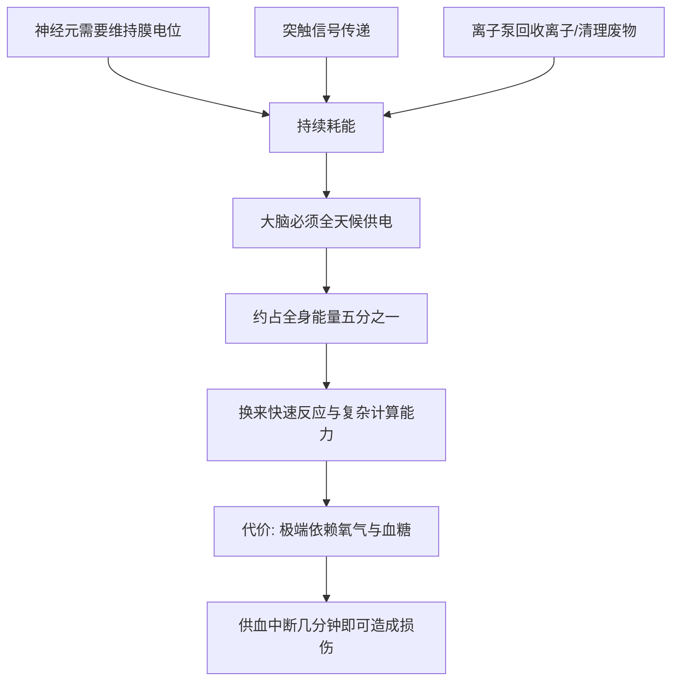

# 04｜大脑：为什么它是最神秘又最耗能的器官？

> 大脑只占体重的百分之二，为什么却要消耗全身约五分之一的能量？

---

## 一、先说结论

布莱森认为：大脑是人体最精妙、最耗能、也最不为人知的器官。

它只占体重的很小一部分，却消耗了全身相当大比例的能量。它由数百亿个神经元组成，神经元之间又通过数以万亿计的连接彼此通信。我们用它思考、记忆、感受情绪、做出决定，却至今说不清“意识”究竟是如何从这些细胞活动里冒出来的。

布莱森的态度很诚实：这一章写得越深，谜团反而越多。别的器官你能大致讲清“它在做什么”，而大脑——你能描述它的结构，却很难解释它为什么会产生“你”。

这一篇只回答一个问题：**大脑为什么既如此耗能，又如此神秘？**

---

## 二、我们先理解一个问题

先看一个数字上的反差。

大脑的重量大约只占体重的百分之二，可它消耗的能量，却占全身的百分之二十左右。也就是说，一个安静坐着、什么也不做的人，他身体里每五份能量，就有一份被这个小小的器官拿走。

更奇怪的是：无论你在解一道数学题，还是躺着发呆，大脑的能耗并没有低多少。它不是一台“用才耗电、不用就省电”的机器，而是几乎一直在满负荷运转。

这就带来两个直观的疑问：

- 一，它为什么这么“贵”？
- 二，它到底把能量花在了哪里，以至于连“休息”都这么费电？

顺带还有第三个、也是更难的问题：**花费这么多能量维持的，究竟是一种什么样的东西？**

---

## 三、作者到底提出了什么观点？

综合布莱森在书中的论述，他的观点可以归纳为几条：

1. **大脑是身体里最耗能的器官之一。** 它以极小的体积，占用了极大的能量份额。
2. **它的复杂程度难以想象。** 数百亿个神经元、数以万亿计的连接，本身就是一个天文数字级的网络。
3. **它的能耗主要用于“维持”而非“思考”。** 大部分能量花在保持神经元的待命状态与信号传递上，而不是某一次具体的思维。
4. **意识与记忆是最大的谜。** 我们能观察到脑区活动，却难以解释主观体验如何从中产生。
5. **大脑也是可塑的。** 它会随经历改变连接，这既是学习的基础，也意味着它终身都在被“重写”。

布莱森强调的，是那种“越研究越困惑”的诚实。他不假装人类已经搞懂了大脑，反而把这份未知当作全书最迷人的部分。

---

## 四、把这个观点翻译成人话

把大脑想象成一座永不熄灯的城市。

城里有数百亿个居民（神经元），彼此用无数条线路（突触）连接。哪怕整座城市看起来安安静静，底下的电网仍在持续供电：路灯要亮着，信号要传着，随时准备处理一条突然到来的信息。城市不能“今晚断电省点钱”，因为一旦断电，整座城市的秩序就会崩溃。

所以，大脑的大部分开销，其实花在“保持在线”上。神经元需要在细胞膜两侧维持电位差，随时准备放电；信号在突触间传递要消耗能量；清理代谢废物、维持细胞环境也要消耗能量。这些事不管你“在想不想事情”，都一刻不能停。

这就解释了为什么发呆也费电：**城市不是在“干活”时才耗能，而是“活着”本身就耗能。**

至于意识——那更像城里突然涌现出的一种“整体气氛”：每个居民都只按规则行事，可整座城市却似乎有了自己的情绪与想法。这种“从无数个体里冒出整体”的过程，正是科学家至今无法完全解释的地方。

---

## 五、为什么会这样？

为什么大脑要这么“烧钱”？因为它的工作方式决定了它离不开持续的能量供给。

关键在 **F → I** 这一跳。

正是“高能耗、高复杂度”这套组合，让大脑获得了其他器官难以比拟的能力：快速处理信息、学习、规划、社交、创造。但代价也很直接——它极度依赖稳定的氧气与葡萄糖供应。血流中断几分钟，脑细胞就会开始受损。**大脑的强大与脆弱，是同一枚硬币的两面。**

从进化角度看，一些研究者认为，大脑的扩张与人类的社会生活、工具使用、语言能力密切相关。但为什么偏偏是人类走到了这一步，学界仍有争论。关于这一问题，存在不同解释，从“社会脑假说”到“生态脑假说”都有支持者。

---

## 六、举一个现实生活中的例子

就用那个最惊人的数字本身：**大脑只占体重约百分之二，却消耗约百分之二十的能量。**

这个比例意味着什么？设想你把一个成年人的总能耗想象成一笔家庭预算。收入是有限的，每个器官都要分钱：心脏、肝脏、肾脏、肌肉……而那个只占很小体积的大脑，却拿走了整整五分之一的预算。一个体重七十公斤的人，大脑大概只有一点四公斤左右，却能“吃掉”这么多。

这也让一些现象变得可以理解。比如，低血糖时人会头晕、注意力涣散、甚至暴躁——因为大脑最依赖血糖，一旦供应不足，它第一个抗议。再比如，大脑对缺氧极其敏感，溺水或窒息时，意识往往在很短时间内就会丧失。

所以这个例子的意义在于：**“耗能”不是抽象的数字，而是大脑工作方式的直接结果。** 它必须随时在线、随时待命，这份“随时”就是它高昂账单的来源。

---

## 七、回到书中重新理解

现在再回看布莱森为什么把大脑写成全书最难、也最精彩的一章，就理解了。

前面讲皮肤、讲微生物，我们还能用“屏障”“共生”这类相对清晰的比喻讲明白。可到了大脑，比喻开始失效——因为大脑本身就是那个“制造比喻”的器官。我们用一个会思考的东西，去研究它自己怎么思考，这本身就带着循环的尴尬。

布莱森并没有回避这种尴尬，反而把它变成了亮点：**对大脑的无知，恰恰是大脑最诚实的部分。** 我们能测量它的能耗、绘制它的活动图谱、知道哪个区域大概负责什么，但在“意识如何产生”这个核心问题上，我们仍然像站在门口的旁观者。

所以这一篇真正想说的，不是“大脑很复杂”这句套话，而是：**我们身上最重要的器官，同时也是我们最不了解的器官。**

---

## 八、这个观点背后还有什么？

**第一，大脑是“可塑”的。** 它会随学习与经历改变连接，这既是记忆的基础，也解释为什么习惯可以养成与打破。

**第二，它高度依赖稳定环境。** 睡眠、营养、供血、血糖，任何一环出问题，都会直接影响思维与情绪。

**第三，它并非只为“思考”而存在。** 情绪、社交、身体调节、无意识处理，同样占用大量资源。所谓“理性大脑”只是它功能的一小部分。

**第四，它极其节能又极其费能。** 单个神经元的活动耗能很小，但数量与持续运转叠加起来，就成了巨大的总开销。

**第五，它把“物质”与“体验”联系了起来。** 神经元活动是物质的，而疼痛、喜悦、颜色、声音却是主观体验。这两者之间的关系，被称为“意识难题”，至今没有公认答案。

---

## 九、这个观点有问题吗？

有，且这个领域的争议格外多。

**第一，具体数字因方法与个体而异。** “百分之二”与“百分之二十”是常被引用的近似值，不同研究、不同人群、不同状态下会有所出入。把它当成精确常数并不合适，它更适合用来表达量级上的反差。

**第二，脑区“分工图”容易过度简化。** 说“这块管记忆、那块管情绪”便于理解，但真实的大脑是高度网络化的，功能分布远比分区图复杂。

**第三，脑成像结果常被误读。** 某些脑区“亮起来”，不代表它就是某种体验的唯一来源。一些研究者提醒，图像带来的“直观感”可能让人高估结论的可靠性。

**第四，关于意识的说法尤其容易越界。** 关于这一问题，学界存在不同解释，从“意识是大脑的涌现属性”到各种哲学立场，分歧很大。任何把意识讲得过于确定或过于玄妙的说法，都需要打一个问号。

**所以更准确的说法是**：大脑的高耗能与高复杂度是可靠的事实，“我们尚不理解意识”也是诚实的判断；但围绕大脑的很多“通俗解释”，其实比它们看起来要不牢靠得多。

---

## 十、今天再看这个观点

以下部分是基于布莱森思想的现代延伸，不是布莱森的原话。

在布莱森之后，大脑研究又前进了很多：更高分辨率的成像、脑机接口、人工智能对神经网络的模拟……我们比过去任何时候都更能“看到”大脑在工作。

但一个耐人寻味的现象是：**我们看得越多，问题反而越多。** 我们能训练模型模拟一部分大脑功能，却发现“像”不等于“是”；我们能记录神经活动，却仍难以解释主观体验。关于意识的问题，并未因技术进步而变简单。

与此同时，大脑也成了当代焦虑的焦点：注意力被碎片化、睡眠被压缩、信息过载被视为常态。如果说大脑是一台高能耗的精密设备，那么现代生活方式，可能正在持续地让它超负荷运行。

如果把布莱森的观点放到今天，它更像一句提醒：**在有能力测量大脑之前，先学会善待它。** 理解它的昂贵与脆弱，或许比追求任何“用脑技巧”都更根本。

---

## 十一、这一篇真正应该记住什么？

1. **大脑是极耗能的器官。** 它只占体重很小一部分，却消耗全身约五分之一的能量。
2. **它的能耗主要用于“维持在线”，而非某一次思考。** 所以发呆也费电。
3. **它极其复杂，且高度可塑。** 数百亿神经元、数以万亿计的连接，会随经历改变。
4. **高能耗带来强大能力，也带来极端脆弱。** 它对氧气与血糖的依赖远超一般器官。
5. **意识是至今最大的谜。** 我们能描述大脑，却难以解释主观体验从何而来。

---

## 十二、留一个问题

> 你所有的想法、记忆、情绪与爱，都发生在这个约占体重百分之二的小器官里。
> 可你既看不见它，也感觉不到它在耗电。
> 那么当你“决定”要做一件事的时候，
> 究竟是“你”在决定，还是那团一直亮着的神经元，替你决定了？

---

**下一篇**：大脑提供了“处理中心”，可它并不直接接触世界。真正把外界的阳光、声音、气味、滋味送进来的，是感官。那么，我们究竟是如何看见、听见、闻到、尝到的？如果眼睛不是一台照相机，我们看到的到底是什么？

下一篇我们就来拆开这个问题——**我们如何看见听见闻到尝到。**
