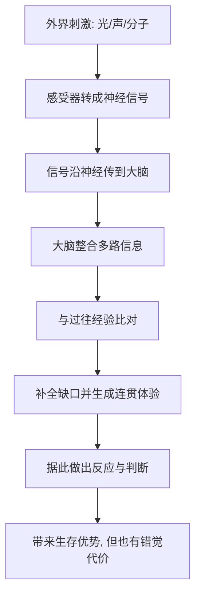

# 05｜我们如何看见、听见、闻到、尝到？

> 感官是怎么把外界的信号，变成我们头脑里的“体验”的？

---

## 一、先说结论

布莱森认为：感官不是世界的“摄像机”，而是大脑对信号的重建。

我们习惯以为，眼睛像相机一样把画面拍下来，耳朵像录音机一样把声音录下来。但事实恰恰相反：感官只负责接收零散的物理与化学信号——光、振动、分子——然后由大脑把它们“拼”成一个完整的体验。

这个“拼”的过程，既让我们能高效地理解世界，也让我们极易被欺骗。视觉错觉、听觉补全、味觉受气味影响，都是这套重建机制的自然产物。

所以感官既强大又不可靠：**它给我们一个足够好用的世界模型，但那从来不是世界本身。**

这一篇只回答一个问题：**感官到底是如何把外界变成“体验”的？**

---

## 二、我们先理解一个问题

先想一件很日常的事。

你闭上一只眼，用另一只眼看前方。你看到的是一个完整、连续、有色彩、有纵深的画面。可你的视网膜上，其实只是一片光敏细胞被光刺激后产生的电信号；而且视网膜上还有一个“盲点”，那里没有感光细胞。

按理说，你应该看到画面里有个洞。可你从来没有。为什么？

因为大脑把那个洞“填”上了——它根据周围的信息，自动补全了你以为看到的一切。类似地，你眼球其实一直在轻微抖动，画面本该晃动，可你感觉世界是稳定的，因为大脑又做了补偿。

**你看到的“画面”，从来不是眼睛直接给你的，而是大脑根据不完整的信息，实时给你重建出来的。** 这就是理解全部感官的钥匙。

---

## 三、作者到底提出了什么观点？

综合布莱森在书中的论述，他的观点可以归纳为几条：

1. **感官是“信号接收器”，不是“记录仪”。** 它们把外界的物理化学刺激转换成神经信号，仅此而已。
2. **体验发生在大脑里，而不是器官里。** 光进入的是眼睛，但“看见”这件事发生在大脑。
3. **感官各有精巧却有限的机制。** 每一类感受器都只对特定范围的刺激敏感，超出范围就“看不见、听不到”。
4. **感官容易被骗。** 错觉不是故障，而是重建机制在特定条件下的“副产品”。
5. **感官常常协同工作，并互相影响。** 你“尝”到的味道，很大一部分其实来自嗅觉；你“看”到的唇形，会影响你“听”到的声音。

布莱森想传达的是：**感官是一套精妙的近似系统，而不是一面忠实的镜子。**

---

## 四、把这个观点翻译成人话

把感官想象成一支“前方记者”团队，而大脑是总部的编辑室。

眼睛、耳朵、鼻子、舌头、皮肤这些“记者”，只负责采集最原始的素材：光强、频率、分子浓度、压力。它们没有能力“理解”素材，也从不交给你一份完整的报道。真正把这些零散信号整合成“一条新闻”的，是大脑这个编辑室。

而这间编辑室有个特点：**它极度讨厌信息缺口，宁可自己“脑补”，也要给你一个连贯的故事。** 视网膜的盲点被填上，模糊的轮廓被补成一张熟悉的脸，残缺的句子被听成合理的话——都是这位编辑在赶稿。

所以，你的体验其实是“编辑后的版本”。它足够可靠，能让你走路不撞墙、听人说话不费劲；但它不是原件，而是大脑根据素材重新写出的报道。

---

## 五、为什么会这样？

为什么大脑不老老实实呈现原始信号，非要“重建”？因为原始信号本身没有意义。

关键在 **F → H** 这一跳。

大脑的目标不是“还原真实”，而是“快速生成一个够用的世界模型”，好让你及时做出反应。看到草丛晃动，与其花时间判断是不是风吹的，不如先假设“可能有危险”并后退——这种“宁可多猜、不可迟疑”的策略，在生存上非常划算。

但代价就是：**当你面对的信息恰好“像”某种熟悉的模式时，大脑会毫不犹豫地给你一个错误答案。** 错觉正是这套“快速补全”策略在极端条件下的破绽。它不是感官坏了，而是大脑太擅长猜了。

---

## 六、举一个现实生活中的例子

最能说明这一切的，是**视觉错觉**：眼睛不是摄像机，而是大脑的重建。

看经典的错觉图：两条长度完全相同的线段，因为两端加了朝向不同的箭头，你会觉得其中一条明显更长。用尺子一量，两段一模一样。你的视网膜接收到的光信息，和你用尺子量出的结果是一致的；可你的“感觉”却坚定地说它们不一样。

再比如那些“旋转的舞者”“会动的静态图”：画面明明是静止的，你却能看出它在动。图像本身没有动，是大脑在解读边缘、阴影与对比时，自动“插入”了运动。

这些例子之所以有力，是因为它们直接证明了前面那个结论：**你看到的不是眼睛给的东西，而是大脑给的解释。** 眼睛只是把光转成信号，真正决定“你看到什么”的，是大脑如何解读这些信号。

这也解释了为什么错觉“知道是假的也没用”——即使你拿着尺子确认了两段一样长，视觉上它们依然不同。**因为产生错觉的，正是那个负责“看见”的机制本身，你没办法用同一个机制去否定它。**

---

## 七、回到书中重新理解

现在再回看布莱森把感官写成“大脑的重建”，就明白他的用意了。

他没有把感官当作“身体的输入设备”来罗列，而是当作一扇理解大脑的窗口：既然连最“客观”的视觉都充满解释与补全，那么人类的整个认知，恐怕也建立在类似的推断之上。**我们看到、听到、闻到的世界，始终是经过加工的世界。**

这也把前一篇和这一篇连了起来。前一篇说大脑是最神秘也最耗能的器官，这一篇则给了它一个具体的职责：它花那么多能量，很大程度上就是在做这种“把碎片拼成世界”的实时工作。

所以这一篇真正重要的，不是“眼睛有盲点”这类冷知识，而是一个更深的提醒：**你以为自己在观察世界，其实你一直在和大脑合作，共同构建世界。**

---

## 八、这个观点背后还有什么？

**第一，感官有明确的“量程”。** 人耳听不到超声波，人眼看不到红外线。我们感知的世界，只是全部刺激中很窄的一段。别的动物，活在完全不同的“感官世界”里。

**第二，感官之间会相互影响。** 鼻子堵住时，食物会变得“没味道”，说明味觉严重依赖嗅觉；看到说话人的口型，会改变你实际听到的内容。

**第三，感官会“疲劳”和“适应”。** 久居花香之中会闻不到香味，久穿衣服会感觉不到布料——感受器会对持续不变的刺激降低反应。

**第四，感官不是五种，而是更多。** 除了视、听、嗅、味、触，还有平衡感、体感、痛觉、温度感等。“五感”只是一个便于记忆的简化说法。

**第五，注意力和期待会塑造体验。** 同一段模糊的声音，你若期待它是什么词，就更容易听成那个词。感官输出，会随大脑的状态而变。

---

## 九、这个观点有问题吗？

有，需要把“感官是重建”这个可靠的大框架，和一些流行的过度引申分开。

**第一，错觉的普遍性不能推得过头。** 视觉错觉确实证明了大脑会“补全”，但由此得出“我们看到的一切都不可信”就走远了。绝大多数情况下，感官给出的世界模型足够可靠，我们才能正常生活。

**第二，错觉研究本身有历史局限。** 许多经典错觉图来自特定文化与实验情境，关于它们的解释，学界仍有不同意见。关于这一问题，存在不同解释，并非所有错觉都已被彻底讲清。

**第三，感官差异被低估了。** 不同人的色觉、嗅觉敏感度、听觉范围差别很大，甚至有人天生“联觉”。用一套统一的描述去讲“人类如何感知”，会掩盖这些差异。

**第四，商业会利用“重建”来做文章。** 既然体验可以被塑造，广告、包装、音效、气味就被大量用来影响你的判断。“感官营销”这个词，正是建立在这套机制之上。

**所以更准确的说法是**：感官是大脑的重建，这一框架既解释力强又有大量证据；但“所以一切皆幻觉”是另一种简化，它把可靠的日常感知和特定条件下的错觉混为一谈了。

---

## 十、今天再看这个观点

以下部分是基于布莱森思想的现代延伸，不是布莱森的原话。

在今天，“感官是重建”这件事有了全新的应用场景：虚拟现实、增强现实、乃至各种沉浸式设备，本质上都是在“绕开真实世界，直接给大脑喂信号”。既然体验由大脑生成，那么只要能影响输入，就能制造体验。

更值得警惕的是信息环境。既然我们看到、听到的永远是“经过重建的版本”，那么谁掌握了输入的内容，谁就在很大程度上决定了我们体验到的世界。算法推荐的画面、被剪辑的音频、精心设计的界面，都在悄悄参与这份“重建工作”。

如果把布莱森的观点放到今天，它更像一句提醒：**感官不是通向真相的直通车，而是一套会猜、会补、会被引导的系统。** 知道这一点，不是让你怀疑一切，而是让你在“我明明亲眼所见”时，多留一分余地。

---

## 十一、这一篇真正应该记住什么？

1. **感官是信号接收器，不是世界记录仪。** 体验发生在大脑里，不在器官里。
2. **体验是大脑对信号的“重建”。** 它补全缺口、修正抖动，给你一个连贯的世界。
3. **错觉是这种重建机制的产物，不是故障。** 视觉错觉直接证明眼睛不是摄像机。
4. **感官各有精巧的量程与局限。** 我们感知到的，只是全部刺激中很窄的一段。
5. **感官相互影响、也会被引导。** 你尝到的味道、听到的话，都受其他感官与期待影响。

---

## 十二、留一个问题

> 你以为自己在“如实地”看这个世界，
> 可你看到的每一帧画面，其实都是大脑即时拼出来的。
> 那么当你确信“我亲眼看见了”的时候，
> 你确定那是世界的模样，还是大脑愿意让你相信的模样？

---

**下一篇**：感官负责接收外界，但要真正把信号、氧气与营养送到全身每一个角落，身体还需要一套昼夜不停的运输系统。一颗拳头大小的心脏，究竟是如何支撑起几十万亿个细胞的？血液在血管里来回流淌，又承担着哪些我们看不见的任务？

下一篇我们就来拆开这个问题——**心脏与血液：身体里的运输系统。**
