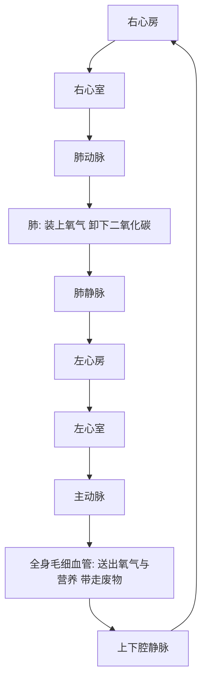

# 06｜心脏与血液：身体里的运输系统

> 一颗拳头大的心脏，如何把血液泵到全身？

---

## 一、先说结论

布莱森讲心脏时，带着一种敬意。

它大概只有你的拳头那么大，重量和一瓶矿泉水差不多，却从你还没出生就开始跳动，一直跳到生命的最后一刻。你从不需要提醒它，它也从不请假。

**布莱森认为，心脏是身体里最被低估的器官。** 它每天跳动约十万次，一生累计跳动几十亿次，把血液一刻不停地送往全身每一个角落。

研究显示，一个成年人安静时，心脏每分钟大约泵出五升血液——差不多就是全身血液的总量。也就是说，它每分钟几乎把你全身的血循环一遍。

结论很清楚：**心脏是一台泵，血液是运输介质，血管是道路。** 这三样东西加在一起，构成了身体里最基础、也最容易被忽略的一套系统——运输系统。一旦这套系统出问题，后果往往不是慢慢来的，而是又快又重。

---

## 二、我们先理解一个问题

要理解心脏为什么这么重要，先要理解一个更根本的问题：**身体为什么需要一套运输系统？**

如果身体只是一个细胞，问题很简单。它泡在水里，氧气、营养靠扩散就能飘进来，废物靠扩散就能飘出去。距离近，一切好办。

可你不是一个细胞。你是几十万亿个细胞凑在一起的大集体。

这就带来一个麻烦：人体表面的细胞到身体中心，距离可能有好几厘米；从肺到脚趾，距离甚至超过一米。而分子靠扩散移动的速度非常慢。研究表明，氧如果只靠扩散，从肺走到脚趾，根本来不及。

所以身体必须发明一套更快的办法：**用一台泵，加一张管道网，把运输这件事外包出去。**

这就是循环系统的由来。心脏负责用力，血液负责装载，血管负责到达。

---

## 三、作者到底提出了什么观点？

布莱森关于心脏与血液，主要说了几件事：

1. **心脏是一台精密到不可思议的泵。** 它其实不是“从不休息”，而是每一次跳动之间都在极短暂地休息——正是这种间隙，让它可以一辈子不停。
2. **循环系统是一张遍布全身的管道网络。** 如果把一个成年人体内的血管首尾相连，长度可达数万公里，绕地球两圈以上还绰绰有余。
3. **血液不只是一袋红色的液体。** 它同时承担运输、免疫、凝血、调温等多重任务，是流动的生命线。
4. **这套系统一旦破损，往往迅速致命。** 心血管疾病之所以是现代人最主要的死因之一，根源大多在血管和心脏上。

布莱森的写法是把“泵—管道—介质”讲得非常具体。因为只有理解了这套运输逻辑，后面谈疾病、谈医学，才不会觉得抽象。

---

## 四、把这个观点翻译成人话

把身体想象成一座特大城市。

心脏是城中心的中央泵站，一刻不停地往管网里加压。血液是一列列运输车，装着氧气、养分、激素、免疫细胞，在城市里川流不息。血管就是公路、高架和数不清的小巷，从主干道一路通到每家每户门口。

城市里每一户人家——也就是每一个细胞——都要收快递，也要扔垃圾。它需要氧和葡萄糖，同时要排出二氧化碳和代谢废物。这套物流如果停摆几分钟，细胞就会开始死亡。

而且这套系统不是单向的。它其实是一个**双循环**：

- 一头的血到肺里“换货”，装上氧气、卸下二氧化碳；
- 另一头的血走遍全身，把氧气送出去、把废物带回来。

心脏就像一个路口的总调度，让这两条线路严丝合缝地衔接。

---

## 五、为什么会这样？

血液在身体里的路线，其实是一条设计得非常清楚的环形公路：

看这张图，你会发现一个容易被忽略的细节：**左心室的壁比右心室厚得多。**

为什么？因为它要把血泵到全身，而右心室只要把血送到近在咫尺的肺。距离不同，阻力不同，用力自然也不同。研究表明，左心室是心脏里“肌肉”最发达的部分。

同时，心脏还有一套自己的“电源系统”。它的跳动不需要大脑逐次下令——心脏内部有一小簇细胞充当节拍器，自动发出电信号，让心肌按节奏收缩和放松。这套自带电源的设计，正是心脏能被移植、能用起搏器替代的关键。

---

## 六、举一个现实生活中的例子

看一个最日常的场景：**跑步时，你的心率和血压发生了什么？**

安静时，成年人的心率大约每分钟六十到一百次，血压常见的参考值是收缩压一百二十、舒张压八十毫米汞柱左右。可一旦你开始快跑，身体的耗氧量猛增，肌肉急着要氧、要能量。

心脏的反应几乎立刻到位：**跳得更快，也跳得更有力。**

心率可能从七十升到一百四十、一百五十甚至更高；每次泵出的血量也增加。结果是每分钟送出去的血液成倍增长。同时，收缩压明显上升，因为心脏正把血用力推向前进。这就是为什么运动时你会心跳如鼓、脸红发热。

这套反应说明了两件事。第一，心脏有巨大的储备能力，平时只用了它一小部分本领。第二，血压的波动是正常的、有弹性的——可怕的是它**长期居高不下**。

血压长期偏高，就像用高压水枪日夜冲刷血管内壁，管壁会受伤、变硬、变窄。研究表明，高血压是中风、心梗等心脑血管疾病最重要的危险因素之一。心脏这台泵没问题，坏的是它要面对的“管道压力”。

---

## 七、回到书中重新理解

现在再回看布莱森为什么花一整章讲心脏与血液，就明白了。

他不是在做器官科普，而是在铺一条逻辑主线：**身体是一套依赖持续运输的系统。**

只要理解“氧和养分必须不停被送到每个细胞”，你就能理解为什么心血管一出事就是急症；就能理解为什么医生盯着血压、血脂、血糖这些指标；也就能理解，为什么后面讲疾病时，血管永远是被反复点名的地方。

心脏与血液，是整套身体故事的第一条大动脉。

---

## 八、这个观点背后还有什么？

**第一，心脏不只是一台泵。** 它还有内分泌功能，会分泌影响血压和体液的物质。把它简化成水泵，是为了好懂，不是因为它真的那么简单。

**第二，血液的成分远比颜色复杂。** 血浆负责搬运，红细胞负责运氧，白细胞负责防御，血小板负责止血。同一种液体，同时干着好几份完全不同的工作。

**第三，血液还是免疫系统的巡逻通道。** 白细胞随血流在全身巡视，一有情况就赶赴现场。运输网络和防御网络，其实是共用一套道路的。

**第四，心形符号和真实心脏几乎是两回事。** 我们把“心”当作情感、勇气、爱的象征，可那颗真正在跳的器官，只想把血泵出去，它不懂浪漫。

---

## 九、这个观点有问题吗？

有，主要是类比与简化带来的偏差。

**第一，“泵”的比喻很好懂，但也太简单。** 真实的心脏有复杂的电生理节律、有自己的供血系统（冠状动脉）、有精密的内分泌调节。把心脏当成一台普通水泵，容易让人低估它的复杂度。

**第二，那些漂亮的数字需要谨慎对待。** “每天跳十万次”“一生跳二十五亿次”“血管连起来绕地球两圈”，这类估算是为了方便理解，不同来源的口径并不完全一致，不必当成精确测量。

**第三，把心血管病都归因于“生活方式”，可能过度简化。** 饮食、运动、吸烟确实重要，但遗传、年龄、基础疾病同样起作用。把所有责任都推给个人选择，既不准确，也不公平。

**第四，但这条主线的方向是对的。** 以循环系统为入口理解健康，能帮普通人抓住重点：血管状态，往往比很多时髦的健康概念更值得关注。

**所以更准确的说法是**：心脏与血液提供了一个理解身体的绝佳骨架，但它的细节，仍需要用更专业的医学知识去补足。

---

## 十、今天再看这个观点

以下部分是基于布莱森思想的现代延伸，不是他的原话。

布莱森写作的那个年代，关注心率、血压还得靠医院和血压计。今天，一块手表就能持续记录你的心率，甚至能提示心律异常。信息一下子变得唾手可得。

但这也带来新的问题：**数据多了，理解却没跟上。**

看到静息心率偏高就恐慌，看到一次血压超标就失眠，看到手表提示“心律不齐”就自己上网查病——这些在门诊里越来越常见。设备能告诉你一个数字，却告诉不了你这个数字在什么情况下正常、什么时候该去医院。

与此同时，医学对这套系统的干预手段也在进步：降压药、他汀、支架、搭桥、溶栓、心肺复苏与自动除颤器。研究表明，控制血压、戒烟、规律运动，能显著降低心脑血管事件的风险。

所以今天再看布莱森的提醒，反而更清楚：**心脏不声不响地跳着，但它承受的压力，往往来自我们看得见的生活方式。**

---

## 十一、这一篇真正应该记住什么？

1. **心脏是拳头大的泵，血液是运输介质，血管是道路。**
2. **身体需要运输系统，是因为细胞太多、距离太远，扩散根本来不及。**
3. **血液走的是双循环：先到肺换气，再到全身送货。**
4. **心率和血压是这套系统的两个关键读数，长期异常比一时波动更值得警惕。**
5. **心脏有自带的节律系统，能自己跳——这是现代心脏医学的基础。**

---

## 十二、留一个问题

> 你的心脏已经为你跳了几十亿次，你却可能从未留意过它。
> 那么，你上一次认真关心自己的血压和心率，是什么时候？

---

**下一篇**：血液把氧送到全身，可这些氧又是从哪儿来的？答案在那个你可能从没仔细想过的器官里——它柔软、轻飘，却用一张大得惊人的面积，默默替你完成每一次呼吸。

下一篇我们就来拆开这个问题——**肺与呼吸：我们是怎么“换气”的？**
