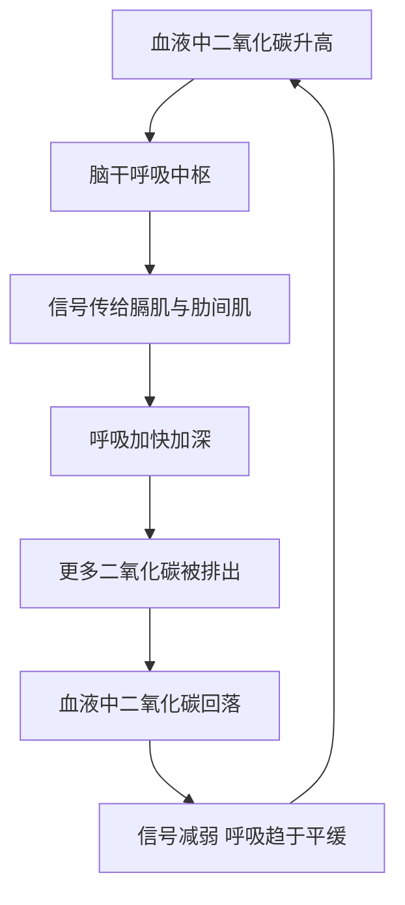
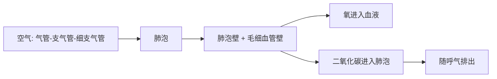

# 07｜肺与呼吸：我们是怎么“换气”的？

> 呼吸看起来最简单，为什么其实极其精妙？

---

## 一、先说结论

在所有身体功能里，呼吸大概是最不起眼的一个。

它太自动了。你不需要想起“该吸气了”，它自己就来；睡着了也照常进行。正因为太顺理成章，我们几乎从不追问它到底怎么工作。

**布莱森认为，呼吸是被严重低估的一套系统。** 它看起来只是“把空气吸进去”，背后却是一台精度极高的气体交换装置。

研究表明，成年人的肺里大约有数亿个肺泡。如果把这些肺泡全部摊开，总面积可以达到几十平方米，接近一块标准网球场的大小。而这么巨大的交换面积，被你压缩进了胸腔里那个不大的空间。

所以呼吸的精妙，可以浓缩成一句话：**它不是靠肺有多大，而是靠面积有多大。**

---

## 二、我们先理解一个问题

要理解呼吸，先要理解它到底在解决什么问题。

答案是：**身体每个细胞都需要氧。**

细胞靠“燃烧”葡萄糖来获取能量，而这个过程需要氧参与。没有氧，细胞只能低效运转，久了就会死亡。与此同时，这场“燃烧”会产生二氧化碳，必须被排出去。

于是身体需要一座换气站：把外界的氧装进血液，把血液里的二氧化碳排到体外。肺就是这座换气站。

但这里有个难点：空气和血液必须接触，可它们又不能直接混在一起，也不能让外面的灰尘、病菌随便进来。所以身体需要一个既高效、又可控、还带防护的界面。

肺的全部巧妙，都围绕这个界面展开。

---

## 三、作者到底提出了什么观点？

布莱森关于呼吸，主要说了几件事：

1. **肺的关键不是“容量”，而是“面积”。** 它靠数亿个肺泡把交换面铺展开来，才实现了高效的气体交换。
2. **呼吸是自动的，但又不是完全自动的。** 它由脑干调控，属于少数你可以主动干预的自动功能。
3. **气体交换靠的是扩散，不需要额外用力。** 氧和二氧化碳只是各自从浓度高的地方走向浓度低的地方。
4. **肺很脆弱。** 巨大的表面积既是它的优点，也是它的弱点——污染物、烟雾都能轻易伤害它。

布莱森特别强调第三点：呼吸看起来是“用力吸气”，其实整个过程依赖的是物理规律，而不是肌肉的硬拼。

---

## 四、把这个观点翻译成人话

把肺想成一个被反复折叠的交换器。

如果把它完全摊平，面积能比一间教室还大，甚至接近一个网球场；但它被塞进了你的胸腔，靠的是无数微小的褶皱——肺泡。

呼吸的过程，可以拆成三步：

- **吸气**：空气经过气管、支气管、细支气管，一路进到肺泡；
- **交换**：在肺泡壁和它周围密布的毛细血管之间，氧进入血液，二氧化碳进入肺泡；
- **呼气**：把富含二氧化碳的空气赶出去。

这里有个常被误解的地方：**肺自己是没有肌肉的。** 我们以为呼吸靠肺“用力吸”，其实真正干活的是膈肌和肋间肌。肺更像一只被动张开又压扁的气囊，是周围的肌肉在替它“抽风箱”。

---

## 五、为什么会这样？

呼吸为什么能自动进行，而且还能被你短暂控制？关键在于它有两套调控方式同时存在。

从这张图能看出一个反直觉的事实：**驱动呼吸的主要信号，不是“氧不够”，而是“二氧化碳太多”。**

研究表明，脑干对血液中二氧化碳浓度的变化非常敏感。二氧化碳一升高，呼吸就被催快；它一回落，呼吸又慢下来。这也解释了为什么你屏气到一定程度，会不由自主地想吸气——不是你在忍，而是身体在“接管”。

肺的气体交换本身，则更简单，只是纯粹的物理过程：

两套机制叠在一起，让呼吸既稳定，又能在需要时被临时“插话”。

---

## 六、举一个现实生活中的例子

最能说明问题的，就是那**数亿个肺泡提供的巨大交换面积**。

想象一下：你的胸腔就那么大，可里面装着数亿个微小气囊。每一个肺泡都被一层极薄的壁包着，外面紧贴着一张密密麻麻的毛细血管网。空气在一侧，血液在另一侧，中间只隔着极薄的一层。

就是这层薄薄的分隔，让氧和二氧化碳能在瞬间各走各的路。

因为交换面积足够大，血液只要在肺里短短经过一次，气体交换就基本完成了。反过来，如果面积被破坏——比如肺泡被疾病破坏、融合成更大的空腔——交换效率就会明显下降。这就是为什么肺病往往和“气不够用”联系在一起。

也正因为这张面积如此之大、又如此之薄，它对伤害几乎没有抵抗力。吸烟、空气污染、某些粉尘，都是冲着这张脆弱的面去的。**肺的强大和脆弱，其实来自同一个原因：面积。**

---

## 七、回到书中重新理解

现在再回看布莱森为什么专门写呼吸，就清楚了。

他看中的不只是“呼吸很重要”，而是呼吸的一个特殊地位：**它是少数我们能主动干预的自动功能。**

心跳、消化、体温，你基本指挥不了；但呼吸，你可以加深、加快、屏住。这个特点在医学上极其关键——麻醉、呼吸机、人工通气，全都建立在“呼吸可以被外部接管”这件事上。

同时，呼吸也是日常生活中最容易观察的身体状态：紧张时变浅变快，放松时变深变慢。它成了身体与情绪之间一扇随时能推开的小窗。

---

## 八、这个观点背后还有什么？

**第一，肺泡不会自己塌掉，靠的是一种“表面活性物质”。** 它降低了肺泡内层的表面张力，防止小气囊在呼气时黏在一起。早产儿常因为这种物质不足而呼吸困难，这也是医学上很受重视的一个问题。

**第二，肺不只是呼吸器官。** 它还参与血压调节、过滤血液里的小凝块，甚至影响体内一些化学物质的水平。

**第三，呼吸有两套“开关”。** 一套是自动的化学调控，另一套来自你的主观意志。正因如此，你能主动憋气，但憋久了身体又会抢回控制权。

**第四，呼吸是情绪的窗口。** 焦虑、恐惧、专注，都会在呼吸的深浅快慢上留下痕迹。反过来，刻意调整呼吸，也常被用来影响情绪状态。

---

## 九、这个观点有问题吗？

有，主要出在通俗化叙述容易带来的误解。

**第一，那些面积数字需要谨慎。** “几十平方米”“约等于一块网球场”，都是形象的估算，不同来源的换算口径并不一致，不必当成精确值。

**第二，把呼吸说成“缺氧驱动”，是最常见的错误。** 事实上日常呼吸主要由二氧化碳浓度驱动。科普为了讲得简单，容易把这一点含糊掉。

**第三，“深呼吸排毒”是典型的伪科学。** 肺真正排出去的是二氧化碳，是代谢废气，而不是所谓“毒素”。多呼吸几次，并不会让身体更“干净”。

**第四，“肺活量越大越健康”也不完全准确。** 肺活量是健康的一个参考，但它受身高、体型、年龄影响，不能简单等同于健康水平。

**第五，但布莱森的核心判断是对的。** 呼吸之所以精妙，恰恰在于它用面积换效率、用化学信号换自动控制，这个框架是站得住的。

**所以更准确的说法是**：呼吸是一个绝佳的“理解身体的入口”，但它同样需要配合更严格的医学知识，才能避免被简化成口号。

---

## 十、今天再看这个观点

以下部分是基于布莱森思想的现代延伸，不是他的原话。

布莱森写作时，空气质量的关注度还远不如今天。而现在，呼吸这件事被推到了更严肃的位置。

研究表明，长期暴露于空气污染与呼吸系统疾病、心血管疾病的风险升高相关。吸烟对肺泡和气道造成的损害，很多是不可逆的。慢性阻塞性肺病、哮喘，成了影响大量人口的常见病。

与此同时，技术也在改变我们“看呼吸”的方式。血氧仪、家用呼吸机、便携监测设备，让呼吸状态可以被量化。一场公共卫生事件，更是让普通人第一次开始天天盯着自己的血氧。

但设备带来的问题和心脏那一章一样：**数字很好拿，理解却很难得。** 知道血氧是九十八，不代表你知道它意味着什么；一次偏低，也不等于生病。

所以今天再看呼吸，我们或许更该记住布莱森的那个底层提醒：**肺靠一张巨大而脆弱的面积为你工作，你对它最好的照顾，往往是最朴素的那几件事——别用烟和脏空气去伤它。**

---

## 十一、这一篇真正应该记住什么？

1. **呼吸的精妙，在于用数亿个肺泡换来了巨大的交换面积。**
2. **肺自己没有肌肉，真正“抽风箱”的是膈肌和肋间肌。**
3. **驱动呼吸的主要信号是二氧化碳，不是氧。**
4. **呼吸是少数能主动干预的自动功能，这让麻醉和呼吸机成为可能。**
5. **“深呼吸排毒”是伪科学，肺排出的是二氧化碳。**

---

## 十二、留一个问题

> 你一天大约呼吸两万次，却可能从没认真注意过其中任何一次。
> 那么，你的呼吸，此刻是深是浅？它又为什么变成了这样？

---

**下一篇**：氧和营养都备齐了，可它们究竟从哪里来？答案藏在你每天都要做、却很少细想的一件事里——吃下去的那顿饭，在身体里到底走过了怎样一条路。

下一篇我们就来拆开这个问题——**消化与肠道：吃进去之后发生了什么？**
