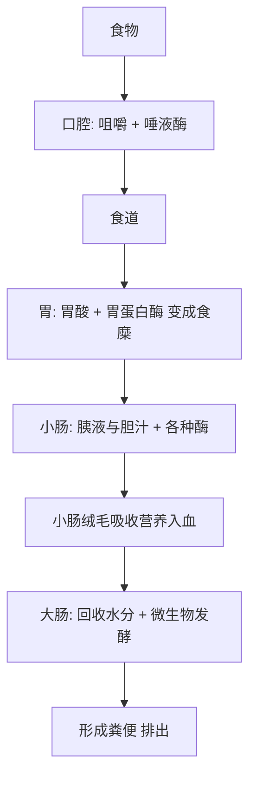

# 08｜消化与肠道：吃进去之后发生了什么？

> 一顿饭之后，身体里究竟发生了什么？

---

## 一、先说结论

在所有身体功能里，消化大概是最不体面的一个。它发生在你看不见的地方，伴随着蠕动、酸液和发酵，很少被人拿出来赞叹。

可布莱森偏偏花了整整一章讲它。

**布莱森认为，消化是身体里最壮观的流水线之一。** 从你咬下第一口，到营养被吸收、残渣被排出，中间要经过一连串分工明确、环环相扣的工序。研究表明，成人的消化道从口腔到肛门，长度可达九米左右，比很多人的身高还长。

更让人意外的是：这条流水线并不只属于你自己。你的肠道里住着数以万亿计的微生物，它们不是乘客，而是**合伙人**——和你一起完成这场拆解工程。

所以这一篇要回答的问题很具体：**从一口饭到被吸收，身体里到底发生了什么？**

---

## 二、我们先理解一个问题

要理解消化，先要理解它为什么这么复杂。

因为食物其实是“别人”的分子。一块肉、一碗米饭、一勺油，本质上都是大分子，身体的细胞根本没法直接利用。它们太大，穿不过肠壁，进不了血液。

所以身体必须先做两件事：

- **把大分子拆小**，小到能穿过肠壁、被吸收进血液；
- **把有害的东西挡住**，别让随食物进来的病菌长驱直入。

一个是“拆”，一个是“筛”。消化的全部设计，几乎都在为这两件事服务。

---

## 三、作者到底提出了什么观点？

布莱森关于消化，主要说了几件事：

1. **消化是一条完整的流水线。** 从口到肛门，每一站都有自己的工种，谁都不能越位。
2. **胃酸是强力的化工厂，但胃本身不会被它消化。** 胃壁有一层黏液专门保护自己。
3. **吸收的主力是小肠。** 它靠绒毛和微绒毛把吸收面积放大到惊人程度。
4. **肠道微生物是消化系统的合伙人。** 它们帮忙分解、合成、训练免疫、影响代谢。
5. **肠道还被称为“第二大脑”。** 它有一套自己的神经网络，与情绪、免疫都有联系。

布莱森写消化时，其实在悄悄推进一个更大的主题：人体不是一个孤立的个体，而是一个“共生的系统”。

---

## 四、把这个观点翻译成人话

把消化道想成一条长长的传送带，从头到尾设了好几个车间。

- **口腔**：切碎、润湿。唾液里的酶，从第一口就开始分解淀粉。
- **食道**：只负责往下送，是一段运输管道。
- **胃**：一台强力搅拌机，加上盐酸和酶，把食物搅成半流体的糊。
- **小肠**：主吸收车间。营养在这里被拆到足够小，穿过肠壁进入血液。
- **大肠**：回收水分，微生物继续加工剩下的残渣，最后形成粪便。

整条线走完，快的几小时，慢的要一天多。你吃下一顿饭，身体要用大半天来“处理”它。

这里有个常见误解：很多人以为“消化主要在胃里”。其实胃更多是个加工和暂存站，**真正的吸收，绝大部分发生在小肠。**

---

## 五、为什么会这样？

食物在身体里走这一趟，每一站都有它必须完成的任务。整条路线大致是这样：

看这条线，你会发现三个关键设计。

**第一，胃酸很强，但胃有自保。** 研究表明，胃酸的酸性极强，pH 值可以低到接近一。这样的环境足以杀死随食物进来的大部分细菌。可胃自己为什么不被腐蚀？因为胃壁表面覆盖着一层不断更新的黏液，把酸和胃壁隔开。一旦这层保护破了，就会出现溃疡。

**第二，小肠靠“表面积”取胜。** 它的内壁不是平的，而是布满绒毛，绒毛上还有更小的微绒毛。层层放大之后，吸收面积大得惊人。研究方法不同，数字有差异，但可以确定的是：小肠是全身吸收效率最高的地方。

**第三，胃酸杀菌，但不是杀光。** 总有一部分微生物能活着穿过胃，进入肠道，成为菌群的一部分。所以胃酸既是一道防线，也是一道筛选门。

---

## 六、举一个现实生活中的例子

我们就跟着**一口饭和一块肉**，走一遍完整的过程。

你嚼下第一口饭。牙齿负责物理切碎，唾液负责润湿，唾液里的酶则悄悄开始把淀粉分解成更小的片段。这块肉里的蛋白质，暂时还基本完整。

食物进入胃。胃酸让蛋白质“变性”——原本折叠的结构被泡开，胃蛋白酶才好下手切割。食物被搅拌成糊状的食糜，慢慢被推向小肠。

到了小肠，真正的拆解大戏开场。胰液送来多种消化酶，胆汁把脂肪乳化成小油滴。淀粉被切成糖，蛋白质被切成氨基酸，脂肪被切成脂肪酸。这些足够小的分子，透过小肠绒毛进入血液，被送往全身。

接下来，那些身体消化不了的东西——主要是膳食纤维——进入大肠。它们自己没法被人体直接吸收，却正好是肠道微生物的食物。微生物把这些纤维发酵，产生一些对肠道和身体有益的短链化合物；它们还帮忙合成部分维生素K和B族维生素。

你看，**同一顿饭，人体和微生物在分工合作：人负责拆解和吸收，微生物负责处理那些“人拆不动”的部分。** 这就是“胃酸与肠道微生物共同工作”的真实含义。

---

## 七、回到书中重新理解

现在再回看布莱森为什么讲消化，就明白了他真正的用意。

他写的不只是“胃和小肠怎么分工”，而是借消化这一章，完成了全书一个重要转折：**从“人体是一个独立个体”，转向“人体是一个生态系统”。**

一旦你接受了肠道里住着数以万亿计的微生物，并且它们真真切切参与你的消化、免疫甚至代谢，那么“我”这个概念的边界，就变得模糊了。你不再是一座孤岛，而更像一片草原。

这也是为什么布莱森会在讲完消化之后，自然地把话题引向免疫：肠道既是吸收营养的通道，也是身体与外界之间最重要的一道边界。

---

## 八、这个观点背后还有什么？

**第一，肠道有一套自己的神经系统。** 研究表明，肠壁里密密麻麻分布着数以亿计的神经细胞，数量之大，让人忍不住给它一个绰号——“第二大脑”。

**第二，很多和情绪有关的化学物质，其实在肠道里。** 研究发现，人体内绝大部分血清素存在于肠道。这也是“肠脑轴”这个说法流行起来的原因之一。

**第三，微生物是免疫的教官。** 它们和免疫系统长期“打交道”，帮助训练免疫系统学会分清敌友、该出手时出手、不该动手时收手。

**第四，菌群和饮食结构关系密切。** 你长期吃什么，会实实在在地改变肠子里住着哪些菌。这不是玄学，而是有研究支持的现实。

---

## 九、这个观点有问题吗？

有，而且这一章尤其容易“讲过头”。

**第一，“第二大脑”是个比喻，不是字面意义。** 肠道确实有丰富的神经，但把它说成“会思考”“有情绪的大脑”，就过度了。它能影响情绪，不等于它能产生思想。

**第二，“肠脑轴”研究很热，但结论要谨慎。** 大量研究显示的是相关性，不是因果关系。到底是菌群影响了情绪，还是情绪反过来改变了菌群，很多问题还没有定论。关于这一点，学界存在不同解释。

**第三，“吃某种益生菌就能改善情绪”，证据并不充分。** 市面上很多说法，把初步研究直接包装成了确定结论。

**第四，微生物和人体细胞数量“相当”的说法，口径并不统一。** 不同研究给出的估算差别不小，不必把某一个数字当成铁律。

**第五，但不能因此否定整章的价值。** 即便具体数字和机制仍有争议，“人体与微生物共生”这个大的判断，已经得到广泛认可。

**所以更准确的说法是**：消化的主线机制是清楚的，但涉及菌群和情绪、行为的部分，仍处在“有希望、待证实”的阶段，别把猜测当结论。

---

## 十、今天再看这个观点

以下部分是基于布莱森思想的现代延伸，不是他的原话。

布莱森写作时，肠道菌群还算是相对前沿的话题。而今天，它已经成了健康产业最热的风口之一。

一方面，研究确实在往前走。比如粪菌移植，已经被用于治疗某些反复发作的肠道感染，这是相对成熟的应用；饮食中的膳食纤维，被广泛认为对肠道菌群和整体健康有益。

另一方面，商业也把这片领域搅得很乱。益生菌饮料、菌群检测、各种“调理肠道”的产品层出不穷，宣传语往往跑在证据前面。

同时还有一个新变量：抗生素。它在救命的同时，也会大范围冲击肠道菌群。超加工食品、久坐、作息紊乱，同样在悄悄改变我们肚子里的“生态”。

所以今天再回看布莱森，他的提醒其实很朴素：**你每天吃进去的东西，不只在喂自己，也在喂你身体里的另一半。** 这件事的分量，可能比我们过去以为的要大。

---

## 十一、这一篇真正应该记住什么？

1. **消化是一条从口到肛门的流水线，每一站分工明确。**
2. **胃酸很强，但胃壁有黏液保护，否则先伤的是自己。**
3. **吸收的主力是小肠，靠绒毛和微绒毛放大面积。**
4. **肠道微生物是消化系统的合伙人，人负责拆解，菌负责“啃硬骨头”。**
5. **“第二大脑”和“肠脑轴”是有价值的方向，但要警惕被过度解读。**

---

## 十二、留一个问题

> 你每天吃下的东西，最终都变成了什么？
> 而那些你消化不了的部分，又是谁在替你处理？

---

**下一篇**：食物、空气、微生物，无时无刻不在和身体打交道。既然外界的东西总想闯进来，身体靠什么守住这道防线？答案是一支你从没见过、却每天都在替你打仗的队伍。

下一篇我们就来拆开这个问题——**免疫系统：身体里的军队。**
