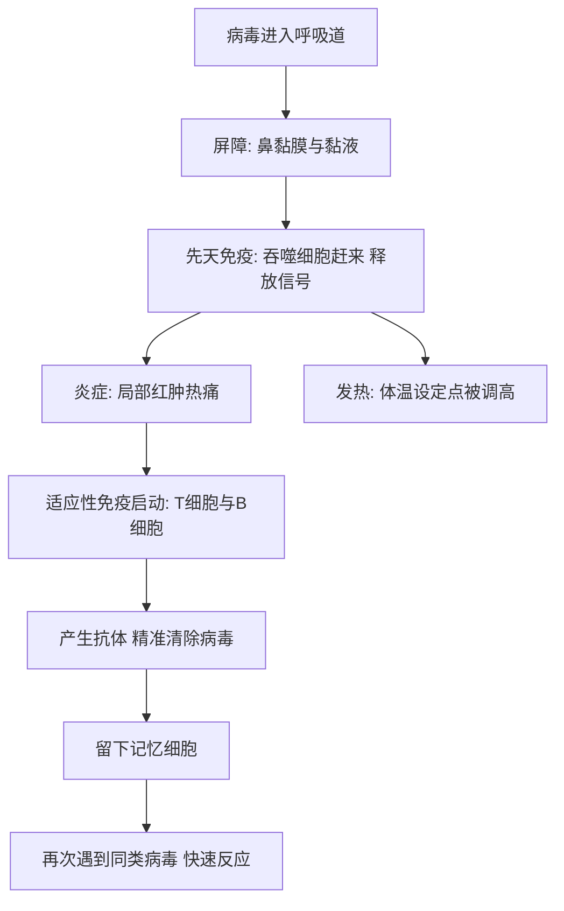

# 09｜免疫系统：身体里的军队

> 面对无穷无尽的细菌和病毒，我们是怎么活下来的？

---

## 一、先说结论

我们活在一个充满了微生物的世界里。空气里有，食物上有，你的皮肤上、嘴里、肠子里，更是住着数不清的细菌和病毒。

按理说，这该是一件很危险的事。可绝大多数时候，你对此毫无知觉。你照样吃饭、睡觉、上班，身体内部却一刻不停地处理着这些“外来者”。

**布莱森认为，这背后是身体里最像“军队”、也最被误解的一套系统——免疫系统。** 它要识别、要攻击、要记忆、要撤退，还要在绝大多数时候按兵不动。

结论可以先用一句话概括：**发烧和炎症，很多时候不是你病了，而是你的免疫系统正在战斗。**

---

## 二、我们先理解一个问题

要理解免疫，先要理解它必须解决一个多么难的矛盾。

世界充满微生物。它们绝大多数无害，甚至有益——比如肠道里的那些“合伙人”。但少数会致病，还有些能要命。身体既要能发现并消灭入侵者，又不能对无害的东西乱开火，更不能打到自己身上。

这三条约束，其实是互相冲突的：**打得不够，会生病；打得太狠，会误伤；打错对象，就是过敏或自身免疫病。**

免疫系统之所以复杂，就是因为它必须在“该出手”和“别乱动”之间，做出极其精细的判断。它真正的核心能力，不是“攻击”，而是**识别**。

---

## 三、作者到底提出了什么观点？

布莱森关于免疫，主要说了几件事：

1. **免疫是分层防御。** 从物理屏障，到先天免疫，再到适应性免疫，一层比一层更精准。
2. **发烧和炎症是战斗的表现。** 它们让人难受，却往往是有目的的反应。
3. **免疫有记忆。** 一旦记住了某种敌人，下次再遇到就能快速反应——这正是疫苗的原理。
4. **免疫会出错。** 它可能把无害的东西当成威胁（过敏），也可能攻击自己（自身免疫病）。
5. **“增强免疫”是个伪命题。** 免疫不是越强越好，太弱不行，太强同样会致病。

布莱森特别看重第五点。因为大众语境里，“提升免疫力”几乎成了万能口号，而免疫系统真实的样子，远比“强弱”复杂。

---

## 四、把这个观点翻译成人话

把免疫系统想成一座城堡的多层防御。

- **城墙与护城河**：皮肤、呼吸道黏膜、胃酸。它们先把大部分入侵者挡在门外。
- **巡逻兵**：一群能吞噬异物的细胞。谁闯进来，它们先吃谁，不挑对象，也不记名字。
- **特种部队**：专门针对某一种敌人的细胞和抗体。它们要识别具体目标，还会“记住”它。
- **通讯与后勤**：炎症信号和发热。它们负责调兵、封锁、升温。

这个类比最好用的地方，是能帮你看懂发烧和炎症：**红、肿、热、痛，其实是“战场”的样子**，而不是敌人本身。身体的难受，很多时候是防御措施带来的副作用。

---

## 五、为什么会这样？

以一次普通的感冒为例，免疫系统的反应是层层递进的：

看这张图，有两个关键点值得停下来。

**第一，炎症是“调兵”。** 当免疫细胞发现入侵者，它们会释放信号分子，让局部血管扩张、通透性增加。更多免疫细胞和物资才能涌向战场。代价就是红、肿、热、痛。

**第二，发热是“改变战场条件”。** 这些信号还会作用于大脑，把身体的“体温设定点”调高。于是你会发冷、打寒战，体温随之上升。研究表明，一定程度的体温升高，不利于部分病原体繁殖，同时能增强某些免疫细胞的活动。

这也解释了那个让人崩溃的体验：**你发烧时那么难受，是因为身体正在打一场仗。**

而“记忆细胞”这一环，是疫苗能够奏效的根本原因：提前让免疫系统“演一遍”，等真敌人来了，它就有了准备。

---

## 六、举一个现实生活中的例子

我们就来看最常见的一个场景：**感冒发烧。**

病毒从你的鼻子进入呼吸道。鼻黏膜上的黏液先试图把它拦住、排走。没拦住的，接触到下面的细胞，开始入侵和复制。

很快，附近的免疫细胞察觉了异常，赶来吞噬并释放报警信号。局部的血管扩张、血流加快，你会觉得鼻子发胀、喉咙发热——这就是炎症开始了。

与此同时，这些信号一路传到大脑，把体温设定点调高。你的身体开始觉得“冷”，于是打寒战、缩起肩膀，体温蹭蹭往上走。这就是发热的由来。

所以，发烧不是病毒在“放热”，而是你的身体主动把温度调高，想创造一个对敌人不友好的环境。研究表明，这是一场代价不小的策略：升温本身就消耗能量，这也是为什么发烧会让你疲惫、没胃口。

几天之后，适应性免疫终于完成“定制武器”——针对这种病毒的抗体被大量生产出来，病毒被清除，体温回落，你慢慢恢复。同时，身体留下了一批记忆细胞。下次再遇到同一个病毒，反应会快得多，很多时候你甚至毫无感觉。

**这就是“感冒发烧是免疫系统在战斗”的全部含义。** 你难受的每一天，都是它在替你打的一场硬仗。

---

## 七、回到书中重新理解

现在再回看布莱森为什么讲免疫，就抓住了他真正的重点。

他讲免疫，其实是为了解释两件看起来相反的事。

一件是**为什么疫苗有效**：因为免疫有记忆，可以“提前预习”。另一件是**为什么有些病是免疫系统自己出了问题**：过敏是它对无害物质过度反应，自身免疫病是它把枪口对准了自己。

理解了这两件事，你就不会再简单地认为“免疫越强越好”。布莱森想让读者明白的，是免疫系统的本质：**它是一套关于“识别”和“平衡”的系统，而不是一台越大越好的发动机。**

---

## 八、这个观点背后还有什么？

**第一，免疫系统是和微生物一起进化出来的。** 它从诞生起就不是在“无菌世界”里工作，而是长期与大量微生物共存、磨合。肠道菌群参与免疫训练，就是这种共存的一部分。

**第二，免疫系统还负责监视体内的异常细胞。** 身体里每天都有细胞出错，免疫系统能识别并清除其中一部分，这是它能对抗某些肿瘤的重要基础。

**第三，免疫会随年龄变化。** 研究表明，随着年龄增长，免疫功能会逐渐下降，同时慢性低度炎症又可能升高，这就是常说的“免疫老化”。

**第四，发热是一笔“划得来的账”。** 它耗能、让人难受，但在很多情况下，身体的判断是：这点代价，值得。

---

## 九、这个观点有问题吗？

有，而且这一章是最容易被“比喻”带偏的。

**第一，“军队”这个比喻本身就有限。** 军队有总指挥、有统一命令，而免疫系统是分散的、冗余的、由许多信号交织而成的网络。把它想成一支纪律严明的军队，会低估它的混乱与灵活。

**第二，“发烧必须马上退烧”是一种常见做法，但并非所有发热都需要立刻压制。** 适度发热可能是有意义的反应，是否用药、何时用药，要看具体情况和个体差异。这不是普通读者能自行判断的，需要交给医生。这里的关键不是教你“扛烧”，而是提醒你：**发烧本身不等于病情严重程度。**

**第三，“增强免疫”之所以是伪命题，是因为免疫是把双刃剑。** 免疫过度活跃会带来过敏、自身免疫病，甚至在某些感染中引发剧烈的“细胞因子风暴”。所以问题从来不是“强弱”，而是“平衡”。

**第四，免疫系统并非无所不能。** 有些病原体专门攻击免疫系统本身，这正是某些疾病格外棘手的原因。

**第五，关于“卫生假说”——即过度清洁可能影响免疫发育——学界存在不同解释。** 它是一个有启发性的假说，但远未成为定论，不能据此走向“不讲卫生”的另一个极端。

**所以更准确的说法是**：把免疫理解为“一套需要平衡的防御网络”，比理解为“越强越好的军队”，要接近真相得多。

---

## 十、今天再看这个观点

以下部分是基于布莱森思想的现代延伸，不是他的原话。

布莱森写作时，免疫学已经是一门成熟学科，但很多今天最热的进展还在路上。

今天，人类已经学会主动“借用”免疫系统的力量。疫苗技术不断更新；免疫检查点抑制剂让免疫细胞重新认出并攻击某些肿瘤，改变了部分癌症的治疗格局；单克隆抗体、CAR-T 等疗法，直接把免疫机制当成药物来设计。与此同时，免疫抑制剂又被用来治疗自身免疫病、帮助器官移植成功。同一种系统，既被“踩油门”，又被“踩刹车”。

但热闹之下也有需要冷静的地方。“增强免疫力”的营销依旧铺天盖地，而真正可靠的做法，仍然是那些朴素的事：规律作息、均衡饮食、适当运动、按时接种疫苗。

经历了近年来的公共卫生事件之后，普通人对免疫的关注前所未有。这本身是好事，但也要警惕另一种倾向：**把每一次发烧都当成灾难，把每一种“免疫产品”都当成救命稻草。** 免疫系统最需要的，往往不是更多的干预，而是别被过度打扰。

---

## 十一、这一篇真正应该记住什么？

1. **免疫是分层防御：屏障、先天免疫、适应性免疫，一层比一层精准。**
2. **发烧和炎症是战斗的痕迹，不是你敌人的样子。**
3. **免疫的核心能力是识别，而不是攻击。**
4. **记忆是疫苗的基础：提前预习，真敌人来了才反应快。**
5. **“增强免疫”是伪命题，免疫的关键是平衡，不是强弱。**

---

## 十二、留一个问题

> 你上一次发烧，是把它当成必须立刻消灭的敌人，
> 还是当成身体正在为你打的一场仗？

---

**下一篇**：免疫细胞在血液里巡逻，消化在肠道里进行，呼吸在肺泡里完成——可这一切都还需要一副可靠的支架，和一套能让身体动起来的装置。它们平时沉默，却支撑着你每一次站立、行走和奔跑。

下一篇我们就来拆开这个问题——**骨骼与肌肉：我们怎么动起来？**
