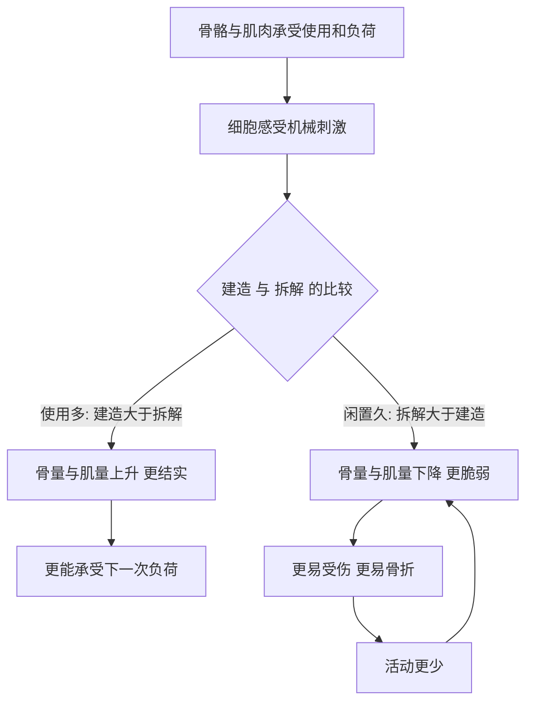

# 10｜骨骼与肌肉：我们怎么动起来？

> 支撑与行动，身体是怎么做到的？为什么骨骼和肌肉会"用进废退"？

---

## 一、先说结论

布莱森讲骨骼与肌肉时，最想纠正的是一种直觉：**我们以为骨骼是身体里最"死"的部分，其实它是最活跃的组织之一。**

骨骼撑着身体、保护内脏、给肌肉提供支点；它内部终生在拆与建，还参与造血与矿物质储存。肌肉负责收缩，把化学能变成动作，但要和神经、骨骼一起，才能完成一次举手投足。

由此，布莱森得出一个朴素的结论：**骨骼和肌肉都会对你如何使用它们作出回应——用得越多越强，闲置越久越弱。** 这就是"用进废退"，而它在骨骼上表现得格外清楚。

---

## 二、我们先理解一个问题

先想一个有点反常识的现象。

一个健康的年轻人，如果因为骨折或手术卧床几个月，没有明显外伤，骨头却会变脆、变轻；反过来，长期做负重训练的人，骨骼反而更结实。

问题就来了：

> 骨头明明是最硬的东西，为什么"不动"反而会让它变弱？

同样，一个人长期不运动，肌肉会萎缩、没力气；而开始规律锻炼后，肌肉又会长回来。这说明骨骼与肌肉都不是"装好就不动的零件"，而是**会随环境与使用不断调整的活组织。**

理解了这一点，才算真正开始理解我们是怎么动起来的。

---

## 三、作者到底提出了什么观点？

布莱森关于骨骼与肌肉，大致讲了四层意思。

1. **骨骼是活的。** 布莱森提醒读者，骨骼不是一具静止的骨架，它内部始终有细胞在建造、也有细胞在拆解，一生都在翻修。它还承担造血、储存钙等任务。
2. **运动系统是"三位一体"。** 骨骼提供杠杆与支撑，肌肉提供动力，神经负责指挥。任何一环出问题，动作都会受影响。
3. **骨骼和肌肉都可能因使用而变强、因闲置而变弱。** 布莱森借"用进废退"说明，身体不是按图纸固定成型的机器，而是持续应答外界需求的系统。
4. **它们还随年龄与激素变化。** 随着年龄增长，骨量会逐步下降；女性在绝经之后，骨量流失往往更明显。这让"用进废退"从一条原理，变成一件很现实的健康问题。

需要注意的是，这些是布莱森的叙述框架；他并非在提出新理论，而是把医学界已有的共识，讲成一个普通人能听懂的故事。

---

## 四、把这个观点翻译成人话

把骨骼想象成一栋每天都在翻修的大楼。

我们通常以为，房子盖好就完工了。但骨骼更像这样：每天都有施工队进来，把老化的部分拆掉，再把新材料补上。**拆和建同时进行，维持一个动态的平衡。**

这解释了前面那个怪现象：如果长期不用、不受力，身体会判断"这里的结构用不上"，于是拆得比建得多，骨量就下降。当你想重新"住"进去——比如开始运动或负重——身体又会加派人手去加固。

肌肉同理。你不用的肌肉，身体会认为它"成本太高"，于是减少维持它的投入，它就变小、变弱。

**所以"用进废退"不是一句道德劝告，而是身体在做成本核算。** 它只维持它认为需要的东西。

---

## 五、为什么会这样？

为什么会这样？因为它是一套"受力—感应—重建"的循环。

图中的关键，是那条分叉的"C"。

身体并不"知道"你将来会不会摔倒、会不会搬重物，它只根据当下的信号决定投入。**你给它的负荷，就是它判断"该修多厚"的依据。** 于是，使用与不使用的差别，会在几年、十几年里累积成骨量和肌量的巨大差距。

而 E → H 那条回路最值得警惕：骨量下降让人更容易受伤、更不敢动，不敢动又让骨量继续下降——这是一个会自我强化的下行循环。

---

## 六、举一个现实生活中的例子

来看两件几乎每个人都会遇到的事：**骨折后的愈合，以及随年龄出现的骨质疏松。**

先看骨折愈合。骨头断了以后，并不是"接上就完事"，而是启动一套分期进行的修复：先是断端出血、形成血肿，随后有细胞前来搭起临时的"脚手架"，把缺口逐渐连起来，最后再经过一段较长的重塑，把临时的结构改造成接近原来的形态。整个过程里，骨骼扮演的还是那个"活的建筑队"——它不是在被动愈合，而是在主动重建。（具体分期与时间因人、因部位而异，这里只说明"愈合是一个主动的重建过程"这一基本原理。）

再看骨质疏松。随着年龄增长，骨骼的收支会逐渐偏向"拆多于建"，骨量慢慢下降，骨内部结构变得疏松，因而更容易骨折，尤其是髋部、椎体和手腕等部位。女性在绝经之后，由于激素环境变化，骨量流失往往更快。

这里最值得对照前文的，是"用进废退"那一面：**长期缺乏负重和活动，会让这一过程加速。** 而骨量下降本身通常不痛不痒，很多人直到第一次骨折，才知道自己早已骨量不足。

---

## 七、回到书中重新理解

现在再回看布莱森为什么把骨骼和肌肉放在一起讲，就顺了。

他不是在讲一堆解剖名词，而是在讲一种身体观：**身体不是一具按图纸装配好的静态机器，而是一个持续收支、动态平衡的系统。** 骨骼每天都在拆与建，肌肉每天都在维持与消耗，它们都在根据"你到底怎么用它"来调整自己。

这也解释了布莱森为什么反复强调"能动就动"。在他的叙述里，运动不只是减肥手段，而是给全身发信号：**这些结构还在被需要，请继续维护。**

---

## 八、这个观点背后还有什么？

**第一，"用进废退"背后是身体的经济学。** 维持骨与肌肉都要消耗资源，身体倾向于只保留"有用的部分"。这是效率，也是代价。

**第二，这直接指向"预防重于治疗"。** 骨量一旦大量流失，很难完全逆转；相比之下，年轻时和中年时保持活动，是更划算的投资。

**第三，它把运动和骨骼、免疫、代谢连在了一起。** 骨骼参与造血，肌肉参与代谢；活动影响的不只是"力气"，还有全身状态。

**第四，它也解释了为什么"卧床"本身就是风险。** 对老年人而言，一次长期卧床，往往带来骨量、肌力与整体功能的连锁下降。

---

## 九、这个观点有问题吗？

有。"用进废退"很直观，但如果被讲成万能规律，就会误导人。

**第一，骨量不只由运动决定。** 遗传、激素水平、营养、某些疾病和药物（例如长期使用某些激素类药物）都会显著影响骨骼。把骨质疏松简单归因于"你不够爱运动"，既不准确，也不公平。

**第二，个体差异很大。** 同样的运动量，不同人的骨量和肌肉反应并不相同。"别人练了有效"不代表对每个人都一样。

**第三，把骨密度当成唯一指标，也存在争议。** 一些研究者认为，骨折风险还取决于骨的结构、平衡能力、跌倒概率等因素，单看一个数字容易高估或低估风险。

**第四，广告常借"用进废退"推销产品。** 补钙、氨糖之类的宣传，常把复杂的骨骼代谢简化成"缺什么补什么"，这与真实的生理机制并不完全对应。

**所以更准确的说法是**："用进废退"是一条重要的规律，但它是众多因素之一。骨骼健康是遗传、激素、营养、运动与生活方式共同作用的结果，任何单一解释都不完整。

---

## 十、今天再看这个观点

以下部分是骨骼与肌肉研究的现代延伸，不是布莱森的原话。

近年，研究者越来越把骨骼看成一种"会说话的器官"：它不只支撑身体，还可能通过分泌某些信号分子参与全身代谢的调节。肌肉也被视为重要的代谢与内分泌组织，而不只是"力气"的来源。这些方向仍在研究中，结论也在不断修正。

在应用上，负重运动与抗阻训练被普遍认为有助于维持骨量与肌力；对老年人来说，防跌倒、保持活动同样关键。而可穿戴设备让"步数、活动量"变得可见，也带来新的问题：**数字能提示你动得少了，却不能替你完成那一次真正的负重。**

换句话说，布莱森那句"身体会回应你的使用"，在今天不仅没过时，反而因为久坐生活方式的普及，变得更值得认真对待。

---

## 十一、这一篇真正应该记住什么？

1. **骨骼是活的组织。** 它一生都在拆与建，还参与造血与矿物质代谢。
2. **运动系统是骨骼、肌肉与神经的协同。** 缺一不可。
3. **用进废退真实存在。** 身体只维护它认为"被需要"的结构。
4. **骨量流失往往悄无声息。** 很多人第一次察觉，是因为已经骨折。
5. **但骨骼健康是多因素的结果。** 不能把责任全推给"不够运动"。

---

## 十二、留一个问题

> 我们的身体终生都在根据"你怎么用它"来改造自己。
> 那么，你今天对骨骼和肌肉的使用方式，
> 正在把它们改造成未来的哪一种样子？

---

**下一篇**：骨骼会断，肌肉会伤，但这些大多是"外来的麻烦"。真正让人不安的，是那些从身体内部长出来的疾病——病毒为什么能让我们发烧，一块原本正常的组织又为什么会"叛变"成肿瘤？

下一篇我们就来拆开这个问题——**为什么我们会生病？**
