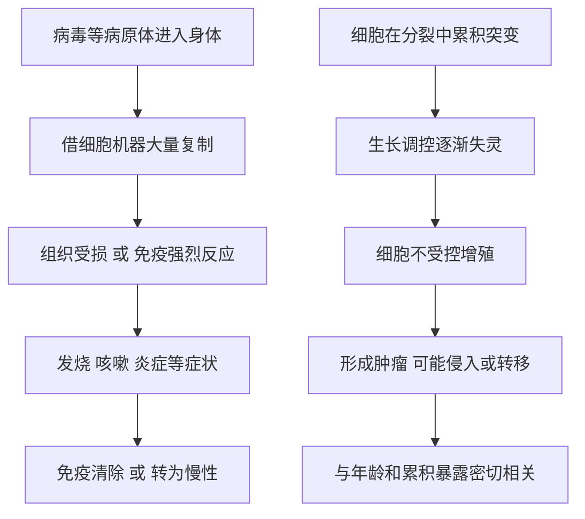

# 11｜为什么我们会生病？

> 疾病到底是怎么来的？为什么有的病来自外敌，有的却来自身体内部？

---

## 一、先说结论

布莱森谈疾病时，先打破一个常见假设：**并不是所有病都是"外面打进来"的。**

疾病来源很多：病原体（病毒、细菌等）、基因、环境、生活方式，以及一种很特别的情况——**细胞叛变，也就是癌症。** 前三者可以理解成"外敌入侵"或"条件不好"，而癌症更像是身体内部的管理出了故障：原本听话的细胞开始不受控制地增殖。

布莱森的落点在于：**很多现代病不是外敌入侵，而是身体在错误条件下的失调。** 理解这一点，才能理解医学能做到什么、又为什么常常力不从心。

---

## 二、我们先理解一个问题

先问两个看似矛盾的问题。

- 感冒、流感可以"传染"给别人，可癌症一般不会——明明都是"生病"，为什么一个能传，一个不能？
- 有些病因来自外部（病毒、细菌），有些却像是身体自己"出了问题"（自身免疫、癌症）——它们真是同一类事吗？

把这两个问题放在一起，就出现了布莱森想讲的那条分界线：

> 疾病既可以来自"外敌入侵"，也可以来自"内部失调"。

而现实中，两者还常常缠在一起。理解了这两条来路，我们才算摸到了"人为什么会生病"的门。

---

## 三、作者到底提出了什么观点？

布莱森关于疾病的观点，大致可以概括为四点。

1. **病因是多样的。** 病原体、遗传、环境、生活方式、细胞异常，都可能让人生病。没有单一解释能覆盖所有疾病。
2. **传染病是"外敌"。** 病毒、细菌等病原体进入身体、繁殖、破坏组织，或引发过度的免疫反应，这就是感染性疾病的基本路子。
3. **癌症是"内乱"。** 布莱森特别强调，癌细胞原本是正常细胞，是自身的细胞在分裂调控上出了问题，逐渐失控增殖。它不是从外面进来的敌人，而是"自己人叛变"。
4. **很多现代病是失调。** 布莱森指出，许多慢性病并非外敌直接造成，而是身体在错误条件下长期失调的结果。理解病因，才能理解医学的边界。

需要说明的是，这是布莱森的通俗叙述框架；在医学界，这些分类本身是被广泛接受的，但具体的比例与机制，争论从未停止。

---

## 四、把这个观点翻译成人话

把身体想象成一座运转的城市。

生病，可能是以下几种情况：

- **外敌入侵**：病毒、细菌像敌军混进城，抢夺资源、破坏设施。这就是感染。
- **内部叛变**：城市里某个人不再遵守规则，开始无限制地扩张自己的地盘，挤压正常部门——这就是肿瘤。
- **图纸缺陷**：从建城起就带着一些先天设定，某些系统天生更容易出问题——这就是遗传因素。
- **环境恶化**：空气、水、食物里的长期负担，慢慢拖垮整座城市——这就是环境与生活方式。
- **管理失灵**：没有外敌，只是内部协调乱了，比如免疫系统开始攻击自己——这就是自身免疫。

**同一个"生病"，背后可能是完全不同的故事。** 而治疗的第一步，恰恰是分清到底是哪一种。

---

## 五、为什么会这样？

从机制上看，疾病至少有两条完全不同的"生成路线"。

上面一条是"外敌"路线：病原体本身可能直接伤害细胞，也可能是身体为了清除它而付出代价。**很多时候，症状不是敌人造成的，而是免疫反应的"战火"。**

下面一条是"内乱"路线：问题出在细胞自身。细胞分裂本来有严格的刹车与检查机制，当这些机制被一连串变化逐渐破坏，细胞就可能脱离控制。**这也是为什么癌症通常不是一夜之间发生的，而是多年累积的结果。**

两条路线的治疗逻辑也完全不同：前者针对"外来者"，后者针对"自家叛徒"。

---

## 六、举一个现实生活中的例子

看两个典型的场景：**病毒感染，以及由"细胞叛变"形成的肿瘤。**

先说病毒感染。病毒本身不能独立繁殖，它必须进入宿主细胞，借用细胞的机器来复制自己。当复制到一定程度，细胞受损，或免疫系统开始大规模清除病毒，人就会发烧、咳嗽、乏力。**这些不适，很大一部分是身体在"打一场仗"的痕迹。** 多数感染最终会被清除，但也有一些病毒能长期潜伏，或造成持续损伤。

再说肿瘤。所谓"细胞叛变"，指的是在多次分裂中，一些细胞累积了变化，逐渐摆脱了"该长就长、该停就停"的规则，开始不受控制地增殖。它们聚集成团，形成肿瘤；如果继续发展，还可能侵入周围组织，或随血液、淋巴扩散到别处。**从正常细胞到失控细胞，通常是一条漫长的、多步累积的路。**

把这两件事放在一起看，就能明白布莱森那句话的分量：疾病有时是外敌造成的，有时是自己内部"长"出来的——而后者，恰恰最难对付。

---

## 七、回到书中重新理解

现在再回看布莱森为什么要用"病因"来谈疾病，就顺了。

他不是要罗列一大堆病名，而是要建立一种思考方式：**先分清病因的类型，再谈应对。** 是外敌入侵，就讲防、讲隔离、讲抗感染；是内部失调，就得从生活方式、免疫、长期管理入手；是细胞叛变，就涉及早期发现与专门治疗。

这背后是布莱森一贯的谦逊：**身体既能自我修复，也会自我背叛。** 医学再强，也必须先理解疾病是怎么来的，才知道自己能做什么、不能做什么。

---

## 八、这个观点背后还有什么？

**第一，免疫系统其实一直在"内部巡逻"。** 一些研究者认为，免疫系统能识别并清除相当一部分异常细胞，这种"免疫监视"在对抗肿瘤中可能扮演角色。这解释了一个现实现象：免疫功能与肿瘤风险之间常常有关联。

**第二，癌症与年龄高度相关。** 因为它的底层是突变累积，活得越久、暴露越多，累积的机会就越大。**某种意义上，癌症是"长寿的一部分代价"。**

**第三，很多现代病的根源在生活方式。** 这也是布莱森反复强调"理解病因"的原因：医学能救急，但很多病的真正解法在日常。

**第四，公共卫生的意义由此凸显。** 如果病因常在环境与行为中，那么预防的作用往往大于治疗。

---

## 九、这个观点有问题吗？

有。"外敌"与"内乱"的二分法很清晰，但清晰本身就是它的风险。

**第一，现实远比二分复杂。** 很多疾病是外因与内因交织的结果：感染可能诱发某些长期损伤，环境暴露可能改变基因表达，免疫失调又可能被感染触发。把它们硬分成两类，容易失真。

**第二，癌症不能全归因于生活方式。** 关于癌症成因中"环境与行为"与"随机突变"各占多少，学界存在不同解释。一些研究者强调，相当一部分突变源于细胞分裂中的随机错误，与是否"自律"关系不大。把癌症说成"都是自己不注意造成的"，既不科学，也容易伤害病人。

**第三，病毒与癌症的关系也需要谨慎。** 确实有一些病毒被确认与特定肿瘤相关，但这不等于"病毒导致大多数癌症"，个体情况差异极大。

**第四，把病因讲清楚，不等于能治好。** 布莱森的叙述擅长解释"为什么"，但解释清楚病因与找到有效疗法之间，隔着漫长而艰难的科研过程。

**所以更准确的说法是**：这套框架很适合入门，能帮我们建立"疾病有多种来路"的直觉；但涉及具体疾病，必须回到临床证据与专业判断。

---

## 十、今天再看这个观点

以下部分是疾病研究的现代延伸，不是布莱森的原话。

近年，医学在"内部失调"这条线上进展很快：靶向治疗试图针对具体的分子变化，免疫治疗则尝试重新唤起身体自己的防御力量。在"外敌"这条线上，快速检测与疫苗技术也改变了应对传染病的方式。这些方向都还在快速演进中，结论并不固定。

同时，疾病图谱也在改变：随着传染病在许多地区得到控制，慢性病、代谢病与肿瘤的负担反而上升。**人类面对的健康问题，正从"外敌入侵"越来越多地转向"内部失调"。** 这恰好呼应了布莱森的判断。

但这也带来新的困惑：当一个社会的主要疾病都与生活方式相关，"生病"就不再只是运气问题，而牵涉到选择、环境与公平。这已经不是单纯的医学问题了。

---

## 十一、这一篇真正应该记住什么？

1. **疾病有多种来路。** 病原体、基因、环境、生活方式与细胞异常，都可能致病。
2. **传染病是"外敌"，癌症是"内乱"。** 两者的机制与应对逻辑不同。
3. **很多症状其实是免疫反应的产物。** 发烧、咳嗽，往往不是敌人本身造成的。
4. **癌症通常漫长、多步、与年龄相关。** 它不是一夜之间发生的。
5. **理解病因，是理解医学边界的前提。** 解释"为什么"，不等于能"治好"。

---

## 十二、留一个问题

> 我们把疾病分成"外敌入侵"和"内部失调"，
> 可现实中，很多病正是两者纠缠的结果。
> 那么当你面对一次生病时，
> 你分得清它是外来的麻烦，还是身体自己的失衡吗？

---

**下一篇**：既然疾病有这么多种来路，那么人类与疾病斗争的历史上，真正改变命运的到底是哪几件事？不是某一种神药，而是麻醉、疫苗与抗生素——而它们做到的事，以及做不到的事，可能都超出我们的想象。

下一篇我们就来拆开这个问题——**医学到底救了多少人？**
