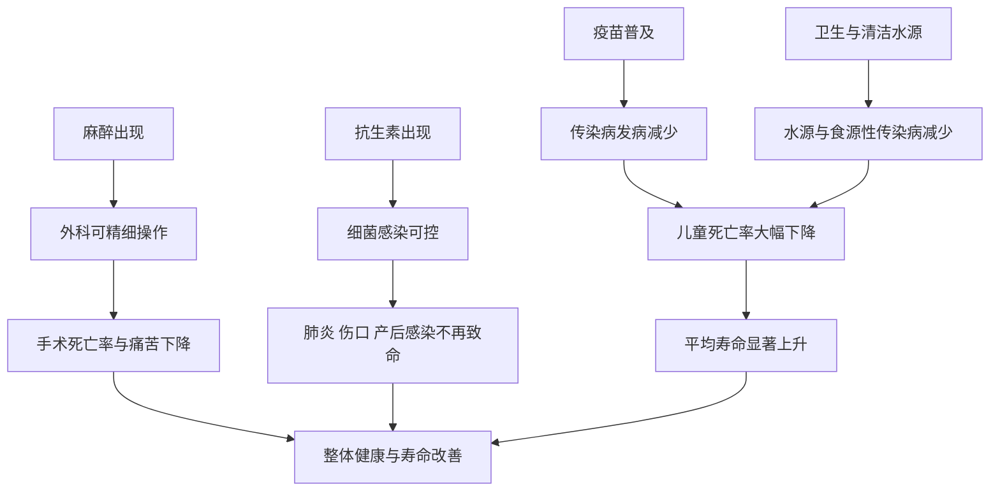

# 12｜医学到底救了多少人？

> 现代医学真正改变人类命运的，是哪几件事？它又有哪些做不到的地方？

---

## 一、先说结论

布莱森在讲医学史时，给出了一个不太"浪漫"的答案：**真正改变人类命运的，不是某一种神奇的药，而是几件非常基础的事——麻醉、疫苗、抗生素，以及卫生与外科。**

这些成就把人类从"生孩子可能死、拔牙会痛死、伤口感染就可能丧命"的处境中拉了出来。平均寿命的大幅提升，很大程度上要归功于它们。

但布莱森同时提醒：**医学也有大量无能为力的地方。** 它能延后死亡、缓解痛苦，却无法取消疾病与衰老。既看到它的伟大，也看到它的边界，才是《人体简史》对待医学的态度。

---

## 二、我们先理解一个问题

先想一个容易被忽略的事实。

在一两百年前，一个人能活到四五十岁，已经算长寿。女人生孩子是一件高风险的事，一次普通的伤口感染就可能致命，一次手术几乎等同于酷刑。而到了今天，很多曾经必死的病，变成了「吃点药就好」。

问题就来了：

> 到底是什么，让人类命运的曲线在一两百年里突然拐了个弯？

答案往往不是"某位天才医生发明了神药"，而是几件看起来朴素的事：让手术不痛、让传染病不再流行、让感染能被控制。**理解这几件事，就理解了现代医学真正的功劳。**

---

## 三、作者到底提出了什么观点？

布莱森关于医学的观点，可以概括为四层。

1. **麻醉让外科成为可能。** 在麻醉出现之前，外科手术是"速度比赛"，医生只能尽快做完，病人只能硬扛。麻醉之后，手术才真正变成一门可以精细操作的技术。
2. **疫苗让传染病退场。** 通过让人体提前"认识"病原体，疫苗把许多曾经的大规模杀手挡在门外。布莱森把它列为医学最伟大的成就之一。
3. **抗生素让感染不再等于死刑。** 在此之前，一次普通的细菌感染就可能致命；抗生素的出现，彻底改变了这个局面。
4. **卫生与外科同样关键。** 清洁的水、洗手、无菌操作这些"不起眼"的措施，在降低死亡率上可能比很多药物更重要。

而这些成就的另一面，是布莱森反复强调的：**医学并没有让人类"战胜死亡"，它只是把死亡往后推了，并减少了途中的痛苦。**

---

## 四、把这个观点翻译成人话

把医学史想象成一场修路的过程。

我们通常以为，医学的进步是"发明了越来越厉害的神药"。但更真实的图景是：**先解决的是最基础、最要命的坑。**

- 先让手术不痛——不然病人根本撑不过去。
- 再让伤口不感染——不然手术做得再漂亮也没用。
- 然后让传染病不流行——不然大批儿童活不到成年。
- 最后才有余力去处理那些精细、复杂的病。

**换句话说，现代医学不是靠一两个英雄时刻拯救了人类，而是靠一连串"把地基建牢"的工作。**

理解了这一点，就不会再把医学神秘化：它很伟大，但它的伟大是渐进的、务实的，而不是无所不能的。

---

## 五、为什么会这样？

医学对寿命的影响，可以看成几条互相叠加的路径。

图中最值得注意的是：**"平均寿命上升"从来不是单一路径的结果。** 麻醉让手术可行，抗生素让感染可控，疫苗与卫生则直接压低了儿童死亡。

而"儿童死亡率下降"这条线尤其关键。平均寿命是一个平均数：**当大量婴幼儿不再早夭，平均寿命就会被大幅拉高。** 这也是为什么在谈医学成就时，预防与卫生常常比人们以为的更重要。

---

## 六、举一个现实生活中的例子

来看三件改变人类命运的事：**麻醉、疫苗与抗生素。**

先说麻醉。在有效麻醉出现之前，外科手术拼的是速度——医生要在几分钟内完成切开与缝合，因为病人痛得无法忍受。麻醉方法被引入后，手术时间不再是首要约束，医生可以从容处理更复杂的问题。**没有麻醉，现代外科几乎无从谈起。**

再说疫苗。它的思路是：在真正遇到危险病原体之前，先让免疫系统"演习"一次，从而形成记忆。历史上最著名的案例是天花：经过长期的疫苗接种与公共卫生努力，天花最终在全球范围内被消灭。疫苗之所以伟大，不是因为治好了一个人，而是因为它**让整整一代人不必再得某种病。**

最后说抗生素。在抗生素之前，一次肺炎、一个被污染的伤口、一次分娩后的感染，都可能是致命的。抗生素出现后，细菌感染从"听天由命"变成了"可以治疗"。**它把许多曾经的绝症，变成了常规可治的疾病。**

但这三件事也各有边界：麻醉本身不治病，它只是让治疗得以进行；疫苗依赖人群广泛接种才能形成保护；抗生素只对细菌有效，对病毒无能为力——而滥用还会带来耐药问题。

---

## 七、回到书中重新理解

现在再回看布莱森为什么要专门讲医学史，就顺了。

他其实是在纠正一种流行的误解：**并不是"每个时代都在进步"。** 在麻醉、疫苗、抗生素出现之前，很多医学手段不仅无效，甚至有害——比如放血、催吐这类疗法，可能让病人更快走向死亡。

也就是说，医学的进步不是匀速的，而是**在某个时间点之后突然加速**。布莱森想让人看到的是：我们今天习以为常的"手术不痛、伤口不烂、传染病不流行"，其实是极晚近才获得的礼物。

这也让"医学救了多少人"这个问题，有了更清醒的答案：**它救的人很多，但主要救在那些最基础、最容易被忽略的地方。**

---

## 八、这个观点背后还有什么？

**第一，预防常常比治疗更重要。** 如果传染病能被疫苗和卫生挡住，就不必进入昂贵而艰难的治疗环节。布莱森对医学史的叙述，反复指向这一点。

**第二，儿童死亡率的下降，是寿命跃升的核心。** 很多人以为长寿是因为"老年的病被治好了"，实际上更主要的原因是"更多人活到了成年"。

**第三，公共卫生是一种"看不见的胜利"。** 干净的水、规范的洗手、无菌操作，这些措施不显眼，却在降低死亡上贡献巨大。

**第四，医学也制造了新的问题。** 抗生素带来了耐药，延寿带来了慢病与养老负担，过度医疗带来了新的风险。**救得越多，问题也越复杂。**

---

## 九、这个观点有问题吗？

有。它很清醒，但也留下了一些争议。

**第一，临床医学与公共卫生，谁贡献更大，学界存在不同解释。** 有观点认为，死亡率下降主要归功于营养、卫生与生活水平改善，临床医学的作用被高估；也有研究者反驳说，疫苗、抗生素等医学手段的贡献其实非常关键。比例如何，目前并无定论。

**第二，把医学成就列成"麻醉、疫苗、抗生素"，可能过于简化。** 输血、消毒、影像诊断、重症监护等同样重要，任何清单都难免挂一漏万。

**第三，医学的局限被强调，也可能被误读。** 有人可能因此走向另一个极端，认为"医学没什么用、不如顺其自然"。这与布莱森的本意并不一致——他是在纠偏，而不是在否定。

**第四，进步本身带来新的伦理难题。** 当医学能维持更多生命、延长更久的病程，"该救到什么程度""资源如何分配"就不再是纯技术问题。

**所以更准确的说法是**：医学是一项伟大的、但有限的成就。它极大地改变了人类的处境，却从未承诺过永生，也不该被当作万能保险。

---

## 十、今天再看这个观点

以下部分是医学现状的现代延伸，不是布莱森的原话。

今天，人类面对的健康问题已经明显转向：在许多地区，传染病不再是头号杀手，慢性病、代谢病与肿瘤成为主要负担。**医学的战场，从"挡外敌"转向了"管理长期失调"。** 这对医学提出了完全不同的要求——它需要的是长期管理，而不是一次性的救命。

与此同时，全球范围内的不平等依然尖锐：清洁水源、疫苗与基本医疗，在一些地方仍是稀缺品；而在另一些地方，问题则变成了过度检查与过度治疗。**同一个"医学进步"，在不同地方的意味完全不同。**

还有抗生素耐药性，这个被反复警告的问题正在逼近：如果现有抗生素逐渐失效，那些曾经"吃片药就好"的感染，可能重新变得危险。**布莱森笔下那种"感染不再等于死刑"的处境，并非不可逆转。**

---

## 十一、这一篇真正应该记住什么？

1. **医学最伟大的成就，是麻醉、疫苗、抗生素与卫生。** 不是某一种神药。
2. **平均寿命的跃升，主要来自传染病与儿童死亡的下降。** 而非"治好了老年病"。
3. **预防往往比治疗更划算。** 卫生与疫苗是"看不见的胜利"。
4. **医学不等于全能。** 它延后死亡、缓解痛苦，却无法取消疾病与衰老。
5. **进步也带来新问题。** 耐药、慢病、过度医疗，都是成就的另一面。

---

## 十二、留一个问题

> 我们习惯了"生病就去医院"，习惯了把医学当成最后一道保险。
> 可如果医学真正改变命运的，是疫苗、抗生素与清洁水源这些基础之事，
> 那么我们自己，是否也低估了那些"不显眼"的预防措施？

---

**下一篇**：从疾病与医学转向生命本身。人是怎么被"造"出来的？为什么繁衍这件事，身体要动用一整套精密的激素系统来调控，而且过程里还藏着许多演化上的"不划算"？

下一篇我们就来拆开这个问题——**性是怎么工作的？**
