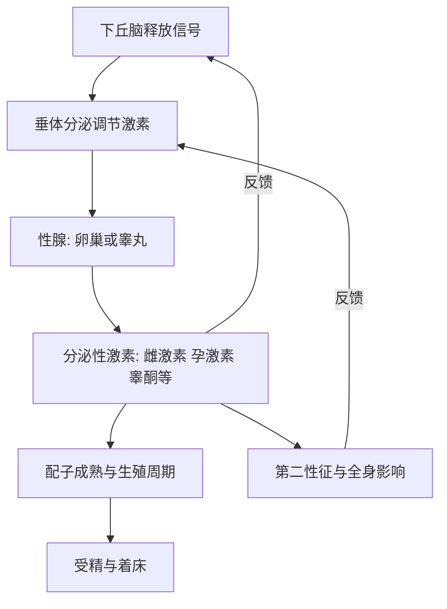

# 13｜性是怎么工作的？

> 人类繁衍的机制，比我们想象的更奇妙吗？

---

## 一、先说结论

布莱森谈性与生殖，态度坦率，却始终带着一种敬畏：**这不是一件"本能"就能概括的事，而是一套由激素精密调度、又被演化长期塑造的系统。**

从激素信号到下丘脑与垂体的指挥，从配子的产生到受精与着床，身体动用了一连串精确到时间点的机制。而在这套机制背后，还藏着布莱森特别感兴趣的东西：**繁殖的成本、两性之间的差异，以及演化层面的博弈。**

简单说，这一篇要回答的是那个最朴素的问题：**我们从何而来。** 而答案，比想象中复杂，也比想象中有趣。

---

## 二、我们先理解一个问题

先想两个有点奇怪的现象。

- 繁衍这么"基本"的事，为什么身体要动用一整套激素系统、精确到周期中的某一天，而不是简单想生就生？
- 为什么男女在生理、发育时间与繁殖成本上有明显差异，这种差异从哪里来？

把这两个问题放在一起，就出现了这一篇的核心：

> 性与生殖，表面看是生理现象，底层却是一套被激素调控、被演化筛选出来的复杂程序。

理解它，不只是了解器官如何工作，也是在理解"生命为什么这样设计"。

---

## 三、作者到底提出了什么观点？

布莱森关于性与生殖，大致讲了四层意思。

1. **生殖是一套激素调控的系统。** 从大脑深处的信号开始，一路传导到性腺，再由激素反过来影响全身。整个过程有明确的次序与反馈。
2. **男女两套系统既有共性，也有差异。** 共同的上游调控，加不同的下游器官与激素环境，形成了配子产生与生殖周期上的不同节奏。
3. **繁殖是有成本的。** 布莱森强调，孕育、分娩与抚养都要付出巨大的代价，尤其对女性而言，生殖的生理成本与风险更高。这解释了为什么两性的策略常常不同。
4. **这里面有演化博弈。** 一些研究者认为，两性在繁殖中的不同投入，塑造了各自的行为倾向与生理特征。布莱森用坦率又幽默的方式，把这些讲成了故事。

需要说明，前三点更接近公认的生理学知识，第四点则属于演化生物学的解释框架，其中不少细节仍在讨论中。

---

## 四、把这个观点翻译成人话

把生殖系统想象成一条需要多道开关依次打开的生产线。

它不能"一键启动"，也不是"随时待命"。上游的大脑发出信号，中游的垂体做出响应，下游的性腺开始工作并分泌激素，激素再回头向上反馈，调整整条线的节奏。**任何一道开关没打开，或者时间点错位，过程就会受影响。**

这解释了两个现象：

- **为什么生殖有周期。** 因为要让配子的成熟、排出与准备受孕在时间上对齐。
- **为什么激素一乱，生殖就会出问题。** 因为整条线依赖精确的次序与反馈。

**所以"生殖"不是某个器官独自完成的事，而是一条全身协同、层层反馈的调控链。**

---

## 五、为什么会这样？

从机制上看，生殖由一条"自上而下、再自下而上"的激素轴驱动。

图中最要紧的，是那两条向上的"反馈"箭头。

**激素系统的特点，是它一边往下发指令，一边根据下游的状态往回调。** 正因如此，身体才能把配子的成熟精确地"卡"在合适的时间点。这也意味着，一旦反馈环被打断，整套节奏就会混乱。

同时可以看到，性激素的作用远不止生殖：它还影响骨骼、肌肉、体脂、情绪与发育节奏。**这解释了为什么性激素的变化，往往带来全身性的改变。**

---

## 六、举一个现实生活中的例子

来看生殖的生理机制与激素调控，在男女两套系统里是如何展开的。

**男性一侧**：上游的下丘脑与垂体发出信号，作用于睾丸；睾丸在睾酮等激素的作用下持续产生精子，并把激素信号反馈回上游。睾丸产生的激素还参与第二性征的形成与维持。与女性相比，这一侧的配子生成更像是一种持续进行的过程，而不是有明确周期的节律。

**女性一侧**：同样是下丘脑—垂体—卵巢这条轴，但节奏更鲜明。随着周期推进，卵巢中的卵泡逐渐发育并分泌雌激素；接近周期中段时，垂体发出的信号出现一次明显的峰，触发排卵；排卵之后，黄体形成并分泌孕激素，为可能的受孕做准备。如果没有受孕，激素水平回落，周期重新开始。

**受精与着床**：当配子相遇、完成受精后，胚胎需要移动到合适的位置并完成着床，才能继续发育。**这一整套过程，横跨了激素调度、细胞准备与时间窗口的精密配合。**

把这两侧放在一起看，就能理解布莱森想讲的重点：**繁衍不是单一器官的任务，而是一条从大脑一路延伸到性腺、再反馈回来的完整回路。**

---

## 七、回到书中重新理解

现在再回看布莱森为什么把性与生殖单独拿出来讲，就顺了。

他不是在做生理科普的罗列，而是在讲"生命如何延续"这件最根本的事。他要让读者看到：**我们的存在本身，是一连串精确调控与长期演化的产物。** 从激素的反馈到受精的时机，每一步都不是随手安排的。

而布莱森真正想强调的另一面，是"不经济"：人类的分娩与育儿成本很高，繁衍远不像想象中那样轻松。**正因为代价高昂，两性的策略、家庭结构与社会的形态，才变得复杂起来。**

---

## 八、这个观点背后还有什么？

**第一，繁殖成本不对称。** 一些研究者认为，因为两性在繁殖中的投入不同，围绕繁殖形成的策略也不同。这是理解许多生物行为的一条线索。

**第二，性别差异既有生物基础，也有文化塑造。** 激素确实影响身体与行为倾向，但文化、教育与社会期待同样在起作用。**把二者混为一谈，是最常见的误读。**

**第三，生殖与全身健康紧密相连。** 性激素影响骨骼、代谢与情绪，这让人口层面的健康问题与生殖系统密不可分。

**第四，它指向一个更大的问题：演化不追求"好"，只追求"能延续"。** 很多看似不合理的现象，从演化的角度看，其实是"够用就行"的结果。

---

## 九、这个观点有问题吗？

有。"演化视角"很有解释力，但也最容易被滥用。

**第一，激素与行为的关系远比想象复杂。** 激素水平与情绪、行为之间存在关联，但相关性不等于因果。把复杂行为简单归因于某种激素，并不严谨。

**第二，性别差异的生物基础，学界存在不同解释。** 生物因素与社会文化因素各占多少，研究者们并无一致结论。任何"天生如此"的论断，都需要谨慎对待。

**第三，演化解释不能被当作道德辩护。** "这样做有演化上的理由"，不等于"这样做是好的或应该的"。这是从科学事实跳到价值判断的常见错误。

**第四，把性简化成"繁殖手段"，会漏掉太多。** 人类性的意义远不止繁衍，它还承载关系、情感与文化。**只用生殖功能来解释它，是一种过度简化。**

**所以更准确的说法是**：生理机制层面的叙述相对可靠，而涉及演化解释与性别差异的部分，需要分清哪些是有共识的机制，哪些仍是待检验的假说。

---

## 十、今天再看这个观点

以下部分是生殖医学的现代延伸，不是布莱森的原话。

今天的生殖领域，已经出现了许多布莱森写作时尚未普及的技术：辅助生殖帮助许多原本难以受孕的人实现了生育，激素类避孕让生育与性行为在技术上被分开，产前检测也让许多风险被提前发现。这些技术进步，正在深刻改变人类与生殖的关系。

同时，新的担忧也在出现：一些研究者关注环境中的某些化学物质是否可能干扰内分泌，进而影响生殖健康。相关结论仍在研究中，尚无定论，但这一方向值得持续观察。

更值得注意的是观念的变化：性与生育正在被越来越多地当作可以独立看待的两件事。**布莱森笔下那套精密的激素系统没有变，但我们围绕它建立的制度与观念，变化得比身体快得多。**

---

## 十一、这一篇真正应该记住什么？

1. **生殖是一套激素调控的系统。** 从大脑到性腺，自上而下，再反馈回来。
2. **男女共用上游调控，下游器官与节律不同。** 这形成了配子生成与周期的差异。
3. **繁殖是有成本的。** 尤其对女性而言，生理投入与风险都更高。
4. **演化解释很有力，也很容易被滥用。** 相关不等于因果，事实不等于价值。
5. **性不只是繁殖。** 它同时承载关系、情感与文化。

---

## 十二、留一个问题

> 我们的生殖，被一整套精密的激素系统调控；
> 而今天的技术，已经可以让生育与性、甚至与身体本身逐渐分离。
> 那么，当生物机制不再完全决定结果时，
> 我们该如何理解"我们从何而来"这件事？

---

**下一篇**：从一个受精卵到几十万亿个细胞，一个人是怎么一步步长成的？基因程序与激素又是怎样配合，把一团细胞变成会呼吸、会思考的完整的人？

下一篇我们就来拆开这个问题——**我们如何从受精卵长到成年？**
