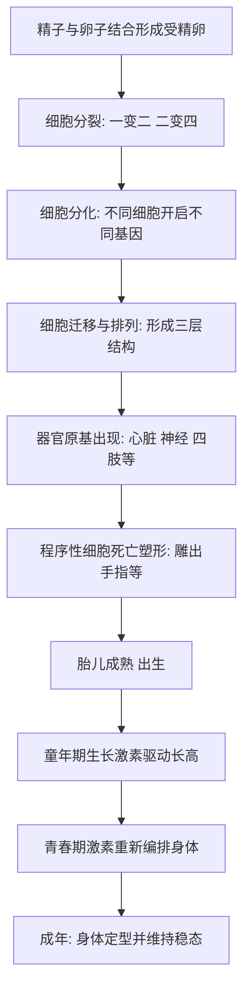

# 14｜我们如何从受精卵长到成年？

> 从一个细胞到几十万亿个细胞，这段旅程到底是怎么完成的？

---

## 一、先说结论

答案可以先用一句话概括：**我们从受精卵长到成年，靠的是一套写在基因里的程序，加上激素在不同时间点的调节。**

受精那一刻，一个精子和一个卵子结合，形成一个细胞。此后不断分裂、分化、迁移、塑形，最终变成几十万亿个各司其职的细胞。这个过程不需要任何人指挥，却精确到令人难以置信；同时它又极其脆弱，任何一个环节出错，都可能让整个计划走偏。

布莱森在书里反复强调一个感受：**发育本身就是奇迹，而每一具活着的身体，都是这个奇迹成功走完一遍的结果。**

---

## 二、我们先理解一个问题

先想一个反直觉的事实。

受精卵只有一个细胞，它有完整的遗传信息；而你身体里的每一个细胞，几乎都带着这同一套信息。也就是说，**肌肉细胞、神经细胞、皮肤细胞，最初拿到的"说明书"是同一本。**

那问题就来了：既然说明书一样，为什么有的细胞长成心脏，有的长成眼睛，有的长成指甲？

这正是发育最核心的秘密：**不是每个细胞都读同一页，而是不同细胞在不同时间，读不同的页。** 有些基因被打开，有些被关掉，读到的内容不同，细胞也就长成了不同的样子。

理解这一点，你才理解"从受精卵长到成年"这句话的分量：它不只是细胞的堆积，而是一次持续十几年的、按程序展开的分工。

---

## 三、作者到底提出了什么观点？

布莱森的观点大致可以归纳成几条：

1. **发育是一套程序。** 受精、分裂、着床、器官形成、出生、成长、青春期，每一步都有内在的时间表。胚胎不是被"设计"出来的，而是按遗传程序一步步长出来的。
2. **调控的关键是"开关"而非"复制"。** 所有细胞遗传信息基本相同，差别在于哪些基因被表达、在什么时候被表达。
3. **激素是发育后半程的总调度。** 从婴儿期的生长，到青春期身体的剧烈变化，激素在背后发号施令。
4. **这个过程既稳健又脆弱。** 它能容忍大量扰动而照常进行，却又对某些关键节点极其敏感。

布莱森认为，发育真正让人震撼的地方，不是"我们有多聪明"，而是**这么复杂的流程，居然能在没有总指挥的情况下，一次次成功完成。**

---

## 四、把这个观点翻译成人话

把发育想象成盖一栋大楼。

图纸只有一份，但工地上的工人成千上万。如果每个人都照着整张图纸同时施工，一定会乱套。真实的做法是：**每个工人只拿到属于自己那一段的指令，在指定的时间做指定的事。**

有些工人负责打地基，有些负责搭框架，有些负责装水电。等房子盖好，各自的指令就收起来，人也就安静下来。细胞也是这样：基因是那本总图纸，细胞读到的是被分配到自己手里的那一页。

而激素呢？它更像工地上不断广播的调度口令：**"现在可以加速长个子了""该进入青春期了""开始准备生育能力了"。** 口令一到，不同的工人同时动起来，身体就整体进入下一个阶段。

发育之所以看起来神奇，是因为我们习惯把它当成"设计"，而它更像"按程序自组织"。

---

## 五、为什么会这样？

为什么一个细胞能长成完整的人？把它拆成一条链：

关键在于 **C 和 F 两步**。

**C（分化）** 解释了为什么一个细胞能变出几百种细胞：不是内容不同，而是读的页不同。

**F（程序性细胞死亡）** 则是很多人没意识到的机制——发育不只靠"长出来"，也靠"删掉"。手指最初是连成一片的，正是部分细胞按程序主动死亡，才让指缝分开。**没有死亡，就没有形状。** 这句话在整个身体里都成立。

所以发育的本质，是"开"与"关"、"生"与"死"两股力量精确配合的结果。

---

## 六、举一个现实生活中的例子

看一条完整的成长线：**从受精、胚胎发育，到出生，再到青春期。**

起点是受精：精子与卵子结合，形成一个带完整遗传信息的细胞。接着它反复分裂，变成一小团细胞，在子宫里着床，这就是胚胎的开始。

随后进入器官形成阶段。细胞分成不同层次、不同方向，逐渐长出神经系统、心脏、四肢、五官。这个阶段对外界干扰尤其敏感——**很多先天问题，就发生在器官正在成形的这段窗口期。**

再往后是胎儿期：身体把已有的雏形长大、补全、成熟，直到出生。出生时，一个婴儿已经带着几乎完整的器官，只是还没长成。

出生之后的十几年，是另一套逻辑在主导。童年主要靠生长激素等推动长高、增重；到了青春期，激素水平发生显著变化，身体被"重新编排"：**身高猛增、性器官成熟、第二性征出现、生殖能力具备。** 青春期不是简单的"再长一点"，而是一次系统级的重启。

整条线看下来你会发现：**前半程靠基因程序，后半程靠激素调度，两者接力，才把人从一颗受精卵送到成年。**

---

## 七、回到书中重新理解

现在再回看布莱森为什么花力气讲发育，就清楚了。

他不是在做医学科普的流水账，而是在回答一个根本问题：**这么复杂的我们，到底是怎么被"造"出来的？** 答案不是某个更高的设计者，而是一套自我执行、自我纠错、按时间展开的程序。

理解这一点，会顺带改变几件事的看法：

- 为什么孕期某些阶段需要格外小心——因为器官形成有敏感窗口；
- 为什么青春期孩子情绪起伏大——因为激素正在大范围重排身体；
- 为什么"一切正常"本身就是极小概率的成功——因为每一步都可能出错。

布莱森的潜台词是：**你不是被精心设计的产品，你是一次次成功执行的程序的产物。** 这件事本身就足够让人敬畏。

---

## 八、这个观点背后还有什么？

**第一，发育解释了"同源"现象。** 所有细胞遗传信息基本相同，只是表达不同——这也是为什么干细胞研究、再生医学值得期待。

**第二，激素是理解身体"阶段变化"的钥匙。** 青春期、月经周期、孕期、更年期，本质都是激素在调度。

**第三，敏感窗口意味着环境很重要。** 孕期营养、药物、感染，都可能影响正在成形的器官。这提醒我们：发育不只是基因的事，也是环境的事。

**第四，它把"生命"和"时间"绑在一起。** 发育是有时间表的，早一步晚一步都可能出问题。生命不是静态的，而是一段按节奏展开的过程。

**第五，它让人谦逊。** 我们连自己是怎么长出来的都只能看到一部分，更别说完全理解每一个细节。

---

## 九、这个观点有问题吗？

有，主要在于"程序"这个比喻的局限。

**第一，基因不是全部。** 把发育说成"照着基因图纸施工"，容易让人以为基因决定一切。事实上，环境、营养、随机因素都在参与，同样的基因可以长出不完全一样的结果。**研究表明**，同卵双胞胎也并非完全一致。

**第二，"程序"听起来太顺滑，掩盖了失败的常态。** 发育其实非常脆弱：大量受精卵无法着床，相当比例的妊娠会早期终止。成功走完全程，是幸存者偏差让我们觉得"理所当然"。

**第三，科普容易把机制讲得过于确定。** 发育生物学仍有大量未解之处，比如细胞如何精确迁移、器官如何知道该长多大。把不确定讲成确定，是科普的通病。

**第四，但它完成了最重要的任务：建立整体直觉。** 它让你知道发育有阶段、有窗口、有激素接力，这个框架比任何单个细节都更有用。

**所以更准确的说法是**：发育是"基因程序、环境条件与随机性"共同作用的结果，程序是主干，但不是全部。

---

## 十、今天再看这个观点

以下部分是基于布莱森思想的现代延伸，不是他的原话。

今天的发育科学，比布莱森写作时走得更远。我们对胚胎早期的细胞命运、器官形成的信号通路，有了更细的认识；干细胞与类器官技术，让研究者能在实验室里观察一部分发育过程。**一些研究者认为**，未来或许能修复或替换部分受损组织。

但方向越明确，伦理问题也越尖锐。**关于胚胎研究、基因编辑的边界，学界存在不同解释**：有人强调治疗潜力，有人担心滑向"设计婴儿"。这不只是技术问题，更是"我们该如何对待生命起点"的价值问题。

对普通人来说，最实用的延伸其实是老话：**孕期与儿童期的营养、睡眠、环境，影响的是长期发育。** 发育有时间表，错过某些窗口，代价可能终身难以弥补。

---

## 十一、这一篇真正应该记住什么？

1. **发育是一套按时间展开的程序。** 从受精到成年，每一步都有内在节奏。
2. **细胞差别来自"读哪一页"，而不是"拿到哪本书"。** 所有细胞遗传信息基本相同，差别在表达。
3. **发育既靠"长出来"，也靠"删掉"。** 程序性细胞死亡塑造了我们的形状。
4. **前半程靠基因，后半程靠激素。** 青春期是激素主导的一次系统重排。
5. **它既稳健又脆弱。** 成功走完全程本身就是概率事件，所以健康不是理所当然。

---

## 十二、留一个问题

> 你今天的身体，是十几年前那套发育程序成功走完的结果。
> 那么，假如你现在能对当年那个正在长身体的自己说一句话，
> 你会提醒他重视哪一步——营养、睡眠，还是别被某些"窗口期"白白浪费？

---

**下一篇**：身体长成了，接下来面对的，是一件谁也躲不过的事。年轻时我们几乎感觉不到它，可它从出生那天起就在悄悄进行。为什么细胞会一天天磨损？衰老到底发生在哪里？

下一篇我们就来面对这个问题——**我们为什么会变老？**
