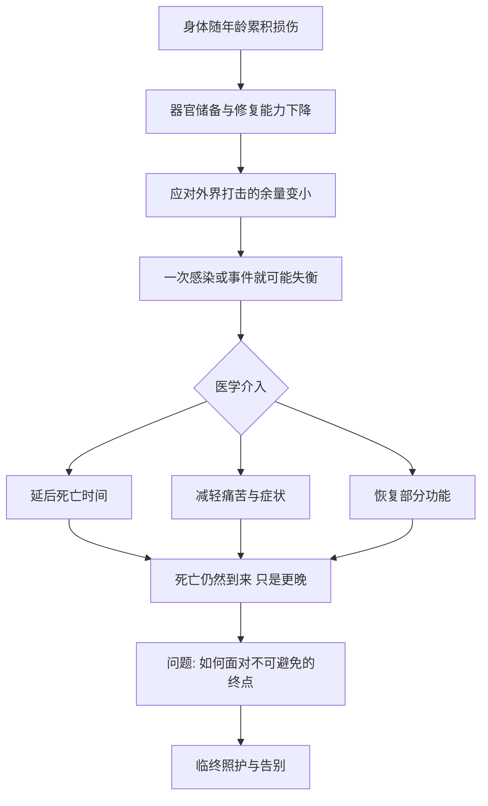

# 16｜人为什么会死？医学能做什么？

> 面对死亡，医学的边界到底在哪里？

---

## 一、先说结论

结论先说清楚：**死亡是生物体的必然终点，医学能极大地延后它、缓解它，却无法取消它。**

从受精卵到成年，从成年到衰老，这条线最终会抵达一个所有生命共有的结局。医学做的，是让这条线尽量走得长一些、稳一些、疼得少一些，而不是让它永不抵达。

布莱森在全书结尾处的态度，既清醒又温和：**承认身体会坏、会死，不是悲观，反而是让我们更认真地对待这具身体——它只借我们用一次。**

---

## 二、我们先理解一个问题

先厘清一个常见混淆：**"老死"其实是一个不准确的词。**

医学上很少有纯粹的"自然老死"。多数人以为的"寿终正寝"，背后往往是某个具体事件：心血管问题、感染、器官衰竭。**死亡通常不是衰老本身，而是衰老让身体失去了抵御某件事的能力。**

这就解释了一个现象：为什么老人的一次肺炎、一次跌倒，可能远比年轻人严重。不是因为那件事本身多致命，而是因为身体的储备和修复能力已经不足。**死因常常写在别处，脆弱才是底色。**

所以理解死亡，不能只看"哪一天"，而要看整条曲线——**从某个时刻起，身体应对打击的余量越来越小，直到某次打击超过余量。**

---

## 三、作者到底提出了什么观点？

布莱森关于死亡的观点，大致可以归纳为几条：

1. **死亡是生物学的必然。** 所有生命都有终点，这不是需要辩解的事，而是需要认识的事。
2. **医学的成就是巨大的，但边界清晰。** 它能把死亡推迟几十年，却从未取消死亡。
3. **死亡不只是生理事件，也是人的事件。** 临终照护、减轻痛苦，是医学不可省略的一部分。
4. **对死亡的态度，反映我们如何看待生命。** 越是否认死亡，越可能错过好好活、好好告别。

他认为，把死亡当作禁忌而回避，只会让人在最需要准备的时候毫无准备。**真正成熟的医学，不只救人于危急，也陪人走完最后一段。**

---

## 四、把这个观点翻译成人话

把人的一生想象成一栋逐渐老化的房子。

年轻时，哪里坏了都能修，甚至能扩建。中年时，修得慢一点，但还能维持。老年时，维修队越来越少，任何一次漏水都可能顺着墙体蔓延。**最终，不是房子"决定"倒塌，而是某一天，一场风雨超过了它能承受的范围。**

医学在这里扮演什么角色？它像一支越来越强的工程队：能堵住突发的漏点，能替换坏掉的管线，能延长使用年限。**但它改不了房子的材质，也改不了"房子终会老"这件事。**

人话版总结：**医学能做的是延长使用期、减少故障带来的痛苦，不是让房子永固。** 而一个人怎么走完最后一段，和这栋房子里的"主人"想怎么告别，同样重要。

---

## 五、为什么会这样？

为什么医学延后死亡，却不能取消死亡？把它拆成一条链：

关键在 **E 这一节点**：医学在同一个环节里，同时做三件事——争取时间、减轻痛苦、恢复功能。它做得很出色，也因此让人产生一种错觉，以为它能一直做下去。

但 **F 和 G 的终点都指向 I**。**医学改变的是死亡的时间、方式与体验，不改变死亡的必然。** 当"延后"已经以巨大的痛苦为代价，医学的重心就必须从"延长生命"转向"照顾生命"——这正是临终照护存在的意义。

---

## 六、举一个现实生活中的例子

看两条线索：**人类寿命的上限与临终照护。**

先说上限。历史上，人类平均寿命的跃升，主要来自婴儿死亡率的下降与感染疾病的控制——也就是说，**更多人能活到老年，而不是每个人都能活得更久。** 而在极限这一端，有确切记录的最长寿者活到一百二十多岁，此后再没有人接近这个数字。

**一些研究者认为**，人类寿命可能存在一个生物学上的上限区间；**另有研究者认为**，随着医学进步，上限仍可能被推高。**关于人类寿命是否存在硬性上限，学界存在不同解释。** 布莱森的问题不在于数字，而在于：**就算把上限再往后推，死亡也依然在那之后。**

再说临终照护。当治疗的目标从"治愈"转为"减轻痛苦、维持尊严"，医学并没有失败，只是换了任务。**研究表明**，良好的姑息与临终照护，能显著改善患者与家属的体验，甚至在某些情况下让人活得更平稳。

这条线索说明：**医学的边界不是一件事，而是两件事——治不了的时候，还能照顾。** 承认前者是诚实，做好后者是责任。

---

## 七、回到书中重新理解

现在再回看布莱森为什么用死亡收尾，就顺了。

全书从"我们对自己的身体一无所知"出发，一路讲皮肤、心脏、免疫、性、发育、衰老。**如果停在衰老，那是一本关于衰退的书；加上死亡，它才是一本关于完整的书。**

他想说的是：**身体的精妙与脆弱是同一件事的两面。** 正因为它会坏、会死，健康才值得珍惜，医学才值得敬畏，日常的选择才有分量。

而"医学能做什么"这个问题，最终指向的是一个更柔软的问题：**当延长生命不再可能，我们愿意怎样度过最后的时光，又愿意怎样告别？** 这不是技术问题，而是人的问题。

---

## 八、这个观点背后还有什么？

**第一，医学的成功改变了死亡的样子。** 过去更多是急性的、突然的；如今不少人是带病长期生存后的缓慢衰退。死亡从"事件"变成了"过程"，这本身就需要新的照护方式。

**第二，寿命的延长并不自动等于生活质量的延长。** 活得更久，可能意味着与慢性病共处更久。**一些研究者认为**，我们应当更关注"健康寿命"，而不只是绝对寿命。

**第三，死亡观影响医疗选择。** 家属是否愿意接受"不再积极治疗"，往往取决于对死亡的理解，而不只是医学判断。沟通在这里和技术一样重要。

**第四，它也重新定义了医学的目标。** 医学不只有"战胜死亡"一个方向，还有"减轻痛苦、维护尊严、陪伴告别"这些同样重要的方向。

**第五，它让人重新看待活着的每一天。** 承认终点存在，反而让人更清楚什么值得投入。

---

## 九、这个观点有问题吗？

有，主要在"边界"与"选择"都很模糊。

**第一，寿命上限是有争议的。** 有人主张人类寿命接近生物学天花板，有人相信干预会不断突破它。**关于这一争论，学界存在不同解释**，把它讲成定论并不诚实。

**第二，"医学不能取消死亡"可能被误读为消极。** 它不是说医学无用，而是在提醒：把死亡当敌人一味死磕，有时会伤害患者最后的尊严。

**第三，临终照护在很多地方仍然不足。** 承认"能照顾"是一回事，现实中能否获得高质量的姑息照护是另一回事。资源和观念差距很大。

**第四，个体差异被平均数掩盖。** 平均寿命、最大寿命都是统计概念，落到每个人身上，情况千差万别，不能用数字替一个人做决定。

**所以更准确的说法是**：医学既不是万能的，也不是无能的；它在"延长"与"照顾"之间不断寻找平衡点，而这个平衡点该划在哪里，需要患者、家属与医生共同决定。

---

## 十、今天再看这个观点

以下部分是基于布莱森思想的现代延伸，不是他的原话。

今天，人类在延后死亡上仍在进步，也在面对新的问题：人口老龄化、慢性病长期化、临终阶段的医疗资源分配。**一些研究者认为**，我们需要的不是"更努力地对抗死亡"，而是"更好地设计生命的最后阶段"。

与此同时，"如何死亡"正在成为公开讨论的话题：预立医疗意愿、安宁疗护、生命末期的选择。这些讨论的核心，不完全是医学，而是价值——**我们希望怎样活，也决定了我们希望怎样走。**

对普通人来说，这篇最实用的延伸也许是：**趁还来得及，和家人谈一次"如果有一天"。** 这不会让死亡变近，只会让告别变得不那么仓促。

---

## 十一、这一篇真正应该记住什么？

1. **死亡是生物学的必然终点。** 医学能延后它、缓解它，但无法取消它。
2. **"老死"往往是脆弱上的最后一击。** 死因常写在别处，脆弱才是底色。
3. **医学的边界有两件事。** 治不了的时候，还能照顾——前者是诚实，后者是责任。
4. **寿命不等于健康寿命。** 活得更久，也要问活得好不好。
5. **如何看待死亡，决定了我们怎样活。** 承认终点，反而让生命更清楚。

---

## 十二、留一个问题

> 如果医学最终只能延后死亡，而不能取消它，
> 那么在不可逆转的那一刻到来之前，
> 你最想守住的，是更多的时间，还是更好的告别？

---

到这里，这套解读走完了：从皮肤到大脑，从免疫到疾病，从性到成长，从衰老到死亡。我们绕了身体一大圈，最后回到最初那个朴素的发现——**我们住在这具身体里一辈子，却可能从未真正认识它。**

布莱森写这本"简史"，从来不是为了让每个人都变成医学专家，而是为了让每个读者在面对体检单、健康传言、衰老与失去时，不至于完全茫然。**他给的不是答案，而是一种姿态：承认无知，保持好奇，对自己这具身体多一点理解与体谅。**

这本书真正的落点，其实在开头：**"我们对身体了解得太少。"** 而读完这十六篇之后，如果有一天你开始主动想知道自己身体的某个部位在做什么，开始在焦虑时先思考、而不是先购买，那么这趟旅程就没有白走。

身体只借我们用这一次。愿你在合上这些文字之后，愿意自己去读它、照顾它，也愿意形成属于你自己的那一份理解——这，才是这本《人体简史》真正想请你做的事。
