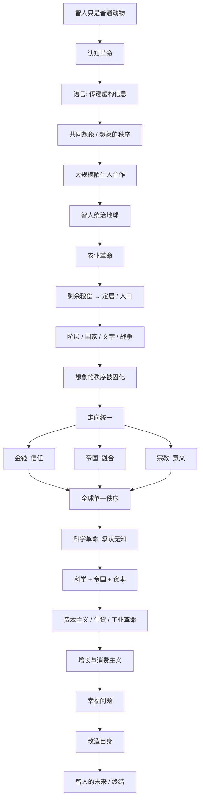

# 《人类简史》深度解读系列

## 系列简介

十万年前，地球上至少生活着六种人类；今天，只剩下我们——智人。我们既不是最强壮的，也不是大脑最大的，却驯化了动植物、建立了帝国、发明了货币和宗教，最后甚至开始改造自己的基因。

《人类简史》讲的正是这个反常识的故事。赫拉利的核心主张是：智人真正的秘密不在个体智力，而在于我们能**大规模、灵活地与陌生人合作**——而支撑这种合作的，是我们共同相信的"虚构故事"。国家、公司、金钱、人权都不是物理存在，却真实地支配着世界。

作者最重要的问题是贯穿全书的：人类如何从非洲一个不起眼的动物，一步步走到今天？这一路是进步，还是骗局？我们到底是更自由了，还是被自己创造的系统困住了？

本系列不按章节复述，而是围绕 **22 个核心问题**重新组织，从认知革命、农业革命、人类融合、科学革命，一路讲到幸福与未来，把这部宏大叙事拆成一套普通读者也能真正理解的课程。

---

## 全书核心问题

| 层次 | 问题 |
|---|---|
| 能力问题 | 智人凭什么能从普通动物变成地球主宰？ |
| 机制问题 | 人类赖以合作的"共同想象"是如何运作的？ |
| 评价问题 | 从认知革命到科学革命，这条路是进步还是陷阱？ |
| 意义问题 | 人类是否真的更幸福？我们又会走向哪里？ |

---

## 全书知识地图



---

## 全系列目录

### 第一部分：智人凭什么是地球的主人（认知革命）

#### 01｜为什么偏偏是智人统治了地球？

核心问题：为什么体格、智力都不占优势的智人，最终消灭了其他人类物种、统治了地球？

核心观点：智人取胜的关键不是个体能力，而是认知革命带来的"大规模灵活协作"能力。这是生物学上一次偶然突变，却让智人跳出了其他动物"只能靠基因缓慢进化"的轨道。

理解难度：★★☆☆☆

关键词：智人、认知革命、尼安德特人、协作规模

---

#### 02｜语言究竟给了人类什么超能力？

核心问题：人类的语言和其他动物的叫声，本质区别到底在哪？

核心观点：动物也能传递信息，但人类语言最大的突破是能谈论**根本不存在的东西**。关键不是"能说"，而是能传递关于从未见过、甚至纯属虚构的事物的信息，从而在群体中创造共同信念。

理解难度：★★☆☆☆

关键词：语言、八卦理论、虚构、共同想象

---

#### 03｜不存在的东西，为什么能改变现实？

核心问题：国家、公司、金钱、人权这些看不见摸不着的东西，为什么能真实地支配世界？

核心观点：赫拉利把它们称为"想象的秩序"——它们存在于**许多人的共同相信**之中，而不是客观物理世界里。一旦相信的人足够多，它就能像真实存在一样组织资源、约束行为。

理解难度：★★★☆☆

关键词：想象的秩序、主体间现实、标致公司、社会建构

---

#### 04｜为什么几万个陌生人能一起合作？

核心问题：为什么人类能组织起几十万人的军队和国家，而黑猩猩最多只能维持几十个成员的小群体？

核心观点：动物群体受"熟人社会"的规模上限约束；人类靠共同的神话、法律、货币和制度，让陌生人之间也能产生信任，从而把合作规模扩大几个数量级。

理解难度：★★★☆☆

关键词：邓巴数、陌生人信任、共同神话、大规模协作

---

### 第二部分：史上最大的骗局（农业革命）

#### 05｜农业革命，为什么被说成“史上最大的骗局”？

核心问题：农业看起来是人类最伟大的进步，赫拉利为什么说它是"史上最大的骗局"？

核心观点：从物种数量看，小麦、牛、鸡空前成功；但从个体生活看，农民比采集者更劳累、更单调、更容易挨饿和生病。农业增加的是整体人口，不是个人幸福。

理解难度：★★★★☆

关键词：农业革命、最大的骗局、物种视角与个体视角、人口陷阱

---

#### 06｜究竟是人类驯化了小麦，还是小麦驯化了人类？

核心问题：谁才是农业革命的真正主角——人类，还是被种植的作物？

核心观点：赫拉利用"反向驯化"的反讽视角指出，小麦通过让人类为它除草、浇水、施肥、定居，把自己的基因传遍世界；人类却为此付出了自由和舒适。这提醒我们：演化的成功不等于个体的幸福。

理解难度：★★★☆☆

关键词：反向驯化、演化视角、舒适陷阱、定居

---

#### 07｜粮食多出来了，为什么普通人反而更苦？

核心问题：农业带来剩余，为什么没有让所有人过得更好，反而制造了贫困与压迫？

核心观点：剩余粮食可以被少数人占有、储存和继承，于是出现了私有财产、税收和"精英阶层"。多数人被固定在自己的土地上，用劳动供养少数人，社会不平等由此被制度化。

理解难度：★★★★☆

关键词：粮食剩余、私有制、阶层、精英

---

#### 08｜国家、文字、战争，是怎么从麦田里长出来的？

核心问题：国家、文字和战争这些庞大的制度，为什么会随着农业一起出现？

核心观点：当人口和事务超出人脑记忆的极限，社会必须发明文字来记录税收、债务和命令；而剩余粮食又养得起士兵和官僚，于是国家、军队与战争成为可能。文字最初不是用来写诗的，而是用来**记账和统治**的。

理解难度：★★★☆☆

关键词：文字、记账、国家、官僚、战争

---

### 第三部分：我们活在自己编的故事里（想象的秩序）

#### 09｜“人人生而平等”，为什么只是近代的发明？

核心问题：我们今天视为天经地义的"平等"，为什么在历史上反而是例外？

核心观点：赫拉利认为，平等和不平等都是"想象的秩序"，没有生物学依据。古代社会用"君权神授""种族优劣"维持等级，近代社会改用"天赋人权""人人平等"来组织合作——变的是故事，不变的是"用共同信念维持大群体"的机制。

理解难度：★★★★☆

关键词：想象的秩序、平等、汉谟拉比法典、独立宣言

---

#### 10｜种族和性别的不平等，是天生的还是编出来的？

核心问题：关于种族和性别的等级差异，有多少是生物学事实，有多少是文化建构？

核心观点：作者立场是：生物学上的人类差异远不足以支撑历史上的等级制度；"种族"是近代政治产物，"性别角色"也大多由文化规定。这里争议最大，也最值得读者带着批判去读。

理解难度：★★★★☆

关键词：种族、性别、生物决定论、社会建构、争议

---

### 第四部分：人类如何走向统一（融合的力量）

#### 11｜为什么互不相识的人，会相信同一种钱？

核心问题：为什么一张本身几乎没用的纸（或一串数字），能让全世界的陌生人愿意交换真东西？

核心观点：钱是人类最成功、最普遍的"信任系统"。它的价值不来自材质，而来自"所有人都相信别人也会接受它"。金钱把陌生人之间无法建立的信任，变成了可以交易的信念。

理解难度：★★★☆☆

关键词：金钱、信任、通用价值、信用

---

#### 12｜帝国为什么是“文化大熔炉”，而不只是压迫者？

核心问题：帝国往往靠武力建立，为什么赫拉利却说它也是文化融合的引擎？

核心观点：帝国用统一的语言、法律、货币和道路把不同族群绑在一起，虽然充满压迫，却也常常创造出混合文化，并被后世继承。今天的"全球文化"很大程度是帝国扩张的遗产。

理解难度：★★★★☆

关键词：帝国、文化融合、同化、遗产、后帝国时代

---

#### 13｜宗教为什么能组织起上亿人？

核心问题：宗教为什么能超越血缘和地域，把素不相识的人组织成庞大的共同体？

核心观点：宗教把"共同相信的秩序"变成超越人类、不可质疑的绝对法则，从而给出统一的道德与身份，让大规模合作成为可能。从泛灵论、多神教到一神教，再到人文主义，都是这个机制的不同版本。

理解难度：★★★☆☆

关键词：宗教、一神教、人文主义、绝对法则

---

#### 14｜金钱、帝国、宗教，有什么共同的秘密？

核心问题：这三个看似不同的力量，为什么都在推动人类走向统一？

核心观点：它们都在构建"我们"——让越来越多陌生人认同同一个秩序。金钱给统一的价值尺度，帝国给统一的政治与法律框架，宗教给统一的终极意义。历史的方向，是更大的共同体不断吞并更小的共同体。

理解难度：★★★★☆

关键词：统一、融合、全球秩序、历史的方向

---

### 第五部分：现代世界是怎么来的（科学革命）

#### 15｜科学革命真正“革命”在哪里？

核心问题：科学革命和以往的知识传统相比，最根本的不同是什么？

核心观点：赫拉利把关键归结为"**承认自己无知**"。此前文明大多认为重要知识已经掌握，而近代科学以"我们不知道"为起点，用观察、实验和数学不断修正，从而获得了持续扩张知识的能力。

理解难度：★★★☆☆

关键词：科学革命、承认无知、观察、实验、知识增长

---

#### 16｜科学为什么和帝国、资本结成了同盟？

核心问题：科学、帝国扩张和资本主义，为什么会在近代紧密咬合在一起？

核心观点：科学需要资金和"收集数据"的机会，帝国需要地图、航海和武器，资本主义需要新市场和新资源——三者形成正反馈：帝国和资本资助科学，科学又反过来增强帝国和资本的力量。看似纯粹的知识，背后往往有利益结构。

理解难度：★★★★☆

关键词：科学、帝国、资本主义、正反馈、探险

---

#### 17｜资本主义为什么会相信“未来一定更好”？

核心问题：资本主义为什么愿意把资源不断投入到"还没发生的未来"？

核心观点：资本主义的核心信条是"增长"——相信未来的总产出会大于今天，因此借贷和投资才有意义。这种对未来的信任，是近代经济区别于古代经济的根本。它既是增长的引擎，也孕育了金融危机。

理解难度：★★★★☆

关键词：资本主义、增长、信用、投资、未来

---

#### 18｜银行凭什么把明天的钱借给今天？

核心问题：银行账户里的钱，真的存在吗？为什么银行能把"不存在的钱"借出去？

核心观点：在现代金融中，信贷很大程度上是"共同想象的信用"：银行只保留少量准备金，靠大家对货币和偿付能力的信任来运转。钱之所以"凭空出现"，是因为信用本身就是一种被广泛相信的秩序。

理解难度：★★★★★

关键词：信贷、准备金、信用创造、银行、金融信任

---

#### 19｜工业革命到底改变了什么？

核心问题：工业革命真正改变的是技术，还是人类与能源、时间的关系？

核心观点：工业革命的本质，是人类学会把能源转化为生产、把生产转化为消费，并用"信贷—生产—消费"的循环实现持续的指数增长。它还重塑了家庭、城市、时间观念，并催生了消费主义。

理解难度：★★★★☆

关键词：工业革命、能源、增长循环、消费主义、时间

---

### 第六部分：幸福与未来

#### 20｜人类越来越富，为什么不一定越来越幸福？

核心问题：财富和寿命都在增长，为什么幸福感没有同步提升？

核心观点：赫拉利综合心理学与生物学指出，幸福感很大程度由基因、预期和人际关系决定，而不是物质绝对水平；它更像一个"恒温器"，会随期望被重新校准。经济增长能改善生活条件，却不一定提高主观幸福。

理解难度：★★★★☆

关键词：幸福、享乐适应、期望、意义、主观感受

---

#### 21｜人类为什么开始试图改造自己？

核心问题：人类为什么不再满足于适应环境，而要改造自身？

核心观点：科学革命让人类从"顺应自然"转向"改造自然"，下一步就是把同样逻辑用到自己身上：基因工程、器官改造、人工智能结合。这一转向的伦理后果，比以往任何革命都更难预料。

理解难度：★★★★☆

关键词：生物工程、义肢、人机结合、改造自身、伦理

---

#### 22｜智人会不会终结？人类的下一阶段是什么？

核心问题：如果人类能设计自己的基因、意识和智能，那么"智人"还是不是一个稳定的物种？

核心观点：赫拉利预见可能出现"神人"或后人类：不再受自然选择和生理限制，甚至出现与人类完全不同的智能形式。这既是可能性也是警告——人类创造的力量，可能最终超出人类自己的控制。

理解难度：★★★★★

关键词：神人、后人类、人工智能、奇点、未来

---

## 推荐阅读顺序

**主线顺序（推荐）：01 → 22，逐篇阅读。**

按认知难度和逻辑依赖，分四段推进：

```text
第一段｜能力的来源（01–04）
   智人崛起 → 语言 → 共同想象 → 陌生人合作
        ↓
第二段｜代价与秩序（05–10）
   农业骗局 → 驯化反转 → 不平等 → 国家文字 → 想象秩序
        ↓
第三段｜走向统一（11–14）
   金钱 → 帝国 → 宗教 → 三大力量合流
        ↓
第四段｜现代与未来（15–22）
   科学革命 → 科学+帝国+资本 → 资本主义 → 银行 → 工业革命 → 幸福 → 改造自身 → 智人终结
```

**阅读建议：**

- **想先抓住全书骨架**：读 01、03、05、14、15、22 六篇即可拼出完整主线。
- **对经济金融感兴趣**：17、18、19 可作为一个独立小单元。
- **对当代议题（AI、生物科技）感兴趣**：直接从 20、21、22 切入，再回补 03、15。
- **想练习批判性阅读**：重点看 09、10、20 三篇，它们是全系列争议最集中的地方。

---

## 全系列状态

> 本系列 22 篇正文已全部完成，每篇独立成文，均采用统一结构：先说结论 → 提出问题 → 作者观点 → 翻译成人话 → 推理链 → 现实例子 → 回到书中 → 深层逻辑 → 争议 → 现代延伸 → 核心结论 → 留一个问题。
>
> 每篇都严格区分「赫拉利的书中观点」「历史/科学事实」「学界争议」「现代延伸」，并对争议处保持开放。
>
> 建议阅读顺序：从 **01｜为什么偏偏是智人统治了地球？** 开始，依次读到 **22｜智人会不会终结？人类的下一阶段是什么？**
