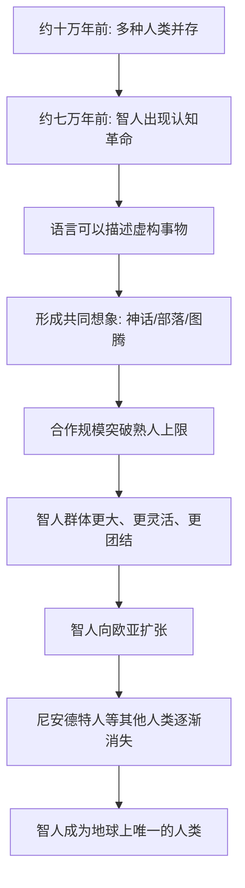

# 01｜为什么偏偏是智人统治了地球？

> 如果人类只是普通动物，为什么最终能够建立如此庞大的文明？

---

## 一、先说结论

赫拉利的答案有点反直觉：智人胜出，不是因为我们最聪明、最强壮，而是因为我们学会了**一起相信不存在的故事**。

大约十万年前，地球上至少并存着六种人类。尼安德特人比智人更强壮，脑容量甚至更大，还能适应寒冷的欧洲。但最后活下来的只有我们。赫拉利认为，转折点发生在约七万年前的一次"认知革命"：智人的语言获得了描述虚构事物的能力，从此刻起，我们可以组织起其他动物望尘莫及的大规模协作。

换句话说，**赢家不是最能单打独斗的那一个，而是最会合作的那一群。**

---

## 二、我们先理解一个问题

我们习惯把"人类"当成一个理所当然的整体，好像地球从来就只有我们一种人。可如果你把时间拨回十万年前，看到的会是一个完全不同的世界——地球上同时生活着好几种"人"。

赫拉利在书里列出了一张名单：

| 物种 | 活动区域 | 特点 |
|---|---|---|
| 智人（Homo sapiens） | 东非 | 就是后来的我们 |
| 尼安德特人 | 欧洲、西亚 | 肌肉发达、耐寒，脑容量比智人更大 |
| 直立人 | 东亚 | 存活时间最长的人类之一，约两百万年 |
| 梭罗人 | 印尼爪哇 | 适应热带环境 |
| 弗洛里斯人 | 印尼小岛 | 身高约一米，被戏称为"小矮人" |
| 丹尼索瓦人 | 西伯利亚 | 后来被基因研究确认存在 |

问题是：如果进化论讲的是"适者生存"，那么更壮、脑更大、更能适应严寒的尼安德特人，为什么反而灭绝了？为什么最后剩下的是我们这些既跑不快、又打不过、身上还没毛的智人？

这不是一个猎奇的问题。它其实是整本《人类简史》的地基：**如果连"我们凭什么赢"都答不上来，后面谈农业、金钱、帝国、科学，全都无从谈起。**

---

## 三、作者到底提出了什么观点？

赫拉利在第一章就抛出一个挑衅性的说法：智人不过是"一种没什么特别的动物"。

他不认为智人的胜利是必然的。在他看来，这并不是一场"优等生战胜差生"的竞赛，而更像历史开的一个玩笑——一群并不占体格优势的动物，因为一次偶然的变化，拿到了通往未来的钥匙。

他把这个变化叫作**认知革命**。

按照赫拉利的说法，大约七万年前，智人的思维方式出现了新的可能，产生了一种前所未有的语言能力。这种能力有三层：

1. **能传递大量关于外部世界的信息。** 比如"河对岸有一群野牛""三天后会下雨"。
2. **能谈论八卦。** 能说清"谁是可靠的、谁在骗人、谁和谁结盟"。这让人能维持更复杂的人际关系。
3. **也是关键的一层——能谈论根本不存在的东西。** 神、精灵、国家、公司、法律、货币、人权……这些在物理世界里找不到，但可以被一群人共同谈论、共同相信。

赫拉利的判断是：**正是第三层，让智人跳出了其他动物的天花板。**

---

## 四、把这个观点翻译成人话

先看动物能做什么。

一群狼、一群黑猩猩，也可以合作，但它们能合作的规模有硬上限。原因很简单：它们只能和**认识的**个体建立信任。而一个群体里能维持的稳定关系数量是有限的（人类学里常提到"邓巴数"，大约150人）。超过了，内部就会因为"谁听谁的""谁分多少"而散架。

所以黑猩猩无法组织起一支五千只的军队，不是因为它们不够凶，而是因为它们没有一套能让陌生个体彼此配合的规则。

智人不一样。

我们可以在完全没见过面的情况下，跟一个陌生人一起排队、一起遵守红灯、一起相信"这张纸能换一碗面"。这不是因为我们天生信任陌生人——恰恰相反，人类对陌生人本能地警惕。真正让合作成立的，是**我们共享同一个故事**。

我打个比方。假设你要和一百个陌生人临时组队完成一件事。如果没有规则，你们会互相猜疑、争抢、内耗。但如果有人告诉你们："我们现在是一个叫'XX 公司'的团队，我是经理，你是财务，他是销售，月底按这个规则分钱。"——即使你和这些人素不相识，甚至不喜欢他们，事情也能运转起来。

"公司"这个东西，你摸得到吗？摸不到。它没有实体。可一旦大家共同相信它，它就能调动资金、雇佣员工、签订合同、承担责任。

**智人的超能力，不是能编故事，而是能让成千上万人相信同一个故事。**

---

## 五、为什么会这样？

把赫拉利的推理拆成链条，大致是这样：

这条链条里最关键的一步，是 **C → E** 的跳跃。

其他动物也能"合作"，但基本是两种模式：一种是血缘合作（家族、蜂群），一种是等级合作（狼群里的头狼）。这两种模式都受"必须认识彼此"的限制。

智人的共同想象打开了一个新空间：**合作不再需要建立在熟人关系上，而可以建立在一个大家共同相信的秩序上。** 于是"族群"可以变成"部落"，"部落"可以膨胀成"民族"，"民族"可以组成"国家"，最后甚至出现跨国公司和全球贸易。

正是这一步，让智人从"一种普通的非洲动物"，变成了能改造整个星球的力量。

---

## 六、举一个现实生活中的例子

想象一场五人组队的竞技游戏。

甲队有一个技术顶尖的玩家，个人操作全场第一，但另外四个人各打各的，谁也不听指挥，见到敌人就冲。乙队五个人个人技术都一般，但开语音、有统一战术：谁先手、谁接应、谁撤退、什么时候打团，全部配合。

结果通常是谁赢？多半是乙队。

尼安德特人和智人的差距，有点像甲队和乙队。考古证据显示，尼安德特人的体格更强、脑容量更大（赫拉利在书里特别强调，尼安德特人的脑比智人还大），个体战斗力很可能更强。但智人拥有的是另一种东西——**更大人数、更灵活的分工、更紧密的协作**。

再想想现代公司。一家公司能让几万人朝着同一个目标工作，靠的不是老板认识每个员工，而是所有人共同接受一整套"故事"：这是我们的品牌，这是我们的 KPI，这是我们的股权，这是我的岗位职责。这些东西没有一个能用手摸到，但没有它们，几万人的组织一分钟都撑不下去。

赫拉利想说的正是同一件事：**从石器时代到今天，让人类变大变强的，一直是"共同相信"这件事。**

---

## 七、回到书中重新理解

现在再回头看赫拉利第一部分的论述，就顺了。

他之所以花那么多篇幅去讲尼安德特人、直立人、弗洛里斯人，不是为了科普人类学，而是要制造一个反差：**在生物学意义上，智人并不是什么天选之子，甚至很多方面不如对手。** 他反复强调智人只是"一种动物"，就是想打破我们那种"人类当然会赢"的事后视角。

接着他把全部重量压到"语言"和"虚构"上。在他看来，智人真正的武器不是更硬的拳头，而是更松的信任——一种可以跨越血缘、跨越陌生人、把大规模合作组织起来的能力。

理解了这一点，也就能理解他为什么要写这样一本"从动物到上帝"的书：他想讲的不只是历史，而是一个更冷的命题——**人类文明的根基，不是真实，而是共同相信。**

---

## 八、这个观点背后还有什么？

这里有几个赫拉利没有完全展开、但很关键的前提。

**第一，演化的"成功"不等于个体的幸福。** 赫拉利衡量一个物种是否成功，用的是"数量、分布、繁衍"，而不是"个体过得好不好"。这个标准后面会反复出现，也是他后来敢说"农业革命是最大骗局"的伏笔。

**第二，"虚构"不是贬义词。** 在日常语境里，"虚构"听起来像骗人。但赫拉利用它指的是**社会性建构**——那些靠共同相信才存在的秩序。国家、货币、公司、法律都是虚构的，可它们对现实有真实的约束力。

**第三，协作规模本身就是力量。** 智人不需要每个个体都更强，只要能凑出更大的协作单位，就能在竞争中胜出。这个逻辑贯穿全书：从部落到帝国，从宗教到全球市场，本质上都是在不断扩大"我们"的边界。

**第四，它为后文埋了线。** 既然文明的根基是"共同想象"，那么这套想象是如何被创造、维持和强化的？答案将在农业、文字、金钱、帝国、宗教里一步步展开。

---

## 九、这个观点有问题吗？

有，而且争议不小。这里要特别提醒：**赫拉利讲的是一个有说服力的解释，而不是学界公认的定论。**

第一，"认知革命"这个说法本身就有争议。赫拉利把它定位在约七万年前的一次突变，但考古证据并不整齐。一些学者认为，象征性行为（壁画、装饰、墓葬）在更早或更长的时间跨度里逐步出现，很难说是某一次突然的"革命"。把它当成一个清晰的时间点，可能过于干净了。

第二，智人取代其他人类的原因，学界有多种解释，且往往并存：

- **语言与认知优势**（赫拉利最强调的）
- **人口数量优势**——智人群体更大，靠数量消化竞争
- **社会组织与分工**——更灵活的联盟与交换网络
- **疾病**——智人从非洲带来的病原体可能重创了没有免疫力的其他人类
- **气候与环境剧变**——冰期波动本身就可能压垮小种群
- **杂交与同化**——基因研究发现，现代欧亚人身上有约1%到4%的尼安德特人 DNA，美拉尼西亚人群中也发现了丹尼索瓦人 DNA。

这说明故事可能比"智人会讲故事所以赢了"复杂得多。赫拉利把权重几乎全压在"虚构能力"上，是一种解释上的聚焦，也可能是一种简化。

第三，把"虚构"说成文明的唯一根基，也有点绝对。工具、火、烹饪、迁徙能力、对环境的适应，同样是智人扩张的条件。语言很可能是**加速器**，但未必是唯一的**起点**。

**所以更准确的说法是**：赫拉利提供了一条非常有力的解释路径——"大规模协作依赖共同想象"；但它是否足以独力解释智人的胜利，学界仍有分歧。

---

## 十、今天再看这个观点

以下部分是基于赫拉利思想的现代延伸，不是他在书里的原话。

赫拉利讲的是七万年前的故事，但它的逻辑在今天反而更清楚了。人类最强的组织，无一例外都是"共同相信"的产物：上市公司、主权国家、中央银行、社交平台、品牌、粉丝群体。

而这也带来一个新的追问，属于我们这个时代的版本：**当"编故事"这件事可以交给机器来做时，会发生什么？**

过去，共同想象要靠人来讲、人来信、人来维护——宗教、神话、民族叙事都需要漫长的传播。今天，算法可以大规模、个性化、几乎零成本地生成叙事，甚至生成"看起来像真的"的图像、声音和视频。如果智人的核心优势是"用故事把人组织起来"，那么当故事的生产权被重新分配，组织人的能力也就被重新分配了。

更极端的问题还在后面：如果有一天，人们开始像信任国家、信任货币一样，去信任一个并非人类的智能体，我们习以为常的"共同想象"结构，会变成什么样？这一点，也是本系列最后一篇要处理的问题。

---

## 十一、这一篇真正应该记住什么？

1. **智人不是天选之子。** 十万年前至少存在六种人类，智人在体格和脑容量上都不占绝对优势，胜出带有偶然性。

2. **关键能力是"共同想象"。** 人类语言最独特的地方，不是能传递信息，而是能谈论根本不存在、却被大家共同相信的事物。

3. **虚构带来规模。** 国家、公司、货币这类"想象出来的秩序"，让合作突破熟人社会的上限，把人组织成几万、几亿的共同体。

4. **这是全书的地基。** 后面所有话题——农业、金钱、帝国、宗教、科学——本质上都是这套"共同相信"机制在不同阶段的展开。

5. **解释有力，但非定论。** 智人取代其他人类的原因，学界仍有语言、人口、疾病、气候、杂交等多种解释，不宜把单一原因当成铁律。

---

## 十二、留一个问题

> 如果智人真正的优势，是能让千千万万陌生人相信同一个故事，
> 那么当 AI 也能生产故事、甚至本身成为人们共同相信的对象时，
> "会讲故事"这件事，还算不算智人的护城河？

---

**下一篇**：既然智人的秘密藏在语言里，那语言到底特别在哪？我们常说"语言能沟通"，可动物也会沟通。二者的差别，真的只是"复杂一点"吗？

下一篇我们就来拆开这个问题——**语言究竟给了人类什么超能力？**
