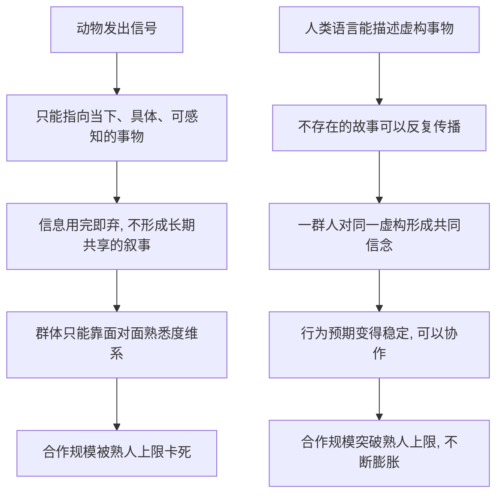

# 02｜语言究竟给了人类什么超能力？

> 人类的语言和其他动物的叫声，本质区别到底在哪里？

---

## 一、先说结论

赫拉利认为，动物也会交流，但人类语言真正的突破不在"信息量更大"，而在于能谈论根本不存在的东西。

猴子的报警声只能表达"有狮子""有老鹰"这类有限而具体的信号；人类语言却可以八卦、可以描述祖先与神灵、可以谈论从未见过甚至纯属虚构的事物。关键不是"能说"，而是能把关于虚构事物的信息传给别人，让一整个群体共享同一套信念。

换句话说，语言给我们最厉害的超能力，不是"描述世界"，而是"创造世界"。

---

## 二、我们先理解一个问题

如果只看"会不会沟通"，人类其实没什么了不起。

蜜蜂会用舞蹈告诉同伴花蜜在哪个方向、有多远；鸟会用叫声警告同类；狗会通过气味、姿态、吠叫表达紧张或友好。动物显然也在"说话"。

于是一个很自然的问题就出现了：**人类语言到底特别在哪里？**

流行的答案通常是：词汇量大、语法复杂、能表达抽象概念。可赫拉利不太认同这个方向。他指出，即使一只经过训练的黑猩猩能认识几百个符号，它依然无法用它来做一件人类小孩每天都在做的事——讲一个谁也没见过、甚至根本不存在的东西。

所以问题不是"人类说得更多"，而是"人类能说的东西，性质不一样"。

---

## 三、作者到底提出了什么观点？

赫拉利在讲认知革命时，把人类语言大致拆成三层能力。

**第一层，传递关于真实世界的信息。** 比如"河对岸有一群野牛""三天后会下雨""那个人偷了肉"。这一层动物也有，只是人类能说的更细、更准、更多。

**第二层，能谈论八卦。** 也就是聊"谁可靠、谁在骗人、谁和谁结盟、谁和谁有过节"。赫拉利引用了一种在学界被称为"八卦理论"的假说：一些研究者（如人类学家罗宾·邓巴）认为，语言之所以演化出来，最初可能就是为了维系群体里的人际关系——用嘴巴"梳毛"，比用手一个个梳效率高得多。

**第三层，也是他真正强调的关键——能谈论根本不存在的东西。** 神、精灵、祖先的传说、部落的图腾、死后的世界、从未到过的地方。这些东西在物理世界里找不到对应物，却可以被一群人共同谈论、共同相信。

赫拉利的判断是：**正是第三层，把人类和其他动物彻底区分开来。** 前两层让人类"更聪明"，第三层让人类"能组织起完全不同的东西"。

---

## 四、把这个观点翻译成人话

想象一只猴子在山坡上放哨。它看到狮子，发出一声尖叫。这声尖叫能传递的信息非常有限：**"危险，有狮子，现在。"** 同伴听到就跑。跑完，这声尖叫就消失了，它不会变成"上次那只狮子后来又回来了"这样的故事。

人类不一样。

同样是面对危险，一个人类可以坐下来跟同伴说："我爷爷讲过，南边那片林子住着一只会说话的豹子，谁进那片林子谁就回不来。所以我们祖先立过规矩，那片林子不能去。"——这段话里，豹子可能根本不存在，祖先的规矩也未必真发生过，但听到的人会认真地避开那片林子。

看出区别了吗？猴子的叫声指向**眼前真实存在的东西**，说完就没了；人类的语言可以指向**不在场的、没见过的、可能根本不存在的东西**，而且这个"不存在的故事"能长期影响大家的行为。

再想想"八卦"。一个几十人的小团体，靠什么维持秩序？很大程度上靠闲聊："他上次答应的事没做到""她人靠谱，可以合作""别信他，他脚踏两条船"。这些信息没有一条能用手摸到，却决定了谁被信任、谁被排挤。赫拉利说，正是这种能力，让人能维持比黑猩猩更大、更复杂的群体。

而最关键的一步是：**当一群人能共同想象同一件不存在的事，他们就能围绕它组织起来。** 这是后面所有"国家、公司、金钱、法律"故事的起点。

---

## 五、为什么会这样？

把赫拉利的推理拆成两条路，对比就清楚了。

两条路的分岔点，在于**信息能不能"脱离当下、指向不存在"**。

动物的信号大多绑定在具体的刺激上：看到狮子才叫，看到老鹰才叫，信号是刺激的"影子"。人类的语言却可以让信息脱离当前环境：现在没有狮子，我们照样能讨论狮子；甚至狮子的传说、豹子的禁忌，也可以谈。

一旦信息可以脱离当下，它就能被反复复述、代代相传，慢慢变成一套大家共同接受的"背景设定"。有了这套背景设定，素不相识的人也能对彼此的行为产生稳定预期：我知道你会遵守那个规矩，你也知道我知道——于是协作才有可能。

所以语言的核心价值，不只是"传递信息"，而是**在人脑中安装同一套软件**。

---

## 六、举一个现实生活中的例子

看你的微信群聊和朋友圈。

一个一百多人的微信群，绝大多数人其实互不认识。可这个群能运转起来，本身就很神奇。它的前提是所有人都接受了一个共同框架——"这是公司项目群"或者"这是小区业主群"。这个框架没有任何物理形态，但每个人都照着它说话、做事。

然后看群公告的作用。一条"本周五前提交材料，逾期算缺勤"，就能让一百个彼此不熟的人在同一时间、按同一标准行动。有人可能会抱怨，但通常会照做。这不是因为大家怕发布公告的这个人，而是因为大家共同接受了"群规则算数"这件事。

再看八卦功能。群里偶尔会有人问："这个人靠谱吗？""上次那个供应商怎么样？"——这些闲聊，本质上就是赫拉利说的第二层：用语言维护群体里的信任与联盟。它决定了以后谁被愿意合作，谁被默默拉黑。

朋友圈则展示了第三层。一个人发"从今天起，我要每天早起跑步"，还配上打卡。这里的"未来的、自律的我"其实还不存在，是一个被想象出来的形象。可这条公开的宣告，会真实地约束他明天的行为，也会让朋友们开始用那个形象来看待他。一个不存在的设定，被说出来、被大家看见之后，就产生了真实的影响。

这就是人类语言最不显眼、又最强大的地方：**我们靠谈论不存在的东西，来协调彼此真实的行为。**

---

## 七、回到书中重新理解

现在再回看赫拉利关于语言的论述，就能明白他为什么把重点放在"虚构"上。

他并不是在说"人类语言比动物语言高级"，而是在说：人类语言的独特之处，是让**传说、神话、神、宗教**这类共同想象成为可能。当一群人共享同一个故事，他们就能以动物无法想象的方式合作。

赫拉利特别提醒，这些故事之所以有力量，不是因为它真实，而是因为**大家都相信**。一个部落的祖先传说、一个民族的起源神话、一个宗教的来世图景，没有一个是能用实验证明的，但它们能让人牺牲、让人服从、让人结盟。

所以语言的真正威力，不在"说清事实"，而在"建立共识"。它为下一层问题铺好了路：既然大家能共同相信虚构的东西，那这些虚构的东西，凭什么能支配现实世界？

---

## 八、这个观点背后还有什么？

有几个容易被忽略的前提。

**第一，"虚构"在这里是中性词，甚至带褒义。** 日常说"虚构"像是在指骗人，但赫拉利用它指的是那些靠共同相信才存在的秩序。它不是"假的"，而是"社会性的"。这两者的区别，下一篇会重点讲。

**第二，语言的本质功能是协调，不只是描述。** 如果只把语言看成"给世界贴标签"，会低估它。它更像一套让一群人运行同一个程序的协议。

**第三，共同想象需要被维护。** 故事不会自己活着。它要靠反复讲述、仪式、教育、惩罚来续命。一旦没人讲了，它就慢慢失效。

**第四，这直接接上了上一环。** 认知革命的核心机制，正是语言能传递虚构信息；而让智人胜出的"大规模协作"，又依赖这套机制。三者是一条链，不是三件独立的事。

---

## 九、这个观点有问题吗？

有，而且这里要特别小心，因为赫拉利的讲法相当"干净"，而真实情况更模糊。

**第一，动物到底能表达什么，可能被低估了。** 现代动物行为学发现，一些灵长类、鸟类、海洋哺乳动物的交流系统比赫拉利描述的更复杂：有的报警叫声会按捕食者类型区分，有的能组合出不同含义，有的能被学习、被模仿。关于"动物只能传递有限信息"的说法，学界存在不同解释，不宜当成铁板一块的事实。

**第二，"八卦理论"是假说，不是定论。** 语言究竟为什么演化出来，至今没有共识。除了"社交梳理"说，还有手势起源说、共同劳动协作说、歌唱与情绪交流说等。用八卦来解释语言的起源，是一种有影响力的猜想，但谈不上已经被证实。

**第三，"虚构能力为人类独有"这个边界，可能被划得太利落。** 动物是否完全没有某种形式的想象、欺骗或符号使用，仍有争论。

**第四，把语言的作用几乎全压在"虚构"上，也可能是一种简化。** 传递真实信息、协调狩猎、传递技术，同样重要。虚构很可能是**加速器**，但未必是唯一的关键。

所以更准确的说法是：赫拉利提供了一个有力的视角——人类语言最独特的产物是"共同想象"；但它是否就是语言的本质、是否是唯一的关键，学界仍有分歧。

---

## 十、今天再看这个观点

以下部分是基于赫拉利思想的现代延伸，不是他在书里的原话。

赫拉利谈的是七万年前的语言，但今天这件事反而看得更清楚了。我们几乎生活在一个由"语言创造的现实"包裹的世界里：朋友圈里精心经营的人设、品牌讲述的创业故事、短视频里被剪辑出来的"真实"、粉丝群体共享的梗和身份认同。这些东西都不在任何物理实验里存在，却能真实地影响消费、投票、甚至市场涨跌。

更值得警惕的是，当生成内容变得极其便宜，共同想象的"生产成本"被大幅降低了。过去，一个能让人相信的故事要靠宗教、民族、媒体长期培育；今天，一条被反复转发的内容，就可能在几天内造出一个被无数人共享的"事实"。

这里出现了一个新的追问：**如果一群人能共同相信的东西，不再需要与任何真实发生的事对应，那么"共同信念"还能不能承担它过去承担的协作功能？** 这个问题，超出了赫拉利的原话，却是他的思路在今天最自然的延续。

---

## 十一、这一篇真正应该记住什么？

1. **动物也沟通，差别不在"能不能说"。** 蜜蜂、鸟、猴子都能传递信号，人类语言的特别之处不在信息量或语法。

2. **关键突破是"能谈不存在的东西"。** 赫拉利把语言分为传递真实信息、八卦、谈论虚构三层，其中第三层才是核心。

3. **虚构信息能变成共同信念。** 一个不存在的故事被一群人共同相信，就能稳定彼此的预期、协调彼此的行为。

4. **语言的威力是"安装同一套软件"。** 它让人脑中运行同一个程序，从而让协作突破熟人关系的限制。

5. **这一观点有说服力，但非定论。** 动物的交流能力、语言的起源、虚构是否人类独有，学界都还有不同解释。

---

## 十二、留一个问题

> 如果人类语言的独特力量，是把"不存在的东西"变成一群人共同相信的信念，
> 那么当这种能力被用来批量制造根本不对应任何事实的"共同信念"时，
> 我们该把它看成语言的胜利，还是语言的失控？

---

**下一篇**：语言能让人共同相信虚构的东西，可是国家、公司、金钱、人权这些看不见摸不着的存在，凭什么能真实地调动资源、约束行为、甚至决定一个人的生死？这中间到底发生了什么？

下一篇我们就来拆开这个问题——**不存在的东西，为什么能改变现实？**
