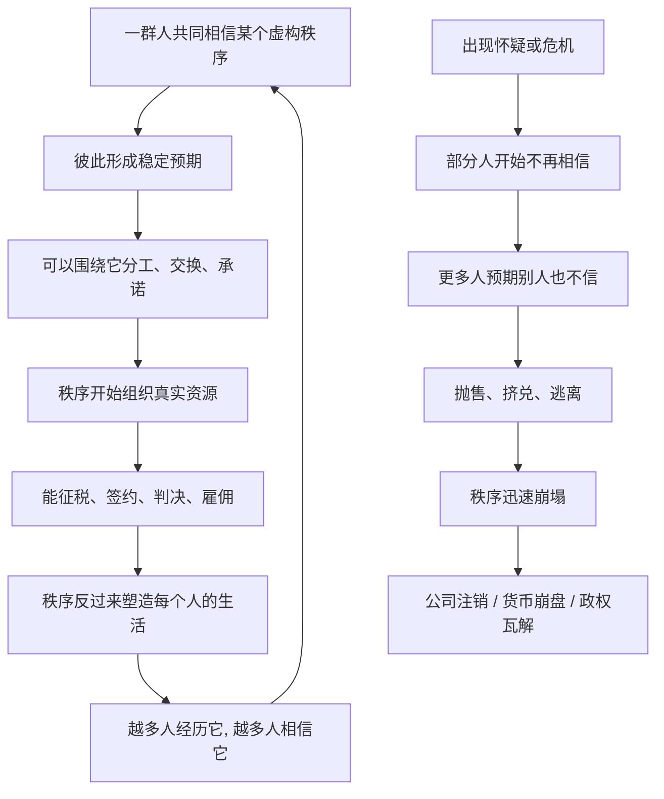

# 03｜不存在的东西，为什么能改变现实？

> 国家、公司、金钱、人权这些看不见摸不着的东西，为什么能真实地支配世界？

---

## 一、先说结论

赫拉利认为，这类东西属于"想象的秩序"：它们不存在于物理世界，而存在于许多人的共同相信之中。他把这种存在方式称为"主体间现实"——不是某个人的主观幻想，而是许多人心灵之间共享的东西。

一旦相信的人足够多，它们就能像真实存在一样调动资源、约束行为。金钱能让人干活，公司能拥有资产、签订合同、被告上法庭，国家能征税、开战、决定谁能入境。它们没有实体，却比很多实体更有力量。

而更关键的是：**一旦共同信念崩塌，这些秩序会像出现时一样，迅速消失。**

---

## 二、我们先理解一个问题

先问一个看起来有点傻、但非常要紧的问题：**一家公司，究竟在哪里？**

你可以去它的工厂，看到厂房、机器、员工；你可以去总部，看到办公室、招牌、logo。可是如果工厂拆了、员工换了、logo改了、总部搬了，"这家公司"似乎还在。它还能继续签合同、还债、被收购。

那它到底住在哪里？它是一堆厂房和设备吗？显然不是。它是老板这个人吗？也不是，老板可以换。它是法律文件吗？文件只是纸。

同样的问题可以问金钱。你支付宝里的余额，是"钱"吗？它只是服务器上的一串记录。可它为什么能换来一杯奶茶？为什么所有人都愿意收？

再问国家、人权、法律。这些东西你在街上都找不到，可它们每天都在决定你能不能结婚、能不能出国、能不能告别人、能不能不被别人告。

它们看不见、摸不着，却真实地支配着世界。这中间到底发生了什么？

---

## 三、作者到底提出了什么观点？

赫拉利用一个非常具体的例子来说明——标致汽车公司。

他提醒我们，你走在街上，是找不到"标致公司"这个实体的。你能看到的只有汽车、厂房、机器、员工、股东、银行账户和一堆法律文件。可是当某一天公司破产清算，厂房还在、机器还在、员工还在，"标致公司"却会依法"消失"——它作为法律实体被注销了，从此不能再签合同、不能再被告。也就是说，构成它的那些物理东西都还在，消失的只是那个"公司"本身。

那它到底存在在哪里？赫拉利的答案：**它存在于我们共同的想象和法律之中。** 更准确地说，它是被一群人共同相信、并被制度固定下来的一套秩序。

为了讲清这一点，他把"存在"分成三种：

| 存在类型 | 存在于哪里 | 例子 | 特点 |
|---|---|---|---|
| 客观存在 | 物理世界 | 石头、河流、重力、细菌 | 不依赖人的想法，谁不信都存在 |
| 主观存在 | 某个人的心里 | 我的头疼、我的梦境、我的幻想 | 只属于一个人，别人无法直接进入 |
| 主体间存在 | 许多人之间，被共同相信 | 国家、公司、金钱、法律、人权、宗教 | 不是我一个人信，而是"大家都信"，并且知道"大家都信" |

"主体间"这个词很关键。它不是主观的，因为不是只有你一个人信；它也不是客观的，因为你没法用手摸到、用仪器测到。它悬在许多人之间，靠共识维持。

赫拉利由此判断：**任何大规模的人类合作，都建立在共同相信的秩序之上。** 这些秩序不是谎言，也不是物理事实，而是一种特殊的现实——它需要被相信才能存在，也可能因为不再被相信而消失。

---

## 四、把这个观点翻译成人话

先看钱。

一张纸币本身几乎没什么用，不能吃、不能穿、烧了还污染空气。它之所以能换东西，是因为**所有人都相信别人也会接受它**。这里有个循环：我相信这张纸有价值，是因为我预期别人也相信它有价值；别人相信它有价值，是因为他们预期我也会接受。这个循环一旦转起来，纸就变成了钱。

支付宝、微信支付里的余额更极端——它连纸都没有，只是一行数据库记录。可它能真实地买到奶茶，因为顾客、店员、平台、银行、监管者都共同相信"这套账会兑现"。你相信的不是那串数字，而是"整个系统会认这串数字"。

再看公司。法律甚至直接给它造了一个词——"法人"。它被当成一个能签合同、能拥有财产、能承担责任、能被告上法庭的"人"。你没法跟"工厂"打官司，但你能跟"公司"打官司。公司不是物理实体，可它拥有比很多物理实体更大的权力：它能开除人、收购别人、决定成千上万人的生计。

公司破产、货币崩盘，都是同一个道理：**秩序不在物理世界里，它在人们的共同相信里；信念一走，秩序就散。**

---

## 五、为什么会这样？

赫拉利的推理，可以画成两条方向相反的链：一条是秩序如何建立，一条是秩序如何崩塌。

左边这个循环是秩序的"自我强化"：越多人相信，秩序就越有效；越有效，就越多人亲身体验到它、越倾向相信它。这就是为什么国家、货币、公司一旦建立，往往能稳定存在很久。

右边这条链是秩序的"自我瓦解"：信念的维持需要预期一致。一旦有人开始怀疑，怀疑本身就会传染——因为相信别人会相信，才是你相信的真正理由。这就是为什么金融恐慌、政权崩溃往往来得非常突然。

赫拉利想强调的是：这两种过程都发生在"主体间"的层面，也就是许多人共享的信念里，而不是在物理世界里。物理世界提供材料和载体（纸张、建筑、服务器、枪炮），但真正让秩序成立的是共同相信。

---

## 六、举一个现实生活中的例子

还是回到支付宝和标致汽车。

**支付宝余额。** 你账户里有一百元。它既不是硬币，也不是钞票，严格说是服务器上的一条记录。但你走进便利店，扫一下，店员就给你一瓶水。整个过程之所以成立，是因为你和店员都相信同一件事：支付宝会记账、银行会结算、这一百元明天还能买别的东西。这条信念链上任何一个环节被普遍怀疑，交易就会立刻变难。你自己信不算数，得"大家都信"才算数。

**人民币。** 一张百元钞为什么值一百元？不是因为纸的材质，而是因为无数人共同相信它会一直能买东西，并且相信别人也会继续接受它。这个信念让它可以用来发工资、缴税、还债。它没有物理价值，却能调动整个社会的劳动和资源。

**标致汽车公司。** 你去看它的工厂，能看到钢铁和工人；你去看它的文件，能看到股权和章程。但"标致公司"本身，你在任何一个坐标上都找不到。它是靠法律和共同承认"活"着的。它可以拥有工厂、雇佣员工、借钱、被人收购，也可以在资不抵债时被法院宣告破产——从法律上"死亡"。工厂本身不会死亡，公司会。这正是赫拉利想说的：公司是主体间现实，不是物理现实。

把这三件事放在一起看，你会发现它们共享同一个结构：**一个没有实体的东西，靠一群人的共同相信，获得了支配真实世界的能力。**

---

## 七、回到书中重新理解

现在再回头看赫拉利的论述，就能理解他为什么把它叫"想象的秩序"而不是"谎言"。

他反复强调，这些秩序不是随便编的、也不是纯粹的骗局。它们通常被**嵌入物质现实**：货币有实物载体，法律有文件、法庭和警察，公司有厂房和员工，国家有边界、军队和税收系统。也就是说，想象的秩序和物理世界不是两张皮，而是互相纠缠、互相支撑的。没有物质基础，秩序难以维持；没有共同相信，物质基础也组织不起来。

同时，赫拉利指出，想象的秩序往往通过**教育、仪式、习惯和暴力**被不断加固。小孩从小被教导"这是我们的国家""这是我们的钱""这是法律"，长大后就把它当成天然现实。没有人会每天提醒自己"国家只是想象"，因为一旦这么想，整个生活的基础都会晃动。

理解了这一点，也就理解了赫拉利那句贯穿全书的判断：**大规模人类合作，建立在共同相信的虚构秩序之上。** 这句话既是他的描述，也是他的警示。

---

## 八、这个观点背后还有什么？

**第一，它是上一环的直接延伸。** 语言能谈虚构（上一篇），所以人类才能共同相信一套不存在的秩序（这一篇）。没有前者，后者无从发生。

**第二，它重新定义了"真实"。** 我们习惯把"真实"等同于"能摸到"，但主体间现实提示我们：对人的生活影响最大的东西，往往恰恰是摸不到的。地位、信用、名誉、承诺、法律效力，都属于这一类。

**第三，它预设了人的认知是"通过故事理解世界"的。** 人并非先看清世界再编故事，而是先活在故事里，再在里面行动。这一点后面讲性别、种族、平等时会更明显。

**第四，它是双刃的。** 想象的秩序既能让人协作，也能制度化压迫。等级、特权、歧视，同样可以被"共同相信"包装成天经地义。这也是赫拉利后面争议最大的地方。---

## 九、这个观点有问题吗？

有。这里要提醒读者，"想象的秩序"是一个很有启发性的框架，但它并不是没有对手的定论。

**第一，把金钱、国家叫"虚构"，可能低估了它们的物质性和强制力。** 它们确实靠共同相信，但它们也有枪炮、警察、监狱、资源分配作为后盾。关于这一问题，学界存在不同解释：一派强调社会建构和共识，另一派强调权力、暴力和物质基础。说"公司只是想象的"，可能会让人忽略它背后真实的强制力。

**第二，"主体间现实"这个概念并非赫拉利首创。** 在哲学和社会学里，关于制度性事实、社会建构的讨论已有很多（例如社会学家伯格和卢克曼关于"现实的社会建构"的论述，以及哲学家塞尔的制度性事实理论）。赫拉利的贡献更多是把这些思想用叙事讲给大众，而不是提出了一个新发现。这一点值得如实说明。

**第三，把复杂制度归为"共同相信的故事"，是一种简化。** 制度还依赖路径依赖、利益结构、组织惰性、失败的替代方案等等。为什么坏的制度还能长期存在？光用"大家相信"解释是不够的。

**第四，边界模糊。** 什么算"想象的秩序"、什么算"客观事实"？有些东西介于两者之间，硬分成三类，清楚但可能过于干净。

所以更准确的说法是：赫拉利提供了一把很好用的"钥匙"，帮我们看见制度背后的信念结构；但这把钥匙并不能单独解释制度为什么强大、为什么持续、为什么崩塌。

---

## 十、今天再看这个观点

以下部分是基于赫拉利思想的现代延伸，不是他在书里的原话。

赫拉利谈的是国家和公司，但今天我们身边多了几样更"纯"的想象秩序。

加密货币是一个极端例子。它没有央行背书、没有实体、没有领土，价值几乎完全来自参与者的共同相信。它把"货币的价值来自共识"这件事，做成了一个可以直接观察的实验：有人因此暴富，也有人因此归零。它是不是"成功"，取决于共识能不能维持，而不是取决于任何物理属性。

另一个例子是平台上的信用与身份。粉丝数、评分、等级、会员、虚拟财产，全都不是物理事实，却能带来真实的商业机会、社会地位和资源。一个人可以因为"账号被认可"而获得工作、收入、影响力。它们同样具备"主体间现实"的全部特征——你一个人不信没用，得大家一起信。

这里出现一个新的追问：**当我们越来越多地依赖这些依赖共识的秩序生活时，共识的稳定性本身就成了最大的风险。** 共识一旦碎裂，崩塌可能比过去任何时候都更快。这个判断是赫拉利思路的现代延伸，不是他书里的原话。

---

## 十一、这一篇真正应该记住什么？

1. **"想象的秩序"不是谎言，是主体间现实。** 它存在于许多人的共同相信里，既不是物理事实，也不是某个人的主观幻想。

2. **标致公司是最好的例子。** 你找不到"公司"这个实体，但工厂和员工都还在时，公司却可以依法"死亡"——因为它是法律和共识的产物。

3. **三种存在要分清。** 客观存在（石头）、主观存在（我的梦）、主体间存在（货币、国家、公司），三者的成立条件完全不同。

4. **秩序可以被信念建立，也可以被信念摧毁。** 公司破产、货币崩盘、政权瓦解，都是共同相信消失的过程。

5. **框架有力，但不是唯一解释。** 权力、暴力、物质基础同样是制度得以运转的原因，这个观点与其他理论并存，不宜当成全部答案。

---

## 十二、留一个问题

> 如果金钱、公司、国家都只是"很多人共同相信"才成立的东西，
> 那么当共同相信的规模本身成为衡量力量的标准时，
> 究竟是什么在决定——哪一些故事能吸引到足够多的人去相信？

---

**下一篇**：我们已经知道，共同相信能让虚构的东西获得力量。可人类面对的，是一个几万、几十万甚至上亿陌生人的世界。为什么我们能与素不相识的人合作，而黑猩猩最多只能维持几十个成员的小群体？这条"规模鸿沟"到底是怎么跨过去的？

下一篇我们就来拆开这个问题——**为什么几万个陌生人能一起合作？**
