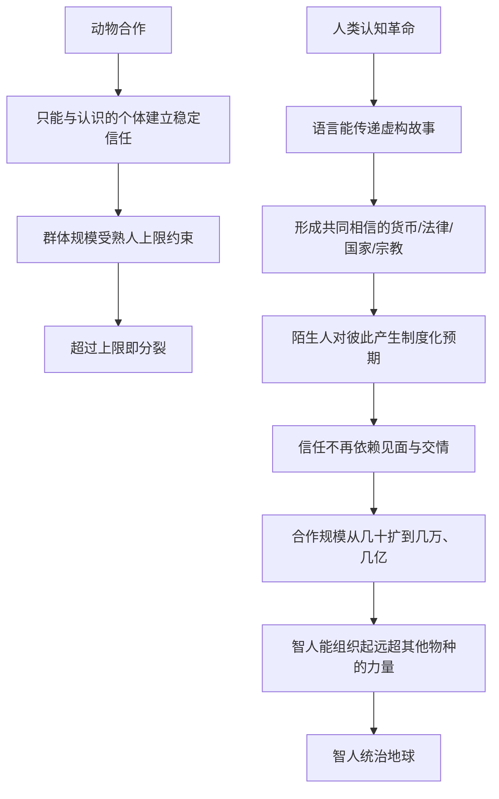

# 04｜为什么几万个陌生人能一起合作？

> 为什么人类能组织起几十万人的军队和国家，而黑猩猩最多只能维持几十个成员的小群体？

---

## 一、先说结论

赫拉利认为，动物群体的合作受"熟人社会"的规模上限约束：黑猩猩只能和认识的个体建立稳定关系，群体一超过几十只就会分裂。人类则靠共同相信的神话、法律、货币和制度，让陌生人之间也能产生可预期的信任，从而把合作规模扩大几个数量级。

金钱让陌生人愿意交易，国家让陌生人愿意纳税，法律让陌生人愿意履约，宗教让陌生人愿意彼此认同。这些"共同的故事"，正是智人能从普通动物变成地球主宰的直接原因。

一句话：**人类赢，不是因为我们更强，而是因为我们能把互不相识的人组织进同一个秩序里。**

---

## 二、我们先理解一个问题

黑猩猩其实是一种非常社会化的动物。它们会结盟、会调解冲突、会互相梳毛、会一起猎杀猴子。论"社交能力"，它们并不比人差多少。

可你有没有发现：黑猩猩的群体规模，通常只有几十只。它们没法组织起五千只的军队，没法建立几万只的"黑猩猩国家"，更没法让不同群的陌生黑猩猩为了一个共同目标放下敌意。

人类却可以。一支军队可以让几十万素不相识的年轻人穿上同一套制服、服从同一套命令、为同一面旗帜去死。一个国家的上亿公民，绝大多数互不认识，却愿意遵守同一套法律、使用同一种货币、缴同样的税。

这中间就有一个巨大的谜题：**为什么人类的合作规模能比黑猩猩大上好几个数量级？**

我们既没有比它们更强壮，也没有比它们更"天生友善"。那么，到底是什么跨越了这条鸿沟？

---

## 三、作者到底提出了什么观点？

赫拉利的回答，可以拆成两步。

**第一步，看到动物合作的硬上限。** 动物群体的合作，基本建立在熟悉关系上：彼此认识的同类之间才能形成稳定的信任和等级。人类学里常被引用一个数字——"邓巴数"，大约150人。这是英国人类学家罗宾·邓巴提出的一个估计：灵长类大脑新皮层的大小和它能维持的稳定社交关系数量有关，换算到人身上，大致是150人左右。学界对具体数字有争议，但一个直觉被广泛接受：**只靠熟人关系，群体规模是有天花板的。**

**第二步，看人类如何突破。** 赫拉利认为，人类靠的不是更亲密的私人关系，而是一套可以让陌生人共享的"故事"。金钱、国家、宗教、法律、公司——在他看来，都是让陌生人能够合作的神话。你不需要认识对方，也不需要喜欢对方，只要你们共同相信同一套秩序，就能分工、交换、承诺、追责。

他的关键判断是：**任何大规模的人类合作，都建立在只存在于集体想象中的共同神话之上。** 智人之所以能组织起远超其他动物的群体，正因为他们能创造并传播这类故事。

---

## 四、把这个观点翻译成人话

先设想一个再普通不过的场景：**你会把钱借给谁？**

答案几乎总是身边的人——亲戚、朋友、熟人。因为他们认识你，你也认识他们，出了事你能找到人。你不会随随便便把钱借给一个从没见过的外地人。这不是你小气，而是人类的默认设置：信任陌生人是有风险的。

可现实里，银行每天都在把钱借给陌生人。你去办房贷，银行根本不认识你，却愿意借出几百万。它凭什么敢？凭的是一整套共同相信的制度：法律能强制执行、征信能记录你的行为、央行和金融系统在背后支撑、房子可以抵押。银行相信的**不是**你这个人，而是这套制度。

国家也是同一个逻辑。你为什么要给一个你这辈子都不会见面的官员交税？为什么要和几千万陌生人遵守同一套交通规则？因为你们共同相信"国家""法律""公民身份"这些看不见的框架。它们让你对一个完全陌生的人，产生了一种**制度化的信任**：我知道他会守规则，因为规则对我们俩都算数。

用一个类比：一款大型多人在线游戏，几百万玩家在线，绝大多数互不相识，来自不同地方、说着不同语言，却能组队、交易、分工。他们靠的不是交情，而是所有人都接受了同一套服务器规则。

人类社会的货币、法律、国家，本质上就是这套"服务器规则"。区别只在于，它不在服务器里，而在我们共同的想象里。

---

## 五、为什么会这样？

赫拉利的推理，可以分成两条并行路径：动物的路径和人类的路径。

这条链里最关键的一跳，是 **H → I**：**信任的来源改变了。**

在动物那里，信任来自熟悉：一起长大、互相梳过毛、打过架后重新排序，信任是"人对人"的。在人类这里，信任可以被"外包"给制度：我不需要认识你，只需要相信你也会遵守同一套规则。这个转变听起来简单，却把合作的计量单位从"几十"抬到了"数以亿计"。

顺带说明，这也是为什么赫拉利把"大规模协作"看成智人胜出的直接原因：当你能组织起几万人的部队、几万人的工程、几亿人的市场，你在竞争中的力量就和其他动物完全不在一个量级。

---

## 六、举一个现实生活中的例子

**奥林匹克运动会。**

每四年一次，来自两百多个国家和地区的运动员、教练、裁判、志愿者、观众聚到一起。他们绝大多数互不认识，很多人甚至来自政治对立、语言不通、文化差异极大的地方。可他们能在同一套规则下比赛，住在同一个奥运村里，接受同一个奖牌的含金量，为同一套"更快、更高、更强"的价值欢呼。

奥运五环没有任何物理力量，奥林匹克宪章也不是靠暴力执行。它之所以能让几万个陌生人协调行动，是因为所有人都共同相信同一件事：这是一场大家都认的比赛，规则对每个人都算数，金牌代表同样的荣誉。一旦参赛者普遍不再相信这一点，奥运会立刻就会散掉。

**开源社区和维基百科。**

维基百科由几百万互不相识的志愿者用不同语言共同维护。没有人给他们发工资，没有血缘关系，没有行政命令。他们能协作，靠的是共同相信的一整套规则——中立、可查证、协作编辑，以及"为人类共享知识"这个叙事。

开源软件更明显。像 Linux 这样的项目，成千上万的开发者分布在世界各地，绝大多数从未见过面，很多人甚至互为商业竞争对手。可他们能一起写出、维护一套被全球使用的操作系统，靠的是许可证（一套法律故事）、代码规范、邮件列表文化和共同的目标。

这两个例子都指向同一件事：**当陌生人共享同一套被相信的规则和叙事，他们就能完成任何熟人小团体都不可能完成的合作。** 这正是赫拉利说的"共同神话"在今天的日常版本。

---

## 七、回到书中重新理解

现在再回看赫拉利的论述，就能理解他为什么把它放在全书这么靠前的位置。

他明确区分了两种合作：一种是"熟人之间的合作"，动物也能做到；另一种是"陌生人之间的大规模合作"，这才是人类独有的能力。他反复举例——国家、公司、人权、法律、金钱、宗教——都是在说明同一个机制：**这些故事只存在于人们的集体想象中，却能让互不相识的人围绕它们组织起来。**

他还特别提醒，这种能力不是人类天生善良、天生信任陌生人。恰恰相反，人对陌生人本能地警惕。真正让合作成立的，是制度层面的共同相信：不是因为我相信你这个人，而是因为我相信"你会被规则约束"。

这也直接回答了上一篇留下的问题：为什么几万个陌生人能合作？因为他们并不是在互相认识的基础上合作，而是在**共同相信的基础上合作**。这条结论，又回过头去支撑了本书最开始的问题——智人凭什么能统治地球。

---

## 八、这个观点背后还有什么？

**第一，它把"信任"从人际层面提升到了制度层面。** 现代社会之所以能运转，是因为大量信任被外包给了货币、合同、征信、法律和平台。理解这一点，才能理解现代经济为什么可能。

**第二，共同神话需要持续维护。** 它不是一次性完成的，而要靠教育、仪式、媒体、纪念碑、节假日、强制力反复加固。故事一旦没人讲了，秩序就会松动。

**第三，它同时是权力的来源。** 谁能定义大家共同相信的故事，谁就掌握了组织陌生人的能力。立法、宣传、教育、货币发行，本质上都是在争夺"故事的定义权"。

**第四，它是双刃剑。** 大规模合作带来了文明，也带来了大规模暴力。正因为人类能组织起几百万人的军队，才能发生大规模战争与屠杀——这是其他动物做不到的。赫拉利在书里并没有把"大合作"简单浪漫化。

**第五，它串起了前两篇。** 语言让人能谈虚构，虚构形成想象的秩序，想象的秩序让陌生人合作。三篇是一条不断放大的链条。

---

## 九、这个观点有问题吗？

有，而且值得认真对待。

**第一，"邓巴数"本身有争议。** 150 这个具体数字，是基于灵长类脑容量与群体规模的相关性外推出来的，方法有局限，样本也有限。后续研究对精确数字提出过质疑。更稳妥的说法是：**"熟人关系有规模上限"这个直觉被广泛接受，但把它精确成某个数字要谨慎。**

**第二，动物真的一律只能靠熟人吗？** 蚂蚁、蜜蜂、白蚁能组成几万甚至上百万个体的"超个体社会"，规模远超人类。但它们靠的是基因、化学信号和高度固定的分工，而不是共同相信。这其实反过来支持了赫拉利的观点——真正特别的是人类的机制，而不是单纯"规模大"。

**第三，把制度只解释成"共同相信的故事"可能不够。** 制度同样依赖物质强制：税收要能收得上来，法律要有警察和法庭，边界要有军队。关于这一问题，学界存在不同解释：一类强调共识与信念，另一类强调权力、暴力和资源控制。共同信念很可能是**必要条件之一**，而不是全部。

**第四，赫拉利的讲法偏乐观和整洁。** 真实历史里，很多"共同神话"是伴随着征服、奴役、屠杀被强加给别人的，并不总是温暖的共识。把它一律描述为"合作的基础"，可能会淡化其中的强制与不公。

所以更准确的说法是：赫拉利给出了一个非常有解释力的框架——陌生人合作靠共同想象的秩序；但这套框架需要和权力、暴力、物质条件的分析结合起来看，才不至于过度简化。

---

## 十、今天再看这个观点

以下部分是基于赫拉利思想的现代延伸，不是他在书里的原话。

赫拉利写的是古代到近代的社会，但今天这条逻辑反而更突出。互联网让陌生人协作达到了前所未有的规模：开源软件、维基百科、众筹平台、远程团队、跨国供应链，都是"素不相识的人围绕共同规则和共同目标协作"的当代样本。

但同时，反方向的迹象也在出现。当人们不再共享同一套故事——不同的信息圈层、互相对立的叙事、对同一事件截然不同的理解——大规模合作就会变得困难。货币、选举、公共防疫、国家认同，都依赖一定程度的共同相信。

这里有一个值得注意的现代追问：**当"共同相信"能被人为地、快速地制造和打碎时，几万个陌生人合作所依赖的那个基础，还稳不稳？** 这是基于赫拉利思想的延伸判断，不是他书里的原话。

---

## 十一、这一篇真正应该记住什么？

1. **动物合作有熟人上限。** 黑猩猩、狼等只能与认识的个体建立稳定关系，群体规模因此受限，"邓巴数"是关于这个上限的一个有争议的估计。

2. **人类靠共同相信的故事突破上限。** 金钱、国家、宗教、法律、公司，都是让陌生人合作的神话，而不是熟人关系的延伸。

3. **信任从人际转到了制度。** 我们信任陌生人，不是因为认识他，而是因为相信他也会被同一套规则约束。

4. **规模就是力量。** 能把合作单位从几十人扩到几亿人，是智人统治地球的直接原因，也是现代社会的运转基础。

5. **框架有力但需补全。** 权力、暴力、物质强制同样是制度运转的原因；共同信念是重要条件，但未必是全部。

---

## 十二、留一个问题

> 如果人类的强大，来自能让几万个陌生人相信同一套故事，
> 那么当一个社会里的人越来越不共享同一套故事时，
> 被削弱的究竟是"合作能力"，还是我们赖以理解现实的那种共同基础？

---

**下一篇**：既然共同想象能把陌生人组织起来，那智人为什么不满足于采集狩猎的自由生活，反而一头扎进了种地、定居、被土地绑住的日子？赫拉利甚至说，这很可能是"史上最大的骗局"——农业革命到底骗了谁？

下一篇我们就来拆开这个问题——**农业革命，为什么被说成"史上最大的骗局"？**
