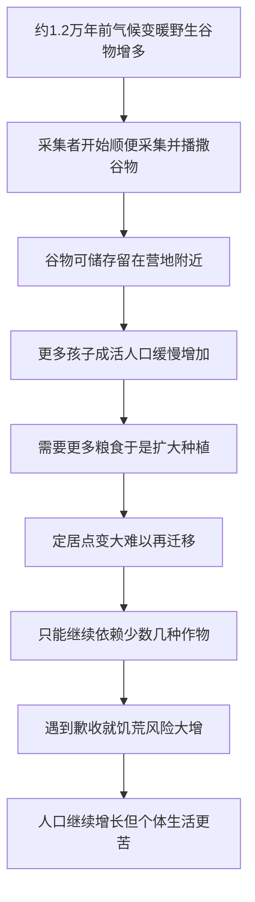

# 05｜农业革命，为什么被说成“史上最大的骗局”？

> 农业看起来是人类最伟大的进步，赫拉利为什么说它是“史上最大的骗局”？

---

## 一、先说结论

赫拉利在书里下了一个很重的判断：约一万两千年前开始的农业革命，是“史上最大的骗局”。

他不是说种地这件事本身是假的，而是说：**农业确实让人类这个物种的总人口爆炸式增长，却让绝大多数个体过得更辛苦、更单调、更容易挨饿和生病。** 换句话说，“人类成功了”和“人过得更好了”是两回事。农业增加的是整体人口，不是个人幸福。这就是他所谓“骗局”的真正含义。

---

## 二、我们先理解一个问题

我们从小被教育：农业是文明的起点。人学会了种粮、养牲口，才有定居、有城市、有文字、有国家。所以农业革命理应是人类最伟大的一步。

这个叙事有理有据，但它默认了一个前提——**进步就等于过得好。**

问题恰恰出在这个前提上。赫拉利问的是一个非常朴素、却很少有人问的问题：如果穿越回农业刚出现的那几千年，把“一个普通农民的一天”和“一个普通采集者的一天”摆在一起比较，谁更舒服？

他给出的答案，和我们的直觉相反。

---

## 三、作者到底提出了什么观点？

赫拉利提出，判断农业革命是不是进步，取决于你从哪个尺度看。

**第一个尺度是物种。** 从物种繁衍的角度，农业是空前的成功。考古证据显示，农业出现后，人类总人口在大约几千年里从几百万量级涨到上亿；被人类种植和养殖的小麦、水稻、牛、羊、鸡、猪，更是遍布全球，成为地球上数量最多的大型动植物。以“基因复制了多少份”为标准，小麦和牛是绝对的赢家，智人也是。

**第二个尺度是个体。** 但从一个具体的人的生活来看，画面完全不同。赫拉利认为，农民比采集者更劳累——弯腰锄地、除草、挑水、收割，是重复而伤身的劳动；饮食更单调——主要靠一两种主粮，营养远不如采集者能吃到的几十种野果、坚果、肉类；更不安全——一旦歉收，整片定居点就要挨饿；也更容易生病——定居、密集居住和与家畜共处，为传染病提供了温床。

于是他的结论是：**农业让“人类”这个物种成功了，却让“人”这个个体变差了。** 增加的只是数量，不是幸福。

---

## 四、把这个观点翻译成人话

可以把这理解成一家公司的两种 KPI。

公司的“用户总数”暴涨了，财报非常漂亮；但“单个用户的体验”暴跌——加载更慢、广告更多、要付更多的钱。股东看的是第一个数字，用户感受的是第二个。农业革命就是人类史上第一次这种“总量和人均严重背离”的事件。

采集者的日子，其实没有我们想象的那么惨。一些人类学家（比如萨林斯提出的“原初丰裕社会”这一说法）认为，采集者每周的工作时间可能只有三四天，其余时间用于社交、休息、闲聊。他们的食谱非常多样：一个采集群体可能吃到上百种植物和动物。他们也不被固定在一块地上，食物不够就迁移。

而农民呢？他被绑在了自己那块地旁边，日出而作，日落才歇，一年到头伺候一种作物。他的“财产”成了他的枷锁。

这就是赫拉利说的**“奢侈品的陷阱”**：一开始，某个小改变看起来只是“方便一点”——比如在营地边种点麦子，省得跑远路去采；有了这点粮食，可以多养一个孩子、多养一条狗。可这些“方便”会慢慢变成依赖，依赖又变成无法回头。等人意识到不对时，整个社会结构已经建立在农田上了，已经回不去了。

---

## 五、为什么会这样？

把赫拉利的推理拆开，大致是这样一条链：

链条里最容易被忽略的是 **C 和 D**。

谷物和猎物不一样：猎物当天吃完就没了，谷物晒干后可以存几个月甚至更久。能储存，才使得“今天多干一点、明天少饿一顿”成为可能，也才使“多养一个孩子”变得可行。可孩子多了，人口就上去了；人一多，原来的采集范围就不够养活所有人，于是只能继续种地、继续增加投入。

结果是：**每一步单独看都是理性的、划算的，合起来却把整个群体推进了一个“越努力越辛苦、还退不出去”的循环。** 赫拉利把这种结构叫作“人口陷阱”——农业带来的增产，很快被新增的人口吃掉，人均生活水平并没有提升，甚至下降。

---

## 六、举一个现实生活中的例子

想想办健身卡这件事。

你去健身房，销售告诉你：办张年卡，平均下来一天才几块钱，比单次划算太多了。你算一算，觉得有道理，于是花几千块办了一张。那一刻，你确实获得了一种“方便”——不用每次掏钱，随时能去。

但接下来发生了什么？一开始你每周去三次，然后变成一次，然后变成“反正有卡，改天去吧”。卡躺在钱包里，钱已经花掉了，健身房用你的年费扩建了更多场地、买了更多器械，然后吸引更多人来办卡。健身房真正靠什么赚钱？不是靠天天来的老会员，而是靠大量“办了卡却不常来”的人。

这张卡就是那个“奢侈品的陷阱”：**你为了省钱的便利，签下了一份长期承诺；短期看起来占了便宜，长期算下来，你付出了金钱，也可能付出了本该用在别处的精力。**

农业革命在赫拉利眼里，是同一个结构放大到全人类规模：一开始只是想“少跑点路、多存点粮”，结果签下了一份一万年都退不掉的合同。

---

## 七、回到书中重新理解

这样再回头看赫拉利这一部分，他为什么敢用“骗局”这么重的词，就清楚了。

他其实在做两件事。

第一，**换了参照系。** 我们习惯用“文明的成就”来评价农业——城市、文字、国家都建立在其上，所以它当然是好事。但赫拉利把参照系从“文明总量”换成了“普通人的一天”。同样是农业，从文明看是进步，从个体看可能是退步。他不是否认农业催生了文明，而是提醒：文明的账本和个人的账本，不是同一本。

第二，**强调不可逆。** 骗局的要害不只是“当下一时不划算”，而是“事后无法退出”。采集者如果觉得种地太累，可以重新去采集；可一旦人口涨上去、定居点扩开、土地被占有，“回去”这个选项就不存在了。一项选择只有在还能反悔时才叫选择，一旦锁死，就变成了不得不接受的秩序。

所以赫拉利说农业是“骗局”，不是道德指控，而是一个结构判断：**它用一个看起来自愿的小决定，换来了一个无法退出的大系统。**

---

## 八、这个观点背后还有什么？

有几个隐含前提值得点出来。

**第一，他衡量“好”的标准是主观体验。** 说农民过得更苦，靠的是“更劳累、更单调、更容易生病”这类体验判断，而不是粮食产量、寿命或 GDP。这是一把“幸福尺”，不是“实力尺”。因此这个结论天然依赖一个前提：我们如何知道一万年前的采集者比农民更幸福？

**第二，物种视角贯穿全书。** 赫拉利反复用“基因复制的份数”来衡量成功，这个标准在讲小麦时会用到极致（下一篇会展开）。它冷酷但一致：小麦的成功，是让更多人替它种它。

**第三，“更多”和“更好”不是一回事。** 农业是历史上第一次大规模证明：一个系统可以总量增长、同时个体体验恶化。这个逻辑在工业革命、消费主义、今天的增长焦虑里会一再重现。

---

## 九、这个观点有问题吗？

有，而且这部分争议相当大。需要明确：**赫拉利讲的是一个有力的再评价，不是学界共识。**

**哪些比较有说服力：**

- “人口增长不等于生活质量提升”这个提醒本身是成立的。农业确实伴随了人口暴涨和传染病增加（考古证据显示，农业人群的龋齿、贫血、关节劳损等问题比采集者更常见）。
- “奢侈品的陷阱”作为一种机制，在历史上反复被观察到：一个便利的引入会创造对它的依赖，进而改变整个社会结构。

**哪些争议较大：**

- **采集者到底有多“丰裕”？** 萨林斯的“原初丰裕社会”这个说法流传很广，但也有学者认为，采集者的生活高度依赖环境，在寒冷或资源贫瘠地区可能相当艰难，婴幼儿死亡率高，暴力冲突也不少见。把采集者一律浪漫化是危险的。
- **“农民更苦”是不是普遍规律？** 不同地区、不同时期的差别极大。有些早期农业社区的生活其实相对稳定，而采集者也并非处处优于农民。用一个统一结论覆盖一万年、几大洲，是相当大的简化。
- **“骗局”这个词本身就是修辞。** 农业革命没有一个“骗子”，它更像是一个没有设计师的、由无数人各自理性选择叠加出来的结果。用“骗局”来解释，可能把无意图的结构性后果拟人化了。

**其他解释：**

- 有学者更强调气候与环境压力（比如全新世初期气候变暖、野生谷物增多）作为触发条件，而不是“人类主动选择了错误的道路”。
- 也有研究认为，农业并非单点起源，而是在西亚、中国、中美洲等地先后独立出现，说明它可能是多种条件下的趋同结果。

**所以更准确的说法是**：赫拉利成功地指出了农业革命的代价和“总量与个体”的张力，但“史上最大的骗局”是一个修辞性极强的判断，适合作为思考框架，不适合当成结论背诵。

---

## 十、今天再看这个观点

以下部分是基于赫拉利思想的现代延伸，不是他在书里的原话。

赫拉利讲的是一万年前的麦田，但他想问的问题今天更响：**我们是不是又掉进了新的“奢侈品的陷阱”？**

想一想手机、外卖、电商、社交软件、算法推荐。它们每一个出现时，都只是“方便一点”：不用出门、不用排队、不用记路。但合在一起，它们重塑了我们的时间、注意力和社交方式，而且几乎不可逆——今天说“我要回去过没有手机的生活”，难度不亚于让一个农民放下锄头。

还可以换个角度看现在的工作。很多现代职业也遵循类似的逻辑：某项技能一旦投入，就越陷越深；工作时间越来越长，产出总量在涨，可个人的空闲和心理状态未必同步改善。这是不是“农业陷阱”的当代版本？这是赫拉利没有直接论证、但可以由其框架提出的问题。

需要提醒的是：**赫拉利本人并没有说“手机是骗局”或“科技让人变差”**，他讨论的是农业。把同样的结构套到今天，是一种延伸，而不是他的原话。值得把它当成一个提问的工具，而不是一个现成的答案。

---

## 十一、这一篇真正应该记住什么？

1. **尺度决定结论。** 从物种繁衍看，农业是巨大成功；从个体生活看，农民可能比采集者更苦。同一件事，两把尺子给出相反答案。
2. **人口增长不等于幸福增长。** 农业的增产很快被新增人口吃掉，这就是“人口陷阱”：总量在涨，人均未必改善。
3. **“奢侈品的陷阱”是关键机制。** 一时的方便会变成长期的依赖，等察觉时已经无法退出，这是“骗局”一词的真正所指。
4. **采集者生活并不必然悲惨。** 一些研究认为，他们的工作时间更短、食谱更杂、自由度更高——但这也不宜浪漫化，真实情况因环境和时代而异。
5. **“骗局”是修辞，不是定论。** 它提醒你区分“人类成功了”和“人过得更好了”，但不要把它当成被学界普遍接受的结论。

---

## 十二、留一个问题

> 如果一项改变让你今天更方便、却让你十年后更难退出，
> 那么当年参与这场改变的人，是“做对了选择”，还是“根本没得选”？

---

**下一篇**：如果说农业是一场骗局，那这场骗局里到底谁在骗谁？换个视角看，也许根本不是人类在种小麦，而是小麦在利用人类——**究竟是人类驯化了小麦，还是小麦驯化了人类？**
