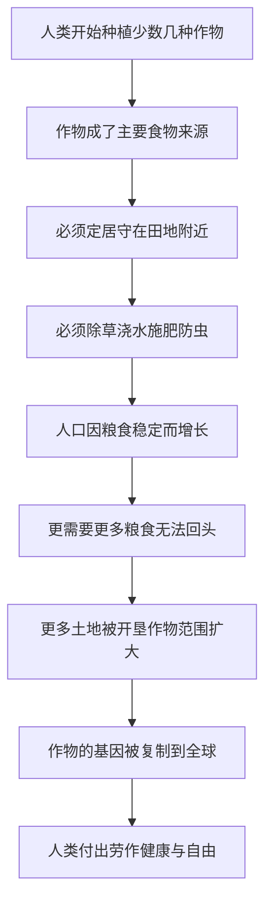

# 06｜究竟是人类驯化了小麦，还是小麦驯化了人类？

> 谁才是农业革命的真正主角——人类，还是被种植的作物？

---

## 一、先说结论

上一篇我们讨论了农业革命是“骗局”这个判断。这一篇换一个更刁钻的角度：**如果从演化视角看，也许根本不该只问“农民过得好不好”，而该问“谁在利用谁”。**

赫拉利的反讽说法是：一万多年来，小麦、水稻、牛、鸡这些物种的基因被复制到了地球每一个角落；而人类的脊椎、膝盖和自由，则被抵押给了农田。**表面上是人类驯化了小麦，实际上小麦也驯化了人类。** 这就是所谓的“反向驯化”。

演化的成功，不等于个体的幸福。小麦的成功，恰恰建立在让人类替它服务之上。

---

## 二、我们先理解一个问题

在我们熟悉的叙事里，农业是一个人类主动驯服自然的故事：人聪明，选了有用的植物，把它们种在身边，于是有了粮食。

这个叙事有一个隐含的方向感：人类是主体，作物是客体；人类是主人，作物是被支配的对象。

但“驯化”这个词，本身是一个从人类立场出发的说法。如果我们把它中立化——不问“谁听谁的”，只问“哪些基因被复制得最多”——那么主角可能会换人。

于是就有了赫拉利那个看似像文字游戏的提问：**究竟是小麦被人类养活了，还是人类被小麦养活了？**

---

## 三、作者到底提出了什么观点？

赫拉利提出了一个“从物种的视角重写历史”的做法。

他的核心观点是：**如果把物种繁衍当作成功的标准，那么农业革命的真正赢家不是智人，而是小麦、水稻、牛、羊、鸡这些被“驯化”的物种。** 拿小麦来说，一万年前它只是中东地区的一种普通野草，分布在很有限的一小片区域；今天它却长满了全球各地的农田，成了地球上种植范围最广的作物之一。以“基因复制了多少份”衡量，小麦是极少数达到这种规模的物种。

但小麦是怎么做到的？赫拉利指出，它靠的不是自己，而是让人类为它干活。以他的描述，小麦“要求”人类做的事情包括：

- **定居下来。** 野草不需要照顾的时候，人可以四处迁徙；可一旦种了小麦，就必须守着这块地，等它长、等它熟、等它收。
- **弯腰劳作。** 除草、松土、播种、收割、脱粒、挑水，这些动作对脊椎、膝盖、肩颈都是长期损耗。考古证据显示，农业人群的关节和骨骼病变比采集者更常见。
- **照顾它。** 小麦不像野草那样能自己活下去，它需要人替它除掉竞争者（其他杂草）、赶走害虫和动物、在旱季给它浇水、在贫瘠的土地上给它施肥。
- **保护它、储存它、再种下它。** 于是人变成了小麦的“保姆”和“运输工具”，把它的种子带到一块又一块新的土地上。

所以赫拉利说：**小麦没有变得更聪明、更强壮，它只是让别人替它做了所有这些事。** 从基因的角度看，这是极其成功的策略。

---

## 四、把这个观点翻译成人话

“驯化”其实很少是单向的。

想想养宠物这件事。我们说是我们驯化了狗：我们给狗食物、给它住所、照顾它。但反过来看，狗也驯化了我们——它让我们每天按时遛它、给它买最好的粮、为它安排假期、甚至围着它的作息生活。狗的基因因此遍布全球，成为世界上数量最多的家养动物之一。

再想想现代的工作关系。你签了一份工作合同，字面上是你“受雇于”公司；但几年后你会发现，你的作息、你的社交圈、你住的地方、你对自己价值的判断，很大程度上都被这份关系塑造了。谁驯化了谁？其实是一个互相塑造、但力量并不对等的双向过程。

赫拉利想说的是：**人类和小麦之间，也是一种双向关系，只不过人类一直以为自己是主动的那一方。**

---

## 五、为什么会这样？

把“反向驯化”的机制拆开，大致是这样：

关键在于 **B → C → F** 这个过程。

一旦某一种作物成了主要口粮，人就失去了“随时改行”的能力。采集者可以今天吃果子、明天打猎、后天挖根茎；农民不行，他的饭碗被绑定在那一亩地上。而这正是作物“控制”人类的办法：**让人类对它形成无法解除的依赖。**

所以赫拉利说，小麦不是被征服的战利品，而是一个学会了借用人类力量来复制自己的“战略物种”。

---

## 六、举一个现实生活中的例子

现在看看你手里那部智能手机。

它显然不是生物，也没有基因，但它的“生存策略”和小麦惊人地相似。

智能手机被发明出来时，只是一个方便的工具：能打电话、发消息、查地图。可它一旦进入你的生活，就开始“要求”你做一些事：

- **要求你把它带在身边。** 忘带手机会让人焦虑，就像农民离不开他的地。
- **要求你定期“照顾”它。** 充电、更新、清理内存、换电池、买配件。
- **要求你为它改变作息。** 睡前刷一会儿、醒来先看一眼、吃饭时也要放在桌上。
- **要求你把越来越多的事情交给它。** 支付、社交、工作、身份验证、门禁、健康记录。

到这一步，你以为你在“使用”手机，实际上你的时间、注意力和生活方式已经被它重新安排了。手机本身没有意识、没有目的，但它的“存在度”却随着你的依赖而不断扩张——这和小麦靠人类定居、劳作来复制自己，是同一个结构。

这里要区分清楚：**把手机比作小麦，是借赫拉利的框架做的一个现代类比，不是他的原话。** 赫拉利说的是作物与农民。但这个类比能帮你体会那个反讽：谁在利用谁，有时并不像表面上那样清楚。

---

## 七、回到书中重新理解

理解了“反向驯化”，就能理解赫拉利为什么会在书里突然切换到小麦的视角来写农业。

他不是真的认为小麦有意识、在策划什么。他是在做一次**视角实验**：把人类从舞台中央挪开，问问“如果从基因复制的角度看，这场革命里谁获益最大”。答案指向作物，而不是人。

这一篇和上一篇其实是同一逻辑的两面。上一篇讨论的是“代价”——农业让个体过得更苦；这一篇讨论的是“方向”——从物种尺度看，人类其实是替作物服务的工具。两篇合起来，赫拉利想让你同时握住两把尺子：

- 一把是**人的体验**：农民更累、更单调、更容易饿。
- 一把是**演化的账本**：小麦、牛、鸡空前成功。

这两把尺子不矛盾，它们量的只是不同的东西。**“成功”在演化意义上，只是“复制得多”，和“过得好”完全无关。**

---

## 八、这个观点背后还有什么？

**第一，演化的标准是冷酷的。** 赫拉利反复强调，演化不关心个体是否幸福，只关心基因有没有传下去。这个标准会一直用到书的后半部分，也是他评价“人类是否更幸福”时的底色。

**第二，“驯化”是一个不对称的双向关系。** 人确实选择了某些作物，但作物也反过来改造了人的身体（比如与消化淀粉相关的基因变化）、生活方式和社会结构。学界更愿意说这是“共同演化”，赫拉利的“反向驯化”是其中一个更尖锐的表达方式。

**第三，它把“人类中心主义”翻了面。** 我们习惯以人类为历史的主体，赫拉利提醒：从别的物种的角度看，人类可能只是它们扩张的工具。这个思路在讲牛、鸡、猪时会变得非常尖锐——它们的数量空前庞大，而个体命运往往极其悲惨。

---

## 九、这个观点有问题吗？

这个观点很像一个漂亮的修辞，但它作为分析框架，有它的边界。

**比较有说服力的地方：**

- “共同演化”确实是学界的共识方向。作物和人类互相塑造，这一点没有太大争议。
- 提醒我们注意“规模与个体”的分离，确实是必要的。一个物种数量再多，也不能推出它的个体过得好。

**争议和局限：**

- **“小麦驯化了人类”是一种拟人化修辞。** 小麦没有意图，谈不上“驯化”谁。把它说成一个有策略的主体，是一种有趣的描述方式，但可能让人误以为存在一个“设计者”，从而模糊了农业革命其实是无数个体分散选择、无意间形成的结构性后果。
- **演化标准是否唯一？** 如果我们改问“人类是否获得了更多选择、更长寿命、更大的文化可能”，农业的评价可能又不一样。赫拉利选“基因数量”作为标准，本身是一种立场，不是唯一的衡量方法。
- **是否过度简化了作物与人的关系？** 有些地区的农业与采集、渔猎长期并存，人类并非一进入农业就被完全锁死。这个“锁死”的程度因时因地差异很大。

**所以更准确的说法是**：赫拉利提供了一个非常有力的视角切换工具——“从基因的角度看谁赢了”。但“小麦驯化了人类”这句话更像一个思想实验，适合用来松动我们习以为常的“人类中心”叙事，而不是一个能被验证的历史命题。

---

## 十、今天再看这个观点

以下部分是赫拉利思想的现代延伸，不是他在书里的原话。

赫拉利谈的是小麦，但“反向驯化”的结构在今天随处可见：算法、平台、品牌、订阅制、数据系统。它们都是被人类造出来的，却反过来“要求”人类调整行为来配合它们。

一个具体的延伸问题：**当“被驯化的对象”从作物变成人工智能，这个结构还成立吗？** 作物没有智能，它只能被动地等着人类替它服务；但如果某个系统具有学习和优化能力，它“驯化”人类的方式可能会更快、更精准，也更难被察觉。这是赫拉利在讨论未来时反复敲的警钟，但不是他关于小麦的原话。

值得警惕的是：这类类比很容易滑向“技术决定论”——好像一切都是系统在操控人，人毫无主动性。更平衡的看法也许是：**人类和这些系统始终在互相塑造，只是力量的分配正在发生变化。** 理解“反向驯化”，是为了让你在依赖形成时，至少能看见它。

---

## 十一、这一篇真正应该记住什么？

1. **驯化是双向的。** 人类选择了小麦，小麦也反过来改造了人类的定居方式、劳作方式和身体。说“共同演化”比说“人类驯服了作物”更准确。
2. **演化的成功只是“复制得多”。** 小麦、牛、鸡的数量空前，但这和它们个体过得好不好没有关系。
3. **“反向驯化”是一次视角实验。** 它的价值在于让你从人类中心的位置上退开一步，而不是断言小麦真有意图。
4. **依赖会锁死选择。** 一旦口粮绑定在少数作物上，“退出”就变得困难，这正是作物“控制”人类的方式。
5. **别把它当成阴谋论。** 农业革命没有幕后主使，它是无数分散选择叠加出的结构，赫拉利的说法是修辞而非指控。

---

## 十二、留一个问题

> 你生活中那些“离不开”的东西，是被你选中的，
> 还是它们选中了你，然后让你以为自己选择了它们？

---

**下一篇**：小麦的成功靠的是让人类替它干活。可当粮食多到吃不完时，又是谁拿走了多余的那部分？为什么种出粮食的人，反而常常是最苦的人——**粮食多出来了，为什么普通人反而更苦？**
