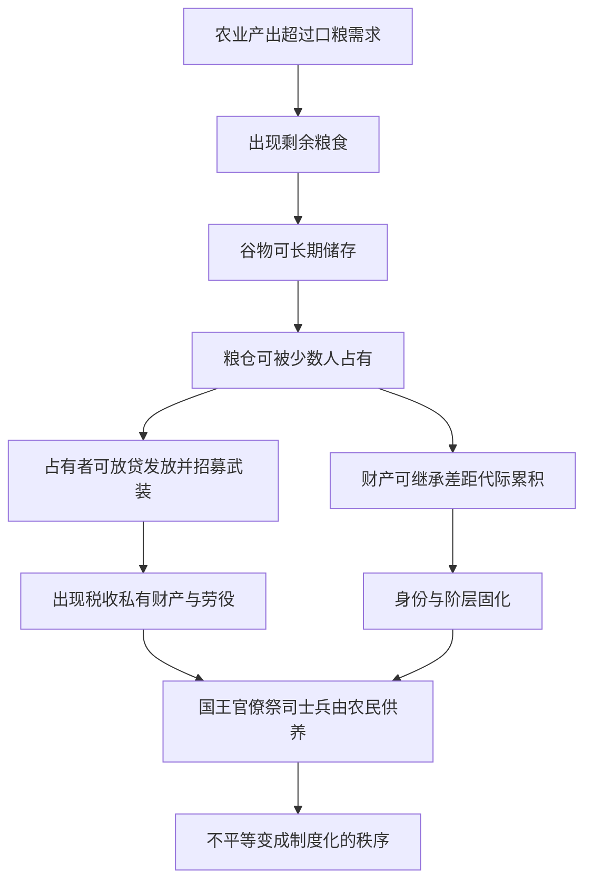

# 07｜粮食多出来了，为什么普通人反而更苦？

> 农业带来剩余，为什么没有让所有人过得更好，反而制造了贫困与压迫？

---

## 一、先说结论

一个朴素的期待是：粮食多了，大家就该都吃饱了。可历史给出的却是相反的景象——农业越发达，社会分层越明显，穷人、税收、劳役、债务甚至奴隶制随之出现。

赫拉利的解释是：**问题不在粮食不够，而在粮食多出来的那部分归谁。** 一旦余粮能被储存、占有和继承，社会就出现了“掌握粮仓的人”和“被土地绑定的人”。前者养活国王、官僚、祭司和士兵，后者用劳动供养前者。于是，贫困和不平等不再是偶然的厄运，而是一套被制度化、被信仰维护的秩序。

---

## 二、我们先理解一个问题

假设你是一个村庄里的农民。今年风调雨顺，你收的粮食比全家一年要吃的还多。表面上看，这是好事：你终于有余粮了，可以防荒年、可以换点别的东西。

但多出来的这部分粮食，会引来一个全新的问题：**它由谁保管，又由谁决定怎么用？**

在采集时代，这个问题几乎不存在——食物当天打当天吃，存不住、也带不走。可农业时代，粮食可以晒干、装进陶罐、放进谷仓，可以藏几个月甚至几年。一旦“存得住”，事情的性质就变了：它变成了可以被占有、被积累、被争夺的东西。

所以本文要回答的问题很朴素：**多出来的粮食，为什么没有让种地的人过得更好，反而让一部分人骑到了另一部分人头上？**

---

## 三、作者到底提出了什么观点？

赫拉利的思路可以概括成一条链条：**剩余 → 可储存 → 可占有 → 可继承 → 制度化。**

第一，农业必然产生“剩余”。种下一把种子，收获几十把；一个家庭的耕作，通常能产出超过自己所需的口粮。

第二，剩余可以被**储存**。这就和采集时代拉开了根本差距——猎物会腐烂，果子会变质，而谷物可以长期保存。

第三，储存下来的东西可以被**占有**。谁控制了谷仓的钥匙，谁就控制了全村的口粮。控制粮食的人可以做两件关键的事：一是让别人依赖他——荒年借粮、平时发放；二是组织武装来保护自己的仓库，防止别人抢走。

第四，占有的东西还能**继承**。父亲手里的土地和粮仓可以传给儿子，于是“有”和“没有”的差距不再随机，而是代代相传、越拉越大。

于是，一批**不种地的人**出现了：国王、官僚、祭司、军官、士兵。他们自己不种粮，却靠余粮养活着——因为种粮的人需要人保护、需要人管理、需要人给战争和祭祀提供组织。赫拉利的一句话很扎心：**是农民养活了整个文明里不种地的那大部分人。**

而剩下的大多数，则被固定在土地上，用劳动换取活下去的权利。**不平等就这样从“谁运气好”，变成了“谁天生是什么身份”。**

---

## 四、把这个观点翻译成人话

关键的一步是：**剩余一旦能被占有，就会出现“支配关系”。**

想一想，如果每天的食物都只能当天吃掉，你很难支配别人——因为谁都没库存，谁也饿不死谁。但当有人握着可以吃一年的粮仓时，他就能对别人说：今年你得听我的，否则你自己去找吃的。

这不是靠道德，而是靠结构。掌握了可储存的资源，就掌握了让别人“不得不”的能力。

赫拉利特别强调，这种不平等之所以能稳定下来，不只是靠暴力，还靠**“想象的秩序”**——人们共同相信的那一整套说法：国王是神选中的、贵族天生高贵、这是祖宗传下的规矩、穷人要安分守己。暴力能让一个人屈服一次，而共同相信的秩序能让一整代人心甘情愿。前者是拳头，后者是合法性。

上一篇讲的“骗局”谈的是个体的代价，这一篇谈的是**代价如何被分配**：有人付得多，有人付得少，还有人一分不付却拿得最多。

---

## 五、为什么会这样？

把赫拉利的推理画成图：

链条里有两处最关键。

一是 **B → C**：没有“可储存”，就没有“可占有”。储存技术（谷仓、陶器、计量）是这一切的前提。

二是 **D → E → I**：掌握了余粮，就掌握了组织暴力和管理的能力；有了暴力和管理，就能把“占有”合法化、长期化，变成税收、法律和阶级。于是“谁有粮”变成了“谁有权”，“谁有权”又反过来保证“谁有粮”。

这不是一个阴谋，更像是一个**正反馈循环**：每一轮都让掌握资源的人更容易继续掌握资源，让不掌握的人更难翻身。

---

## 六、举一个现实生活中的例子

先看房东与租客。

一个人早年间买下一套房子，后来房价上涨，他又用这套房子做抵押买了第二套，出租收租。租客每个月把一部分工资交给房东，换取一个住的地方。表面上是自愿的市场交易，但结构上很清楚：**有房的人靠“占有可增值、可继承的资产”持续获得收入，没房的人靠出卖劳动支付这笔钱。** 房东不需要每天去上班，他的“余粮”（房产）在替他把别人的劳动变成自己的收入。而且这套资产可以传给下一代，差距自动延续——这正是赫拉利说的“占有 + 继承”。

再看公司股权。

一家公司里有两种人：拿工资的员工和拿分红的股东。员工的时间一旦停止出售，收入就断；股东持有的股份却可以在睡觉时继续增值，还能传给子女、抵押、再投资。员工用劳动换取的工资，最终有一部分变成了公司利润，进了股东的口袋。当然，愿意承担风险、投入资本的人获得回报是合理的；但赫拉利式的观察是：**一旦“剩余”可以被占有并继承，制度和法律就会围绕它建立起来，让“有”与“没有”变成两种不同的生活方式，而不只是两种不同的收入。**

需要说明：这两个例子是现代市场制度，和古代农业社会的权力结构并不等同。它们共有的，只是那条底层机制——**可储存、可占有、可继承的资源，会把一次性的差距变成世代的结构。**

---

## 七、回到书中重新理解

这样再回头看赫拉利这一部分的论述，就明白他为什么把“想象的秩序”放在农业之后讲。

他要说明的是：不平等不是从天上掉下来的，也不是因为人性突然变坏了，而是**农业提供了物质条件（剩余与储存），权力提供了强制手段（暴力与税收），想象提供了合法性（神的旨意、祖宗规矩、天生贵贱）。** 三者合起来，才把一个临时的强弱关系，变成了延续几千年的社会结构。

他也在做一次祛魅：我们习惯把“私有财产神圣不可侵犯”“努力就有回报”当成天经地义，但赫拉利提醒，这些规则的历史并不长，而且它们往往是在“谁已经占有很多”之后，才被写下来、被相信、被执行的。规则不是中立的，它会保护那些在规则制定时已经占优的人。

---

## 八、这个观点背后还有什么？

**第一，他把“贫困”从个人问题重新定义成结构问题。** 在赫拉利的框架里，一个人穷，往往不是因为他懒或笨，而是因为他被放进了一个让他难以积累、难以退出、难以继承优势的位置。这个视角在讨论今天的贫富差距时很有力量。

**第二，“想象的秩序”是让不平等稳定的关键。** 单靠暴力，统治阶级要花极大的成本维持；只有让多数人共同相信这套秩序是合理的，统治成本才会下降。这也是为什么每个稳定社会都有一整套关于“谁该被尊重、谁该服从”的故事。

**第三，他埋了“国家、文字、战争”的线。** 税收要记录，记录要文字；剩余要保护，保护要军队；军队和官僚要管理，管理要国家。下一篇要讲的正是这个问题：这些庞大的制度，是怎么从麦田里长出来的。

---

## 九、这个观点有问题吗？

赫拉利这条线索很有解释力，但也需要更细致地看待。

**哪些比较有说服力：**

- “剩余粮食是分层的前提之一”这个判断，在考古上有不少支持：早期的等级社会往往出现在粮食可储存、可积累的地区。
- 把不平等看作“制度与观念共同维持的结构”，而不是单纯的个人道德问题，这一点被很多社会科学家认可。

**哪些争议较大：**

- **“农业必然导致不平等”是不是过度概括？** 考古证据显示，有些早期农业社区长期保持相对平等，也有采集社会出现了明显的等级（比如北美西北海岸的一些采集人群）。可见储存与剩余是重要因素，但未必是唯一或充分条件。
- **因果方向未必单一。** 有学者认为，是战争、人口压力、贸易和环境差异共同塑造了分层，不能把一切都归到“余粮”上。也有观点认为，是先出现了权力集中，才反过来扩大了剩余与私有。
- **“农民养活了不种地的人”这句话带有强烈的情感色彩。** 它指出了事实的一面，但也可能低估了官僚、军队、水利工程等组织活动对农业本身的作用——有些“不种地的人”确实提供了灌溉、治安和市场等必需的公共服务。

**所以更准确的说法是**：赫拉利提供了一个清晰的因果框架——剩余和储存如何让分层成为可能。但“不平等完全由农业剩余造成”是一个过强的表述；更稳妥的说法是，农业剩余**使**大规模不平等**变得可能**，而它的实现还依赖暴力、制度、观念和具体的历史条件。

---

## 十、今天再看这个观点

以下部分是赫拉利思想的现代延伸，不是他在书里的原话。

赫拉利讲的是古代的粮仓，但“剩余如何被占有”的问题今天依然成立，只是形态变了：从土地和谷物变成资本、数据、平台和知识产权。

一个值得想的现代版本是：**当“剩余”从粮食变成数据和算法时，“占有”意味着什么？** 过去的地主占有土地，今天的大平台占有用户数据、注意力和交易通道；这些资产同样可以积累、可以转化为权力，而且往往比土地更集中、更难被分割。

不过要谨慎：**赫拉利没有断言“平台就是新地主”**，这是由他的框架推出的一种延伸解读。它有价值，是因为能帮你问出好问题：在这套系统里，谁在生产“剩余”？谁在占有它？那些规则又是靠什么被大家相信的？

还有一个反过来的问题同样重要：既然不平等很大程度上是制度化的结果，那么制度也可以被重新设计。赫拉利并不是在说“不平等无解”，而是在说“它不是天经地义”。

---

## 十一、这一篇真正应该记住什么？

1. **关键不是粮食够不够，而是余粮归谁。** 剩余一旦可以储存、占有、继承，社会就出现了支配关系。
2. **“农民养活了不种地的人”。** 国王、官僚、祭司和士兵靠农业剩余供养，多数人则被固定在土地上供养少数人。
3. **不平等是结构，不是单纯的道德问题。** 它由物质条件（剩余）、强制手段（暴力与税收）和合法性（想象的秩序）共同维持。
4. **规则会保护既得利益者。** 私有财产、继承、身份这些制度，往往是在差距已经形成之后，才被写下来并让大家共同相信。
5. **框架有力，但结论要放宽。** 剩余使大规模不平等成为可能，但并非唯一原因；不平等在采集社会也曾出现，农业社会也未必一律分层。

---

## 十二、留一个问题

> 如果一套规则是在差距已经形成之后才写下的，
> 那么后来的人遵守它，是在维持公平，还是在维持结果？

---

**下一篇**：有了余粮，就得有人管粮、记账、收税、打仗。可当人口和事务多到人的脑子记不住时，社会会发生什么？——**国家、文字、战争，是怎么从麦田里长出来的？**
