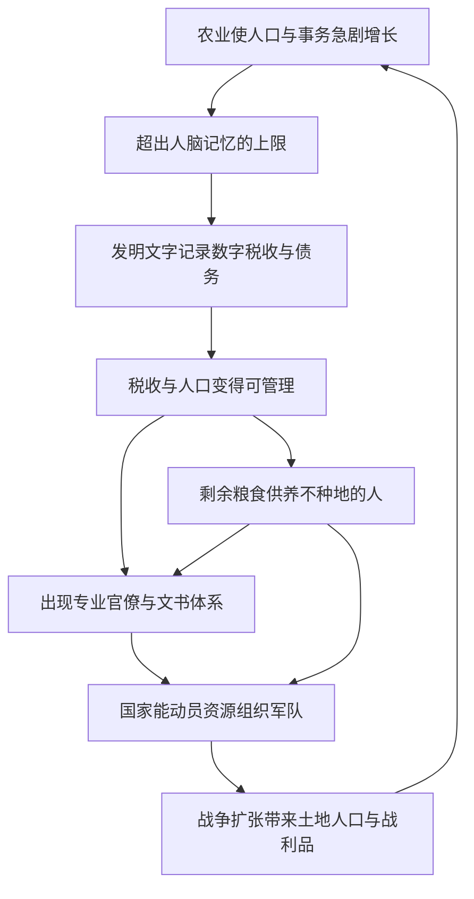

# 08｜国家、文字、战争，是怎么从麦田里长出来的？

> 国家、文字和战争这些庞大的制度，为什么会随着农业一起出现？

---

## 一、先说结论

我们通常把文字、国家、军队当成文明的伟大成就，仿佛它们是聪明人设计出来的。赫拉利的看法更冷静：**它们不是被“设计”出来的，而是被农业社会的规模“逼”出来的。**

当人口和事务超出人脑能记住的极限，社会就必须发明文字来记录税收、债务和命令；当剩余粮食能养活不种地的人，就养得起士兵和官僚，于是国家、军队和战争成为可能。在赫拉利看来，**文字最初不是用来写诗的，而是用来记账和统治的**——它是被治理的需求催生出来的技术。

---

## 二、我们先理解一个问题

先做一个思想实验。

假设你是一个采集部落的首领。部落里五十来个人，谁家里有几口人、谁擅长打猎、谁上次分肉时少拿了一块、谁欠谁一个人情，你基本都能记住。不需要账本，也不需要档案，因为规模小到你脑子装得下。

现在把规模放大一百倍。你是一个王国里的官员，治下有五万人。你要知道：谁家有多少地、今年收成如何、该交多少税、谁家欠税、仓库里还有多少粮、哪里的军队需要多少补给、有多少人可以征来修水渠。请问，你怎么知道？

靠记忆，不可能。靠口头传话，一定会出错、会失真、会被人钻空子。

于是问题就来了：**当一个社会大到“谁也记不住所有事”的时候，它靠什么运转？** 这看起来是个管理问题，其实是国家、文字和战争全部出现的入口。

---

## 三、作者到底提出了什么观点？

赫拉利认为，农业社会面临一个前所未有的难题：**记忆过载。**

人脑的容量和精度是有限的，而农业社会要处理的信息量却急剧膨胀——田地的边界、每户的人口、每季的收成、该交的税、欠下的债、仓库的库存、军队的编制。这些信息不是靠聪明就能记住的，它们需要被放到身体之外去保存。

**文字就是这样被发明的。**

赫拉利特别强调：文字最早的用途不是记录诗歌、哲学或历史，而是记录**数字和账目**。以两河流域的苏美尔为例，考古证据显示，最早的楔形文字泥板上，大量内容是关于粮食、牲畜、劳力和债务的记录——“多少大麦”“谁欠了多少”“交付给了谁”。先有数字和账目，后有叙事和文学。用他的意思说，**文字最初是一种数据技术，不是一种文学艺术。**

而有了文字，国家才有能力做三件以前做不到的事：

1. **收税。** 知道谁有多少地、该交多少，税收才可能系统化、规模化。
2. **维持官僚体系。** 一个靠文书运转的管理机器，才能治理超出熟人范围的大片领土。
3. **组织战争。** 动员、补给、征召、战功登记，都需要记录。

更进一步，赫拉利指出，剩余粮食让这一切有了物质基础：**因为有一批不种地的人能被养活，才可能有专门收税的官员、专门打仗的士兵、专门记账的书吏。** 国家、文字、军队，是这个循环的三个零件。

---

## 四、把这个观点翻译成人话

可以把早期国家想象成一台“必须靠账本才能运转的机器”，而文字就是它最早的数据库。

没有数据库，机器就转不动。所以国家不是先有了一个宏伟的理想，再去发明文字；恰恰相反，是“治理这么多人”的现实压力，逼着它必须把信息写下来。文字不是文化的奢侈品，而是权力的基础设施。

更狠的一步是：**当人本身也被写进账本时，他就从“一个有名字的邻居”变成了“一个可被记录的条目”。** 你有几口人、多少地、该交多少粮、能不能被征召，全都可以被登记在册。统治的本质之一，就是把活生生的人转化为可计量、可征收、可调动的数据。

这也解释了为什么战争和国家总是绑在一起：一个能记账、收税、登记人口的国家，才打得起仗；而打仗带来的战利品、土地和人口，又反过来扩大税基、壮大国家。两者互相喂养。

---

## 五、为什么会这样？

把这条链条画出来：

这个图的关键在于它是一个**循环**：人口增长导致记忆过载，记忆过载逼出文字，文字支撑税收和官僚，税收和官僚支撑军队，军队扩张又带来更多人口和事务，回到起点，规模再上一层。

所以国家不是某一天被“发明”出来的一个东西，而是在这个循环里逐渐长出来的形态。文字则像是这个有机体长出的“外部记忆器官”。

---

## 六、举一个现实生活中的例子

先想 Excel 和会计记账。

一家小餐馆，老板脑子就能记住每天的流水、欠谁的钱、冰箱里还剩多少菜。可一旦开成连锁，几十家门店、上千名员工，就必须靠 Excel、财务系统和 ERP：每一笔收入、每一笔支出、每一个库存都要被登记。为什么？因为**没有任何一个人的脑子能装下这些信息**，只有把它们写进系统，公司才能知道自己到底在赚还是亏、哪家店该关、该给谁发多少工资。

早期国家的楔形文字泥板，和今天的 Excel 表格，做的是同一件事：**把现实折算成可以被记录、核对和管理的条目。**

再看身份证。

身份证（以及户口、税号、社保号）把一个人变成了一串可以被系统识别的编号：你是谁、住哪里、属于哪个辖区、要交什么、能享受什么。有了它，国家才能在你搬家、就业、纳税、就医时“找到你”。没有这套登记系统，现代国家的税收、福利和治安几乎无法运转。

这里要说明的是：身份证是现代民族国家的制度产物，和五千年前的苏美尔泥板并不等同。**它们共有的，是同一条逻辑——当社会规模超过人脑的记忆能力，就必须用外部的记录系统来替代记忆，而谁掌握了这套记录系统，谁就掌握了治理的能力。**

顺便说，写诗和记账其实并不冲突。文字后来也能记录神话、法律和文学，这是它能力扩展的结果。但赫拉利想提醒的是顺序问题：**在成为文化的载体之前，文字先是权力的工具。**

---

## 七、回到书中重新理解

这样回头看赫拉利关于文字和帝国的论述，就能明白他的重点。

他不是在单纯地赞美“文字让文明得以传承”，而是在指出一个容易被忽略的事实：**文字与权力是共生的。** 文字最早服务于税收、债务和命令，服务于让少数人能治理多数人。理解了这一点，就能理解为什么古代识字的往往是祭司和书吏——他们掌握的不只是知识，而是治理的接口。

他也在提示一个更深的观点：**国家、文字、战争这些看似宏大的东西，其实都源自非常具体、非常世俗的需求——记清楚谁交了多少粮、谁欠了多少债、能拉出多少兵。** 文明的宏大结构，往往建立在琐碎的行政需求之上。

这也和前面几篇接上了：农业产生剩余（07），剩余需要管理，管理需要记录（08 的文字），记录支撑税收和军队，而税收和军队又需要一套让所有人共同相信的秩序（03 讲的“想象的秩序”）才能真正稳定下来。

---

## 八、这个观点背后还有什么？

**第一，“国家”是一种想象中的秩序。** 领土、主权、公民身份都不是物理存在，而是被共同相信的制度。但要让这种想象稳定运转，它必须落地成文字、档案和登记系统——也就是可以具体执行的记录。这是“想象”和“技术”的结合。

**第二，文字带来新的权力不对称。** 识字的人和不识字的人之间，出现了一道鸿沟。掌握书写的人可以决定什么被记下、什么被忽略，这本身就是一种权力。

**第三，它预示了后文的主题。** 赫拉利在全书的逻辑是：人类靠共同想象组织大规模合作，而这些想象需要越来越复杂的技术来维持——从泥板到档案，从档案到数据库，直到今天的数据系统。制度越庞大，越依赖外部的记忆和记录。

---

## 九、这个观点有问题吗？

这条论述方向被广泛接受，但具体表述需要一些限定。

**哪些比较有说服力：**

- 考古证据确实显示，最早的文字记录中有大量经济账目和行政内容，文字与国家治理的密切关系有较多支持。
- “记忆过载”作为社会复杂化的动力，在人类学和历史学中有相当多的呼应：记录技术往往随着组织规模扩张而发展。

**哪些争议较大：**

- **“文字只为记账而诞生”可能过度简化。** 关于文字起源，学界存在不同解释。有研究认为，早期的符号和计数标记（比如陶筹）确实主要用于经济，但符号系统向完整文字的演化过程复杂，可能与宗教、仪式、身份标记等需求交织在一起。说“文字最初完全不是为了文学”是一种强调，未必是所有学者的共识。
- **因果是不是必然？** 有些社会依靠结绳、口传、专职记忆者（如印加人的奇普）也能管理庞大帝国，说明“复杂社会必然发明文字”并非铁律。文字是一种常见路径，但不是唯一路径。
- **战争与国家的关系是双向且多因的。** 把战争说成“有了税收自然就能打”容易忽略其他因素：地理、资源、邻国压力、技术（如青铜、马战）在战争形态中的作用同样关键。

**所以更准确的说法是**：赫拉利指出了文字、税收、官僚与战争之间一条极为重要的相互强化链条，这条链条非常有解释力；但“文字只为记账而生”“国家与战争完全由农业剩余推动”这类表述，是对复杂历史的一种聚焦式简化，不宜当作单因定论。

---

## 十、今天再看这个观点

以下部分是赫拉利思想的现代延伸，不是他在书里的原话。

赫拉利讲的是泥板上的账目，但“用外部系统记录和管理人”这件事，今天发展到了他写书时还难以想象的程度。

过去是文字把土地和粮食写进账本；今天，数据系统把人的行为、偏好、位置和关系都写进服务器。税收、身份、信用、社保、医疗、行程，几乎全部被数字化。这可以看作是“记忆过载”解决方案的极端版本：**社会不再只是记录你该交多少税，而是持续地记录你是什么样的人。**

这带来一个值得思考的延伸问题：既然文字最早是权力的工具，那么当记录能力大幅增强时，权力的形态会怎么变？**信息越多，治理越精细，但个体也越透明。** 这是赫拉利在讨论未来时反复触及的方向，但这一段关于“数据即治理”的论述属于现代延伸，不是他关于楔形文字的原话。

也要避免一种幻觉：以为只要技术更先进，社会就一定更公平。记录技术既能提升治理效率，也能强化控制。它本身是中性的，关键看谁掌握、为了什么目的使用。

---

## 十一、这一篇真正应该记住什么？

1. **文字是被“规模”逼出来的。** 当人口和事务超过人脑记忆的上限，社会必须借助外部记录系统，文字因此成为治理的基础设施。
2. **文字最早服务于记账和统治。** 苏美尔的泥板上大量是数字、粮食和债务记录——先有账目，后有文学。
3. **剩余粮食养起了不种地的人。** 官僚和士兵靠农业剩余供养，这是国家和军队得以存在的物质前提。
4. **国家、文字、战争互相强化。** 税收需要记录，记录支撑官僚，官僚支撑军队，军队扩张又带来更多人口和税基，形成循环。
5. **记录系统也是权力系统。** 谁掌握文字和数据，谁就能决定什么被记住、什么被忽略，这本身就是一种不对称的权力。

---

## 十二、留一个问题

> 如果国家最初是靠“把人写进账本”才得以运转的，
> 那么今天被写进系统的我们，是更被照顾了，还是更被看穿了？

---

**下一篇**：这些从麦田里长出来的秩序——国家、文字、法律、身份——一旦稳定下来，就会开始宣称自己的规则是永恒的。可如果规则都是人造的，那“人人生而平等”为什么反而是很晚才出现的说法？**“人人生而平等”，为什么只是近代的发明？**
