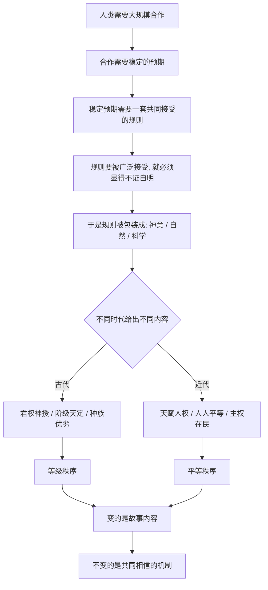

# 09｜“人人生而平等”，为什么只是近代的发明？

> 我们今天视为天经地义的“平等”，为什么在历史上反而是例外？

---

## 一、先说结论

赫拉利认为，平等不是从自然里读出来的真理，而是近代人类共同相信的一个故事。在人类历史的大部分时间里，被当作天经地义的从来不是平等，而是等级。

“人人生而平等”之所以震撼，不是因为它发现了什么生物学事实，而是因为它用一套全新的想象秩序，替换了旧的想象秩序。古代社会靠“君权神授”“种族优劣”解释为什么有人该在上、有人该在下；近代社会改用“天赋人权”“人人平等”来组织合作。

变的是故事的内容，不变的是那个机制：**一个足够大的群体，必须共同相信某种秩序，才能一起生活。**

---

## 二、我们先理解一个问题

我们这一代人几乎泡在“平等”里长大，久居其中就容易产生错觉：平等是人类社会的默认状态，只是过去的人糊涂，没发现而已。

可如果把镜头拉长，画面会反过来。

几千年里，绝大多数社会都认为等级是天然的、甚至神圣的。古印度的种姓制度把人分成婆罗门、刹帝利、吠舍、首陀罗，还有被排除在四大种姓之外的“不可接触者”；古希腊的亚里士多德明确为“有些人天生适合做奴隶”辩护。这不是零星现象，而是常态。

于是真正的问题来了：**为什么被我们当作常识的“平等”，在历史长河里反而是罕见的例外？** 更尖锐的是——如果平等和等级都不是自然给定的，那它们到底是什么，又是怎么被建立起来的？

---

## 三、作者到底提出了什么观点？

赫拉利在书中给了一个统一的答案：**平等与不平等，都是“想象的秩序”，都没有生物学依据。**

第一份对照文献是约三千八百年前古巴比伦的《汉谟拉比法典》。它明确把人分成三个等级：上层的自由民、地位较低的平民、以及奴隶。同样一个伤害行为，受害者等级不同，惩罚就完全不同：打伤一个上层自由民的眼睛，可能要挖出加害者的眼睛；打伤平民的眼睛，只需赔偿银钱；伤的是奴隶，赔偿更少。在法典的世界里，**阶级不是秩序的破坏，阶级本身就是秩序**。

第二份是 1776 年的美国《独立宣言》。它写下了另一句话：“人人生而平等（all men are created equal）。”在它看来，人与人的差异是后天的、次要的，平等才是起点。

赫拉利的观点是：这两份文件看似一正一反，其实属于同一类东西。它们都不是对客观世界的描述，而是**靠共同相信才成立的秩序**。法典把等级说成天经地义，宣言把平等说成天经地义；两者都自称是普遍真理，都用一种超越个人的权威（神意、自然法则）给自己背书。

换句话说，**不是平等证明了不平等是错的，而是一套新的共同想象，替换掉了一套旧的共同想象。**

---

## 四、把这个观点翻译成人话

把人想成一群正在玩同一场游戏的人。游戏要玩下去，必须有一套大家都认的规则。规则本身没有物理重量——你抓不住“越位”，也摸不到“三分线”，但所有人都接受它，它就能决定谁赢谁输。

关键在于：**规则越是显得“本来如此”，就越没人去质疑它。**

古代的规则是：“人生来就分三六九等，这是神的安排。”农民不觉得自己“被剥削”，可能觉得这就是天命；贵族也不觉得自己“不公平”，他觉得这是与生俱来的身份。等级被讲成自然规律，社会反而稳定。

近代的规则换成了：“人生来平等，权利是天给的。”它同样只需要被共同相信。于是身份不再决定一切，契约、法律、选票、市场成为组织社会的新工具。

赫拉利的意思是：**没有哪一套规则是从天上掉下来的，它们是被人群共同相信，才获得了“像自然规律一样”的力量。**

---

## 五、为什么会这样？

把这条推理拆开，大致是这样的：

这条链里最重要的是 **D → E** 这一步。

一套规则如果只是“我们几个人商量出来的”，就随时可以被推翻；但如果说成“神定的”“自然的”，质疑它就等于质疑整个世界。人类为了让大规模合作稳定下来，几乎必然会把规则**自然化**。

而不同时代会自然化出完全相反的内容。农业革命之后出现了剩余、国家、文字和阶层，等级秩序成了那个时代最能维持合作的规则；到了近代，市场经济、民族国家和大工业生产需要把人从出身里解放出来，让陌生人可以自由缔约、自由流动，平等叙事才变得有用。

**残酷的地方在于：不是平等证明了等级错误，而是平等这套新故事，更适合新世界。**

---

## 六、举一个现实生活中的例子

成绩单上都会出现排名。年级第一是谁，谁在“实验班”，谁在“普通班”。没人觉得奇怪——分数是自己考的，排名是客观的。可站远一点看：**分数线和排名本身，就是一套被共同相信的秩序。**

同一道题、同一张卷子，在不同省份划出完全不同的录取线；同一个分数，在甲地能上重点，在乙地只能上普通院校。制度给出的解释是“分省定额、因地制宜”，听上去合理；但从考生的视角，这意味着面对同一场考试，却不是同一把尺子。

更微妙的是“排名”这件事。把学生按分数从高到低排好，再宣称这反映了能力高低——这一步其实把**一种测量方式**，当成了**一种对人的定性**。考得好的叫“优秀”，考得差的叫“不够努力”。没人去问：测量的这一维度，是不是唯一重要的维度？

赫拉利想说的正是这一点。等级秩序从不赤裸裸地说“我们就是要压你一头”，它总会找一个看起来中立、客观、不容置疑的标准：古代是出身，现代是分数。**标准一旦被接受，由此产生的排序就被认为是自然的，而不是被建构的。**

当然，考试带来的筛选与资源分配是真实存在的，也确实在一定程度上提供了流动通道。赫拉利并不是说“分数是假的”，而是说——**分数之所以能决定人的位置，靠的是大家共同承认它有权决定。**

---

## 七、回到书中重新理解

回头看赫拉利的原始论述，他的重点其实不是道德批判，而是一个结构判断。

他反复讲《汉谟拉比法典》和《独立宣言》，不是想说“古人坏、今人好”，恰恰相反——他是想说，**我们今天觉得天经地义的平等，在人类历史的时间尺度上是非常新的事物。** 它不是因为人类突然看见了真相，而是因为换了一套更适应新时代的集体想象。

赫拉利有一个反直觉的推论：如果平等真的不证自明，那为什么几千年里几乎所有人都“看不见”它？反过来，如果等级真是自然规律，那为什么近代几百年间它又会被大规模推翻？

答案是：因为这两者都不是事实，而是**故事**。故事可以被讲成另一种样子，所以历史才会在近代出现那样剧烈的翻转——奴隶制被废除，君主被推翻，选举权从少数人扩展到所有人。每一次扩展，背后都不是新发现了什么生物学证据，而是**“我们”这个共同体的边界被重新讲述了一次。**

---

## 八、这个观点背后还有什么？

**第一，想象的秩序必须“普遍化”才能生效。** 一套只有少数人相信的规则是脆弱的；它必须被说成全人类、全自然、全宇宙通行的。法典说这是神的旨意，宣言说这是造物主赋予的不可剥夺的权利——**给规则找一个高于人的来源，是它获得权威的常见方式。**

**第二，平等与等级并非道德上的对称。** 从机制上说，两者都是想象；但从后果上说，它们完全不同。等级秩序往往意味着出生即锁定命运、大规模压迫和暴力；平等叙事则在一定程度上为陌生人打开了合作与流动的空间，尽管它自己也常常名不副实。

**第三，“想象的秩序”不等于“可以随意撕毁”。** 正因为被千万人相信，它才具有近乎物理的力量——种姓、身份、高考分数，这些看不见的东西能决定一个人能不能上学、买房、迁徙。

**第四，它和前几篇是一条线。** 农业带来剩余与阶层，文字把等级固定成制度，而这一篇讲的是：**等级后来是怎么被重新解释、甚至被翻转的**。变的是内容，不变的是那个机制。

---

## 九、这个观点有问题吗？

有问题，而且这一篇是全系列里最需要小心对待的地方之一。赫拉利的论证很有冲击力，但也留下几个清楚的风险点。

**第一，从“平等没有生物学依据”，推不出“平等不重要”。** 赫拉利说平等是想象的秩序，听起来像在给不平等递刀子：“既然都是编的，那凭什么要平等？”这里涉及一个经典区分——**事实判断与价值判断不是一回事**。就算人类在生物学上确实千差万别，也不能自动推出“所以应该按差异分配权利”。一些哲学家把这种跳步称为“自然主义谬误”。平等完全可以是一个**政治承诺**：我们选择把每个人当作具有同等尊严的主体，不是因为我们长得一样，而是因为我们决定这样组织社会。

**第二，“平等是近代发明”这个说法本身需要限定。** 说“人人生而平等”作为制度化的政治原则是近代产物，大体成立；但若说人类历史上从没有平等观念，就过头了。一些人类学家认为，不少狩猎采集社会内部的资源分配和决策相当平等。换句话说，**不平等是随农业、国家和私有制逐步强化的，而不是人类与生俱来的底色**。赫拉利有时把“历史大部分时间不平等”讲得太整齐。

**第三，把“种族优劣”和“天赋人权”并列成“都是故事”，容易被误读为各打五十大板。** 机制上它们确实同属共同想象，但一个是压迫的辩护词，一个是解放的宣言。一些学者认为这一框架在伦理上过于中立，可能削弱对具体不义的批判力度。

**第四，历史记录本身是矛盾的。** 写“人人生而平等”的托马斯·杰斐逊，本人是奴隶主；美国在《独立宣言》之后近一个世纪仍在实行奴隶制。这既可以被读作“想象秩序的虚伪”，也可以被读作“想象秩序的力量”——正因为平等被讲得太好，它才成了一把推动废奴和民权运动的武器。赫拉利倾向于强调前一面。

**所以更准确的说法是**：赫拉利指出了平等与等级同为共同想象这一结构事实；但“同为想象”并不等于“同等正当”。**承认平等是被建构的，反而更能看清它需要被持续争取和维护。**

---

## 十、今天再看这个观点

以下是基于赫拉利思想的现代延伸，不是作者原话。

今天真正在给人排序的，很大一部分已不再是出身和分数，而是数据。信用评分决定你能借多少钱、租什么房；平台的推荐权重决定谁能被看见；招聘系统用算法筛选简历。这些新标尺有一个共同点：它们都是**人为定义的指标，却被呈现为客观中立的度量**。

如果赫拉利的框架成立，那么关键问题就不再是“平等是不是真的”，而是：**今天这套排序标准是谁定的？它把谁划进了“我们”？**

另一个方向是，平等叙事本身也在被重写：过去它承诺“人人相同”，今天越来越多的讨论转向“承认差异”。这既是修正，也可能带来新的张力——如果差异被无限放大，共同的边界会不会重新收缩？

---

## 十一、这一篇真正应该记住什么？

1. **平等不是自然事实，而是近代的共同想象。** 在人类历史的大部分时期，被视为天经地义的是等级而非平等，平等是一套新故事。

2. **《汉谟拉比法典》与《独立宣言》同属一类。** 一个把等级说成天定，一个把平等说成天定；机制相同，内容相反，都自称普遍真理。

3. **规则需要被“自然化”才有力量。** 一套规则被说成神意、自然或科学，质疑它就越困难，合作也就越稳定。

4. **“同为建构”不等于“同等正当”。** 平等与等级在机制上对称，在后果上极不对称；承认平等是被建构的，不代表它可以被随意抛弃。

5. **判断的重点应落在“谁在定标准”。** 从出身到分数，从分数到算法，每一代都有新的排序标尺，而标尺从来不是中立的。

---

## 十二、留一个问题

> 如果平等和等级都是被讲出来的故事，
> 那么当有人对你说“这次排序是客观公正的”时，
> 你会先追问“标准是什么”，还是先追问“谁定的标准”？

---

**下一篇**：如果说平等与等级都是想象，那么最常被用来给不平等辩护的两样东西——种族和性别——又该怎么解释？它们是生物学的铁律，还是文化的剧本？这个问题争议极大，值得格外小心地读。

下一篇我们就来拆开它——**种族和性别的不平等，是天生的还是编出来的？**
