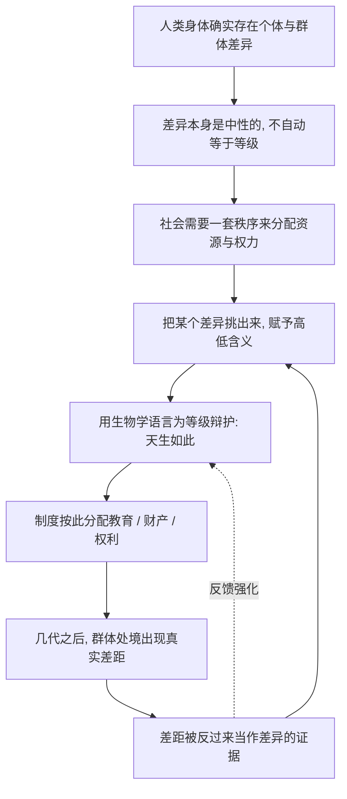

# 10｜种族和性别的不平等，是天生的还是编出来的？

> 关于种族和性别的等级差异，有多少是生物学事实，有多少是文化建构？

---

## 一、先说结论

赫拉利的立场很明确：生物学上的人类差异，远不足以支撑历史上那些森严的等级制度。

在他看来，“种族”是近代政治产物，而不是可靠的科学分类；性别之间的许多角色分工，也大多由文化规定，而非生理注定。也就是说，**差异可能存在，但从“差异”到“不平等”，中间那一步往往是人加上去的。**

必须提醒：这是全系列争议最大的一篇。读它重要的不是站队，而是区分三个问题——**差异是否存在、差异有多大、差异能否为不平等辩护。**

---

## 二、我们先理解一个问题

有一种常见说法：男女不一样，所以分工不同；族群之间有差异，所以地位不同是有道理的。它听起来很“尊重事实”，把不平等说成差异的自然结果。

但请把两句话分开看：

- 陈述一：A 群体和 B 群体在某些指标上存在差异。
- 陈述二：所以 A 群体理应享有更多权利、占据更高位置。

从陈述一到陈述二，**如果没有额外的论证，这一步是跳不过去的。**

于是要追问：历史上那么多“种族优劣论”“男主外女主内”，哪些确有生物学依据？哪些只是把文化安排包装成了自然规律？更关键的是——**就算差异真的存在，它就一定能让不平等变得正当吗？**

---

## 三、作者到底提出了什么观点？

赫拉利把种族和性别放进同一个框架：**它们是“想象的秩序”在身体上的投影。**

先说种族。他指出，“种族”划分并非自古以来就有。古代帝国并不特别在意肤色，罗马、蒙古、奥斯曼的统治正当性更多来自政治、宗教与忠诚。把人类按肤色、血统切成等级是近代产物，与殖民扩张、奴隶贸易和十九世纪的“科学种族主义”紧密相关。

现代遗传学并不支持把人类分成界限分明的“种族”：人类遗传变异是连续渐变的，同一所谓种族内部的差异，往往大于不同种族之间。**“种族”更像社会标签，而非清晰的生物学分界线。** 但标签一旦被使用，就会产生真实后果——人被区别对待，资源被重新分配。

再说性别。赫拉利不否认男女在生理、生殖上确有差异，他质疑的是另一种更强的说法：**历史上几乎所有社会都由男性主导，是因为男人天生更强、更适合掌权。**

他检视了几种常见解释——男人更强壮、更好斗、或要控制女性的性行为——认为它们最多解释局部，无法解释上千年的普遍性，也解释不了各地迥异的具体形态。

赫拉利的结论是：**生物学提供可能性，文化决定哪种可能性被执行。** 从生理差异到“男主外女主内”这一整套规则，跨度太大，靠生物学填不满；至于“男性理所当然统治女性”，他看不到坚实的生物学基础。

---

## 四、把这个观点翻译成人话

可以区分两样东西：**硬件**和**说明书**。硬件是身体本身：子宫、肌肉、激素、染色体，客观存在；说明书是社会告诉你“拿着这个硬件该做什么”。常见的偷换，就是把说明书写的东西说成硬件决定的。

比如“女性天生更擅长照顾人”——这可以是反复训练的结果：女孩从小被鼓励体贴、被给予更多照顾他人的机会，长大后自然更擅长。可一旦成为普遍现象，它就被倒过来解释成“你看，她们天生如此，让她们照顾家是合理的”。

赫拉利的比喻是：**生物学是地基，文化是上层建筑，但你不能因为地基存在，就说楼上任何一间房都必须盖在那里。**

种族问题同理。肤色、身高的确有差异，但与智力、品格高低并无可靠对应。某个群体先被划成“种族”、贴上低等标签，再被排除在土地、教育、选票之外；几代人后差距出现，差距又被当成“他们本来就不行”的证据。**这是自我实现的循环，而非自然事实。**

---

## 五、为什么会这样？

赫拉利的推理大致可以画成这样：

关键在 **D → E** 和 **G → H** 两个环节。

先看 D → E。差异千千万万，为什么偏偏是肤色、性别被挑出来当作等级依据？因为它们**可见、易辨认、且难以伪装**，是最顺手的社会分界。一旦选定，就需要一套说辞让它显得合理，“生物学”或“天性”就成了现成的辩护词。

再看 G → H，这是最隐蔽的一环。不平等的制度会真实塑造结果：被剥夺教育的人识字率更低，被限制就业的人收入更低，被要求承担家务的人履历更薄。等结果出现，人们又说：“你看，本来就差。”社会安排造成的差距，就这样被解释成自然差异的证明。**闭环一旦转起来，就会自我强化。**

赫拉利想做的，就是把这个闭环拆开：**不平等不是差异的结果，差异常常是不平等的结果。**

---

## 六、举一个现实生活中的例子

**第一个场景：体育项目的分类。**

几乎所有正式比赛都按性别分开，理由是生理差异——力量、速度、耐力。这在很多项目上站得住：田径、举重、游泳的顶尖成绩差距明显，混合比赛常让女性难以进入前列。

但再往深看，边界就开始模糊。以女子中长跑为例，近年来围绕某些天生睾酮水平较高的运动员能否参赛的争议几乎没有停过：有人认为她们拥有不公平的生理优势，有人认为把她们排除在外才是真正的不公，世界田联等机构也先后出台过不同的限制标准。**差异确实真实存在，但“哪些差异算数、超标多少、由谁裁定”，是一套人为规定的规则。**

**第二个场景：职场性别差异。**

在许多国家，女性的平均薪酬低于男性，高层管理岗位中女性比例明显偏低。怎么解释？

一种解释强调歧视：同样的岗位与表现，女性的机会更少；生育育儿的职业中断主要落在女性身上；职场文化默认“能加班、随时出差”的人更上进，而这套标准是按无家庭负担者的节奏设计的。

另一种解释强调选择：男女在职业偏好、风险偏好、对工作与家庭的权衡上存在统计差异，部分差距可能由此而来。

赫拉利式的读法是：两者未必互斥，但要警惕把第二种当成全部答案——所谓“选择”本身就是在社会期待中做出的，从玩具、夸奖到招聘预设，都在塑造偏好。**把制度塑造出的偏好当成天性的自由选择，正是“把文化说成自然”的典型。**

这两组例子都高度依赖具体国家与时期，说明的是“问题复杂”，而非“答案已定”。

---

## 七、回到书中重新理解

回头看赫拉利的原始论述，他的重点不是否认生物学，而是**限制生物学的解释范围**。

他反复提醒：社会秩序大多建立在共同相信之上，而不是基因里。种族与性别之所以被选作例子，是因为它们最容易被误认为“自然秩序”——身体差异摆在那里，太像证据。

他有一个很有冲击力的论断：**如果男性统治女性真是生物学铁律，它应该像呼吸一样无须辩护；可历史上几乎所有男性主导的社会，都要用宗教、法律、道德花大力气维持它。** 真正自然的东西，通常不需要这么多说辞。

同样，“种族”之所以能被用来组织大规模压迫，恰恰因为它划出了想象共同体的边界：让素不相识的人觉得彼此同类，也让另一些人被排除在外。

**他要说的不是“差异不存在”，而是“从差异到等级，中间那一步是社会加上去的，而人类常常假装那一步不存在”。**

---

## 八、这个观点背后还有什么？

**第一，区分“差异”与“等级”是两个层次的问题。** 差异是统计上的、需小心解读的；等级则是制度性的权利分配。赫拉利攻击的是后者。把两者混为一谈，是最常见的失误。

**第二，自我实现的循环有历史惯性。** 一旦几代人的机会结构不同，差距就会沉淀为“事实”，再被拿来当作新的论据。

**第三，它与后文相连。** 金钱、帝国、宗教这些统一力量，同样在不断重画“我们”与“他们”的边界。

---

## 九、这个观点有问题吗？

问题很大，必须格外小心。赫拉利的立场容易被读向两个极端：要么“差异全是假的”，要么“无视科学”。两者都不准确。问题拆成三层。

**第一层：差异是否存在？** 回答是肯定的。男女在生殖角色上存在不可忽视的差异——怀孕、哺乳、生育成本主要由女性承担，这是生物学事实，不是文化捏造。个体层面，力量、身高、激素水平，以及不同族群的基因频率、疾病易感性，确有统计差异。**否认这些，等于走向另一个版本的教条。**

**第二层：差异有多大，能否解释历史等级？** 这才是争论的核心。赫拉利的判断是：不够。从“平均差异不大”到“所有社会都由男性主导”，中间缺口巨大；男性主导的具体形态又千差万别，很难用一条普适规律解释。种族亦然：现代遗传学不支持把人类按智力或品格高低来划分。

但这里也有批评。一些演化心理学家和社会生物学家认为，**赫拉利可能低估了生物学的作用**：性别在择偶、风险、攻击性等方面的统计差异在跨文化研究中反复出现，未必能全归因于文化；若立场先行，容易只挑对自己有利的证据。也有学者批评他处理科学证据过于随笔化。

**第三层：差异能否为不平等辩护？** 这是最容易被跳过、也最重要的一层。**即使差异真实存在，也不能自动推出不平等是正当的。** 权利、尊严、机会的分配是价值与制度问题，不是统计学问题。一个社会如何对待身体差异（无障碍设计？产假制度？禁止歧视？），是可选择的，不是被生物学逼出来的。

**还要补充两点批评。**

其一，赫拉利有时把“种族是近代产物”讲得过于干净。族群偏见与排斥在更早的历史中也能找到；近代殖民与奴隶贸易只是把它们**系统化、等级化**的关键，并非凭空出现。

其二，他的框架强调“都是建构”，在分析上有用，却可能产生伦理滑坡：如果一切都是想象，反种族主义、反性别歧视的理由从哪来？较合理的回应是：**正因为这些秩序是被建构的，人类才有能力重新建构它们。** 承认建构性，不是取消批判，而是把批判目标从“自然”转向“制度”。

**所以更准确的说法是**：赫拉利揭示了从差异到不平等之间的那道人为缝隙，但他在生物学证据的处理上并非没有争议；“差异存在”与“不平等正当”之间，永远隔着一次需要论证的跳跃。

---

## 十、今天再看这个观点

以下是基于赫拉利思想的现代延伸，不是作者原话。

一方面，性别差异的讨论仍在继续：职场参与率、薪酬差距、育儿分工，各国数据差异巨大。另一方面，新技术把旧问题翻了出来：基因检测让族群来源变得可测量，也带来新的分类风险；招聘与信贷中的算法可能从数据里学出并放大既有偏见，形成一种“自动化”的区别对待——它不再声称某个群体低人一等，却可能在结果上造成类似分层。

更棘手的是体育、医学：按性别分组的规则如何在尊重差异与保障公平之间取舍？药物与治疗方案如何适配不同群体？这些问题都提醒我们：**差异是真实的，规则是人为的，每一次调整都要面对价值取舍。** 赫拉利提供了看清“人为那一步”的视角，但具体怎么划线，他没有、也不可能给出答案。

---

## 十一、这一篇真正应该记住什么？

1. **差异存在，但差异不等于等级。** 生理与统计差异真实存在，但从“有差异”到“该不平等”，必须有额外论证。

2. **“种族”更接近社会标签而非生物学分界。** 人类遗传变异是连续的，种族划分是近代政治与殖民历史的产物，社会后果却真实深刻。

3. **性别角色大多由文化规定。** 生殖差异无法单独解释历史上男性主导的普遍性与多样性，生物学提供可能，文化决定执行。

4. **警惕自我实现的循环。** 不平等塑造结果，结果又被当作差异的证据，这个闭环一旦形成就会自我强化。

5. **争议焦点不是“差异是否存在”，而是“差异能否为不平等辩护”。** 赫拉利的证据处理并非没有争议，但这一层的区分最值得带走。

---

## 十二、留一个问题

> 如果一个社会真心相信“差异不能为不平等辩护”，
> 那么它应该按“人人相同”来设计制度，
> 还是按“承认差异”来设计制度？这两种做法会不会互相冲突？

---

**下一篇**：种族和性别常被用来划分“我们”和“他们”。可历史上还有一股相反的力量，它不看肤色、不论信仰、不分国界，却让最陌生的双方也愿意交换手中最重要的东西。

下一篇我们就来拆开它——**为什么互不相识的人，会相信同一种钱？**
